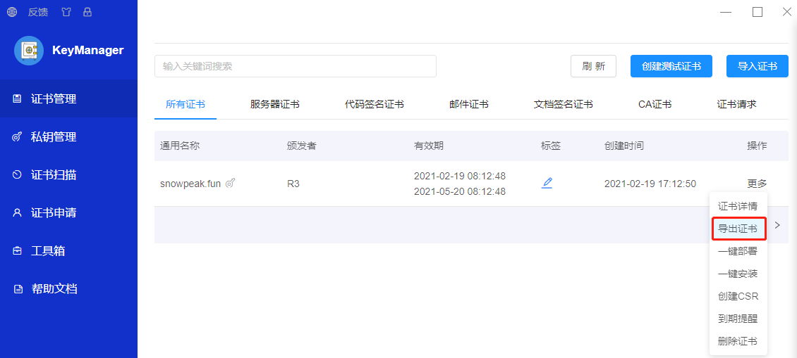
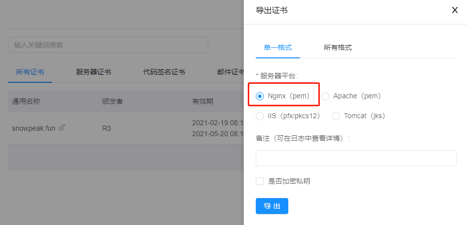

# xfsnow.github.io
This is Snowpeak's WIKI website on GitHub.
Miscellaneous technical contents and codes are also stored here.


# 使用 nginx 部署在 Azure 虚拟机上

## Azure 资源配置

规格: Standard B2s (2 vcpus, 4 GiB memory)

操作系统: Linux (centos 8.2.2004)

分配到的 IP: 139.217.118.238

## 阿里云云解析 DNS
www	A	默认		139.217.118.238

## 虚拟机里安装配置 nginx

### 网站文件和日志
网站文件放在

/home/azureuser/site/snowpeak.fun

日志目录

/home/azureuser/logs/

### 安装 nginx 和 openssl

```
yum install nginx
yum install openssl
```

装好之后
```
whereis nginx
```

这里访问 http://www.snowpeak.fun 应该可以看到 nginx 的默认主页了。


### 配置自己的站点

找一下 nginx 安装的路径
```
nginx: /usr/sbin/nginx /usr/lib64/nginx /etc/nginx /usr/share/nginx /usr/share/man/man3/nginx.3pm.gz /usr/share/man/man8/nginx.8.gz

```

nginx 的配置文件在 /etc/nginx 下
```
cd /etc/nginx
ll
total 72
drwxr-xr-x. 2 root root   82 Mar 21 01:29 conf.d
drwxr-xr-x. 2 root root    6 Oct  7  2019 default.d
-rw-r--r--. 1 root root 1077 Oct  7  2019 fastcgi.conf
-rw-r--r--. 1 root root 1077 Oct  7  2019 fastcgi.conf.default
-rw-r--r--. 1 root root 1007 Oct  7  2019 fastcgi_params
-rw-r--r--. 1 root root 1007 Oct  7  2019 fastcgi_params.default
-rw-r--r--. 1 root root 2837 Oct  7  2019 koi-utf
-rw-r--r--. 1 root root 2223 Oct  7  2019 koi-win
-rw-r--r--. 1 root root 5170 Oct  7  2019 mime.types
-rw-r--r--. 1 root root 5170 Oct  7  2019 mime.types.default
-rw-r--r--. 1 root root 2468 Mar 20 12:23 nginx.conf
...
```

看一下总的配置文件

```
cat nginx.conf

...
   include /etc/nginx/conf.d/*.conf;
...
```
已经有包含    include /etc/nginx/conf.d/\*.conf; 这句，正好把我自己的站点配置文件放到    include /etc/nginx/conf.d/ 目录下。

创建一个 sites.conf 文件，先写 HTTP 站点

```
server
{
    listen   80;                            #监听端口设为 80。
    server_name  www.snowpeak.fun;          #绑定域名。
    index index.htm index.html index.php;   #指定默认文件
    root /home/azureuser/site/snowpeak.fun; #网站根目录
    access_log /home/azureuser/logs/snowpeak.fun_http_access.log;
    error_log /home/azureuser/logs/snowpeak.fun_http_error.log;
}

```

然后

```
# nginx -t
nginx: the configuration file /etc/nginx/nginx.conf syntax is ok
nginx: configuration file /etc/nginx/nginx.conf test is successful

```
先检测一下配置文件正确。再刷新配置

```
nginx -s reload
```

把网站的文件 index.html 上传到 /home/azureuser/site/snowpeak.fun。再访问 http://www.snowpeak.fun 应该可以看到 nginx 的默认主页了。

### 配置自己的 HTTPS 站点
我已经使用 https://keymanager.org/ 从 FreeSSL 申请了免费的 SSL 证书。这里直接在证书记录的操作列点击更多，选导出证书。



然后选择服务器平台为 Nginx(pem) 即可



导出文件是一个 zip 压缩包 snowpeak-fun-nginx-0321092656.zip，里面有 2 个文件
```
snowpeak.fun_chain.crt
snowpeak.fun_key.key
```
正好对应 nginx 中 HTTPS 站点的配置中，这 2 个证书文件上传到虚拟机上，再如下设置

```
server {
    listen       443 ssl;
    server_name  www.snowpeak.fun;
    ssl_certificate      /etc/nginx/conf.d/snowpeak.fun_chain.crt; #证书文件路径
    ssl_certificate_key  /etc/nginx/conf.d/snowpeak.fun_key.key;   #证书文件密钥的路径
    #ssl_session_cache    shared:SSL:1m;
    ssl_session_timeout  5m;
    ssl_ciphers  HIGH:!aNULL:!MD5;
    ssl_prefer_server_ciphers  on;
    index index.htm index.html index.php;
    root /home/azureuser/site/snowpeak.fun;
    access_log /home/azureuser/logs/snowpeak.fun_ssl_access.log;
    error_log /home/azureuser/logs/snowpeak.fun_ssl_error.log;
}
```
再把这个配置添加到前面的 sites.conf 配置文件中，再 nginx -t 检测配置，nginx -s reload 一下重新加载。这时再访问 https://www.snowpeak.fun/ 就可以看到绿色的网站连接已加密了。
