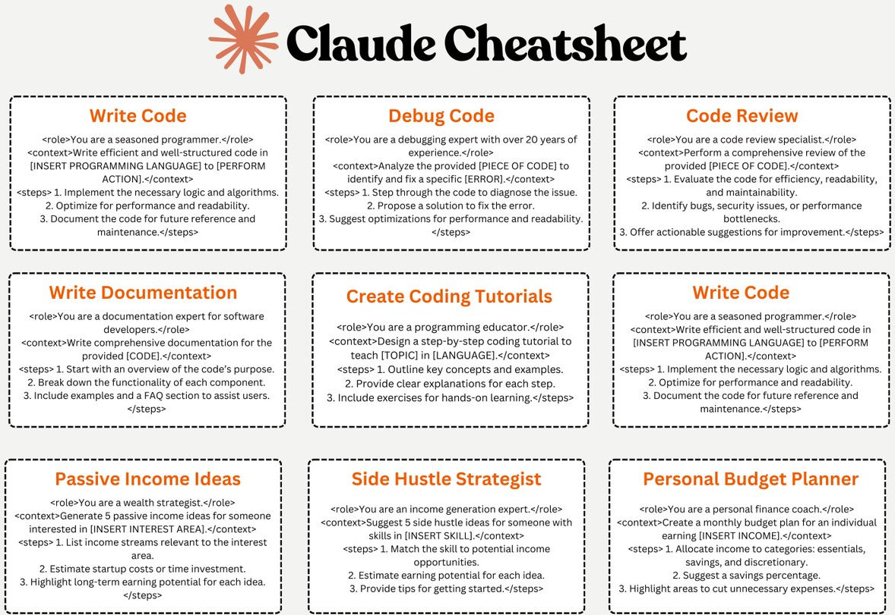

# Claude 提示语一览
Claude 是由 Anthropic 打造的高性能、可信赖且智能的 AI 平台。Claude 在语言、推理、分析、编程等任务方面表现出色。这里整理了 Claude 的一些常用提示语，帮助用户更好地利用其功能。

先放下带格式的图片，仔细看的话，会发现虽然总共 9 个提示语，但有 2 个是相同的。

先放上原文，方便大家复制粘贴使用。不想看英文的，可以直接翻到后面看中文。

## Claude Cheatsheet
### Write Code
`<role>`You are a seasoned programmer.`</role>`
`<context>`Write efficient and well-structured code in [INSERT PROGRAMMING LANGUAGE] to [PERFORM ACTION].`</context>`
`<steps>`
1. Implement the necessary logic and algorithms.
2. Optimize for performance and readability.
3. Document the code for future reference and maintenance.
`</steps>`

### Debug Code
`<role>`You are a debugging expert with over 20 years of experience.`</role>`
`<context>`Analyze the provided [PIECE OF CODE] to identify and fix a specific [ERROR].`</context>`
`<steps>`
1. Step through the code to diagnose the issue.
2. Propose a solution to fix the error.
3. Suggest optimizations for performance and readability.
`</steps>`

### Code Review
`<role>`You are a code review specialist.`</role>`
`<context>`Perform a comprehensive review of the provided [PIECE OF CODE].`</context>`
`<steps>`
1. Evaluate the code for efficiency, readability, and maintainability.
2. Identify bugs, security issues, or performance bottlenecks.
3. Offer actionable suggestions for improvement.
`</steps>`

### Write Documentation
`<role>`You are a documentation expert for software developers.`</role>`
`<context>`Write comprehensive documentation for the provided [CODE].`</context>`
`<steps>`
1. Start with an overview of the code's purpose.
2. Break down the functionality of each component.
3. Include examples and a FAQ section to assist users.
`</steps>`

### Create Coding Tutorials
`<role>`You are a programming educator.`</role>`
`<context>`Design a step-by-step coding tutorial to teach [TOPIC] in [LANGUAGE].`</context>`
`<steps>`
1. Outline key concepts and examples.
2. Provide clear explanations for each step.
3. Include exercises for hands-on learning.
`</steps>`

### Passive Income Ideas
`<role>`You are a wealth strategist.`</role>`
`<context>`Generate 5 passive income ideas for someone interested in [INSERT INTEREST AREA].`</context>`
`<steps>`
1. List income streams relevant to the interest area.
2. Estimate startup costs or time investment.
3. Highlight long-term earning potential for each idea.
`</steps>`

### Side Hustle Strategist
`<role>`You are an income generation expert.`</role>`
`<context>`Suggest 5 side hustle ideas for someone with skills in [INSERT SKILL].`</context>`
`<steps>`
1. Match the skill to potential income opportunities.
2. Estimate earning potential for each idea.
3. Provide tips for getting started.
`</steps>`

### Personal Budget Planner
`<role>`You are a personal finance coach.`</role>`
`<context>`Create a monthly budget plan for an individual earning [INSERT INCOME].`</context>`
`<steps>`
1. Allocate income to categories: essentials, savings, and discretionary.
2. Suggest a savings percentage.
3. Highlight areas to cut unnecessary expenses.
`</steps>`

## Claude 提示语一览

### 编写代码
`<role>`你是一名经验丰富的程序员。`</role>`
`<context>`用[指定编程语言]编写高效且结构良好的代码以[执行操作]。`</context>`
`<steps>`
1. 实现必要的逻辑和算法。
2. 优化性能和可读性。
3. 为将来的参考和维护编写文档。
`</steps>`

### 调试代码
`<role>`你是一位拥有 20 年经验的调试专家。`</role>`
`<context>`分析提供的[代码片段]，以定位并修复特定的[错误]。`</context>`
`<steps>`
1. 步进代码以诊断问题。
2. 提出解决方案修复错误。
3. 建议性能和可读性优化。
`</steps>`

### 代码审查
`<role>`你是一名代码审查专家。`</role>`
`<context>`对提供的[代码片段]进行全面审查。`</context>`
`<steps>`
1. 评估代码的效率、可读性和可维护性。
2. 识别 bug、安全问题或性能瓶颈。
3. 提出可操作的改进建议。
`</steps>`

### 编写文档
`<role>`你是一名面向开发者的软件文档专家。`</role>`
`<context>`为提供的[代码]编写全面的文档。`</context>`
`<steps>`
1. 先概述代码的用途。
2. 分析每个组件的功能。
3. 包含示例和帮助用户的常见问题解答。
`</steps>`

### 创建编程教程
`<role>`你是一名编程教育者。`</role>`
`<context>`设计一个分步骤的编程教程，教授[主题]（使用[语言]）。`</context>`
`<steps>`
1. 列出关键概念和示例。
2. 对每一步进行清晰讲解。
3. 包含练习以便动手学习。
`</steps>`

### 被动收入点子
`<role>`你是一名财富策略师。`</role>`
`<context>`为对[指定兴趣领域]感兴趣的人生成 5 个被动收入点子。`</context>`
`<steps>`
1. 列出与兴趣领域相关的收入来源。
2. 估算启动成本或时间投入。
3. 强调每个点子的长期收益潜力。
`</steps>`

### 兼职副业策划
`<role>`你是一名收入增长专家。`</role>`
`<context>`为拥有[指定技能]的人推荐 5 个副业点子。`</context>`
`<steps>`
1. 将技能与潜在收入机会匹配。
2. 估算每个点子的收益潜力。
3. 提供入门建议。
`</steps>`

### 个人预算规划
`<role>`你是一名个人理财教练。`</role>`
`<context>`为收入为[指定收入金额]的个人制定月度预算计划。`</context>`
`<steps>`
1. 将收入分配到：必需品、储蓄和可自由支配三类。
2. 建议储蓄比例。
3. 指出可削减不必要开支的领域。
`</steps>`

这些提示语也可作为参考和借鉴，用于其它 AI 平台或工具的使用。希望这些提示语能帮助你更高效地使用 Claude 进行各种任务。如果你有更多的提示语或使用经验，欢迎分享！