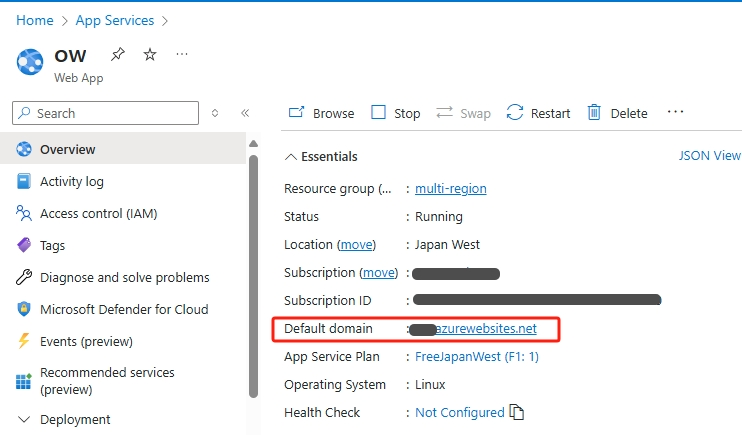
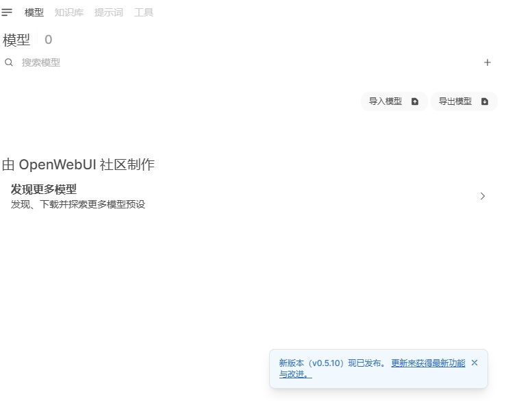

# 在 Azure 上部署 DeepSeek

DeepSeek 是杭州深度求索人工智能基础技术研究有限公司发布的开源大模型，最近是持续火爆，使得官方服务经常不可用。网上各种本地部署和私有部署的文章已经很多，这里我们提供一个全部基于 Azure 的私有部署方案。

## 使用 Azure AI Foundry 部署 DeepSeek
Azure AI Foundry 是微软推出的一个 AI 服务平台，提供了一站式的 AI 服务，包括模型训练、推理、部署等等。创建 Azure AI Foundry 请参考 [官方文档](https://learn.microsoft.com/azure/ai-studio/how-to/create-projects) 。

在 Azure AI Foundry 中，我们可以直接部署 DeepSeek 模型，无需自己搭建环境，非常方便。但是有个小问题，Azure AI Foundry 的部署生成不是标准的 DeepSeek API，也不兼容 Ollama，不能直接拿来连接到 Open WebUI，所以我提供了一个[转换的函数](#配置-open-webui-函数连接到-azure-ai-foundry-部署的-deepseek)，配置到 Open WebUI 中就可以了。

我们可以使用 Azure AI Foundry 来部署 DeepSeek。

1. 开始部署 DeepSeek 模型

2. 选择模型后，可以看到 DeepSeek 模型本身不要钱。(模型是开源免费的嘛)

涉及到 Azure 的计算资源，还是需要一点点钱的。具体的费用可以参考 [Azure 官方定价](https://azure.microsoft.com/zh-cn/pricing/details/machine-learning/)

3. 无需更多配置了，点击“创建资源并部署”按钮，等待部署完成。

4. 部署完成后，可以看到 DeepSeek 模型的 Endpoint。

先记下模型的 Model Name，一般默认是 `DeepSeek-R1`，然后点击模型的 Get Endpoint 按钮。

记下模型的 Azure AI model inference endpoint 和 Key。上述 3 个值会在后续配置 Open WebUI 函数时用到。

## 使用 Azure App Service 部署 Open WebUI

[Open WebUI](https://www.openwebui.com/) 是一个可扩展、功能丰富且用户友好的自托管 AI 平台，设计为完全离线运行。它支持多种 LLM 运行器（如 Ollama 和与 OpenAI 兼容的 API），并内置用于 RAG 的推理引擎，是一个功能强大的 AI 部署解决方案。虽然它支持多种方式本地安装，但毕竟体积较大，部署起来还是有一定难度。使用 Azure App Service 一键部署到云端，无需本地下载安装包或 Docker 镜像，非常方便。

### 创建 App Service

方法非常简便， 主要步骤如下：
1. 在 [Azure 门户](https://portal.azure.com/) 中搜索 App Service，然后点击左上角“创建”按钮，选择“Web 应用”。
2. 按提示填写应用名称、资源组、区域等信息。以下几点需要注意：
   - Publish 选择 Container。
   - Operating System 选择 Linux。
   - Region 建议选择 Japan West，因为这个区域从网络访问来看中国大陆的访问速度较快。
   - Pricing plans 选择 F1 Free，咱们自己用免费的足够了。
3. 下一页 Database 不选。
4. Container 页，配置以下几点：
   - Image Source 选 Other container registries
   - Access Type 选 Public
   - Registry server URL 填写 `ghcr.io`
   - Image and tag 填写 `openwebui/openwebui:main`

5. 其它页都不用动，直接点击“查看 + 创建”按钮。

稍等片刻，App Service 就创建好了。点击 Overview 页的 Default domain，就可以访问 Open WebUI 了。

免费档资源规格较小，但 Open WebUI 镜像很大，加载也慢，启动需要5-6分钟，请耐心等待。多刷新几次，直到看到 Open WebUI 的登录界面。首次使用需要注册一个账号。

### Open WebUI 版本更新

版本更新比较频繁，由于在 Azure App Service 创建时已经设置了 `Open WebUI/Open WebUI:main` 作为镜像的标签。所以只需要停止再启动 App Service 即可更新到最新版本，非常方便。稍微遗憾的是，App Service 底层的计算资源是随机分配的，所以每次重新部署时 Open WebUI 中已经保存的用户信息会丢失。咱们自己使用，重新注册一下就好了。

发现版本更新提示

停止再启动 App Service 后再访问 Open WebUI，发现已经更新到最新版本了。

## 配置 Open WebUI 函数连接到 Azure AI Foundry 部署的 DeepSeek

首次打开 Open WebUI 会提示创建管理员账号，创建后即可登入。点击左下角用户名，弹出菜单中点击 “管理员面板”。

点击左侧“函数”菜单，然后点击“+”按钮。

函数名称填写“DeepSeek”，函数描述填写 “DeepSeek from Azure AI Foundry”。
函数内容填写如下代码的内容，

https://raw.githubusercontent.com/xfsnow/python/refs/heads/master/AzureAI/Open_WebUI_AAIF_DeepSeek.py

点击“保存”按钮，弹出确认层点确认即可。保存好后，点击函数右边的齿轮按钮，点击“默认” 2 字，可以输入自己的值。

在弹出的层里填入前面创建 DeepSeek 部署时记下的 3 个变量值，Azure Endpoint 填 Azure AI model inference endpoint，注意这里填写的是结尾为 /models 的 URL，比如 https://contoso-abcd1234-eastus2.services.ai.azure.com/models 。
Azure Api Key 填 Key，Azure Model Name 填 Model Name。

最后把函数最右侧圆点切换成启用。再占左上角“新对话”，模型选择菜单就会出现 DeepSeek 了。

至此，我们已经成功部署了 DeepSeek 到 Azure 平台，并且配置到 Open WebUI 中，可以愉快的使用了。

TODO
- [ ] App Service 挂接 Storage，实现用户和配置信息等持久化，App 重新部署后信息不丢失。
- [ ] 部署 App Service 时使用启动命令直接把函数注入到配置。