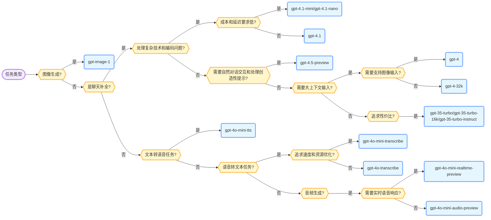

# Azure AI Foundry 里的 GPT 模型选型
随着 OpenAI 的 GPT 模型的不断更新，Azure AI Foundry 也在不断地更新其模型库，现在 GPT 相关模型已经有 21 种了。这么多种模型到底选择哪个，我整理了一个决策树图，给大家梳理一下思路。

下面是从 Azure AI Foundry 官网的产品介绍中提取的更详细的功能及特点，供大家详细了解。

## gpt-image-1
*任务：文本转图像*

gpt-image-1 在图像生成方面有了显著提升：它能够在具有挑战性的场景下生成高质量图像，并能解决复杂的提示。目前该模型在图像修复、照片写实和线框设计方面具有很强的零样本能力。

### 主要能力
* 更多模态：gpt-image-1 支持文本转图像和图像转图像两种模态
* 图像修复：通过文本提示和用户绘制的边界框编辑图像
* 提示变换：通过文本提示编辑图像

## gpt-4.1
*任务：聊天补全*
gpt-4.1 系列是 gpt-4o 模型家族的最新迭代。本次迭代专注于更好的编码和指令跟随能力，使其在处理复杂技术和编码问题时表现更佳。

此外，它将上下文 token 限制提升至 1M，并针对小上下文（128k）和大上下文（最高 1M）输入分别计费。

与之前的 gpt-4o 模型家族一样，支持 16k 输出大小，并具备以下特性：

### 主要能力
* 文本、图像处理
* JSON 模式
* 并行函数调用
* 提高准确性和响应速度
* 英文文本和编码任务与 GPT-4 Turbo with Vision 持平
* 在非英语语言和视觉任务上表现更优
* 支持增强功能
* 支持复杂结构化输出。

## gpt-4.1-mini
*任务：聊天补全*

gpt-4.1 系列是 gpt-4o 模型家族的最新迭代。本次迭代专注于更好的编码和指令跟随能力，使其在处理复杂技术和编码问题时表现更佳。

此外，它将上下文 token 限制提升至 1M，并针对小上下文（128k）和大上下文（最高 1M）输入分别计费。

与之前的 gpt-4o-mini 版本一样，支持文本和视觉，成本和延迟更低，适用于需要链式或并行多模型调用（如调用多个 API）、传递大量上下文（如完整代码库或对话历史）或需要快速实时文本响应（如客户支持聊天机器人）的应用场景。

## gpt-4.1-nano
*任务：聊天补全*

gpt-4.1 系列是 gpt-4o 模型家族的最新迭代。本次迭代专注于更好的编码和指令跟随能力，使其在处理复杂技术和编码问题时表现更佳。

此外，它将上下文 token 限制提升至 1M，并针对小上下文（128k）和大上下文（最高 1M）输入分别计费。

`gpt-4.1-nano` 支持文本和视觉，相比 `gpt-4o` 和 `gpt-4o-mini`，成本和延迟更低。

## gpt-4.5-preview
*任务：聊天补全*

GPT-4.5 Preview 是目前最大最强的通用模型，最适合用于聊天，因为它在实现更自然的对话交互方面有了进步。它在语言任务上能力极强，在直觉、写作风格和知识等方面表现突出。GPT-4.5 Preview 在处理创造性提示和应对冷门知识查询方面表现优异。在测试事实知识的 Simple QA 基准上得分领先。

GPT-4.5 Preview 是像 GPT-4 和 gpt-4o 一样的经典预训练模型。与之前的 GPT 模型相比，GPT-4.5 Preview 更大，训练时间更长。可将 GPT-4.5 Preview 视为推理型模型（如 o1 和 o3-mini）的补充。

### 主要能力

* 模型特性：早期测试显示，与 GPT-4.5 Preview 交互更加自然。其更广泛的知识库、更强的用户意图理解能力和更高的“情商”使其在写作、编程和解决实际问题等任务中非常有用。我们也预计其幻觉率更低。
* 准确性与幻觉：测试显示，GPT-4.5 Preview 的幻觉率低于 GPT-4o（37%，而 GPT-4o 为 61.2%），准确率更高（61.9%，而 GPT-4o 为 38.4%）。
* 更强的人类对齐：GPT-4.5 Preview 采用了新的可扩展对齐技术，使得可以用小模型衍生的数据训练更大更强的模型。这些技术提升了 GPT-4.5 Preview 的可控性、对细微差别的理解和自然对话能力。
* 创意与实用应用：GPT-4.5 Preview 擅长写作辅助、设计、多步编码流程、任务自动化、沟通、学习、辅导和头脑风暴。在规划、执行和复杂任务自动化方面也表现出色。

## gpt-4o-mini-tts

*任务：文本转语音*

gpt-4o-mini-tts 是一款先进的文本转语音模型，能将书面文本转换为自然流畅的语音。借助 GPT-4o 的能力，该模型支持自定义语音输出，开发者可指示模型以特定方式说话，如“像富有同情心的客服一样说话”。gpt-4o-mini-tts 非常适合需要富有表现力和动态语音生成的应用，如有声书、播客和交互式语音助手。

gpt-4o-mini-tts 在多样且高质量的文本和音频数据集上进行了预训练，确保对语音细节和自然语调有深入理解。该模型支持 2,000 tokens 的输入限制，能有效处理较长文本。训练过程采用了严格的增强技术，包括有监督微调和强化学习，以优化性能和准确性。

## gpt-4o-transcribe

*任务：语音转文本*

gpt-4o-transcribe 是一款前沿的语音转文本模型，利用 GPT-4o 的先进能力，实现了极高的音频转录准确率。该模型在词错误率和语言识别方面有显著提升，超越了如 Whisper 等前代模型。gpt-4o-transcribe 旨在为用户提供可靠、准确的转录结果，适用于多种应用场景。

gpt-4o-transcribe 在专门的音频数据集上进行了预训练，涵盖多样且高质量的音频样本，确保对语音细节有深入理解。该模型支持 16,000 tokens 的上下文窗口，能有效处理较长音频输入。最大输出为 2,000 tokens，可生成详细全面的转录文本。训练过程采用了严格的增强技术，包括有监督微调和强化学习，以优化性能和准确性。

## gpt-4o-mini-transcribe

*任务：语音转文本*

gpt-4o-mini-transcribe 是一款高效的语音转文本模型，旨在在保证准确率的同时优化速度和资源消耗。该模型在词错误率和语言识别方面有显著提升，尤其适用于口音、嘈杂环境和语速变化等场景。gpt-4o-mini-transcribe 非常适合需要快速可靠转录服务的应用。

gpt-4o-mini-transcribe 在专门的音频数据集上进行了预训练，涵盖多样且高质量的音频样本，确保对语音细节有深入理解。该模型支持 16,000 tokens 的上下文窗口，能有效处理较长音频输入。最大输出为 2,000 tokens，可生成详细全面的转录文本。训练过程采用了严格的增强技术，包括有监督微调和强化学习，以优化性能和准确性。

## gpt-4o-mini-audio-preview

*任务：音频生成*

GPT-4o-mini-audio-preview 引入了一款更小、更低成本的模型，用于异步音频应用。与 GPT-4o-audio-preview 类似，GPT-4o-mini-audio-preview 能以更低成本提供更丰富、更具吸引力的用户体验。

注意：对于关注低延迟音频响应的客户，gpt-4o-mini-realtime-preview 可能更适合

这些音频功能可用于多种方式：

- 从文本创建口语摘要，提供更具吸引力的信息呈现方式。
- 分析音频录音的情感，将语音细节转化为基于文本的洞察。
- 支持异步语音输入输出交互

### 限制
目前，GPT-4o-mini-audio-preview 主要聚焦于文本和音频，不支持如图像模态等 GPT-4o 现有特性。对于许多任务，正式发布的 GPT-4o 模型可能更适合。

## gpt-4o-mini-realtime-preview

*任务：音频生成*

GPT-4o-mini-realtime-preview 引入了一款更小、更低成本的模型，用于实时语音应用。与 GPT-4o-realtime-preview 类似，GPT-4o-mini-realtime-preview 能以更低成本提供更丰富、更具吸引力的用户体验。

GPT-4o-mini-realtime-preview 的推出为各行业企业带来了诸多可能：

- 增强客户服务：通过集成音频输入，gpt-4o-mini-realtime-preview 能实现更动态、更全面的客户支持互动。
- 内容创新：利用 gpt-4o-mini-realtime-preview 的生成能力，创造丰富多样的音频内容，满足广泛的用户需求。
- 实时翻译：利用 gpt-4o-mini-realtime-preview 的能力，提供准确、即时的翻译，促进不同语言间的无缝交流。

### 模型版本
`2024-12-17`：推出全新多模态 AI 模型，现已支持文本和音频模态。作为预览版，主要用于测试和反馈，尚未针对生产流量优化。

### 限制
目前，GPT-4o-mini-realtime-preview 主要聚焦于文本和音频，不支持如图像模态和结构化输出等 GPT-4o 现有特性。对于许多任务，正式发布的 GPT-4o-mini 模型可能更适合。

## gpt-4

*任务：聊天补全*

gpt-4 是一款大型多模态模型，支持文本或图像输入，输出文本。它能以比以往任何模型更高的准确率解决复杂问题，得益于其广泛的通用知识和高级推理能力。

gpt-4 提供多种模型版本以满足不同业务需求。请注意，AzureML Studio 仅支持部署 gpt-4-0314 版本，AI Studio 支持部署下列所有版本。

## gpt-35-turbo-16k

*任务：聊天补全*

gpt-3.5 模型能够理解和生成自然语言或代码。gpt-3.5 家族中最强大且性价比最高的模型是 gpt-3.5-turbo，已针对聊天进行了优化，也适用于传统补全任务。gpt-3.5-turbo 可通过 Chat Completions API 使用。gpt-3.5-turbo-instruct 通过 Completions API 提供与 text-davinci-003 类似的能力。我们建议优先使用 gpt-3.5-turbo 和 gpt-3.5-turbo-instruct，而不是旧版 gpt-3.5 和 gpt-3 模型。

* gpt-35-turbo
* gpt-35-turbo-16k
* gpt-35-turbo-instruct

## gpt-35-turbo-instruct
*任务：聊天补全*
gpt-3.5 模型能够理解和生成自然语言或代码。gpt-3.5 家族中最强大且性价比最高的模型是 gpt-3.5-turbo，已针对聊天进行了优化，也适用于传统补全任务。gpt-3.5-turbo 可通过 Chat Completions API 使用。gpt-3.5-turbo-instruct 通过 Completions API 提供与 text-davinci-003 类似的能力。我们建议优先使用 gpt-3.5-turbo 和 gpt-3.5-turbo-instruct，而不是旧版 gpt-3.5 和 gpt-3 模型。

* gpt-35-turbo
* gpt-35-turbo-16k
* gpt-35-turbo-instruct

## gpt-35-turbo

*任务：聊天补全*

gpt-35-turbo（也称为 ChatGPT）是 gpt-3.5 家族中最强大且性价比最高的模型，已针对聊天进行了优化，可通过 Chat Completions API 使用。它是一款为对话界面设计的语言模型，行为与之前的 gpt-3 模型不同。之前的模型为文本输入和文本输出，即接受提示字符串并返回补全内容以追加到提示后。而 ChatGPT 模型为对话输入和消息输出，期望输入特定格式的聊天记录，并返回代表模型生成消息的补全内容。

## gpt-4-32k

*任务：聊天补全*

gpt-4 能以比以往任何 OpenAI 模型更高的准确率解决复杂问题。与 gpt-35-turbo 一样，gpt-4 针对聊天进行了优化，也适用于传统补全任务。gpt-4 支持最多 8192 个输入 tokens，gpt-4-32k 支持最多 32,768 个 tokens。