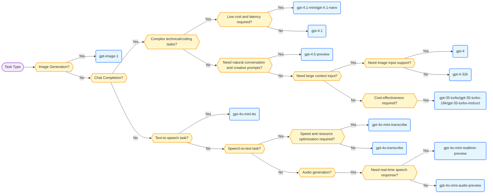

# GPT Model Selection in Azure AI Foundry
As OpenAI's GPT models continue to evolve, Azure AI Foundry is also constantly updating its model library. There are now 21 GPT-related models available. With so many models to choose from, I have created a decision tree to help clarify the selection process.

下面是从 Azure AI Foundry 官网的产品介绍中提取的更详细的功能及特点，供大家详细了解。

## gpt-image-1
*Task: Text to image*

Gpt-image-1 includes significant improvements on image generation: it has generate high-quality images in challenging scenarios and solving challenging prompts. Currently the model has great zero-shot capabilities in image in-painting, photorealistic photos, and wireframe designs.

### Key Capabilities
* More modalities Gpt-image-1 includes both text to image and image to image modalities
* Inpainting: Edit images with text prompt and user drawn bounding box
* Prompt transformation: Edit images with text prompt

## gpt-4.1
*Task: Chat completion*
The gpt-4.1 series is the latest iteration of the gpt-4o model family. This iteration of models is specifically targeted for better coding and instruction following, making it better at handling complex technical and coding problems.

In addition, it increases the context token limit up to 1M input tokens and provides separate billing for small context (128k) and large (up to 1M) context inputs.

As with the previous gpt-4o model family, it supports a 16k output size and features such as:

### Key Capabilities
* Text, image processing
* JSON Mode
* parallel function calling
* Enhanced accuracy and responsiveness
* Parity with English text and coding tasks compared to GPT-4 Turbo with Vision
* Superior performance in non-English languages and in vision tasks
* Support for enhancements
* Support for complex structured outputs.

## gpt-4.1-mini
*Task: Chat completion*

The gpt-4.1 series is the latest iteration of the gpt-4o model family. This iteration of models is specifically targeted for better coding and instruction following, making it better at handling complex technical and coding problems.

In addition, it increases the context token limit up to 1M input tokens and provides separate billing for small context (128k) and large (up to 1M) context inputs.

As with the previous gpt-4o-mini model version it supports both text and vision in the with low cost and latency, enabling a wide variety of tasks including applications that chain or parallelize multiple model calls (e.g., calling multiple APIs), pass a large volume of context to the model (e.g., full code base or conversation history), or interact with customers through fast, real-time text responses (e.g., customer support chatbots).

## gpt-4.1-nano
*Task: Chat completion*

The gpt-4.1 series is the latest iteration of the gpt-4o model family. This iteration of models is specifically targeted for better coding and instruction following, making it better at handling complex technical and coding problems.

In addition, it increases the context token limit up to 1M input tokens and provides separate billing for small context (128k) and large (up to 1M) context inputs.

`gpt-4.1-nano` supports both text and vision provides an even lower cost and latency compared to the `gpt-4o` and `gpt-4o-mini` models.

## gpt-4.5-preview
*Task: Chat completion*

GPT-4.5 Preview is the largest and strongest general purpose model, best suited for chat for its advancement in delivering more natural chat interactions. It is designed to be highly capable in language tasks, and excels in areas such as intuition, writing style, and knowledge. GPT-4.5 Preview handles creative prompts well and responds effectively to obscure knowledge queries. It has leading scores on the Simple QA benchmark which tests factual knowldge.

GPT-4.5 Preview is a classic pretrained model like GPT-4 and gpt-4o. Compared to previous GPT models, GPT-4.5 Preview is larger and trained for longer. Consider GPT-4.5 Preview as a complementary model to reasoning-focused models such as o1 and o3-mini.

### Key capabilities

* Model Qualities: Early testing shows that interacting with GPT-4.5 Preview feels more natural. Its broader knowledge base, improved ability to follow user intent, and greater “EQ” make it useful for tasks like improving writing, programming, and solving practical problems. We also expect it to hallucinate less.
* Accuracy & Hallucinations: Our testing shows that GPT-4.5 Preview achieves lower hallucination rates compared to GPT-4o (37% vs. GPT-4o at 61.2%) and higher accuracy (61.9% compared to 38.4% for GPT-4o).
* Stronger human alignment: For GPT-4.5 Preview, we developed new, scalable alignment techniques that enable training larger and more powerful models with data derived from smaller models. These techniques improve GPT 4.5 Preview’s steerability, understanding of nuance, and natural conversation.
* Creative and practical applications: GPT-4.5 Preview excels in writing help, design, multi-step coding workflows, task automation, communication, learning, coaching, and brainstorming. Also shows strong performance in planning, execution, and complex task automation.

## gpt-4o-mini-tts

*Task: Text to speech*

The gpt-4o-mini-tts model is an advanced text-to-speech solution designed to convert written text into natural-sounding speech. Leveraging the capabilities of GPT-4o, this model offers customizable voice output, allowing developers to instruct the model to speak in specific ways, such as "talk like a sympathetic customer service agent." gpt-4o-mini-tts is ideal for applications that require expressive and dynamic voice generation, such as audiobooks, podcasts, and interactive voice agents.

gpt-4o-mini-tts has been pretrained on diverse and high-quality text and audio datasets, ensuring a deep understanding of speech nuances and natural intonation. This model supports an input token limit of 2,000 tokens, allowing it to process substantial text inputs effectively. The training process incorporates rigorous enhancement techniques, including supervised fine-tuning and reinforcement learning, to optimize performance and accuracy.

## gpt-4o-transcribe

*Task: Speech to text*

The gpt-4o-transcribe model is a cutting-edge speech-to-text solution that leverages the advanced capabilities of GPT-4o to deliver highly accurate audio transcriptions. This model offers significant improvements in word error rate and language recognition, surpassing the performance of previous models like Whisper. Designed for precision and efficiency, gpt-4o-transcribe aims to provide users with reliable and accurate transcripts, making it a valuable tool for various applications.

Gpt-4o-transcribe has been pretrained on specialized audio-centric datasets, which include diverse and high-quality audio samples, ensuring a deep understanding of speech nuances. This model supports a substantial context window of 16,000 tokens, allowing it to process longer audio inputs effectively. With a maximum output of 2,000 tokens, gpt-4o-transcribe can generate detailed and comprehensive transcriptions. The training process incorporates rigorous enhancement techniques, including supervised fine-tuning and reinforcement learning, to optimize performance and accuracy.

## gpt-4o-mini-transcribe

*Task: Speech to text*

The gpt-4o-mini-transcribe model is a highly efficient speech-to-text solution designed to deliver accurate audio transcriptions while optimizing for speed and resource consumption. This model offers significant improvements in word error rate and language recognition, making it particularly effective in scenarios involving accents, noisy environments, and varying speech speeds. gpt-4o-mini-transcribe is ideal for applications that require quick and reliable transcription services.

gpt-4o-mini-transcribe has been pretrained on specialized audio-centric datasets, which include diverse and high-quality audio samples, ensuring a deep understanding of speech nuances. This model supports a substantial context window of 16,000 tokens, allowing it to process longer audio inputs effectively. With a maximum output of 2,000 tokens, gpt-4o-mini-transcribe can generate detailed and comprehensive transcriptions. The training process incorporates rigorous enhancement techniques, including supervised fine-tuning and reinforcement learning, to optimize performance and accuracy.

## gpt-4o-mini-audio-preview

*Task: Audio generation*

The GPT-4o-mini-audio-preview model introduces a smaller, lower cost model to power asynchronous audio applications. Like GPT-4o -audio-preview, GPT-4o-mini-audio-preview provides a richer and more engaging user experience, at a fraction of the cost.

Note: For customers interested in lower latency audio responses, gpt-4o-mini-realtime-preview may still be more suitable

These audio features can be utilized in various ways:

Create spoken summaries from text, offering a more engaging method to present information.
Analyze the sentiment of audio recordings, converting vocal nuances into text-based insights.
Facilitate asynchronous speech-in, speech-out interactions

### Limitations
Currently, the GPT-4o-mini-audio-preview model focuses on text and audio and does not support existing GPT-4o features such as image modality. For many tasks, the generally available GPT-4o models may still be more suitable.

## gpt-4o-mini-realtime-preview

*Task: Audio generation*

The GPT-4o-mini-realtime-preview model introduces a smaller, lower cost model to power realtime speech applications. Like GPT-4o-realtime-preview, GPT-4o-mini-realtime-preview provides a richer and more engaging user experience, at a fraction of the cost.

The introduction of GPT-4o-mini-realtime-preview opens numerous possibilities for businesses in various sectors:

Enhanced customer service: By integrating audio inputs, GPT-4o-mini-realtime-preview enables more dynamic and comprehensive customer support interactions.

Content innovation: Use GPT-4o-mini-realtime-preview's generative capabilities to create engaging and diverse audio content, catering to a broad range of consumer preferences.

Real-time translation: Leverage GPT-4o-mini-realtime-preview's capability to provide accurate and immediate translations, facilitating seamless communication across different languages.

### Model Versions
`2024-12-17`: Introducing our new multimodal AI model, which now supports both text and audio modalities. As this is a preview version, it is designed for testing and feedback purposes and is not yet optimized for production traffic.

### Limitations
Currently, the GPT-4o-mini-realtime-preview model focuses on text and audio and does not support existing GPT-4o features such as image modality and structured outputs. For many tasks, the generally available GPT-4o-mini models may still be more suitable.

## gpt-4

*Task: Chat completion*

gpt-4 is a large multimodal model that accepts text or image inputs and outputs text. It can solve complex problems with greater accuracy than any of our previous models, thanks to its extensive general knowledge and advanced reasoning capabilities.

gpt-4 provides a wide range of model versions to fit your business needs. Please note that AzureML Studio only supports the deployment of the gpt-4-0314 model version and AI Studio supports the deployment of all the model versions listed below.

## gpt-35-turbo-16k

*Task: Chat completion*

gpt-3.5 models can understand and generate natural language or code. The most capable and cost effective model in the gpt-3.5 family is gpt-3.5-turbo, which has been optimized for chat and works well for traditional completions tasks as well. gpt-3.5-turbo is available for use with the Chat Completions API. gpt-3.5-turbo Instruct has similar capabilities to text-davinci-003 using the Completions API instead of the Chat Completions API. We recommend using gpt-3.5-turbo and gpt-3.5-turbo-instruct over legacy gpt-3.5 and gpt-3 models.

* gpt-35-turbo
* gpt-35-turbo-16k
* gpt-35-turbo-instruct

## gpt-35-turbo-instruct
Task: Chat completion
gpt-3.5 models can understand and generate natural language or code. The most capable and cost effective model in the gpt-3.5 family is gpt-3.5-turbo, which has been optimized for chat and works well for traditional completions tasks as well. gpt-3.5-turbo is available for use with the Chat Completions API. gpt-3.5-turbo-instruct has similar capabilities to text-davinci-003 using the Completions API instead of the Chat Completions API. We recommend using gpt-3.5-turbo and gpt-3.5-turbo-instruct over legacy gpt-3.5 and gpt-3 models.

* gpt-35-turbo
* gpt-35-turbo-16k
* gpt-35-turbo-instruct

## gpt-35-turbo

*Task: Chat completion*

The gpt-35-turbo (also known as ChatGPT) is the most capable and cost-effective model in the gpt-3.5 family which has been optimized for chat using the Chat Completions API. It is a language model designed for conversational interfaces and the model behaves differently than previous gpt-3 models. Previous models were text-in and text-out, meaning they accepted a prompt string and returned a completion to append to the prompt. However, the ChatGPT model is conversation-in and message-out. The model expects a prompt string formatted in a specific chat-like transcript format and returns a completion that represents a model-written message in the chat.

## gpt-4-32k

*Task: Chat completion*

gpt-4 can solve difficult problems with greater accuracy than any of the previous OpenAI models. Like gpt-35-turbo, gpt-4 is optimized for chat but works well for traditional completions tasks. The gpt-4 supports 8192 max input tokens and the gpt-4-32k supports up to 32,768 tokens.