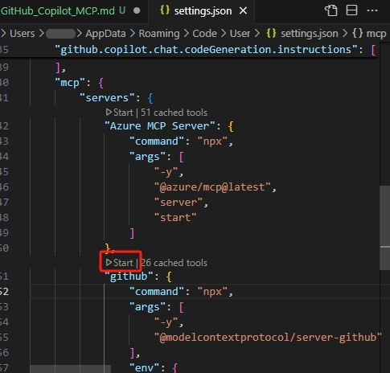
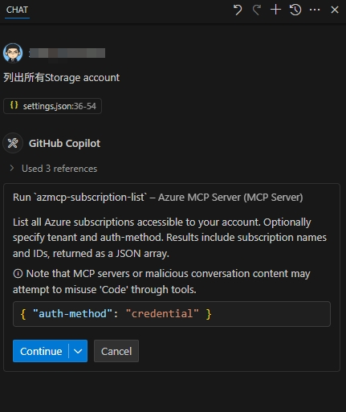

# 在 GitHub Copilot 中使用 MCP

MCP 全称 Model Context Protocol，是一种用于在不同的 AI 模型之间共享上下文信息的协议。它允许开发者在不同的模型之间传递信息，从而实现更复杂的任务和更好的协作。最早由 Cline Labs 提出的一个概念，后来被 GitHub Copilot 采纳并实现。
MCP 服务器是一个中间件，负责在不同的 AI 模型之间传递上下文信息。它可以接收来自一个模型的信息，并将其转换为另一个模型可以理解的格式，从而实现不同模型之间的协作。

GitHub Copilot 现在也可以方便地使用 MCP 服务器来实现更复杂的任务。通过 MCP 服务器，开发者可以将不同的 AI 模型连接在一起，从而实现更强大的功能。

## 基本配置
我们以 GitHub Copilot 的 MCP 服务器为例，来介绍如何配置和使用 MCP。
首先，确保你已经安装了 GitHub Copilot 插件，并且已经登录了你的 GitHub 账号。
先在 Copilot Chat 对话框最下面中间的小菜单点开选择 Agent。然后点击对话框上左下角的螺丝刀和扳手图标。弹出的浮层菜单可能已经有很多内容，滚动到最下面，点击“Add more tools...”，再点“+Add MCP Server”，再点 NPM Package。在弹出的对话框中输入 MCP 的 npm 包名，比如 `@modelcontextprotocol/server-github`，按回车键，然后点击“Add”。
默认名字是 github，回车确认即可。弹出 Choose where to save the configuration 时，选择 `Workspace Settings`， VS Code 会在当前工程下创建 .vscode/mcp.json 文件；如果选择 `User Settings`，则会在在用户设置的 settings.json 文件里添加 "mcp" 段。
在这个文件中的内容找到 `"GITHUB_PERSONAL_ACCESS_TOKEN": "<YOUR_TOKEN>"`，把 `<YOUR_TOKEN>` 替换成你自己的 [GitHub 个人访问令牌](https://docs.github.com/zh/authentication/keeping-your-account-and-data-secure/managing-your-personal-access-tokens?utm_cta=drift#%E5%88%9B%E5%BB%BA-personal-access-token-classic)，保存这个文件。

这时，Copilot Chat 对话框左上角的图标会显示需要刷新，点击刷新，稍后螺丝刀和扳手图标会显示数量增加了，表示添加成功。

## 使用 MCP
回到打开的配置文件，点击 MCP 名称上的 Start，状态变成 Running，表示 MCP 服务器已经启动。


配置上了GitHub Copilot 的 MCP 服务器后，使用对话 `列出所有repo名字。`，就会列出你所有的 repo 名字。

## Azure MCP
如果你想使用 [Azure MCP](https://github.com/Azure/azure-mcp)，最简单的方式就是在 `.vscode/mcp.json` 中 添加以下配置信息：

```json
{
  "servers": {
    "Azure MCP Server": {
      "command": "npx",
      "args": [
        "-y",
        "@azure/mcp@latest",
        "server",
        "start"
      ]
    }
  }
}
```
在 "Azure MCP Server" 上点击 Start，状态变成 Running，表示 Azure MCP 服务器已经启动。

然后同样在 GitHub Copilot 的螺丝刀和扳手图标旁边点击刷新就可以使用了。
## Azure MCP 认证
这个 Azure MCP 和GitHb MCP 不同，它不需要在配置文件中明文写入任何验证的凭据。
Azure MCP 服务器能够无缝集成你的主机操作系统的认证机制，让你轻松上手！我们底层使用了 Azure Identity，通过 [`DefaultAzureCredential`](https://learn.microsoft.com/dotnet/azure/sdk/authentication/credential-chains?tabs=dac) 实现，认证顺序如下：

1. **环境变量**（`EnvironmentCredential`）—— 适合 CI/CD 流水线
2. **共享令牌缓存**（`SharedTokenCacheCredential`）—— 复用其他工具的缓存令牌
3. **Visual Studio**（`VisualStudioCredential`）—— 使用你的 Visual Studio 认证
4. **Azure CLI**（`AzureCliCredential`）—— 使用你已登录的 Azure CLI 账号
5. **Azure PowerShell**（`AzurePowerShellCredential`）—— 使用 Az PowerShell 登录
6. **Azure Developer CLI**（`AzureDeveloperCliCredential`）—— 使用 azd 登录
7. **交互式浏览器**（`InteractiveBrowserCredential`）—— 如有需要，回退到浏览器登录

如果你已经通过上述任意方式登录，Azure MCP 服务器会自动使用这些凭据。请确保你在 Azure 中拥有正确的授权权限（如对 Storage account 的读取权限），可通过 RBAC（基于角色的访问控制）实现。想了解更多 Azure RBAC 授权系统，请访问这个[链接](https://learn.microsoft.com/azure/role-based-access-control/overview)。

所以通常咱们只需要在操作系统中登录 Azure CLI 即可。然后在 GitHub Copilot 对话框中输入提示语，比如 `列出所有Storage account名字。`，就可以列出你所有的 Storage account 名字。首次提问时，Copilot Agent 会提示确认权限。


点击 Continue 后，Copilot Agent 会自动获取 Azure 订阅信息，并显示在对话框中。

由于上述Azure验证方式可能从多处获取凭据，所以如果你有多个 Azure 订阅，可以在提问时加上 tenant ID 来明确指定订阅，比如 `列出所有Storage account名字。tenant: 12345678-abcd-efgh-ijkl-9876543210ab`。这样 Copilot Agent 就会使用指定的 tenant ID 来获取对应的 Azure 资源。

## 总结
MCP 服务器为 GitHub Copilot 提供了强大的上下文共享能力，使得不同的 AI 模型可以更好地协作。通过简单的配置，开发者可以轻松地使用 MCP 服务器来实现更复杂的任务。
## 相关链接
- [GitHub Copilot MCP Server](https://github.com/github/github-mcp-server)
- [Azure MCP](https://github.com/Azure/azure-mcp)