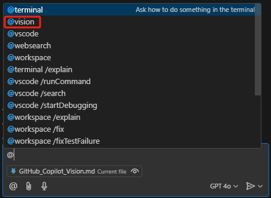
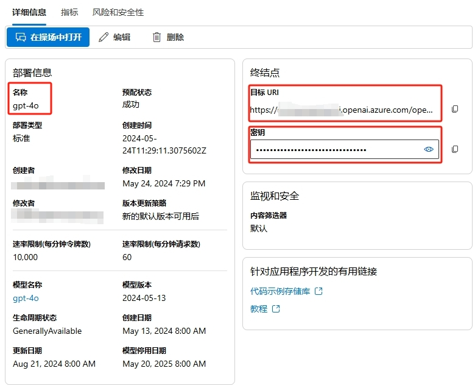
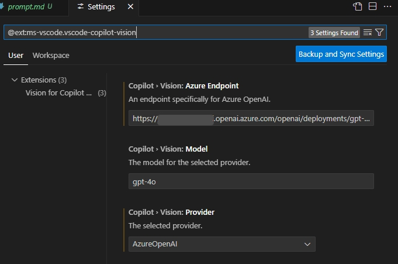
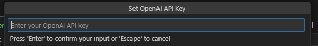
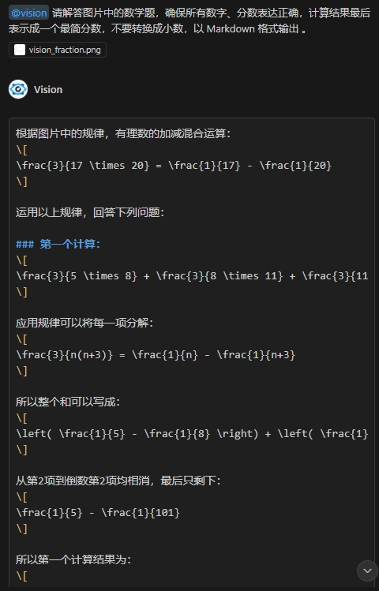
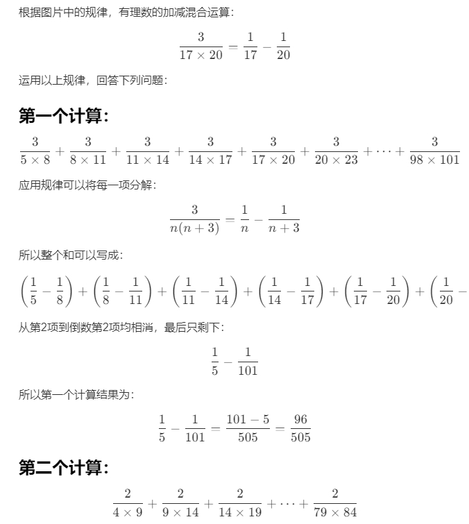

# 使用 Vision 插件让 GitHub Copilot 识图问答

GitHub Copilot 是一个由 GitHub 和 OpenAI 合作开发的人工智能代码提示工具。它可以根据上下文提示代码，还可以回答各种技术相关的问题。GitHub Copilot 在刚刚召开的全球技术大会上宣布升级了 GitHub Copilot 背后的大语言模型，现在已经正式启用 GPT 4o 模型，还增加了可预览使用 o1 模型。虽然未来能支持直接识图，现在还是不能识别图片，以及只能回答技术相关的问题。为了扩展 Copilot 的功能，微软发布了一个名为 Vision for Copilot Preview 的插件，它通过 Copilot 的 Agent 机制对接 OpenAI 中的 GPT 4o 模型实现识图问答。

## 安装 Vision 插件

官网链接在 [Vision for Copilot插件](https://marketplace.visualstudio.com/items?itemName=ms-vscode.vscode-copilot-vision)

或者在 VS Code 的 Extensions 中搜索 "Vision for Copilot" 插件，安装完成后 Copilot Chat 的 Agent 会多一个vision。

## 准备 Azure OpenAI 的 API Key

这个 vision 的 agent 实际上是借用了 Copilot Chat 中方便的 agent 机制再调用 OpenAI 现成的模型实现的识图问答。我们使用 Azure OpenAI，这是用企业级 OpenAI 服务，并且方便启用和配置。以下是简要步骤，注意创建 OpenAI 资源时选择 East US 区域，这是目前提供 gpt-4o 模型的区域。

1. 创建 Azure OpenAI 服务：首先，你需要在 Azure 门户中创建一个新的 Azure OpenAI 服务实例。登录到 [Azure控制台](https://portal.azure.com/)，导航到“创建资源”，然后搜索“Azure OpenAI”。按照提示完成服务的创建。

2. 配置模型：在创建好的 Azure OpenAI 服务实例中，选择“模型部署”，然后选择你想要部署的 GPT-4 模型。配置模型的参数，如名称、版本等。

3. 生成 API KEY：在 Azure 门户中，导航到你的 Azure OpenAI 服务实例，选择“密钥和终结点”。在这里，你可以生成新的 API KEY。

完成这些步骤后，在“部署”页点击刚刚创建好的部署，记下部署名称、终结点、和密钥，以备后面使用即可。

## 使用 Vision 插件

先打开设置 @ext:ms-vscode.vscode-copilot-vision，把前面记录下来的 Azure OpenAI 访问终结点和部署名称填写进去，Provider选择 AzureOpenAI。

首次使用时会弹出提示，需要填写 OpenAI 的 API Key

除了常见的看设计图生成 HTML 代码，使用 Vision 插件可以让 Copilot 识别图片中的问题给出解答。比如

提问效果如下

把所有解答的内容复制另存为一个 markdown 文件，就可以看到详细的解答了。
