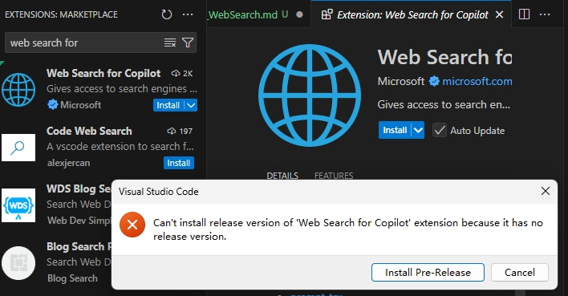
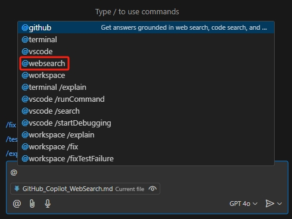
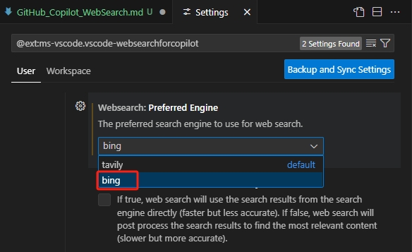
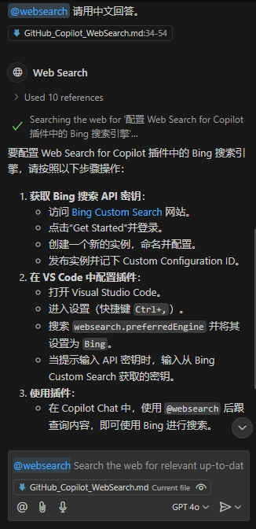

# 使用 Web Search 插件扩展 GitHub Copilot 问答

GitHub Copilot 是一个由 GitHub 和 OpenAI 合作开发的人工智能代码提示工具。它可以根据上下文提示代码，还可以回答各种技术相关的问题。但是 Copilot 本身不能回答非技术类型的问题。为了扩展 Copilot 的功能，微软发布了一个名为 Web Search 的插件，它可以使用搜索引擎来扩展 Copilot 无法回答的问题。

## 安装 Web Search 插件

官网链接在 [Web Search for Copilot插件](https://marketplace.visualstudio.com/items?itemName=ms-vscode.vscode-websearchforcopilot)

在 VS Code 的 Extensions 中搜索 "Web Search for Copilot" 插件，然后安装它。因为当前版本是 v0.1.2024111101 (pre-release) ，所以在安装过程中会弹出提示“Can't install release version...”。

不用担心，点击“Install Pre-Release”按钮，插件会继续安装。

安装完成后 Copilot Chat 的 Agent 会多一个websearch。

## 准备 Bing Search 的 API Key

1. 登录到 [Azure控制台](https://portal.azure.com/)。
2. 在左侧菜单中，点击“创建资源”。
3. 在搜索框中输入“Bing Search API”，然后点击搜索结果中的“Bing Search v7”。
4. 点击“创建”按钮，开始创建新的 Bing Search API 资源。
5. 在配置页面中，选择您的订阅、资源组和定价层。Azure 提供了多个定价层，您可以根据需要选择适合的层级。
6. 填写完所有必填信息后，点击“查看 + 创建”，然后点击“创建”按钮。 等待几分钟，Azure 会自动部署您的 API 服务。

完成这些步骤后，在 Overview 页点击 click here to manage keys，就可以查看到 2 个 Key，咱们保存一个以备后面使用即可。

## 使用 Web Search 插件

只需要在 Copilot Chat 带上 `@websearch` 的代理再提问问题，就可以使用 Web Search 插件来回答问题了。

先打开设置 @ext:ms-vscode.vscode-websearchforcopilot，把默认搜索引擎改成 bing。

首次使用时会弹出提示，需要登录 Bing

点击“Allow” 按钮，然后在 VS Code 顶部弹出的输入框输入刚才记下的 Bing Search 的 key。

按 Enter 键 确认保存。注意这个 key 并不保存在 VS Code 的 settings 中。如果需要更换或清理，需要到 VS Code 本地缓存文件中去删。

继续弹出提示
“The extension "Web Search for Copilot' wants to access the language models provided by GitHubCopilot chat.” 点击“Allow”按钮即可。

再弹出提示，“The extension "Web Search for Copilot' wants to sign in using GitHub.” 点击“Allow”按钮，根据提示选择 GitHub 用户登录即可。

到此所以配置都完成了，稍等 Copilot 就会把通过 Bing 搜索到的内容回答出来了。

有时候即使用中文提问，回答也是英文，再追问一句“请用中文回答” 就可以了。

