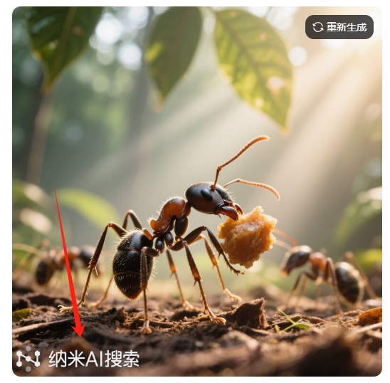
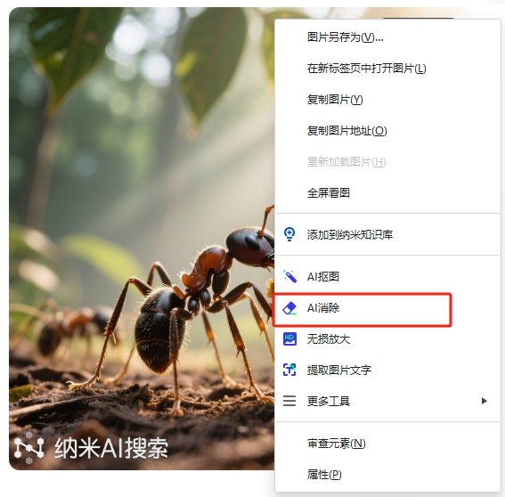
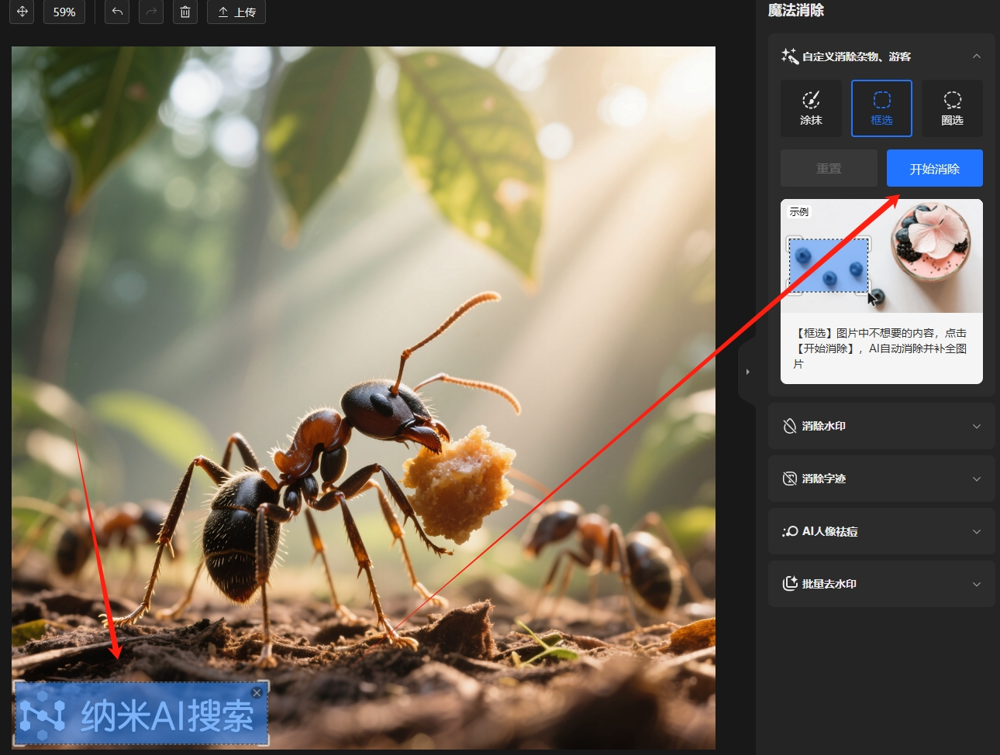

# 纳米AI生成图片去水印

纳米AI是 360 旗下的一个全栈 AI 平台，提供了多种功能，涉及图片的功能就有文生图、图生图、智能抠图、AI消除等。其中生图功能可以使用目前主流的几大模型：豆包3.0、可图、混元、万相2.1 Plus。当然按惯例，纳米AI也会在生成的图片上加上水印。就像下面这样：

纳米AI直接提供了去水印的功能，只需在生成的图片上右键菜单点击“AI消除”。

可以跳转到消除界面，拉框选中水印，然后点击“开始消除”按钮就可以啦。

实际上看这个界面的示例，除了水印，还可以智能消除图片上的其他元素，比如说去掉水印的同时还可以去掉图片上的文字、图标等元素，甚至画面中的特定物体。当然不只是AI生成的图片，其它途径获得的现成图片，想要消除都可以使用这个功能

我最近一直在用纳米AI这个整合AI工具。分享给大家，安装使用的朋友记得输入抽奖码“__7P4QVX__”，祝各位好运！

