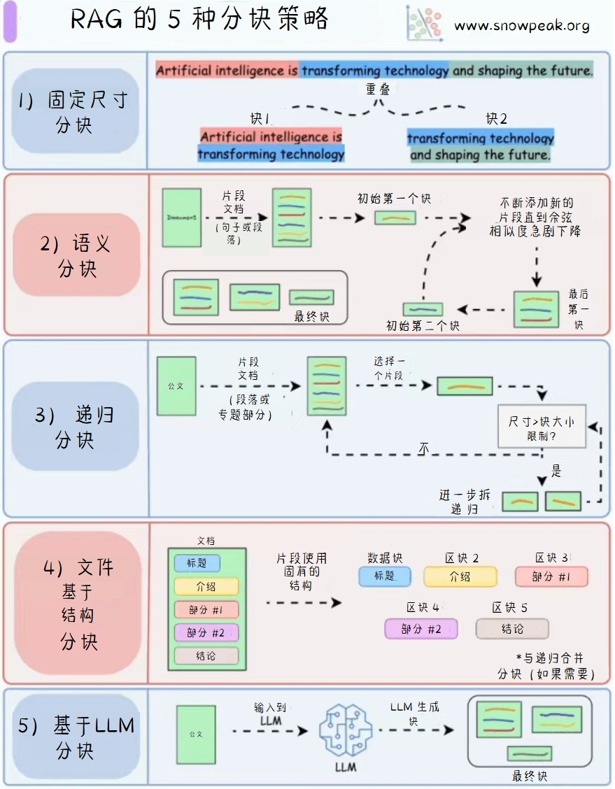

# 图解 AI 核心技术

## Transformer与混合专家（MoE）

上述图示对比展示了Transformer和混合专家（MoE）在结构上的异同。Transformer通过多层解码器块、层归一化、掩码自注意力和前馈网络处理输入；而混合专家（MoE）在Transformer的基础上，将前馈网络替换为一个基于路由器和多个专家的系统，以动态选择最合适的专家进行计算，从而提高模型的效率和表现力。

### 详细解读
#### 左侧：Transformer架构
* __输入（Inputs）__：图片上方展示了Transformer的输入，由一系列彩色方块组成，每个方块代表一个输入元素。
* __位置编码（Positional embedding）__：在输入层之后，通过位置编码给每个输入元素添加位置信息。
* __解码器块（Decoder block）__：解码器块内包含以下组件：
  * __层归一化（Layer norm）__：对输入进行归一化处理。
  * __掩码自注意力（Masked self-attention）__：对输入进行自注意力计算，掩码操作防止模型在训练时“偷看”未来的信息。
  * __前馈网络（Feed forward network）__：由一系列神经元组成的全连接网络，进一步处理掩码自注意力的输出。
* 每个组件之间用加法和层归一化连接，形成残差连接结构。
* __解码器块重复（Decoder block * N）__：多个解码器块堆叠使用，以提高模型的表达能力。
#### 右侧：混合专家（MoE）架构
* __输入（Inputs）__：与Transformer相同，MoE的输入也由一系列彩色方块组成，每个方块代表一个输入元素。
* __位置编码（Positional embedding）__：同样在输入层之后添加位置编码。
* __解码器块（Decoder block）__：解码器块内包含以下组件：
  * __层归一化（Layer norm）__：与Transformer中的层归一化功能相同。
  * __掩码自注意力（Masked self-attention）__：执行与Transformer相同的掩码自注意力操作。
  * __路由器（Router）__：MoE的核心组件，负责根据输入数据选择不同的专家（Expert）进行处理。被选中的专家用彩色方块表示。
  * 每个组件之间也用加法和层归一化连接，形成残差连接结构。
* __解码器块重复（Decoder block * N）__：与Transformer类似，MoE也采用多个解码器块堆叠的方式。

## 微调 LLM 的5种技术

微调大语言模型的五种技术，分别为LoRA、LoRA - FA、VeRA、Delta - LoRA和LoRA+。对比了它们的冻结权重和可训练权重的结构，以及各自的更新规则，帮助读者理解这些技术的原理和差异。

## 传统 RAG 与代理 RAG

传统RAG（Retrieval-Augmented Generation）模型通过检索相关文档来增强生成过程，而代理RAG（Agentic RAG）则将文档嵌入与代理系统结合，提供更丰富的上下文信息。
1. __传统RAG__ 的工作流程如下：

    1. __附加文件__：用户添加文件。这些文件会被编码。
    2. __编码__：文件被编码后，进入嵌入模型。
    3. __嵌入模型__：将文件转换为向量形式，存储在向量数据库中。
    4. __向量数据库__：存储向量表示的文件，用于相似性搜索。
    5. __查询__：用户输入查询，同样被编码后进入嵌入模型。
    6. __相似性搜索__：在向量数据库中搜索与查询相似的文件。
    7. __提示__：将相似文件和查询一起作为提示输入到大语言模型（LLM）。
    8. __最终响应__：LLM生成最终响应返回给用户。

2. __代理RAG__ 的工作流程如下：

    1. __开始__：用户开始查询。
    2. __LLM代理__：查询首先由LLM代理处理，重新制定初始查询。
    3. __更新查询__：LLM代理更新查询，然后进行更多查询。
    4. __搜索更多查询__：LLM代理继续搜索更多相关信息。
    5. __提示__：将更新后的查询和相关信息作为提示输入到LLM。
    6. __LLM__：LLM生成响应。
    7. __工具与API__：LLM可以使用工具和API获取更多信息。
    8. __上下文更新__：根据工具和API获取的信息更新上下文。
    9. __响应__：LLM生成响应，由LLM代理检查。
    10. __是否相关__：LLM代理检查响应是否相关。
    11. __最终响应__：如果相关，将响应返回给用户；否则，继续搜索和处理。
    12. __否__：如果响应不相关，LLM代理继续搜索和更新查询，直到找到相关信息。

## 5种最受欢迎的代理AI设计模式

最受欢迎的代理AI设计模式包括：
1. __Reflection Pattern（反思模式）__：用户提出查询，LLM生成初始输出，然后进行反思和迭代，最终得到经过反思的输出。
2. __Tool Use Pattern（工具使用模式）__：用户发送查询，LLM通过调用工具和向量数据库中的工具及API来获取信息，然后生成回复返回给用户。
3. __ReAct Pattern（反应模式）__：用户输入查询，LLM进行推理，然后根据推理结果采取行动，与环境交互获取结果，最后生成响应返回给用户。
4. __Planning Pattern（规划模式）__：用户提出查询，规划器生成任务，执行器执行任务，判断任务是否完成。如果完成，则返回结果；如果未完成，则重新规划。
5. __Multi-agent Pattern（多智能体模式）__：用户发出请求，不同的智能体之间进行任务委派和协作，最终由某个智能体生成响应返回给用户。

## RAG 的 5 种分块策略

RAG（Retrieval-Augmented Generation）是一种结合了检索和生成的模型架构。其分块策略主要包括以下五种：

1. __固定尺寸分块__：将文本按照固定的尺寸进行分块。
2. __语义分块__：根据语义相关性将文本分成不同的块。
3. __递归分块__：将文本递归地分成更小的块，直到达到指定的大小限制。
4. __基于文件结构分块__：根据文件的结构（如标题、介绍、部分、结论等）进行分块。
5. __基于LLM分块__：使用大语言模型（LLM）生成文本块。

## 代理AI系统的5个级别

代理AI ( Agentic AI) 系统从简单到复杂的五个级别分别为：
1. __基本响应者__
2. __路由器模式__
3. __工具调用__
4. __多代理模式__
5. __自主模式__

## 传统 RAG vs. HyDe

传统的RAG（Retrieval-Augmented Generation）模型通过检索相关文档来增强生成过程，而HyDe（Hybrid Document Embedding）则将文档嵌入与检索相结合，提供更丰富的上下文信息。

1. __传统RAG__ 的工作流程如下：

    1. __附加文件__：将文档进行编码。
    2. __嵌入模型__：将编码后的文档嵌入到向量空间中，并存储在向量数据库中。
    3. __查询__：用户提出查询，查询也被编码。
    4. __相似搜索__：在向量数据库中搜索与查询最相似的文档。
    5. __类似文件__：检索到的相似文档与原始查询一起作为提示。
    6. __提示__：提示被输入到大型语言模型（LLM）中。
    7. __响应__：LLM生成响应并返回给用户。

2. __HyDE__ 的工作流程如下：

    1. __附加文件__：将文档进行编码。
    2. __嵌入模型（检索者）__：将编码后的文档嵌入到向量空间中，并存储在向量数据库中。
    3. __查询__：用户提出查询。
    4. __LLM__：查询被输入到LLM中，生成一个假设文本。
    5. __编码__：假设文本被编码。
    6. __相似搜索__：在向量数据库中搜索与假设文本最相似的文档。
    7. __类似文件__：检索到的相似文档与原始查询和假设文本一起作为提示。
    8. __提示__：提示被输入到LLM中。
    9. __响应__：LLM生成响应并返回给用户。

## 传统RAG与图RAG

传统RAG（Retrieval-Augmented Generation）模型通过检索相关文档来增强生成过程，而图RAG（Graph Retrieval-Augmented Generation）则将文档嵌入与图结构结合，提供更丰富的上下文信息。
1. __传统RAG__ 的工作流程如下：

    1. __附加文件__：将文件输入系统。
    2. __编码__：文件通过嵌入模型进行编码，转化为向量表示。
    3. __嵌入模型__：生成文件的向量表示。
    4. __索引__：向量被存储到向量数据库中，并建立索引。
    5. __相似性搜索__：查询通过嵌入模型编码后，在向量数据库中进行相似性搜索，找到最相关的文档。
    6. __提示__：检索到的相关文档与查询结合，形成提示，输入到大语言模型（LLM）。
    7. __最终响应__：LLM根据提示生成最终的响应。

2. __图RAG__ 的工作流程如下：
    1. __附加文件__：将文件输入系统。
    2. __编码__：文件通过嵌入模型进行编码，转化为向量表示。
    3. __嵌入模型__：生成文件的向量表示。
    4. __索引__：向量被存储到向量数据库中，并建立索引。
    5. __相似性搜索__：查询通过嵌入模型编码后，在向量数据库中进行相似性搜索，找到最相关的文档。
    6. __提示__：检索到的相关文档与查询结合，形成提示，输入到大语言模型（LLM）。
    7. __最终响应__：LLM根据提示生成最终的响应。

## LLM中的KV缓存

LLM（Large Language Model）中的KV缓存（Key-Value Cache）用于存储中间计算结果，以提高模型的推理速度和效率。
