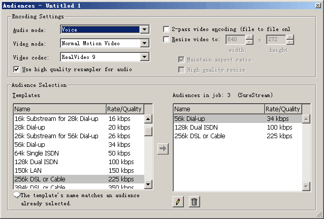
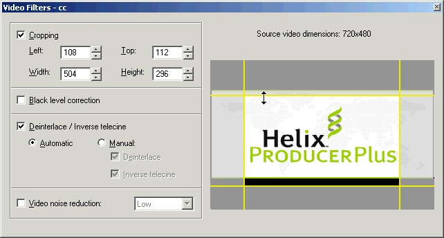
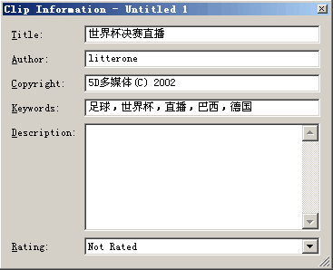
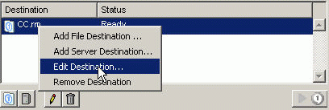

# Compressing RMVB with Helix Producer

Published: *2004-06-20 20:42:00*

Category: __Tools__

Summary: Compressing RMVB with Helix Producer

---------

Most movie and animation files popular on the internet nowadays are in RMVB format, which has the following advantages:

1. It has the highest compression ratio among various media file formats. For movies with the same quality, RMVB format files can achieve the smallest file size, making it the preferred choice for online file transmission and personal file storage.

2. It supports Variable Bitrate, which can automatically adjust the bit rate according to the content of the video. Fast-action scenes are given more data, while slow-action scenes have appropriately reduced data, thus achieving a better quality-to-size performance ratio. This is what distinguishes RMVB files from traditional RM files.

3. Default two-pass compression, where the program automatically completes variable bit rate compression.

4. Automatically invokes VobSub to composite subtitles onto videos without additional operations.

## Installation Method

Official website: [www.realnetworks.com](http://www.realnetworks.com/)

Registration: Basic version is free; Plus version requires purchase

Operating system: Windows 2000 is recommended because Helix Producer compression usually takes a long time, during which system stability is crucial. Only Windows 2000 can meet this requirement. Don't let a system crash ruin files that have been compressed for hours. (XP itself uses too many resources, and Helix Producer also consumes a lot of resources during compression, so it's not recommended.)

Installation requirements: Minimum requirements: CPU>400MHz; RAM>96M; at least 1GB hard disk space. (Higher hardware configuration is recommended! Compression is quite memory-intensive, and faster CPUs make compression more enjoyable. Otherwise, compressing a movie takes half a day, and you need enough patience. Larger hard drives are also better for storing compressed movies.) It's best to have RealOne Player already installed. Although not mandatory, Helix Producer's integration features with RealOne require RealOne to be already installed on the system. Additionally, playing RMVB files later also requires RealOne.

The installation process is just clicking "next" all the way through, nothing special to mention. Now let's start Helix Producer and look at the specific operations for compressing videos.

## Compression Operations

1. Create New Task

Select menu File>New Job or click the New Job button in the lower left corner. This creates a basic framework for our task. The following is the specific configuration. It should be noted that: Helix Producer now manages compression tasks using jobs. Helix Producer Basic can only process one task at a time, while Helix Producer Plus can run multiple tasks simultaneously. Don't just remember to create new tasks; opening, closing, and saving tasks are also essential to know.

2. Set Input Object

Objects here include files and devices. Since we're only using it to compress movies, we'll only introduce input files.

Select File>Open Input File or click the Browse button after Input File, or use the shortcut Ctrl+I to select the file to be compressed. Helix Producer can compress almost all formats of audio and video. Of course, sometimes our video and audio files might not be displayed in the supported playlist. For example, video files on VCD discs are named avseq.dat or music.dat. That's fine, as long as you can confirm they are video and audio files. However, it doesn't support direct compression of DVD VOB files.

3. Output File Settings

(1) Audiences Settings

Click the Audiences button in the middle of the Output pane on the right to open the Audience settings window, as shown below.

A. Encoding Settings

* Audio mode: This relates to the compression content. For news, conferences, and other content mainly consisting of speech, please select Voice. For most animations, please use music.

* Video mode: Use the default Normal Motion Video.

* Video codec: Strongly recommend using RealVideo 9. Its video quality is 30% higher than RealVideo 8 and 50% higher than RealVideo G2; it can achieve DVD-quality effects at 500kbps.

* 2-pass Video encoding is a good feature. Since we're only compressing files without live streaming tasks, we should use two-pass video encoding. What is two-pass video encoding? Two-pass video encoding first analyzes the entire file to find the most suitable compression method, then performs compression. After one pass, it does another pass, hence the name "two-pass video encoding."

B. Audience Selection

Since users have different connection speeds - some might have dial-up (56K modem), some might have ISDN (128K dedicated line), and some might have 1M ADSL - using only one encoding method definitely cannot satisfy everyone. For example: meeting low-speed users' requirements would compromise high-speed users' experience; satisfying high-speed users' effects would make it impossible for low-speed users to watch. So it's best to have several encodings simultaneously, with the server and browser determining the transmission speed based on actual network conditions. This is the famous SureStream - the complete solution to the "can't please everyone" problem!

For file compression, only one audience is needed, and typically DVD-converted movies require audiences with bit rates above 450 kbps. So delete all three default options and select 450 VBR Download from the Templates on the left. The choice of other quality and bit rate settings requires experience, and those interested can explore further.

(2) Video Filters

Helix Producer provides very few filters. Only Cropping is occasionally needed (when the source has black borders that need to be removed), and the width and height must be multiples of 4, which isn't very user-friendly.

For other filters, the default selected Deinterlace - I don't know exactly what it does, but it hasn't caused any problems.

(3) Clip Information

Click "Clip information" to open the Clip information settings dialog. Looking at the image below makes everything clear, so I won't waste time explaining.

4. File Output Path

Helix Producer defaults to file output, saved in the same path as the input file. If you want to modify the output path, you can right-click on the file already in the Destination pane on the right and select Edit Destination; or press the pencil button below. Select another save path.

At this point, all settings are complete, and you can now compress. Select Controls>encode or click , or use the shortcut Ctrl+G to start compression. During compression, pay attention to the compression process log. If problems are found, press the Stop button to interrupt compression. After interruption, once the problem is resolved, you can only restart compression from the beginning. Helix Producer doesn't have the function to continue unfinished tasks.

---
Original link: https://www.snowpeak.fun/cn/article/detail/compress_rmvb_with_helix_producer/