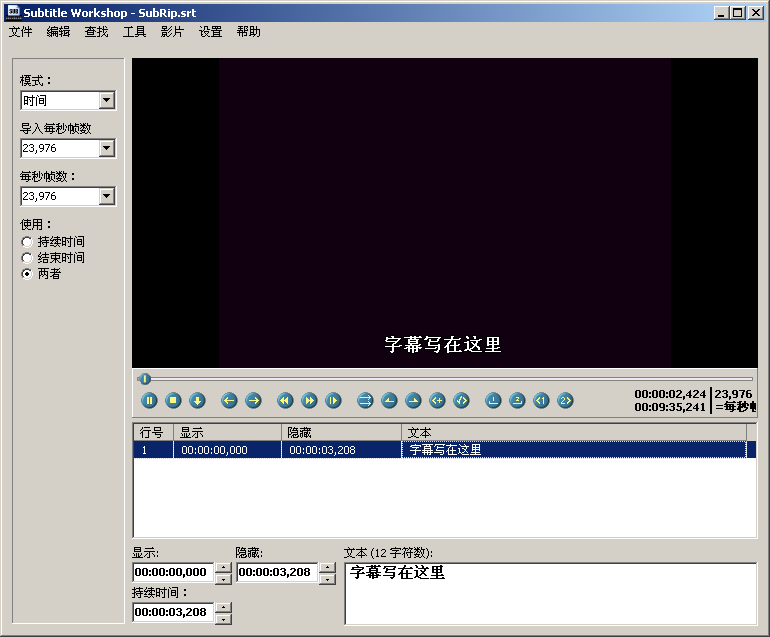
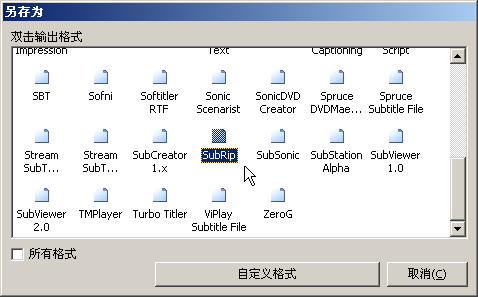
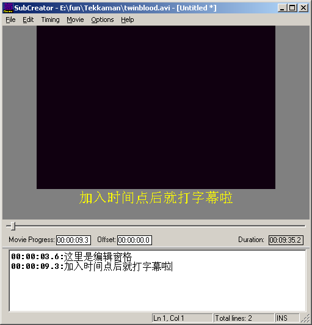

# Snowpeak Recommends Subtitle Tools

Published: *2005-06-14 10:00:00*

Category: __工具__

---------

## [Snowpeak Recommends Subtitle Tools](/cn/article/detail/snowpeak_recommends_subtitle_tools/)

Category: [Multimedia and Subtitles](/cn/article/category/multimedia_subtitle/) 2005-06-14 10:00:00 Views(7205)

## Shortcut Key Preparation

Subtitle creation tools require repeated playing and pausing. Both tools below use the shortcut key Ctrl+Space to control play/pause. However, by default, Ctrl+Space is used by Windows to enable/disable Chinese input methods, so you need to free up the Ctrl+Space shortcut for these tools. (Subtitle Workshop supports custom shortcuts, so you can refer to the help file to set other convenient shortcuts without modifying system shortcuts.)

Open "Regional Options" in Control Panel, click the "Input Locale" tab, click the "Change" button to open the "Text Services" dialog, and click the "Key Settings" button at the bottom. In the "Input Language Hotkeys" menu under "Advanced Key Settings", select "Chinese (Simplified) Input Method - Input Method/Non...", click the "Change Key Sequence" button, select "Enable Key Sequence" in the "Change Key Sequence" dialog, and confirm.

Note: This document uses ">" to indicate a command in a menu or an option page in a dialog, such as File > Open means selecting the Open command from the File menu.

## Subtitle Workshop

Official website: [www.urusoft.net](http://www.urusoft.net/)

Size: 1 MB

Registration: Free software

Operating system: Windows 9x, ME, NT, 2000, XP

Installation requirements: Requires codecs needed to play the video you want to subtitle.

[Official download](http://www.urusoft.net/download.php?lang=1&id=sw)

After installation, when running for the first time, you can go to Settings > Language > Chinese Simplified to switch to Chinese interface. Although this program is made by Spanish developers, it has excellent multilingual support. Moreover, it's the only subtitle tool Snowpeak has found that can simultaneously edit both original and translated subtitle files! Of course, you still need to press Alt + S to configure settings. Under Basic Settings > Character Encoding, set both original and translated character sets to GB2312, because usually we only edit one subtitle file, which will be treated as the original subtitle. If you need to work with two subtitles simultaneously, reset the corresponding character sets here. Use default settings for everything else to get started.

Ctrl+N creates a new subtitle file, Ctrl+P opens a video file. Similarly, Ctrl+Space starts playback, Ctrl+Space pauses. Insert subtitles using the Insert key, then write text in the editing pane below. Then Ctrl+Space to start playback again, Ctrl+Space to pause when you need to add subtitles, then use Insert key to add new subtitle lines. Repeat this process.

In SW's editing pane, you can naturally write multiple lines without special operations.

In SW, you can set subtitle start and end times. Usually, the start time is already set when adding subtitles with Insert. To set the end time, use shortcut Alt+V.

Note that the time point here is when the subtitle starts displaying. For example, for dialogue, it should be when speaking begins. If you pause after speaking has already started, you can use commands under Edit > Time. The shortcuts differ from SubCreator. Defaults are:

Advance time point Ctrl+Shift+H; Delay time point Ctrl+Shift+N;
Fast forward Ctrl+Right, Fast backward Ctrl+Left, Slow forward Alt+Right, Slow backward Alt+Left.

SW shortcuts can be customized by users, though it's done through configuration files, which isn't very convenient for ordinary users.

SW saves files in standard subtitle formats. When saving, a save format dialog appears:

Generally select SubRip, double-click it to get the save path dialog. This format is the simplest; complex formats can be saved later after completing the entire subtitle. Besides supporting 54 common subtitle formats, SW also allows users to define custom file formats for their work! However, these advanced features aren't necessary.

### Custom Shortcut Example

Find the shortcuts.key file in the installation or extraction folder, which can be opened with Notepad. Find
SetKey(aPlayPause,Ctrl,Space)
You can modify it to, for example, SetKey(aPlayPause,Ctrl+Shift,Space), which will make it use Ctrl+Shift+Space to control play/pause.

### Making SW Support RM/RMVB Files

Some existing video files with Chinese subtitles might be RM/RMVB files. To make SW support RM/RMVB files, do the following:

Download and install RealOne codec, available at the following URL or search common download sites.

<http://www.skycn.com/soft/14852.html>

Change the extension of RM/RMVB files you want SW to open to .avi, then use CTRL+P to open the video.

## SubCreator

Official website: [www.radioactivepages.com](http://www.radioactivepages.com/)

Size: 718KB

Registration: Free software

Operating system: Windows 9x, ME, NT, 2000, XP

Installation requirements: No installation needed, run directly after extraction. However, requires Windows Media Player to be installed on the system, as well as codecs needed to play the video you want to subtitle.

[Official download](http://www.radioactivepages.com/download/SubCreator1.2.0.117.zip)

After extraction, run SubCreator.exe directly. The first time you run it, a Settings Wizard appears. Click Next; on the Font Settings page, it's recommended to set Script Font to Fixedsys (font for subtitles being edited in the editing window) and Subtitle Font to SimSun (font for subtitle preview below the video in the preview window). In both font dialogs, set the character set to "CHINESE_GB2312", otherwise Chinese won't display properly. Colors can be changed according to personal preference or left as default.

Click Next. The next General Settings page can remain unchanged. Click Next. On the Video Playback page, select the second option, which uses Windows Media Player ActiveX to play videos - more stable and supports more file formats. Any video that Windows Media Player can play can be opened here. Click Finish to complete. A "Tip of the Day" will appear - just read it. If you don't want this tip to pop up every time you run the program, uncheck "Show Tips on Startup".

File > Open or Ctrl+O to open a video file. SubCreator automatically adjusts video playback size to fit the window, but won't play videos larger than the window size. If you're creating new subtitles, just write in the editing pane below.

Ctrl+Space (Movie > Play) plays the video. When you reach a point where subtitles are needed, press Ctrl+Space (Movie > Stop) to pause, then Ctrl+A (Timing > Set Timestamp) to add a time point, then input the subtitle line after it. Continue with Ctrl+Space to play until the next subtitle point, then Ctrl+Space to pause, Ctrl+A to add a time point, and input the subtitle line after it. Repeat this process.

When you need multiple lines, don't use Enter. Instead, use "|" character (above the Enter key) to separate multiple subtitle lines.

Remember to File > Save as after writing several lines, saving in the same folder as the video with the same name is good. You can see that SubCreator saves files in plain text TXT format. Opening it with Notepad shows it contains exactly what you wrote in the editing pane. Creating the final usable external subtitle file requires the export function, which will be covered later.

Note that the time point here is when the subtitle starts displaying. For dialogue, it should be when speaking begins. If you pause after speaking has already started, you can use commands in the Timing menu to adjust time points. Most commonly used are Ctrl+D to advance time and Ctrl+W to delay time, each use changes it by 0.1 seconds.

Other commonly used shortcuts include fast forward, fast backward, slow forward, slow backward for video playback - check the Movie menu.

Since this software is made by foreign developers, Chinese support isn't great. The subtitle line being edited might display as garbled text, but as long as it displays normally in the preview pane, it's fine. After writing multiple lines, previous lines will display Chinese normally. Only the line being edited has issues - when modifying, you need to press backspace twice to delete one Chinese character, otherwise deleting half a character will turn the entire line into real garbled text.

If importing existing subtitle files, use Ctrl+O to open a subtitle file.

SubCreator doesn't support custom shortcuts.

Due to limited time, welcome subtitle creators to exchange ideas and guidance.

---
*Original link: https://www.snowpeak.fun/cn/article/detail/snowpeak_recommends_subtitle_tools/*