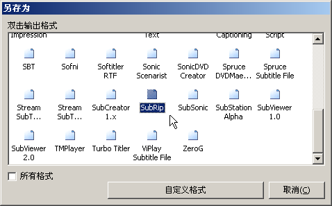

# Subtitle Workshop — Snowpeak's Recommended Subtitle Tool

Release Time: *2005-07-24 10:00:00*

Summary: Official website: www.urusoft.net Size: 1 MB Registration: Free software Operating system: Windows 9x, ME, NT, 2000, XP Installation requirements: Requires codecs needed to play the video files you want to subtitle. Official download Local download This is a compressed program file extracted by Snowpeak, can be run directly after extraction without installation, interface has been changed to Chinese. After installation and first run, go to Settings > Language > Chinese Simpli

Category: __Tools__

Original Link: [https://snowpeak.blog.csdn.net/article/details/433102](https://snowpeak.blog.csdn.net/article/details/433102)

---------

Official website: [www.urusoft.net](<http://www.urusoft.net>)

Size: 1 MB

Registration: Free software

Operating system: Windows 9x, ME, NT, 2000, XP

Installation requirements: Requires codecs needed to play the video files you want to subtitle.

[Official download](<http://www.urusoft.net/download.php?lang=1&id=sw>)
[Local download](<http://www.snowpeak.org/media/tool/SubtitleWorkshop251.zip>) This is a compressed program file extracted by Snowpeak, can be run directly after extraction without installation, interface has been changed to Chinese.

After installation and first run, go to Settings > Language > Chinese Simplified to change to Chinese interface. Although this program was made by Spanish developers, it has excellent multilingual support. Moreover, it's the only subtitle tool discovered by Snowpeak that can simultaneously edit both original and translated subtitle files! Of course, you still need to press Alt + S to configure settings. In Basic Settings > Character Encoding, select GB2312 for both original and translated character sets, because usually we only edit one subtitle file, which will be treated as the original subtitle. If you need to work on two subtitles simultaneously, you can reconfigure the corresponding character sets here. Other settings can use defaults to start working.

Ctrl+N to create a new subtitle file, Ctrl+P to open a video file. Use Ctrl+Space to start playback and Ctrl+Space to pause. To insert subtitles, use the Insert key, then type in the editing pane below. Then press Ctrl+Space to resume playback, pause with Ctrl+Space when you need to add subtitles, and use Insert key to insert new subtitle lines. Repeat this process.

SW's editing pane allows you to naturally write multi-line text without special operations.

In SW, you can set subtitle start and end times. Usually when inserting subtitles with Insert, the start time is already set. To set the end time, use the shortcut Alt+V.

Note that the time point here is when the subtitle starts displaying. For example, for dialogue, it should be when speaking begins. If you pause after speaking has already started, you can use the commands under Edit > Time menu. The shortcuts are different from SubCreator. Defaults are:

Move time forward: Ctrl+Shift+H; Move time backward: Ctrl+Shift+N;
Fast forward: Ctrl+Right, Fast backward: Ctrl+Left, Slow forward: Alt+Right, Slow backward: Alt+Left.

SW shortcuts can be customized by users, though it's done through configuration files, which is not very convenient for ordinary users.

SW saves files in standard subtitle formats. When saving, a save format dialog will appear:

Generally select SubRip, double-click it to open the save path dialog. This format is the simplest; complex formats can be saved after completing the entire subtitle. SW supports 54 common subtitle formats and also allows users to define custom file formats for work use! However, these advanced features are optional. ;)

##### Custom Shortcut Key Example

Find the shortcuts.key file in the installation or extraction folder, which can be opened with Notepad. Find
SetKey(aPlayPause,Ctrl,Space)
You can modify it to, for example, SetKey(aPlayPause,Ctrl+Shift,Space), which will allow it to control play/pause with the shortcut Ctrl+Shift+Space.

##### Making SW Support RM/RMVB Files

Some existing video files with Chinese subtitles might be RM/RMVB files. To make SW support RM/RMVB files, do the following:

Download and install RealOne codec, which can be downloaded from the following website or by searching common download sites.

<http://www.skycn.com/soft/14852.html>

Change the file extension of the RM/RMVB file you want SW to open to .avi, then use CTRL+P to open the video file.