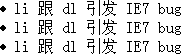

# A CSS Fix to LI in IE7

Published: *2008-04-22 15:20:00*

Category: __Frontend__

Summary: In IE7, there is a bug when an HTML `<li>` element is immediately followed by a `<dl>` element. The first `<li>` item in an `<ol>` or `<ul>` list does not display its preceding marker or number.

-------------

In IE7, there is a bug when an HTML `<li>` element is immediately followed by a `<dl>` element. The first `<li>` item in an `<ol>` or `<ul>` list does not display its preceding marker or number. For example:

```html
<ul>
  <li><dl>li followed by dl triggers IE7 bug</dl></li>
  <li><dl>li followed by dl triggers IE7 bug</dl></li>
  <li><dl>li followed by dl triggers IE7 bug</dl></li>
</ul>
```

Here is a screenshot of the issue in IE7:


For comparison, here is the correct rendering in Firefox 2.0:



After testing, it was found that this issue only occurs when `<li><dl>` is used. However, if there is any character other than whitespace between `<li>` and `<dl>`, such as text or another element, the issue does not occur.

If you want `<dl>` to follow `<li>` directly, you can fix this using CSS:

```css
li {
  position: relative;
}
```

This resolves the issue.

---
*Original link: https://www.snowpeak.fun/cn/article/detail/a_css_fix_to_li_in_ie7/*
