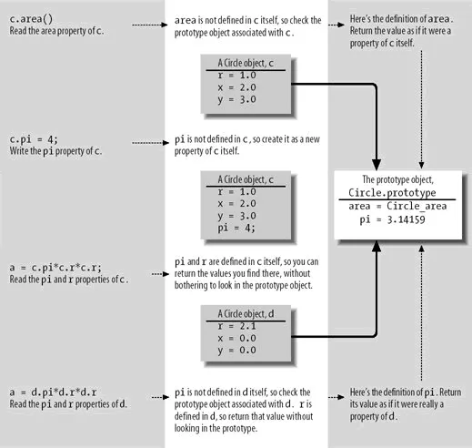

# JavaScript Classes and Class Generator Tool

Published: *2011-04-20 17:56:00*

Category: __Frontend__

Summary: This article introduces the built-in prototype-based class usage in JavaScript through examples, and explains step by step how to implement a class generator tool function to achieve class-based (similar to object-oriented languages) class definition syntax.

---------

## Overview

### Who Should Read This Document?

This article provides an in-depth explanation of JavaScript class-related knowledge and introduces some advanced features for improving object-oriented programming in JavaScript. It is suitable for friends who are familiar with JavaScript, understand JavaScript basic syntax, and have some JavaScript development experience.

### What is the Use of This Document?

The content introduced in this document is suitable for large-scale JavaScript development, especially when extensively using object-oriented programming with class declarations and inheritance.

### Significance

By definition, JavaScript is a prototype-based (prototype-based) object-oriented (object-oriented) scripting language that has all the main features of object-oriented languages and can fully implement object-oriented programming. Due to JavaScript's prototype-based characteristic, using the syntax supported by the language itself for class declaration and inheritance is quite different from the syntax used in other mainstream object-oriented languages. Creating a convenient class generator (Class Creator) to implement class-based (class-based) programming syntax inheritance will greatly facilitate object-oriented JavaScript programming. It not only conforms to programmers' familiar thinking patterns of class inheritance and improves development efficiency, but also reduces code volume and improves the efficiency of JavaScript program parsing and execution.

When conducting large-scale JavaScript development, object-oriented writing is used extensively, making the role of class generators even more important. Class generators have become an indispensable core component of JavaScript basic class libraries, such as Prototype library's [Class.create()](<http://api.prototypejs.org/language/Class/create/>) and extJs's [Ext.create()](<http://dev.sencha.com/deploy/dev/docs/source/ComponentMgr.html#method-Ext-create>) and [Ext.extend()](<http://dev.sencha.com/deploy/dev/docs/source/Ext.html#method-Ext-extend>).

## JavaScript's Built-in Prototype-based Class Usage

### Class Declaration

JavaScript itself supports the use of classes, but it is prototype-based, and its syntax is different from what we are familiar with in other languages. Let's first look at JavaScript's built-in class usage. The following examples and explanations are from "JavaScript: The Definitive Guide, 5th Edition". Its cover features a rhinoceros, and familiar JavaScript friends affectionately call it the "rhino book" based on its cover.

A class can be declared with the following code:

```javascript
// Use a function as a constructor. Its role is to initialize property values that are different for each instance.
function Rectangle(w, h) {
    this.width = w;
    this.height = h;
}

// When we need members that are shared by all instances, we put these members in the prototype object.
Rectangle.prototype.area = function() {
    return this.width * this.height;
}
```

With the above code, we have declared a Rectangle class. Each instance will have different properties width and height. In "The Definitive Guide," such members are called instance properties (instance property) or instance methods (instance method). They share a method area(). In "The Definitive Guide," such members are called class properties (class property) or class methods (class method). This effect can be verified with the following code:

```javascript
var r = new Rectangle(2, 3);
r.hasOwnProperty("width");  // true: width is a direct property of r
r.hasOwnProperty("area");   // false: area is an inherited property of r
"area" in r;                // true: "area" is a property of r
```

JavaScript's core principle when instantiating an object with the new keyword is through "prototype". A constructor is a function that provides the name for this "class" of objects and initializes property values that are different for each instance. The constructor function is associated with a prototype object. Each object instance initialized using this constructor function will have a set of identical properties and methods from this prototype. Object instances having prototype properties and methods is not achieved by copying prototype members to each instance, but through the process of looking up members. That is, when JavaScript encounters a call to a member of an object, it first looks for the object's own instance properties or instance methods. If not found, it continues to look up the class properties or class methods in the prototype of the object's class constructor.

JavaScript's mechanism has two implications. First, using prototype to implement member sharing can save a lot of memory. Second, since members are looked up and called at runtime, even after an object is instantiated, if members are added to the prototype, the object instance can use these newly added members (although this is not recommended).

The following image from "The Definitive Guide" visually illustrates the principle of runtime object member lookup and usage.



### Class Inheritance

Let's explain JavaScript's native class inheritance usage with the following example. Based on the previous Rectangle class declaration, we'll inherit a subclass from it.

```javascript
function PositionedRectangle(x, y, w, h) {
    //First, call the parent class constructor in the new object's constructor method using the call method to apply the parent class constructor to the current class instantiated object.
    //This practice is called constructor chaining. Many class inheritance languages have this practice.
    Rectangle.call(this, w, h);
    
    // Now add two properties to the current class.
    this.x = x;
    this.y = y;
}

// If we use the default prototype object, we'll only get a subclass of the default Object class.
// To inherit the Rectangle class, we must explicitly create our own prototype object and specify it as new Rectangle() to get Rectangle's prototype object.
PositionedRectangle.prototype = new Rectangle();

// The prototype object of the previous constructor was created using the Rectangle() constructor. The prototype object has a constructor property pointing to the constructor itself, so each object instance can know which function is its constructor through the constructor.
// We want the object instances of the current subclass PositionedRectangle to have their own constructor. We can explicitly specify it as follows.
PositionedRectangle.prototype.constructor = PositionedRectangle;

// Now that we've prepared the subclass prototype object, we can add new instance methods to it.
PositionedRectangle.prototype.contains = function(x, y) {
    return (x > this.x && x < this.x + this.width && y > this.y && y < this.y + this.height);
}
```

After declaring this subclass as above, we can use it.

```javascript
var pr = new PositionedRectangle(2, 2, 2, 2);
pr.contains(3, 3);                     // Call own instance method
pr.area();                             // Call inherited instance method from parent class

// Call parent and own properties the same way
pr.x + ", " + pr.y + ", " + pr.width + ", " + pr.height;

// This object instance is an instance of the following 3 classes
pr instanceof PositionedRectangle     // true
pr instanceof Rectangle               // true
pr instanceof Object                  // true
```

## Step-by-Step Creation of a Class Generator

The above examples show that JavaScript fully supports class declaration and inheritance, but it is indeed somewhat cumbersome to use. Friends familiar with mainstream JavaScript basic class libraries may know some class generator usages. Let's create a class generator ourselves.

Essentially, a class generator tool function encapsulates the JavaScript class writing method discussed earlier. Let's first clarify our goals and then implement them step by step.

1. Simplify class definition syntax. Instead of writing constructors separately and defining methods in prototype one by one, pass in a concise JSON structure and convert it to a class definition. Use as constructor method name, and the constructor method is optional.
2. Basic class inheritance, inheriting only one class at a time
3. Support instanceof method to detect if an object is an instance of a class
4. Subclasses can call parent class methods, either calling parent class methods with different names or calling parent class methods with the same name.

### Step Zero, First Give Our Class Generator Tool Function a Function Name

Let's clarify again that a class generator is essentially a tool function. It receives parameters related to class definition and returns a constructor function for instantiating objects. Based on the basic knowledge of JavaScript class usage introduced earlier, this returned constructor function also has its prototype object and related properties and methods. Just use new to instantiate different object instances. So a class generator itself is not a class definition; it is a regular function. According to common class library naming conventions, this function name should be all lowercase. Let's call it classer, meaning "a tool for making classes."

### Step One, First Simplify Class Definition Syntax

Pass in a JSON structure and convert it to the constructor function and prototype object required for class definition and related properties and methods. It's essentially organizing JavaScript's separate declaration of constructor functions and prototype methods together.  
We agree to use __init as the constructor method name, and the constructor method is optional.

```javascript
// Only one parameter, which is the class definition
var classer = function(aDefine) {
    //Agree that the constructor function name is __init()
    var constructorName = '__init';
    
    //The type is the constructor function. If there is no __init(), use the default root class Object's constructor function
    var aType = aDefine[constructorName] ? aDefine[constructorName] : Object;
    var aPrototype = aType.prototype;
    
    for (var member in aDefine)  //Copy class definition to current class prototype
    {
        if(constructorName != member)  //Constructor function doesn't need to be copied
        {
            aPrototype[member] = aDefine[member];
        }
    }
    
    return aType;
};
```

With this most basic class generator, we can define classes more simply. For example:

```javascript
var Animal = classer({
    __init: function(name) {
        this.name = name;
    },
    
    getName: function() {
        return this.name;
    }
});

// Instantiate an object and test it.
var animal = new Animal('animal');
animal instanceof Animal;  // true
animal.getName();          // "animal"
```

### Step Two, Implement Class Inheritance

Here we use Li Zhan's Ganlu model writing. When there is one parameter, it is a class definition. When there are two parameters, the first one is the base class and the second one is the current class definition.

```javascript
var classer = function() {
    var argLength = arguments.length;
    var aDefine = arguments[argLength-1];  //The last parameter is the class definition
    
    if(aDefine) {
        //Parse the base class. Use the base class when there is one, otherwise use the default root class Object
        var aBase = argLength > 1 ? arguments[0] : Object;
        
        //Agree that the constructor function name is __init()
        var constructorName = '__init';
        
        //The type is the constructor function. If there is no __init(), use the default root class constructor function.
        //The classic class inheritance approach is also to call Parent.call(this, arguments); in the Child constructor.
        var aType = aDefine[constructorName] ? aDefine[constructorName] : function() {
            aBase.call(this, arguments);
        };
        
        //Classic class inheritance is essentially Child.prototype = new Parent(); But just var aPrototype = new aBase(); won't work,
        //because we can't directly access the object's built-in prototype property. We must pass it through a constructor chain.
        //See "Wutou" http://www.cnblogs.com/leadzen/archive/2008/02/25/1073404.html
        function prototype_() {}           //Prepare to pass prototype
        prototype_.prototype = aBase.prototype;  //Establish the prototype to be used by the class. The new object's built-in prototype will be the expected prototype object
        var aPrototype = new prototype_();
        
        //Copy class definition to current class prototype
        for (var member in aDefine) {
            //Constructor function doesn't need to be copied
            if(constructorName != member) {
                aPrototype[member] = aDefine[member];
            }
        }
        
        //Set the class (constructor function) prototype
        aType.prototype = aPrototype;
        //Set the class constructor
        aType.prototype.constructor = aType;
        
        return aType;
    }
};
```

After the above expansion, we can now inherit classes very conveniently. Based on the previous Animal class, we inherit a subclass Dog.

```javascript
var Dog = classer(Animal, {
    __init: function(name) {
        this.name = name;
    },
    
    bark: function() {
        return 'woof';
    }
});

// Instantiate an object and test it.
var dog = new Dog('dog');
dog instanceof Dog       // true
dog instanceof Animal    // true
dog instanceof Object    // true
dog.getName()            // "dog"
dog.bark()               // "woof"
```

### Finally, Let's Implement Calling Parent Class Members in Subclass Declarations

In the process of assembling prototype object members above, the parent class members have been assembled into the subclass prototype object. Therefore, subclass method declarations can directly use parent class members, except when a subclass method needs to call a parent class method with the same name. Now we'll借鉴 John Resig's solution to solve this problem.

```javascript
var classer = function() {
    var argLength = arguments.length;
    var aDefine = arguments[argLength-1];  //The last parameter is the class definition
    
    if(aDefine) {
        //Parse the base class. Use the base class when there is one, otherwise use the default root class Object
        var aBase = argLength > 1 ? arguments[0] : Object;
        
        //Agree that the constructor function name is __init()
        var constructorName = '__init';
        
        //The type is the constructor function. If there is no __init(), use the default root class constructor function.
        //The classic class inheritance approach is also to call Parent.call(this, arguments); in the Child constructor.
        //Classic class inheritance is essentially Child.prototype = new Parent(); But just var aPrototype = new aBase(); won't work,
        //because we can't directly access the object's built-in prototype property. We must pass it through a constructor chain.
        
        // Add _super() method to implement the current class method calling the parent class method with the same name
        var _super = aBase.prototype;
        
        //Construct a temporary function for the prototype to connect the prototype chain
        function prototype_() {}           //Prepare to pass prototype
        prototype_.prototype = _super;
        
        //Establish the prototype to be used by the class. The new object's built-in prototype will be the expected prototype object
        var aPrototype = new prototype_();
        
        //Copy class definition to current class prototype
        for (var member in aDefine) {
            aPrototype[member] = (
                ("function" == typeof aDefine[member]) && 
                ("function" == typeof _super[member])
            ) ? (function(member, fn) {
                return function() {
                    // The _super method is just temporarily added, so first backup the original this._super to tmp, then restore it to the original this._super = tmp after binding;
                    // As for the binding approach, what I can understand now is var ret = fn.apply(this, arguments); applying fn to the current object's this,
                    // Finally, the returned return ret; is this function. This realizes that this._super() can be called in each method of the class definition, the method names are the same, but their contents are different!
                    var tmp = this._super;
                    
                    // Add a ._super() method to the current method in the parent class
                    this._super = _super[member];
                    
                    // This method is only temporarily bound, so after execution we delete it again.
                    var ret = fn.apply(this, arguments);
                    this._super = tmp;
                    
                    return ret;
                };
            })(member, aDefine[member]) : aDefine[member];
        }
        
        // To implement calling the parent class constructor with the same name in the constructor method, we need to put the constructor method definition after copying prototype members.
        // And the program statements are more natural: use your own constructor method if you have one, otherwise use the parent's.
        var aType = aDefine[constructorName] ? aPrototype[constructorName] : _super[constructorName];
        
        //Set the class (constructor function) prototype
        aType.prototype = aPrototype;
        //Set the class constructor
        aType.prototype.constructor = aType;
        
        return aType;
    }
};
```

Finally, let's demonstrate our results and test them. Note that in subclass definitions, `_super()` methods can be used in different methods, and they point to different methods in the parent class!

```javascript
var Person = classer(Animal, {
    __init: function(name, sex) {
        this.sex = sex;
        this._super(name);
    },
    
    getName: function() {
        return 'Person says ' + this._super();
    },
    
    getSex: function() {
        return this.sex;
    }
});

var p = new Person('boy', 'male');
p instanceof Person     // true
p instanceof Animal     // true
p instanceof Object     // true
p.getName()             // "Person says boy"
p.getSex()              // "male"
```

The above class generator code and explanations reference Li Zhan's ["Wutou JavaScript" Ganlu Model](http://www.cnblogs.com/leadzen/archive/2008/06/04/1213090.html)
and [John Resig's Simple JavaScript Inheritance](http://ejohn.org/blog/simple-javascript-inheritance/).

Our final class generator classer function adopts the two-parameter approach of the Ganlu model because I personally prefer this approach. Its usage habits are basically consistent with the class-based declaration approach commonly used by everyone. Whether declaring a new class or inheriting a class, the classer() function is uniformly called, which looks clearer and more understandable than John Resig's approach. John Resig's solution adds an extend() method to the constructor functions of all classes generated by its generator, which I don't like.