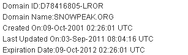

# Snowpeak.org 10th Anniversary Celebration

Published: *2011-12-25 17:56:15*

Category: __System__

Introduction: This article documents the 10th anniversary of the snowpeak.org domain registration, reviewing the website's development journey from its creation in 2000 to the present, and the story behind the domain registration.

---------

Time flies like an arrow; days pass like a shuttle. The snowpeak.org domain has been registered for 10 years this year. I didn't get a chance to write a commemorative article on the exact 10th anniversary, but I'd like to express my feelings now.

Let's start with a screenshot.

This is the domain registration information found on Wanwang (a Chinese domain registrar). The domain registration date shown above is October 9, 2001. At that time, major portal websites were just getting started. In that era, there were still many free hosting spaces available. Free hosting was once a service offered by portal websites. Snowpeak also started with free hosting. To be precise, the earliest online "Snowpeak Scenery" website launched in the fall and winter of 2000. The exact time is no longer verifiable, but it should have been around the end of October or early November 2000.

2001 was the year when Snowpeak graduated and started formal work. After running a personal website for about a year, I began considering registering an official domain name. Since my online nickname had always been "Snowpeak," I naturally thought of using snowpeak as the English domain name. When registering the domain in 2001, both snowpeak.com and snowpeak.net were already registered. The registrant of these two domains is the American outdoor user company Snow Peak, which still uses the snowpeak.com domain today. Fortunately, the snowpeak.org domain was not yet registered, so I didn't hesitate to register it. I also purchased virtual hosting space and cultivated it silently, making it a small haven for sharing insights and pursuing ideals.

Over the past decade, this website has only experienced 3 official versions, including this new version launched this year, which can be described as "continuous writing without pause." However, it's not easy to persist for ten years. At least I never gave up. The version that everyone can see today may look functionally rudimentary on the surface. But from a technical perspective, it represents the culmination of ten years of Snowpeak's internet application development experience. Though it's a small website, it has a big architecture behind it, and the frontend also uses quite a lot of optimization solutions. I'll publish a detailed technical analysis in a later article.