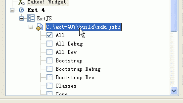

# Installing Spket in Eclipse for ExtJs4.1 and jQuery Code Completion

Published: *2012-07-08 20:31:58*

Category: __Frontend__

Introduction: This article introduces how to install the Spket plugin in Eclipse and configure it to support code completion for ExtJs4.1 and jQuery. Through detailed step-by-step instructions, it helps developers improve JavaScript development efficiency.

Original link: [https://snowpeak.blog.csdn.net/article/details/7727874](https://snowpeak.blog.csdn.net/article/details/7727874)

---------

Translated and organized from Spket official website instructions   
<http://www.spket.com/extjs.html>   
<http://www.spket.com/jquery.html>   
  
Spket is an excellent JavaScript plugin for Eclipse that supports various mainstream JavaScript libraries. It provides code completion for JavaScript, XUL/XBL, Laszlo, SVG and Yahoo! Widget, and here we introduce how to run it as an Eclipse plugin and configure it to support ExtJs4.1 and jQuery code completion.   
  
To install Spket in Eclipse, you can download the plugin package from the Spket official website http://www.spket.com and install it. The latest version is 1.6.22.   
  
Configuring ExtJs4.1 Support   
Download Ext JS 4.1 from the ExtJS official website   
<http://www.sencha.com/products/extjs/download/>   
Extract and make sure to keep the src directory.   
In Eclipse, go to Window -> Preferences -> Spket -> JavaScript Profiles -> New   
Enter "ExtJS" and click OK;   
Select "ExtJS" and click "Add Library" then select "ExtJS" from the dropdown;   
Select "ExtJS" and click "Add File", then select the sdk.jsb3 file in the previously extracted build directory.   
A series of ExtJS components will be listed under this file, check them all.   

As shown in the following figure  
  

Finally, select ExtJS and click Default on the right to set this as default.   

Now create a new JavaScript file with Spket JavaScript Editor, press Alt+/ to see code completion which indicates successful configuration.  
As shown in the figure below  
  

Configuring jQuery Support   
Download the annotated full source code from the jQuery official website <http://jquery.com/>, such as jquery-1.7.2.js.   
  
In Eclipse, go to Window -> Preferences -> Spket -> JavaScript Profiles -> New   
Enter "jQuery" and click OK;   
Select "jQuery" and click "Add Library" then select "jQuery" from the dropdown;   
Select "jQuery" and click "Add File", then select the jquery-1.7.2.js file you just downloaded.   
A series of components will be listed under this file, check them all.   
Finally, select jQuery and click Default on the right to set this as default.   
Now create a new JavaScript file with Spket JavaScript Editor, type $('a'). to see code completion which indicates successful configuration.