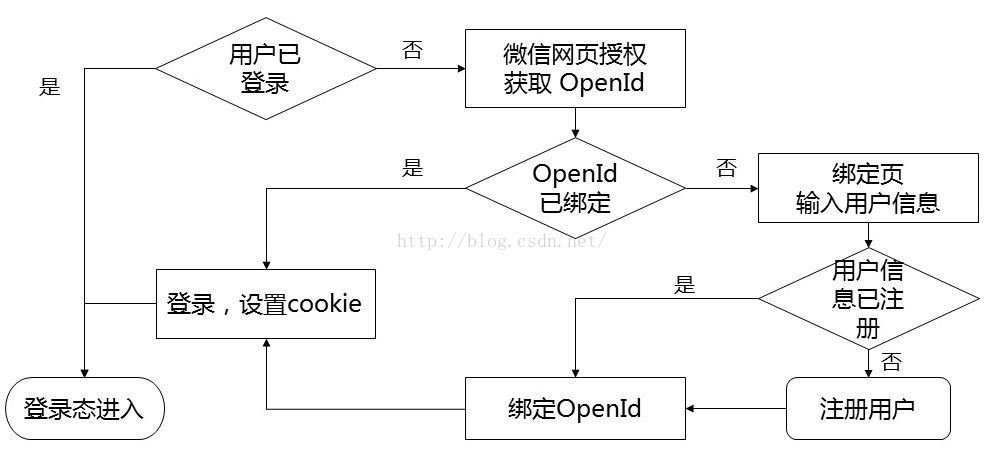

# WeChat Official Account Development - Simplified User Binding through Web Authorization

Published: *2016-03-13 22:37:47*

Category: __Development__

Introduction: This tutorial introduces how to implement simplified user-system binding through WeChat web authorization. Using the OAuth2.0 interface, users can achieve automatic login without repeated logins, enhancing user experience. The article details the association process between WeChat user OpenID and system user UserId, as well as the implementation method of silent authorization mode.

Original link: [https://snowpeak.blog.csdn.net/article/details/50880884](https://snowpeak.blog.csdn.net/article/details/50880884)

---------

Prerequisites for this tutorial:

- Understanding the basics of WeChat official account development. You should have applied for a WeChat official account and set up development mode. If not, please first study at the official WeChat platform: http://mp.weixin.qq.com/wiki.
- Basic server-side development skills. This article mainly explains the process and does not involve specific programming languages.

First, we need to clarify that binding WeChat users and system users aims to allow the system to automatically log in users when they access the system through WeChat again after one-time binding, avoiding repeated login operations and providing a smoother user experience.

The core logic of WeChat user binding is essentially establishing an association between the WeChat user's OpenID and the system user's UserId. Currently, there are 2 methods to obtain a WeChat user's OpenID:
1. Obtaining from user interaction XML:

```xml
<FromUserName><![CDATA[fromUser]]></FromUserName>
```

This method doesn't require an authorization page but needs the user to actively interact with the official account. A common approach is to use the official account menu, set it to reply with a message, and obtain the OpenId from the XML pushed to the server interface when the user clicks the menu. Then organize a link related to the OpenId and put it in the reply content, so the user can click this link to jump to the binding page.

2. Using web authorization to get user basic information
This utilizes WeChat's OAuth2.0 interface, which doesn't require users to click additional menu items or reply messages. It can be initiated directly from any page of the mobile site within the WeChat official account. Especially when binding users, if you only need to know the OpenId without complete user information, you can use WeChat's silent authorization mode. In this case, even the user authorization page doesn't appear, and the process of obtaining the OpenId is almost transparent to the user, making this flow more seamless.

This article focuses on the second method. The corresponding official WeChat documentation is at [Web Authorization to Get User Basic Information](<http://mp.weixin.qq.com/wiki/4/9ac2e7b1f1d22e9e57260f6553822520.html>)

Let's first look at the overall flowchart.



The determination of whether a user is logged in is made by our system itself. When detecting that a user is not logged in, the program redirects to the WeChat OAuth authorization page, for example:

https://open.weixin.qq.com/connect/oauth2/authorize?appid=wx520c15f417810387&redirect_uri=https%3A%2F%2Fchong.qq.com%2Fphp%2Findex.php%3Fd%3D%26c%3DwxAdapter%26m%3DmobileDeal%26showwxpaytitle%3D1%26vb2ctag%3D4_2030_5_1194_60&response_type=code&scope=snsapi_base&state=123#wechat_redirect

Note that we use the silent authorization method, so the scope parameter should be set to snsapi_base. The redirect_uri parameter value is the URL address to return to our system, which needs to be URL encoded.

When redirecting to the WeChat authorization page, no user click authorization is needed, so it won't pause and will directly return to our system's URI with an additional code parameter, as in the above example:
https://chong.qq.com/php/index.php?d=&c=wxAdapter&m=mobileDeal&showwxpaytitle=1&vb2ctag=4_2030_5_1194_60&code=xxxx

The page that returns is where the program to obtain the OpenId is located. This program uses the code parameter value obtained from the return to call the WeChat server's access_token interface to get the OpenId. This interface returns the access_token and also the OpenId:
https://api.weixin.qq.com/sns/oauth2/access_token?appid=APPID&secret=SECRET&code=CODE&grant_type=authorization_code

Note that this interface's URL starts with https://api.weixin.qq.com/sns/oauth2, which is different from other WeChat interfaces like https://api.weixin.qq.com/cgi-bin/!

At this point, we have obtained the WeChat user's OpenId. Then we output a login form to the user, letting them fill in username/password, or use the more popular login method today - filling in a mobile phone number to get an SMS verification code. After POST submission, we can find the user's UserId in our system and record the association on the server side, completing the entire binding process.

As the WeChat user identification string, OpenId should not, for security reasons, appear in plain text in forms or be submitted through forms. There's already much discussion online about OpenId anti-counterfeiting and anti-duplication. In my actual development, I found a relatively simple method: directly use a session with a 5-minute validity period to store the OpenId. This session is immediately invalidated when used, and the session key is output as a parameter to the client side.

Finally, here's our official account QR code. Welcome everyone to scan and follow to experience it. Suggestions and technical discussions are also welcome.

