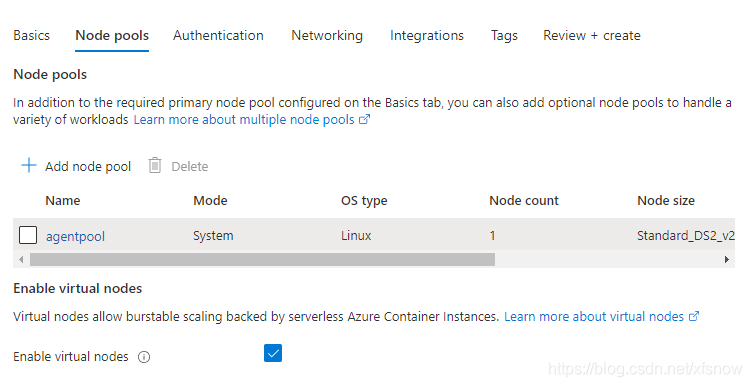
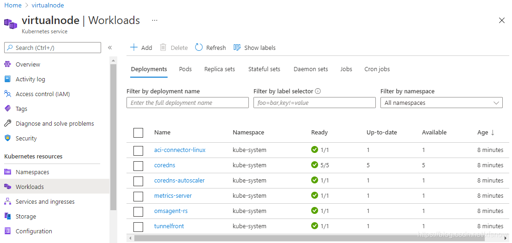
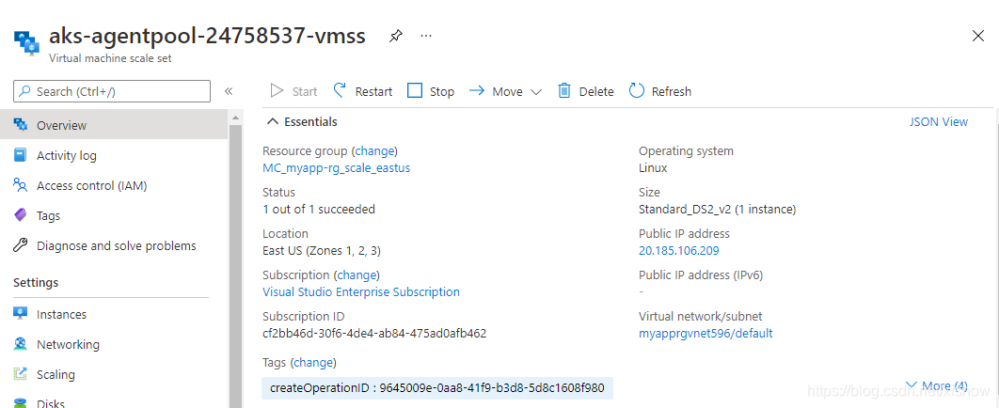

# AKS Scaling to Virtual Nodes

Published: *2021-05-26 15:36:48*

Category: __Azure__

Summary: Azure Kubernetes Service (AKS) is a managed Kubernetes cluster on Microsoft Azure cloud that can be used to quickly deploy Kubernetes clusters. Basic AKS clusters use horizontal Pod autoscaler, using metrics server in Kubernetes clusters to monitor Pod resource requirements. If applications need more resources, Pod count is automatically increased to meet demand. If worker node resources are also insufficient, worker node autoscaling is performed based on Virtual Machine Scale Sets (VMSS). When scaling worker nodes, new virtual machines need to be started behind the scenes, making resource scaling relatively slow. For this reason, Azure also introduced virtual node functionality, which can quickly create pods based on Azure Container Instances without using virtual machines, eliminating wait time and greatly improving cluster scaling efficiency.

Original article: [https://snowpeak.blog.csdn.net/article/details/117294004](https://snowpeak.blog.csdn.net/article/details/117294004)

---------

Azure Kubernetes Service (AKS) is a managed Kubernetes cluster on Microsoft Azure cloud that can be used to quickly deploy Kubernetes clusters. Basic AKS clusters use horizontal Pod autoscaler, using metrics server in Kubernetes clusters to monitor Pod resource requirements. If applications need more resources, Pod count is automatically increased to meet demand. If worker node resources are also insufficient, worker node autoscaling is performed based on Virtual Machine Scale Sets (VMSS). When scaling worker nodes, new virtual machines need to be started behind the scenes, making resource scaling relatively slow. For this reason, Azure also introduced virtual node functionality, which can quickly create pods based on Azure Container Instances without using virtual machines, eliminating wait time and greatly improving cluster scaling efficiency.

Note: As of May 2020, only the East 2 region in Azure China has released Container Instances service, and AKS scaling to Container Instances through virtual nodes is not yet supported. This feature has been officially released in most overseas regions. For specific release status, please refer to [Azure Container Instances resource availability in Azure regions](<https://docs.microsoft.com/en-us/azure/container-instances/container-instances-region-availability> "Azure Container Instances resource availability in Azure regions"). To perform the following experiments, an overseas Azure environment is required. We're using the East US region.

## Basic Deployment

### Application

The demo application source code is here:

[https://github.com/xfsnow/container/blob/master/VirtualNodeScaling](https://github.com/xfsnow/container/blob/master/VirtualNodeScaling)

The Kubernetes deployment configuration file nginx-vn.yaml uses the classic nginx application for demonstration. Besides basic container image configuration, it uses tolerations and affinity to optimize the use of VM nodes and virtual nodes.

```yaml
tolerations:
  - key: virtual-kubelet.io/provider
    value: azure
    operator: Equal
    effect: NoSchedule
affinity:
  nodeAffinity:
    preferredDuringSchedulingIgnoredDuringExecution:
    - weight: 1
      preference:
        matchExpressions:
        - key: type
          operator: NotIn
          values:
          - virtual-kubelet
```

Virtual nodes added to AKS clusters are tainted by default, so we need to explicitly specify which workloads should be scheduled to virtual nodes through ACI. The tolerations in the configuration file allow pods to be scheduled to virtual nodes, so that when scaling pods and VM node resources are insufficient, they can be created on virtual nodes.

nodeAffinity specifies preferences when creating new pods, while ignoring during runtime. The preference is for nodes whose labels don't contain the virtual-kubelet value for type, meaning new pods are preferentially placed on VM nodes, while during contraction, pods on virtual nodes are preferentially deleted.

### Azure Resources

Use the console to create an AKS cluster with virtual nodes enabled.


Select East US region and enter 1 for node count. Click the Next: Node pools button.



Check "Enable virtual nodes" - this is the key setting for enabling virtual nodes.

On the Networking page, only Azure CNI can be selected, Kubenet is no longer supported. We also need to specify Cluster subnet and Virtual nodes subnet - use default values for these.

Use default values for other configuration pages, click Review + Create to create the cluster.

After creation, let's first look at Workloads:



The aci-connector-linux here is the pod used to connect to ACI.

If this pod doesn't show as Ready immediately after creating the AKS cluster, please wait patiently - it may take 20-30 minutes to become Ready.

Now look at VMSS:



You can see there's 1 VM inside, running normally.

Click the Virtual network/subnet link to jump to the subnet where the VM is located.


Click Subnets in the left navigation links to see that the AKS platform automatically created 2 subnets for us.


The "default" is the subnet where VM nodes are located, while the other "virtual-node-aci" is the subnet for future virtual node scaling.

### Deploy Kubernetes

First connect to the Kubernetes cluster:


Then look at existing nodes:

```
kubectl get node
NAME                                STATUS   ROLES   AGE     VERSION
aks-agentpool-34658330-vmss000000   Ready    agent   10m     v1.19.9
virtual-node-aci-linux              Ready    agent   9m35s   v1.18.4-vk-azure-aci-v1.3.5
```

You can see aks-agentpool-34658330-vmss000000 is a regular virtual machine-based node, and virtual-node-aci-linux is the virtual node.

Create a namespace for all subsequent experiments:

```
kubectl create namespace virtualnode
namespace/virtualnode created
```

First, let's do a basic deployment of pods to virtual nodes:

```
kubectl apply -f helloworld-vn.yaml
deployment.apps/helloworld-vn created
```

Look at the pods:

```
kubectl get pods -o wide -n virtualnode
NAME                             READY   STATUS     RESTARTS   AGE   IP       NODE                     NOMINATED NODE   READINESS GATES
helloworld-vn-5749f58859-67vn6   0/1     Creating   0          21s   <none>   virtual-node-aci-linux   <none>           <none>
```

You can see it's deploying on the virtual node.

Look at details:

```
kubectl describe pod helloworld-vn-5749f58859-67vn6 -n virtualnode
Name:         helloworld-vn-5749f58859-67vn6
Namespace:    virtualnode
Priority:     0
Node:         virtual-node-aci-linux/
Start Time:   Tue, 11 May 2021 11:28:36 +0800
Labels:       app=helloworld-vn
              pod-template-hash=5749f58859
Annotations:  <none>
Status:       Running
IP:           10.241.0.4
IPs:
  IP:           10.241.0.4
Controlled By:  ReplicaSet/helloworld-vn-5749f58859
Containers:
  helloworld-vn:
    Container ID:   aci://6ee343c40cb742b912ce86084cb73c5d0f9997dd55fa0b44290bb0c9b04370a4
    Image:          mcr.microsoft.com/azuredocs/aci-helloworld
    Image ID:
    Port:           80/TCP
    Host Port:      0/TCP
    State:          Running
      Started:      Tue, 11 May 2021 11:28:36 +0800
    Ready:          True
    Restart Count:  0
    Environment:    <none>
    Mounts:
      /var/run/secrets/kubernetes.io/serviceaccount from default-token-rzbnb (ro)
Conditions:
  Type           Status
  Ready          True
  Initialized    True
  PodScheduled   True
Volumes:
  default-token-rzbnb:
    Type:        Secret (a volume populated by a Secret)
    SecretName:  default-token-rzbnb
    Optional:    false
QoS Class:       BestEffort
Node-Selectors:  beta.kubernetes.io/os=linux
                 kubernetes.io/role=agent
                 type=virtual-kubelet
Tolerations:     node.kubernetes.io/not-ready:NoExecute op=Exists for 300s
                 node.kubernetes.io/unreachable:NoExecute op=Exists for 300s
                 virtual-kubelet.io/provider op=Exists
Events:
  Type    Reason                 Age   From                                   Message
  ----    ------                 ----  ----                                   -------
  Normal  Scheduled              82s                                          Successfully assigned virtualnode/helloworld-vn-5749f58859-67vn6 to virtual-node-aci-linux
  Normal  ProviderCreateSuccess  81s   virtual-node-aci-linux/pod-controller  Create pod in provider successfully
```

The first virtual node deployment took 82 seconds, which seems a bit slow. The time is mainly spent on two aspects: first, initially creating the ACI instance, and more time is spent pulling the mcr.microsoft.com/azuredocs/aci-helloworld image file and deploying.

Click to view container instances:


You can see there's now 1 container instance.

Finally, delete this deployment to clean up resources:

```
kubectl delete -f helloworld-vn.yaml
deployment.apps "helloworld-vn" deleted
```

## Scaling Test

Mixed scaling of VM-based nodes and virtual nodes:

```
kubectl apply -f nginx-vn.yaml
deployment.apps/nginx-vn created
```

When deploying only 1 pod, it's preferentially deployed on the virtual machine node:

```
kubectl get pod -o wide --namespace virtualnode
NAME                        READY   STATUS    RESTARTS   AGE   IP            NODE                                NOMINATED NODE   READINESS GATES
nginx-vn-54d69f7df4-hxkkz   1/1     Running   0          23s   10.240.0.75   aks-agentpool-34658330-vmss000000   <none>           <none>
```

First scale to 20 replicas:

```
kubectl scale deployment nginx-vn --replicas=20 -n virtualnode
deployment.apps/nginx-vn scaled
```

View pods:

```
kubectl get pod -o wide --namespace virtualnode
NAME                        READY   STATUS    RESTARTS   AGE     IP             NODE                                NOMINATED NODE   READINESS GATES
nginx-vn-54d69f7df4-4fr5g   1/1     Running   0          3m2s    10.241.0.19    virtual-node-aci-linux              <none>           <none>
nginx-vn-54d69f7df4-cg4jb   1/1     Running   0          3m2s    10.241.0.5     virtual-node-aci-linux              <none>           <none>
nginx-vn-54d69f7df4-cmj6d   1/1     Running   0          3m2s    10.241.0.7     virtual-node-aci-linux              <none>           <none>
nginx-vn-54d69f7df4-dljkw   1/1     Running   0          3m2s    10.241.0.16    virtual-node-aci-linux              <none>           <none>
nginx-vn-54d69f7df4-f25fb   1/1     Running   0          3m2s    10.241.0.8     virtual-node-aci-linux              <none>           <none>
nginx-vn-54d69f7df4-g6ps9   1/1     Running   0          3m2s    10.241.0.15    virtual-node-aci-linux              <none>           <none>
nginx-vn-54d69f7df4-h2dtq   1/1     Running   0          3m2s    10.240.0.82    aks-agentpool-34658330-vmss000000   <none>           <none>
nginx-vn-54d69f7df4-hgkzc   1/1     Running   0          3m2s    10.241.0.14    virtual-node-aci-linux              <none>           <none>
nginx-vn-54d69f7df4-hxkkz   1/1     Running   0          7m53s   10.240.0.75    aks-agentpool-34658330-vmss000000   <none>           <none>
nginx-vn-54d69f7df4-jf4h7   1/1     Running   0          3m2s    10.241.0.20    virtual-node-aci-linux              <none>           <none>
nginx-vn-54d69f7df4-mtjbn   1/1     Running   0          3m2s    10.241.0.9     virtual-node-aci-linux              <none>           <none>
nginx-vn-54d69f7df4-q9d5f   1/1     Running   0          3m2s    10.241.0.13    virtual-node-aci-linux              <none>           <none>
nginx-vn-54d69f7df4-qlf4l   1/1     Running   0          3m2s    10.241.0.18    virtual-node-aci-linux              <none>           <none>
nginx-vn-54d69f7df4-sb54f   1/1     Running   0          6m27s   10.241.0.4     virtual-node-aci-linux              <none>           <none>
nginx-vn-54d69f7df4-t4zmf   1/1     Running   0          3m2s    10.241.0.12    virtual-node-aci-linux              <none>           <none>
nginx-vn-54d69f7df4-xj95k   1/1     Running   0          3m2s    10.241.0.10    virtual-node-aci-linux              <none>           <none>
nginx-vn-54d69f7df4-xltlt   1/1     Running   0          3m2s    10.241.0.17    virtual-node-aci-linux              <none>           <none>
nginx-vn-54d69f7df4-xnhtc   1/1     Running   0          3m2s    10.240.0.109   aks-agentpool-34658330-vmss000000   <none>           <none>
nginx-vn-54d69f7df4-zbzt5   1/1     Running   0          3m2s    10.241.0.6     virtual-node-aci-linux              <none>           <none>
nginx-vn-54d69f7df4-zphhk   1/1     Running   0          3m2s    10.241.0.11    virtual-node-aci-linux              <none>           <none>
```

Now scale back to 2 replicas:

```
kubectl scale deployment nginx-vn --replicas=2 -n virtualnode
deployment.apps/nginx-vn scaled
```

You can see that after scaling down, only pods on virtual machine nodes remain:

```
kubectl get pod -o wide --namespace virtualnode
NAME                        READY   STATUS    RESTARTS   AGE     IP            NODE                                NOMINATED NODE   READINESS GATES
nginx-vn-54d69f7df4-h2dtq   1/1     Running   0          5m18s   10.240.0.82   aks-agentpool-34658330-vmss000000   <none>           <none>
nginx-vn-54d69f7df4-hxkkz   1/1     Running   0          10m     10.240.0.75   aks-agentpool-34658330-vmss000000   <none>           <none>
```

## Summary

Scaling to virtual nodes through ACI is indeed much faster than first scaling VMs based on VMSS and then scaling pods. However, the number of virtual nodes that can be scaled is also limited - unlimited scaling in a short time is not achievable. The recommended approach is to use AKS autoscaling as the foundation, combined with rapid scaling of virtual nodes to support burst scenarios. Use virtual nodes to handle burst demand first, giving AKS scaling time to expand. Scale both simultaneously, and once VMSS is scaled up, virtual nodes can be replaced. Moreover, VMSS scaling can theoretically provide larger-scale resources, offering more resources than using virtual nodes alone. This approach balances both performance and cost.