# Azure DevOps Managing Azure China Regions

Published: *2021-05-26 19:01:44*

Category: __Azure__

Summary: Azure DevOps currently only provides SaaS services in Microsoft Azure's overseas regions, and has not yet been released in Azure China regions. Actually, Azure DevOps can manage various cloud and application deployment environments and platforms, and can conveniently connect to Azure China regions through Service Connections, as well as other special Azure regions such as US Government Cloud, Germany regions, etc. This article will guide you step by step to configure China region subscriptions and establish connections from Azure DevOps to China region subscriptions.

---------

Azure DevOps currently only provides SaaS services in Microsoft Azure's overseas regions, and has not yet been released in Azure China regions. Actually, Azure DevOps can manage various cloud and application deployment environments and platforms, and can conveniently connect to Azure China regions through Service Connections, as well as other special Azure regions such as US Government Cloud, Germany regions, etc. This article will guide you step by step to configure China region subscriptions and establish connections from Azure DevOps to China region subscriptions.

## Configuring Azure China Regions

Azure DevOps service connections support multiple connection methods, including Azure Resource Manager, Azure Service Bus, Bitbucket Cloud, Kubernetes, Jenkins, etc. Among these, Azure Resource Manager needs to connect to an Azure Active Directory (Azure AD) application and service principal in an Azure subscription. So let's first create an Azure AD service principal that can manage resources in the Azure China region console.

### Confirming Azure AD User Permissions

To create an Azure AD service principal, you must have sufficient permissions to register applications with the Azure AD tenant and assign roles to applications in Azure subscriptions. Let's first confirm the Azure AD user permissions. Click Azure Active Directory in the service list to proceed to the following user profile page.

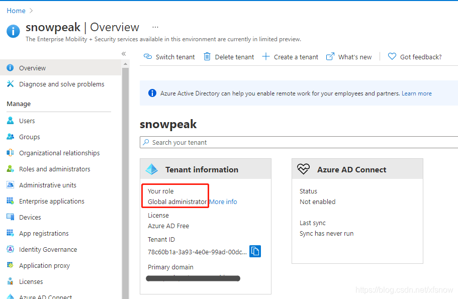

My test user is currently a global administrator. By default, regular users cannot register applications. If you need regular users to also register applications, you can click User Settings in the left navigation links and set users can register applications to enabled.

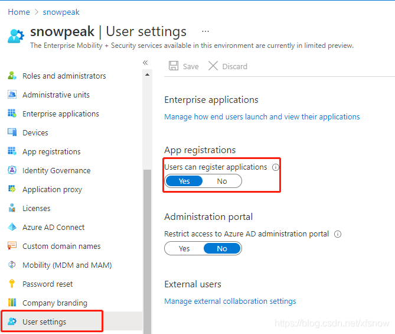

### Confirming Azure Subscription Permissions

The service principal we want to create is used to create other Azure resources, so our account needs Microsoft.Authorization/*/Write access permissions to assign roles to AD applications. If the current account has Owner role or User Access Administrator role, the permissions are sufficient.

In the console, select Subscriptions, select the subscription where you want to create the service principal, then click "My permissions" in the left navigation links. You can see that my account's current role is Administrator.

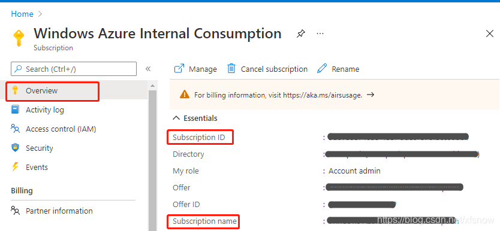

### Creating Azure AD Service Principal

Return to Azure Active Directory in the console, select App registrations in the left navigation links, then click New registration.

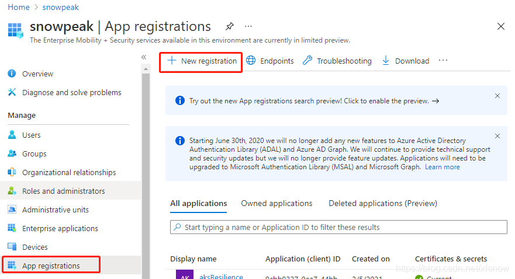

Give the application a name, such as "Azure-DevOps", and note down this name as it will be used later.

For supported account types, select "Accounts in this organizational directory only", keep other settings as default.

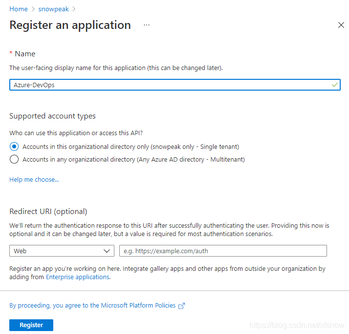

Finally, click Register to complete the registration.

### Adding Authentication to Service Principal

To support the verification when Azure DevOps creates service connections in the next step, we add authentication to the newly created service principal. Here we choose the application secret method.

In "App registrations" in Azure AD, select the newly created application. Select "Certificates & secrets" in the left navigation links. Then click "New client secret" in the main pane.

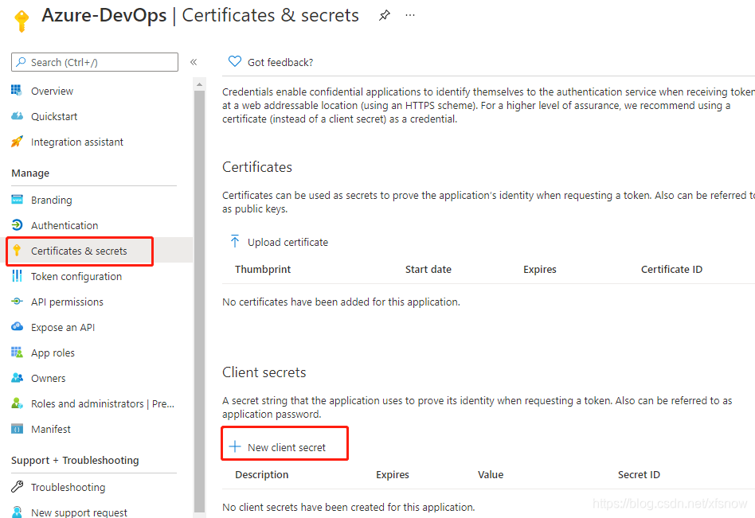

Fill in the description in the popup dialog, keep the expiration period as default 6 months, and finally click the Add button at the bottom. After successful addition, the newly added record will be displayed.

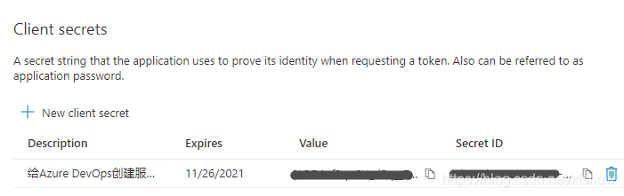

Note that we need to copy and save the Value here, this is the only chance, it cannot be copied later. The Secret ID can be copied at any time.

### Assigning Subscription Role to Application

Go back to the subscription management interface in the console, select the subscription we are operating on, then click "Access control (IAM)" in the left navigation links, click "Add" in the main pane, then click "Add role assignment".

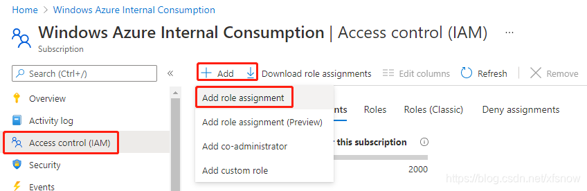

In the Add role assignment popup dialog, select Contributor for Role, select "User, group or service principal" for Assign access to.

In the Select field, enter the application name created earlier, it will search for a result, you need to click on this result once more, then the Save button on the bottom left becomes available.

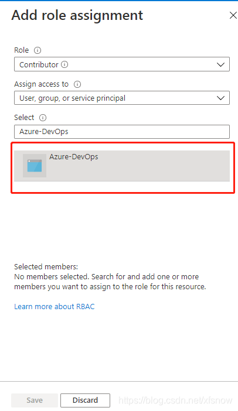

Finally click Save. After success, it will return to the role assignment list, showing the newly assigned role, indicating successful operation.

## Configuring Azure DevOps Service Connection

### Creating Azure DevOps Service Connection

Log in to the Azure DevOps console, enter our project, click Project settings in the bottom left to enter project configuration. Click Service connections under Pipelines, then click New service connection in the upper right corner. Step 1, select Azure Resource Manager.

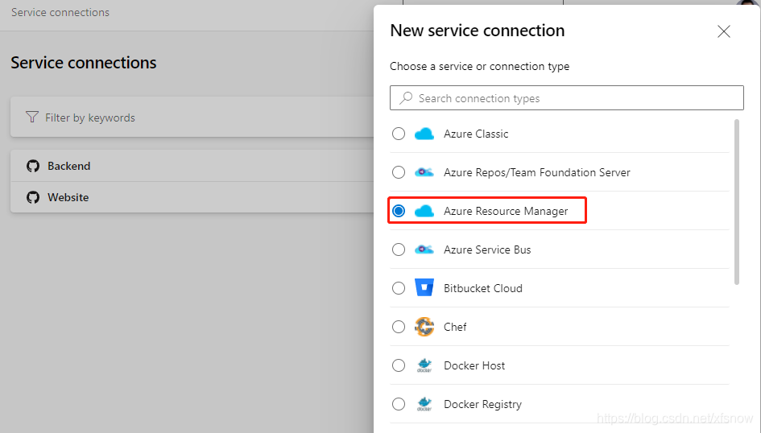

Next step, select Service principal (manual).

On this page, select Azure China Cloud for Environment.

Select Subscription for Scope Level.

For Subscription Id and Subscription Name, go back to the subscription overview page and copy from the corresponding items in the main pane.

For Service Principal Id, go to the Azure China console subscription, open the application we just registered, and find the Application (client) ID on its overview page.

For Service principal key value, fill in the Value from the client secret we copied and saved earlier.

For Tenant ID value, take it from the Directory (tenant) ID in the above interface. After filling in these 5 fields, the Verify button becomes available. Click it, and if successful, it will show the following verification success. If there's an error, please go back and check whether all IDs and secret values are filled in the correct fields.

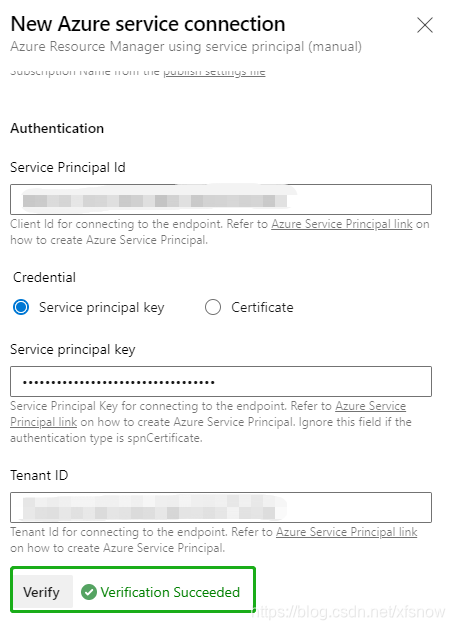

Finally, fill in meaningful names in Service connection name and Description (optional), such as "Azure China" and detailed description, then click Verify and save in the bottom right corner to complete.

### Verifying Service Connection Using Azure DevOps Release Pipeline

In Azure DevOps console under Pipelines -> Releases, click the New button in the center of the main pane on the right, then click New release pipeline.

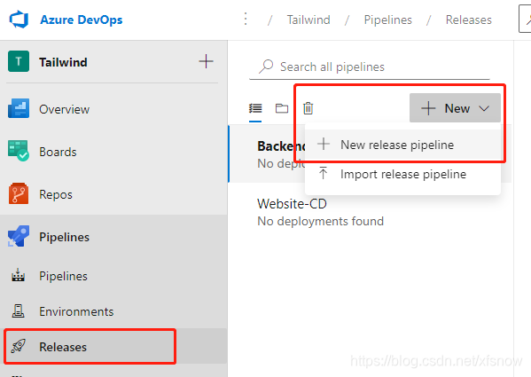

In the popup template selection dialog, click the first Azure App Service deployment.

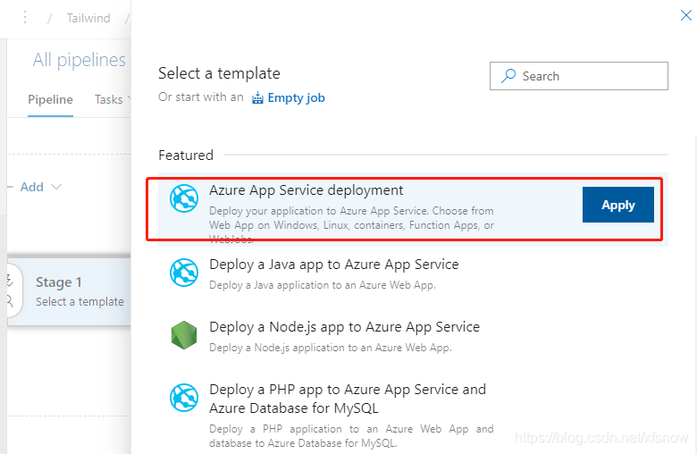

In the next dialog, click the "1 job, 1 task" link on the left.

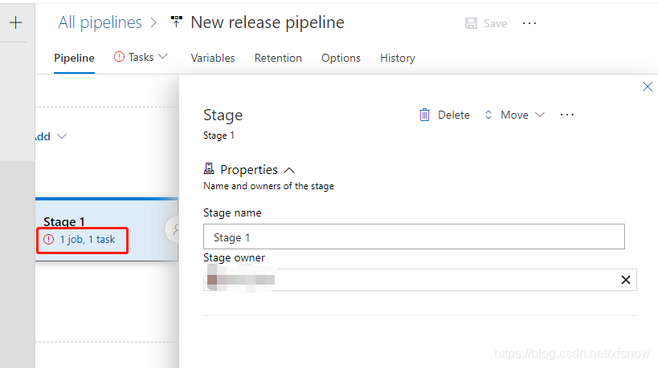

In the next dialog, expand the menu under Azure subscription option.

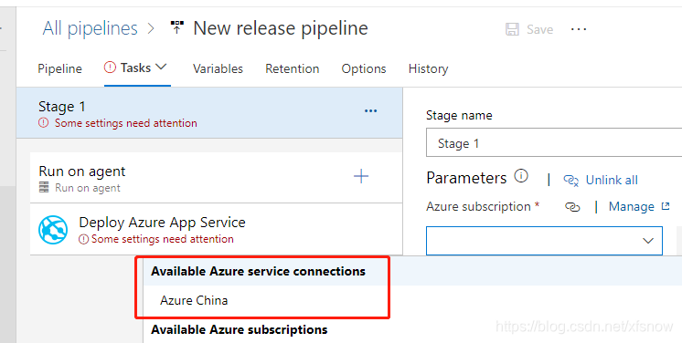

You can see that the service connection we just created is already displayed here, indicating that this service connection was completely created successfully. Subsequent release pipelines can all use this service connection and then select specific resource targets as prompted.