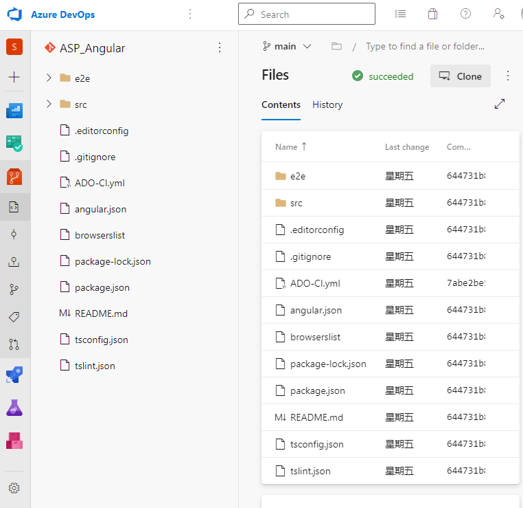
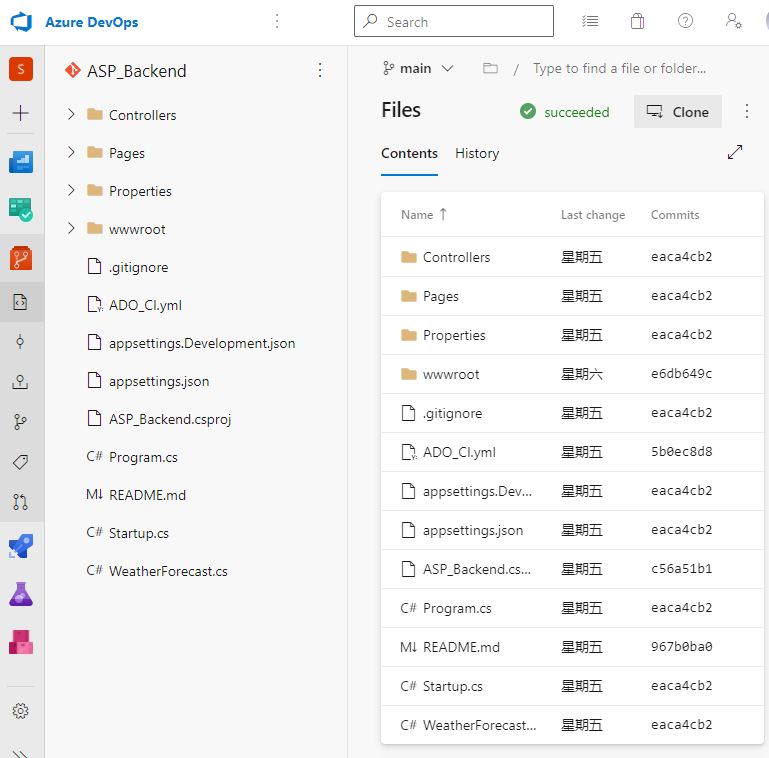
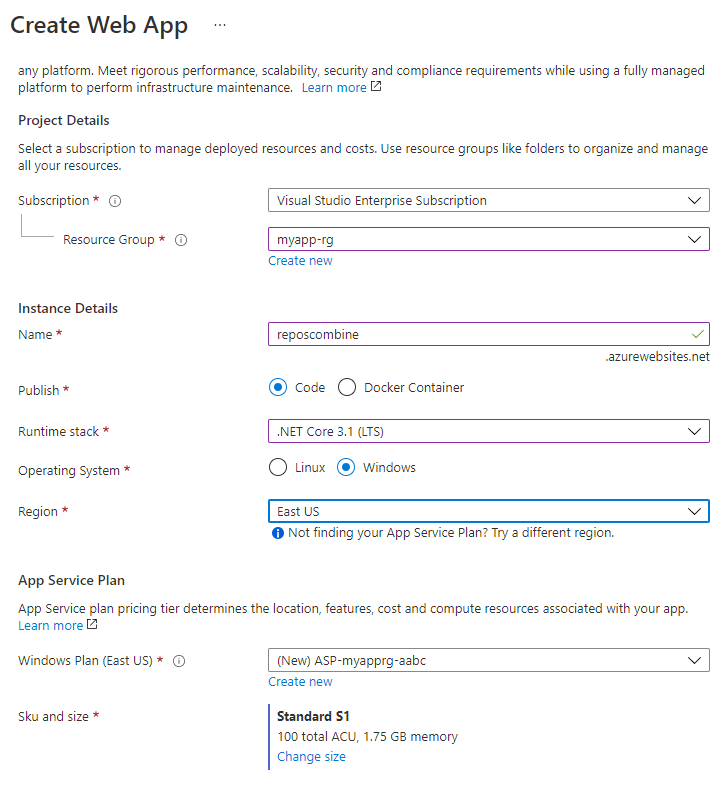
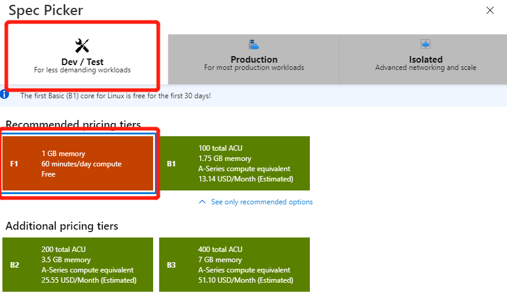

# Azure DevOps Pipeline Combining Multiple Repositories (Part 1)

Published: *2021-06-10 10:57:47*

Category: __Azure__

Summary: Azure DevOps, as an end-to-end tool chain for DevOps on the Microsoft Cloud, provides commonly used modules for developing main features, especially the CI and CD that are automated by the Repos source repository combined with the Pipelines pipeline. This article guides you through Azure Pipelines, familiarizes you with basic YAML file usage, and integrates the docking of pipelines and release lines.

---------

Azure DevOps, as an end-to-end tool chain for DevOps on the Microsoft Cloud, provides commonly used modules for developing the main features commonly used today, especially the CI and CD that are automated by the Repos source repository combined with the Pipelines pipeline. As current Web applications evolve, separated front and back architectures have become mainstream. Front-end and back-end source code are typically developed by two teams and stored in two source repositories, while automated integration and deployment often require unified deployment to a single resource environment. To implement this common scenario, today we'll take you through the pipelines of Azure Pipelines, familiarize yourself with the basic usage of YAML files, and integrate the docking of pipelines and release lines.

## The fundamental deployment

The overall steps for our presentation are:

1. Build ASP.Net back-end projects into publishable release packages
2. Build the code on the front end into a publishable Angular project
3. Package the front and back releases and deploy them to Azure App Service.

First, let's get the source repository and the final deployment target App Service ready.

### Prepare the source repository

Demo with app source code can be downloaded here:

https://github.com/xfsnow/container/blob/master/ReposCombine/ASP_Angular.zip

https://github.com/xfsnow/container/blob/master/ReposCombine/ASP_Backend.zip

Download the two compression packages, unzip them, and create 2 Azure DevOps Repos with each of these 2 directories and push the source code to the appropriate Repos. For more information, please refer to the document [Creating a new Git repository in your project](https://docs.microsoft.com/zh-cn/azure/devops/repos/git/create-new-repo). The two source repositories that are completed are shown in the figure below.

This is the source repository for the front end, which, as the name suggests, is a pure front-end project that uses Angular.js.

This is the source repository for the back end, which is a back-end project that uses ASP.Net.

### Provision an App Service instance

We use the console to quickly create a web app instance.

The main configuration items are:

Publish: choose Code;

Runtime stack: choose .Net Core 3.1;

Operation System: choose Windows.

Please click Change size to choose Sku and size.

Click on the far-left Dev/Test in the pop-up float and click on 1GB memory type, which is a free model for easy experimentation without charge. You can do this by clicking on the Review-create button at the bottom and clicking on the Create button. The creation process takes a few minutes, and we'll continue with the following tasks while waiting.
