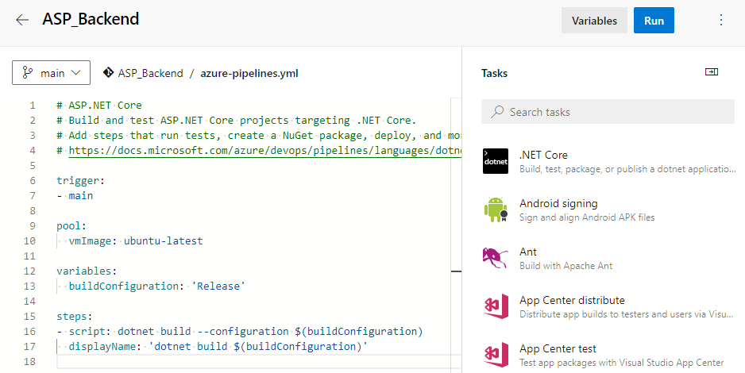
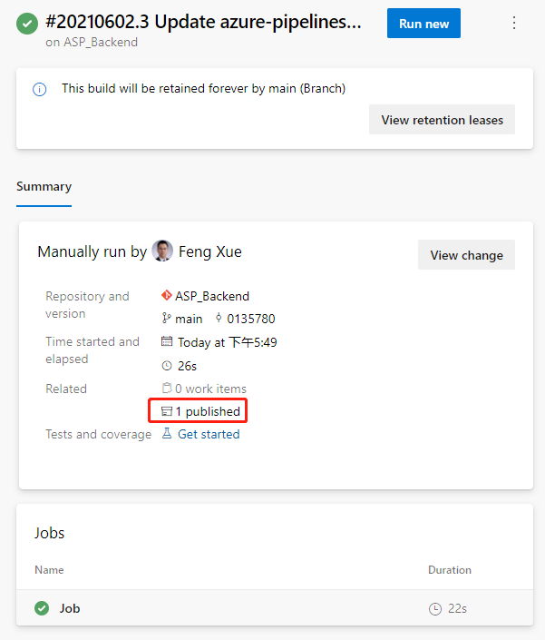
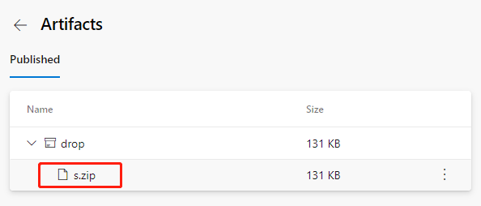

# Azure DevOps Pipeline Combining Multiple Repositories (Part 2)

Published: *2021-06-10 10:57:47*

Category: __Azure__

Summary: The source and target are ready, let's configure the CI pipeline first. We will create a pipeline to build the back-end project and save the build artifacts.

---------

## Configure the CI pipeline

The source and target are ready, let's configure the CI pipeline first.

### Create a pipeline and build the back-end project first

In the Azure DevOps console click the left navigation link Pipelines under Pipelines and the New pipeline button in the upper right corner.

Follow the wizard. Choose Azure Repos Git for Where your code.

For Select a repository selects the ASP_Backend library prepared earlier.

For Configure your pipeline, click the Show more button, and then click ASP.Net Core.

Click the Save and run button in the upper right corner. For the prompted float layer, use the default value. Click Save and run buttons in the lower right corner to run the pipeline. It then jumps to the pipeline execution page. Wait a minute, we'll see the job done, and there's a green check icon in front of Job, indicating that this first step, ASP.Net build, was successful.


The integrated pipeline was created successfully, and the first task was completed. But until now, nothing has been generated or saved. It doesn't matter, let's go step by step to explain in detail, leading you to create a pipeline from scratch. Next, let's save the artifact.

### Save the artifact

Let's go back to the Pipeline we just created and click the Edit button in the upper right corner to see that this is a YAML file.



Here's the concrete steps to be taken by this pipeline, and you can see that there's only one step now, which is to build the current back-end project using dotnet build. Let's add another 2 steps.

```yaml
- task: DotNetCoreCLI@2
  displayName: 'dotnet publish'
  inputs:
    command: publish
    publishWebProjects: false
    projects: '**/*.csproj'
    arguments: '--configuration $(BuildConfiguration) --output $(build.artifactstagingdirectory)'
    zipAfterPublish: true

- task: PublishBuildArtifacts@1
  inputs:
    PathtoPublish: '$(Build.ArtifactStagingDirectory)/'
```

The first of the two new steps is to publish the artifact to the specified path, and the second is to save the published artifact.

Click the Save button in the upper right corner, then the Run button, and wait patiently for a while for our updated Pipeline to finish. Then come back to the results page of the task execution and you'll see 1 Published under Related.



Clicking on this 1 Published link will take you to the following artifact page.



We can download this artifact file s.zip by clicking its name. After downloading, open this compressed package file with unzip command, you can see that inside the package is built files by dotnet build command.

```
unzip -l s.zip
Archive: s.zip
Length Date Time Name
---------- ---------- ----- ----
138528 06-02-21 09:50 ASP_Backend
10240 06-02-21 09:50 ASP_Backend.Views.dll
19136 06-02-21 09:50 ASP_Backend.Views.pdb
106734 06-02-21 09:50 ASP_Backend.deps.json
11264 06-02-21 09:50 ASP_Backend.dll
20392 06-02-21 09:50 ASP_Backend.pdb
292 06-02-21 09:50 ASP_Backend.runtimeconfig.json
62328 04-23-21 18:32 Microsoft.AspNetCore.SpaServices.Extensions.dll
162 06-02-21 09:50 appsettings.Development.json
196 06-02-21 09:50 appsettings.json
487 06-02-21 09:50 web.config
0 06-02-21 09:50 wwwroot/
5430 06-02-21 09:50 wwwroot/favicon.ico
---------- -------
375189 13 files
```

At this point, back-end builds and artifacts are saved. Let's take a look at the build of the front end. Before we can build the front end, we need to include a second source repository into the current pipeline.
