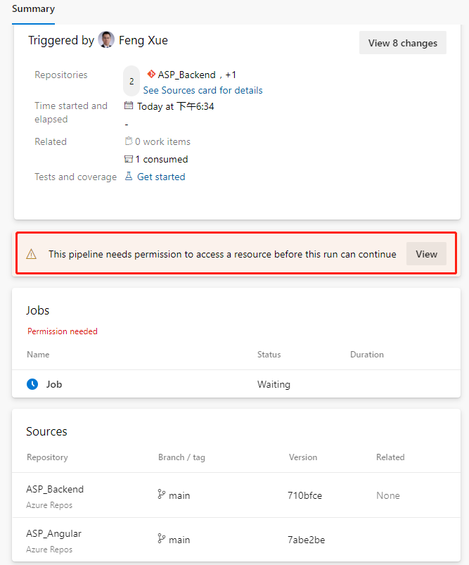
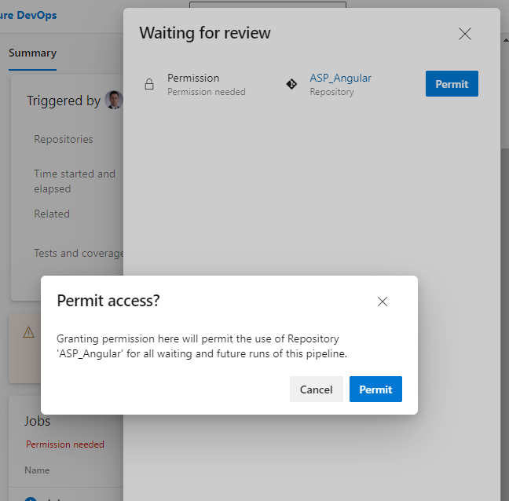
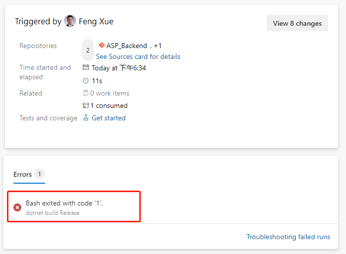
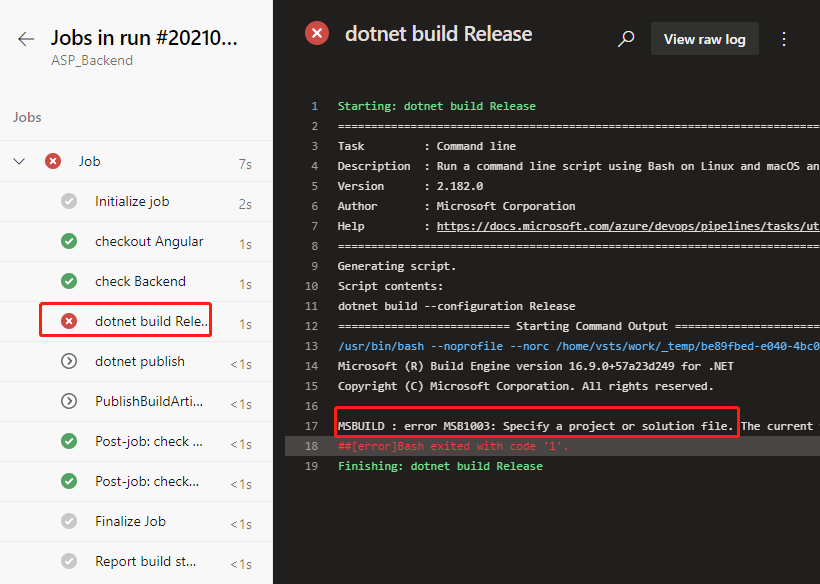
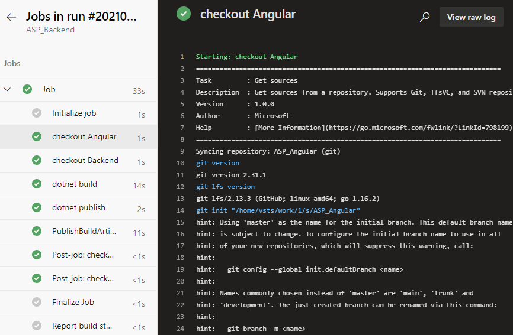

# Azure DevOps Pipeline Combining Multiple Repositories (Part 3)

Published: *2021-06-11 10:57:47*

Category: __Azure__

Summary: This is the 3rd part of the series on combining multiple repositories with Azure DevOps pipeline. In this post, we will introduce the second source repository (front-end project) into our existing pipeline and configure it to work with the back-end project.

---------

## Introduce the second source repository

Let\'s go back to the YAML file editing interface and add the following
paragraph after the trigger:- master segment at the beginning of the
file:

```yaml
resources:
  repositories:
    - repository: Angular
      name: <YourProjectName>/ASP_Angular
      type: git
      ref: main
```

Here repository: Angular is a code name for the referenced source
repository, which can be simply called later.

name: <OurProjectName>/ASP_Angular is the "project name / repository
name" format.

ref: Main claims to use the main branch.

Then add after steps:

```yaml
- checkout: Angular
  displayName: 'checkout Angular'
- checkout: self
  displayName: 'check Backend'
```

The task means checking out the front-end repository. Because a second
source repository is introduced, the current repository itself also has
a task - checkout:self to check out. Now save and run. Because a second
source repository is included in the current pipeline, we will see a
prompt to grant permission when we run this pipeline for the first time.



Click the View button.



Just click the "Permit" button on the float layer. This permission
only needs to be done the first time we add a task, and it won\'t pop up
again.

This execution probability will fail.



We click on this error message and jump directly to the specific error
log.



ASP build tasks that used to work properly did no work this time. Let\'s
locate the task that were previously built by the wizard.

```yaml
- script: dotnet build --configuration $(buildConfiguration)
  displayName: 'dotnet build $(buildConfiguration)'
```

Replace with this below.

```yaml
- task: DotNetCoreCLI@2
  displayName: 'dotnet build'
  inputs:
    command: 'build'
    projects: '**/*.csproj'
    arguments: '--configuration $(BuildConfiguration)'
```

Save and run again and it works fine. We click on the Job link on the
green check-in on the job run details page to see that the task of
checking out the back-end repository of the front-end repository in the
log is complete, and we can click on each task name to view the detailed
log.



Note that there is a line in the log checked out by the front-end
project here

```
git init "/home/vsts/work/1/s/ASP_Angular"
```

This means the path where the front-end code was saved in the container
that our job was executed by the pipeline. We note this path down and we
will need it to add build tasks later.
