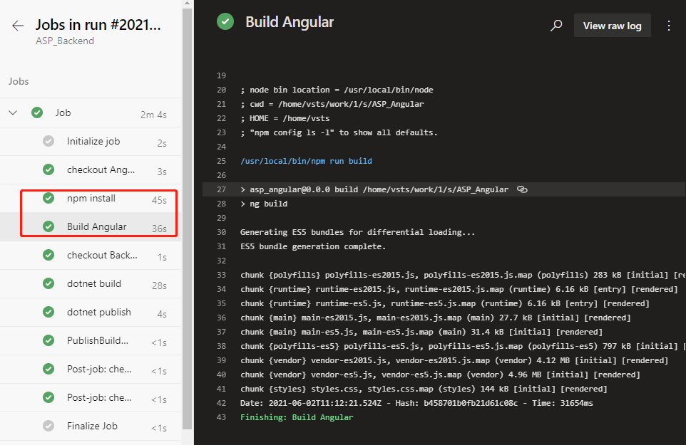

# Azure DevOps Pipeline Combining Multiple Repositories (Part 4)

Published: *2021-06-12 10:57:47*

Category: __Azure__

Summary: This is the 4th part of the series on combining multiple repositories with Azure DevOps pipeline. In our last post, we have included the two source repositories of front-end and back-end projects. In this post, we will continue to build the front-end project and combine the artifacts from front-end and back-end together.

---------

This is the 4th part of the series on combining multiple repositories with Azure DevOps pipeline. In our last post, we have included the two source repositories of front-end and back-end projects. In this post, we will continue to build the front-end project and combine the artifacts from front-end and back-end together.

## Build the front-end project

Go back to the YAML file editing interface and find this step.

```yaml
steps:
- checkout: Angular
  displayName: 'checkout Angular'
```

Add the following 2 tasks below the step.

```yaml
- task: Npm@1
  displayName: 'npm install'
  inputs:
    command: install
    workingDir: '$(Agent.BuildDirectory)/s/ASP_Angular/'

- task: Npm@1
  displayName: 'Build Angular'
  inputs:
    command: custom
    customCommand: run build
    workingDir: '$(Agent.BuildDirectory)/s/ASP_Angular/'
```

The first 1 new task is to install the dependency library by the dependency of the front-end project. The last 1 task is to build files that can be published by the front end.

Note that both tasks have workDir: '$(Agent.BuildDirectory)/s/ASP_Angular/' statement. $(Agent.BuildDirectory) is an environment variable that refers to /home/vsts in the context of the current task /work/1, so the code check-out path /home/vsts/work/1/s/ASP_Angular shown in the previous log can be represented by an environment variable that is $(Agent.BuildDirectory)/s/ASP_Angular/.

Save and run. Wait patiently for a while, when the task runs, we click into the task log and see the following log.



This indicates that the build of the front end has been successfully completed.

## Combine the front-end and back-end artifacts

Finally, we copy the front-end built files to the back-end built directory to prepare the total package for the release.

Go back to the YAML file editing interface and find the task.

```yaml
- task: DotNetCoreCLI@2
  displayName: 'dotnet publish'
  inputs:
    command: publish
    publishWebProjects: false
    projects: '**/*.csproj'
    arguments: '--configuration $(BuildConfiguration) --output $(build.artifactstagingdirectory)'
    zipAfterPublish: true
```

Change the last zipAfterPublish: true to zipAfterPublish: false, which means that we don't compress at this step, keep the original directory and files. Then add a task after this task.

```yaml
- task: CopyFiles@2
  displayName: 'copy frontend files'
  inputs:
    SourceFolder: '$(Agent.BuildDirectory)/s/ASP_Angular/dist'
    Contents: '**'
    TargetFolder: '$(Build.ArtifactStagingDirectory)/ASP_Backend/wwwroot'
```

This is to copy the files built from the front end into the specified directory that the back end is built in.

SourceFolder: '$(Agent.BuildDirectory)/s/ASP_Angular/dist' means that the source path is set to $(Agent.BuildDirectory)/s/ASP_Angular/dist because by default the files generated by the Angular build are placed in the project's /dist directory.

TargetFolder: '$(Build.ArtifactStagingDirectory)/ASP_Backend/wwwroot' means that the target path is the back-end built directory in wwwroot, which is a path ASP.Net projects use usually for static files. Static files in wwwroot are output directly.

Then add a task.

```yaml
- task: ArchiveFiles@2
  inputs:
    rootFolderOrFile: '$(Build.ArtifactStagingDirectory)/ASP_Backend/'
    includeRootFolder: false
    archiveType: 'zip'
    archiveFile: '$(Build.ArtifactStagingDirectory)/$(Build.BuildId).zip'
    replaceExistingArchive: true
    verbose: true
```

Archive the previously organized directories and files in one package.

archiveFile: '$(Build.ArtifactStagingDirectory)/$(Build.BuildId).zip' this line declares the path to which the packaged file is stored. $(Build.BuildId) is an environment variable that stands for a built serial number that is typically used to generate a different name for each packaged file built.

Finally, the task of publishing the product is changed from the original

```yaml
PathtoPublish: '$(Build.ArtifactStagingDirectory)/'
```

to

```yaml
PathtoPublish: '$(Build.ArtifactStagingDirectory)/$(Build.BuildId).zip'
```

Let's just save this final package, and ignore the rest files in the process.

Run after saving. After a successful run, this time we can see that the resulting product file name becomes like this.


Because it contains all the built files from the front and back ends, the volume also increases to 4MB.

We download this file and can look at it on our computer.

```
unzip -l 235.zip
Archive: 235.zip
Length Date Time Name
---------- ---------- ----- ----
138528 06-03-21 08:12 ASP_Backend
10240 06-03-21 08:12 ASP_Backend.Views.dll
19216 06-03-21 08:12 ASP_Backend.Views.pdb
106734 06-03-21 08:12 ASP_Backend.deps.json
11264 06-03-21 08:12 ASP_Backend.dll
20472 06-03-21 08:12 ASP_Backend.pdb
292 06-03-21 08:12 ASP_Backend.runtimeconfig.json
62328 04-23-21 18:32 Microsoft.AspNetCore.SpaServices.Extensions.dll
162 06-03-21 08:11 appsettings.Development.json
196 06-03-21 08:11 appsettings.json
487 06-03-21 08:12 web.config
0 06-03-21 08:12 wwwroot/
2530889 06-03-21 08:12 wwwroot/vendor-es5.js.map
6303 06-03-21 08:12 wwwroot/runtime-es5.js
6289 06-03-21 08:12 wwwroot/runtime-es2015.js.map
14659 06-03-21 08:12 wwwroot/main-es2015.js.map
5430 06-03-21 08:11 wwwroot/favicon.ico
387821 06-03-21 08:12 wwwroot/polyfills-es5.js.map
6286 06-03-21 08:12 wwwroot/runtime-es5.js.map
816259 06-03-21 08:12 wwwroot/polyfills-es5.js
289746 06-03-21 08:12 wwwroot/polyfills-es2015.js
6306 06-03-21 08:12 wwwroot/runtime-es2015.js
16417 06-03-21 08:12 wwwroot/main-es5.js.map
147637 06-03-21 08:12 wwwroot/styles.css
819 06-03-21 08:12 wwwroot/index.html
5198180 06-03-21 08:12 wwwroot/vendor-es5.js
28439 06-03-21 08:12 wwwroot/main-es2015.js
4315318 06-03-21 08:12 wwwroot/vendor-es2015.js
776588 06-03-21 08:12 wwwroot/styles.css.map
256877 06-03-21 08:12 wwwroot/polyfills-es2015.js.map
5079925 06-03-21 08:12 wwwroot/vendor-es2015.js.map
32199 06-03-21 08:12 wwwroot/main-es5.js
---------- -------
20292306 32 files
```

It does contain all the files on the front and back ends and is organized in the directory format that are ready to deploy.

If you still have problems editing YAML files for CI pipelines, you can refer to the ASP_Combine.yml file in the back-end source package ASP_Backend.zip.
