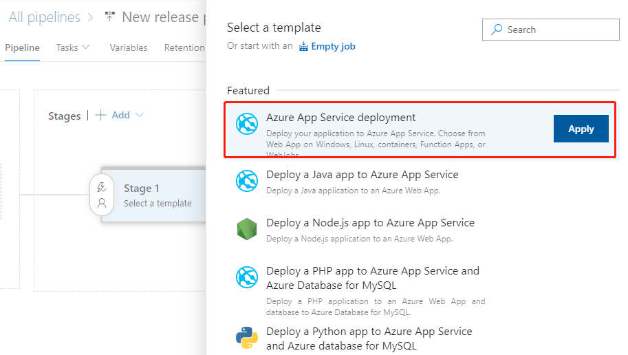
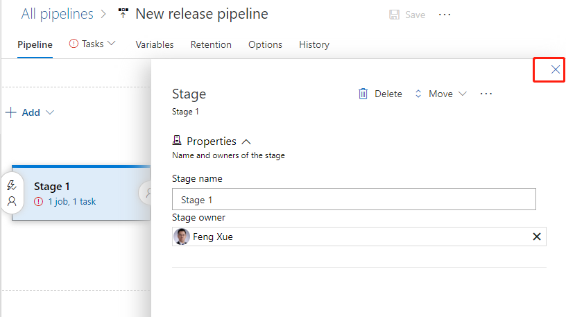
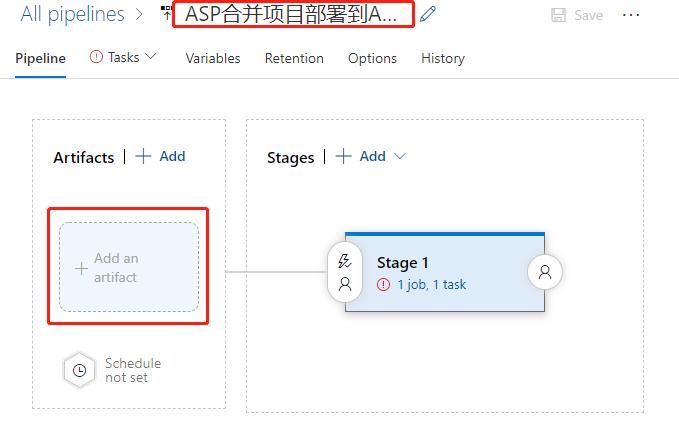
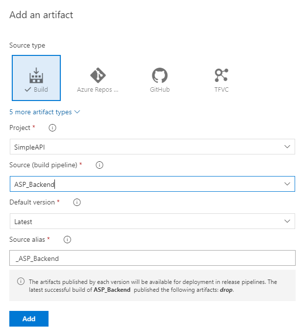
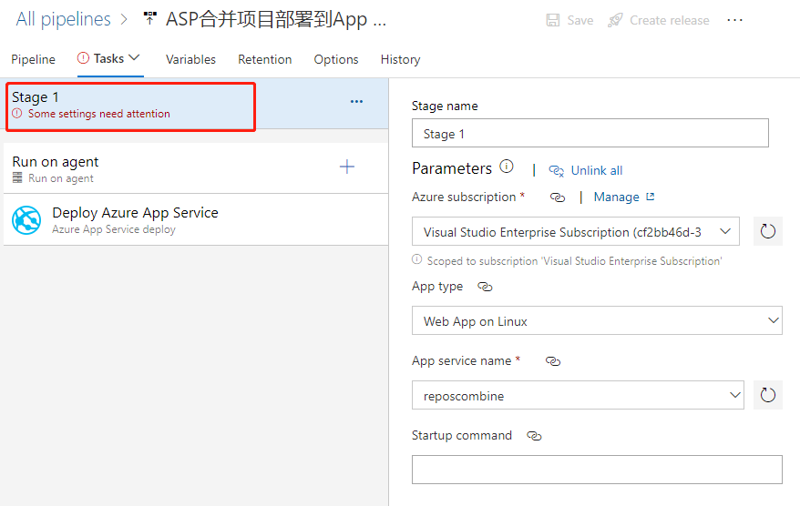
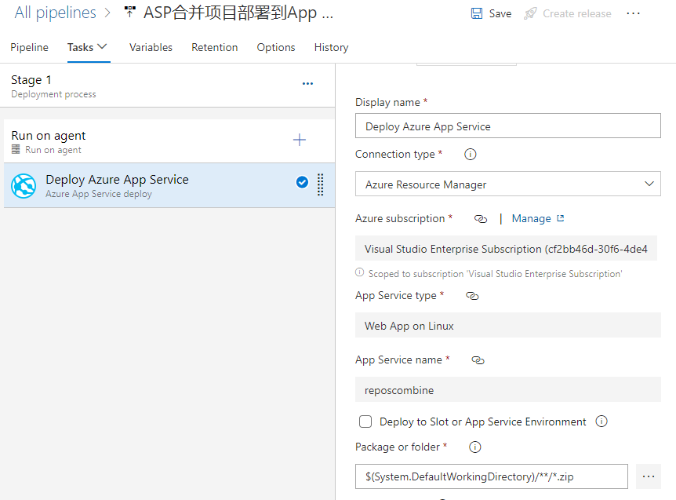
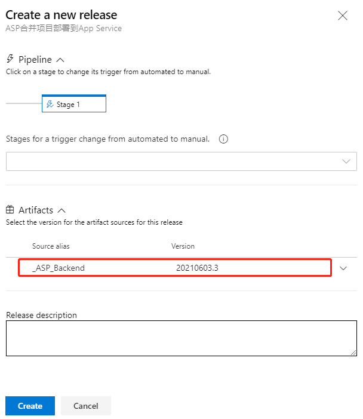
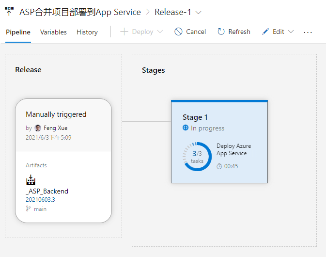
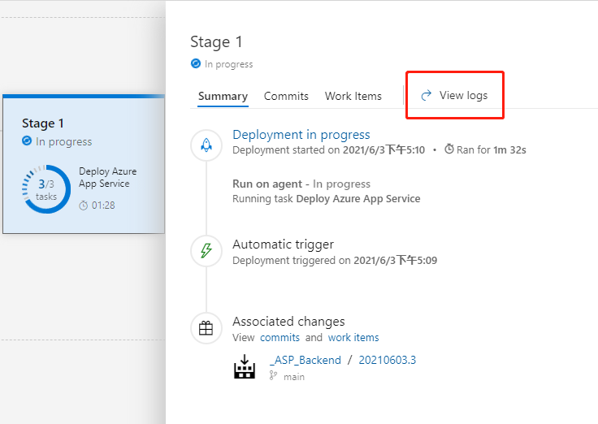
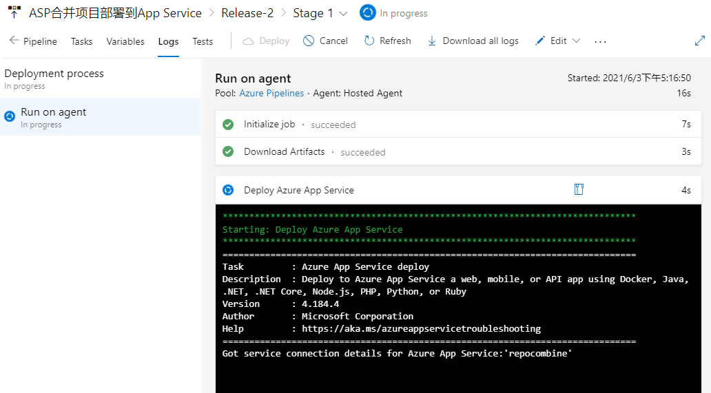

# Azure DevOps Pipeline Combining Multiple Repositories (Part 5)

Published: *2021-06-13 10:57:47*

Category: __Azure__

Summary: This is the final part of the series on combining multiple repositories with Azure DevOps pipeline. In our previous posts, we have included two source repositories of front-end and back-end projects, built the two projects, and combined the artifacts from front-end and back-end together. In this final post, we will deploy the artifacts to Azure App Service.

---------

This is the final part of the series on combining multiple repositories with Azure DevOps pipeline. In our previous posts, we have included two source repositories of front-end and back-end projects, built the two projects, and combined the artifacts from front-end and back-end together. In this final post, we will deploy the artifacts to Azure App Service.

## Configure release pipeline

Earlier we prepared the package for deployment with CI pipeline. Now finally let's deploy it to the Azure App Service.

### Create a Release pipeline

Click Releases in the left navigation menu under Pipelines. In the middle find the New button and click New release pipeline to create a new release pipeline. Open directly to the selection template page.

Let's select the first Azure App Service deployment and click the Apply button.

Then pop up the Stage float layer.

Click on the upper right corner fork to close the float layer. Click on the name line and enter a meaningful name.

Then click on the add an artifact button at the bottom left. Add a product.

First select the ASP_Backend that line we had prepared before for Source. Then the program automatically refreshes the lower half of the float layer. We use default values for all items, and click the bottom Add button to complete the addition.

Click the "1 job, 1 task" link to the right to open the configuration float layer for the deployment target. Start by filling out the configuration for the entire phase of Stage 1.

We mainly select the Azure subscription and the type of App as prompted, and then select the instance we created earlier.

We then find that the Deploy Azure App Service task is ready to use with the default values.

If we click the 3-point button in the lower right corner of the Package or folder, a floating layer pops up to select a specific package file. However, it is recommended to use the default wildcard instead of a specific file name, which is the most flexible.

Click the Save button in the upper right corner to save it, and then click the Create release button next to it to pop up the floating layer.

As you can see, the latest version of the CI pipeline is shown here, and it is recommended that you write some descriptions related to this deployment in Release description for later traceability. Click the Create button at the bottom to create it.

Once the release is created it is run immediately. And here we can see an animation showing the progress.

Click on Stage 1 and click on the View logs on the right to see the detailed logs in real time for the deployment process below.

When the deployment task is complete, we go back to the console of App Service and find the URL in Overview.

Open this URL with a browser and you'll see that we've deployed a successful website.
generated](../assets/img/20210613_Azure_DevOps_Pipeline_5_08.png)

As you can see, the latest version of the CI pipeline is shown here, and
it is recommended that you write some descriptions related to this
deployment in Release description for later traceability. Click the
Create button at the bottom to create it.

Once the release is created and it is run immediately. And here we can
see an animation showing the progress.

Click on Stage 1 and click on the View logs
on the right to see the detailed logs in real time for the deployment
process below.

When the deployment task is complete, we go back to the console of App
Service and find the URL in Overview.

Open this URL with a browser and you\'ll see that we\'ve deployed a
successful website.
