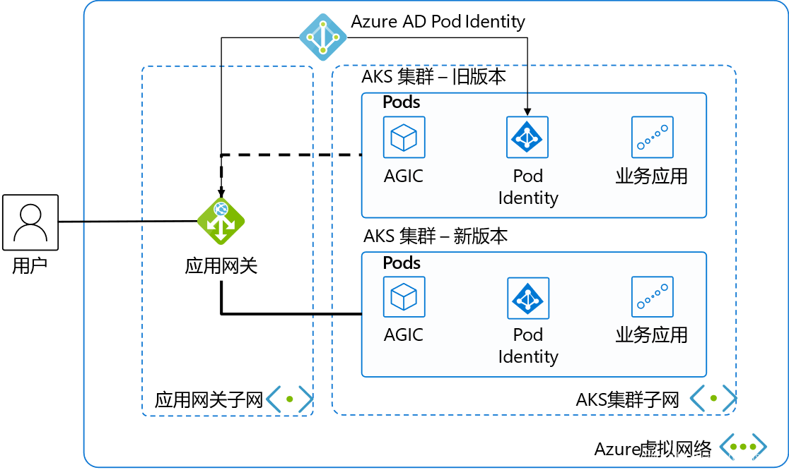

# AKS Cluster Blue-Green Deployment for Version Upgrade (Part 1)

Published: *2022-03-01 16:47:49*

Category: __Azure__

Summary: Azure Kubernetes Service (AKS) is a managed Kubernetes cluster on Microsoft Azure cloud that can be used to quickly deploy Kubernetes clusters. Combined with other Azure services and features, it simplifies daily operations and easily implements business application elasticity. The current Kubernetes community is thriving with frequent version upgrades. AKS's managed upgrade feature allows one-click in-place upgrades of AKS clusters, rolling upgrades of worker nodes in the cluster one by one. For small-scale or non-critical business clusters, using AKS's managed upgrade feature is very convenient. For large-scale clusters or critical business applications, the aforementioned one-click in-place upgrade method has issues such as long overall upgrade time cycles, possibility of upgrade failures, and inability to rollback if failures occur.

---------

Azure Kubernetes Service (AKS) is a managed Kubernetes cluster on Microsoft Azure cloud that can be used to quickly deploy Kubernetes clusters. Combined with other Azure services and features, it simplifies daily operations and easily implements business application elasticity. The current Kubernetes community is thriving with frequent version upgrades. AKS's managed upgrade feature allows one-click in-place upgrades of AKS clusters, rolling upgrades of worker nodes in the cluster one by one. For small-scale or non-critical business clusters, using AKS's managed upgrade feature is very convenient. For large-scale clusters or critical business applications, the aforementioned one-click in-place upgrade method has issues such as long overall upgrade time cycles, possibility of upgrade failures, and inability to rollback if failures occur. The most reliable approach is to create a new AKS cluster and use blue-green deployment for switching upgrades, which can achieve second-level switching, backup clusters can be rolled back at any time, making it faster and safer. Correspondingly, this solution's architecture and operations are more complex. This article will guide you step by step to build such a switching upgrade architecture solution. This time we use a classic web application scenario, which can also be extended to other AKS cluster application scenarios.

## Architecture Overview



This is a classic web application architecture diagram. We've selected the most streamlined resources to make the demonstration and explanation as clear and concise as possible.

In a virtual network, we divide it into 2 subnets. The first subnet contains the Application Gateway, serving as the load balancer for external services.

The second subnet normally has only 1 AKS cluster with business systems deployed. The AKS cluster uses advanced networking CNI to simplify the network model and facilitate communication with the Application Gateway.

Pod Identity is deployed in the AKS cluster, using Azure AD's Pod Identity to authorize pods in AKS to manage the Application Gateway.

AGIC stands for Application Gateway Ingress Controller. Besides distributing network traffic from the Application Gateway to corresponding pods, it also monitors changes in some Kubernetes resources, automatically updating the Application Gateway's backend pool when AKS scales, and synchronously updating the Application Gateway's backend pool when switching AKS clusters. Using AGIC to dynamically update the Application Gateway backend is the core concept of our blue-green deployment implementation.

## Resource Deployment

### Network and Other Basic Resources

We'll use CLI to quickly create the basic resources for the current environment. Resource group:

```
AZ_REGION=ChinaNorth2
RESOURCE_GROUP=AKS_Upgrade
az group create -n $RESOURCE_GROUP -l $AZ_REGION
```

Create VNET and subnets

```
VNET_NAME=AksVnet
APPGW_SUBNET=AppGwSubnet
AKS_SUBNET=AksSubnet

az network vnet create -n $VNET_NAME \
-g $RESOURCE_GROUP \
-l $AZ_REGION \
--address-prefix 10.0.0.0/8 \
--subnet-name $APPGW_SUBNET --subnet-prefix 10.1.0.0/16

az network vnet subnet create \
-g $RESOURCE_GROUP \
-n $AKS_SUBNET \
--address-prefixes 10.240.0.0/16 \
--vnet-name $VNET_NAME
```

### Current Version Azure Resources

Create public IP

```
APPGW_IP=AppGatewayIp
az network public-ip create -n $APPGW_IP \
-g $RESOURCE_GROUP \
--allocation-method Static \
--sku Standard
```

Create Application Gateway

```
APP_GATEWAY=AppGateway
az network application-gateway create -n $APP_GATEWAY \
-g $RESOURCE_GROUP \
-l $AZ_REGION \
--vnet-name $VNET_NAME \
--subnet $APPGW_SUBNET \
--sku Standard_v2 \
--public-ip-address $APPGW_IP
```

Create old AKS cluster using the current default mainstream AKS version.

```
az network vnet subnet show \
-g $RESOURCE_GROUP \
--vnet-name $VNET_NAME \
--name $AKS_SUBNET
```

First get the subnet ID for the previously created AKS cluster

```
AKS_SUBNET_ID=$(az network vnet subnet show -g $RESOURCE_GROUP --vnet-name $VNET_NAME --name $AKS_SUBNET --query id -o tsv)
```

Create AKS cluster.

```
AKS_OLD=old
az aks create -n $AKS_OLD \
-g $RESOURCE_GROUP \
-l $AZ_REGION \
--generate-ssh-keys \
--network-plugin azure \
--enable-managed-identity \
--vnet-subnet-id $AKS_SUBNET_ID
```

At the time of writing this article, the mainstream AKS version is 1.19.11.

### Application Gateway Integration with Current Version AKS

We use Azure Service Principal to authorize the AKS cluster to manage Application Gateway configuration.

Connect to AKS cluster

```
az aks get-credentials --resource-group $RESOURCE_GROUP --name $AKS_OLD
```

Then you can use the familiar kubectl to manage the AKS cluster.

Install Helm and run the following commands to add the application-gateway-kubernetes-ingress Helm package. Our AKS cluster has Kubernetes RBAC enabled, so use the following commands.

```
kubectl create serviceaccount --namespace kube-system tiller-sa
kubectl create clusterrolebinding tiller-cluster-rule --clusterrole=cluster-admin --serviceaccount=kube-system:tiller-sa
helm repo add aad-pod-identity https://raw.githubusercontent.com/Azure/aad-pod-identity/master/charts
helm install aad-pod-identity aad-pod-identity/aad-pod-identity
```

This will return

```
NAME: aad-pod-identity
LAST DEPLOYED: Tue Jun 29 08:14:30 2021
NAMESPACE: default
STATUS: deployed
REVISION: 1
TEST SUITE: None
NOTES:
You have successfully installed AAD Pod Identity in your Kubernetes cluster!
…
```

Wait a minute or two, then use

```
kubectl get po -o wide
NAME                                    READY   STATUS    RESTARTS   AGE   IP            NODE                                NOMINATED NODE   READINESS GATES
aad-pod-identity-mic-787c5958fd-kmx9b   1/1     Running   0          71s   10.240.0.33   aks-nodepool1-94448771-vmss000000   <none>           <none>
aad-pod-identity-mic-787c5958fd-nkpv4   1/1     Running   0          72s   10.240.0.63   aks-nodepool1-94448771-vmss000001   <none>           <none>
aad-pod-identity-nmi-mhp86              1/1     Running   0          72s   10.240.0.4    aks-nodepool1-94448771-vmss000000   <none>           <none>
aad-pod-identity-nmi-sjpvw              1/1     Running   0          72s   10.240.0.35   aks-nodepool1-94448771-vmss000001   <none>           <none>
aad-pod-identity-nmi-xnfxh              1/1     Running   0          72s   10.240.0.66   aks-nodepool1-94448771-vmss000002   <none>           <none>
```

We can see that several related pods are running.

Helm install Application Gateway Ingress Controller.

```
helm repo add application-gateway-kubernetes-ingress https://appgwingress.blob.core.windows.net/ingress-azure-helm-package/
helm repo update
```

Copy the following YAML file and save it as helm-old.yaml to configure AGIC:

```
# This file contains the essential configs for the ingress controller helm chart

# Verbosity level of the App Gateway Ingress Controller
verbosityLevel: 3

################################################################################
# Specify which application gateway the ingress controller will manage
#
appgw:
  subscriptionId: <subscriptionId>
  resourceGroup: <resourceGroupName>
  name: <applicationGatewayName>
  environment: AzureChinaCloud

# Setting appgw.shared to "true" will create an AzureIngressProhibitedTarget CRD.
# This prohibits AGIC from applying config for any host/path.
# Use "kubectl get AzureIngressProhibitedTargets" to view and change this.
  shared: false

################################################################################
# Specify which kubernetes namespace the ingress controller will watch
# Default value is "default"
# Leaving this variable out or setting it to blank or empty string would
# result in Ingress Controller observing all acessible namespaces.
#
# kubernetes:
#   watchNamespace: <namespace>

################################################################################
# Specify the authentication with Azure Resource Manager
#
# Two authentication methods are available:
# - Option 1: AAD-Pod-Identity (https://github.com/Azure/aad-pod-identity)
# armAuth:
#    type: aadPodIdentity
#    identityResourceID: <identityResourceId>
#    identityClientID:  <identityClientId>

## Alternatively you can use Service Principal credentials
armAuth:
  type: servicePrincipal
  secretJSON: <<Generate value with: "az ad sp create-for-rbac --sdk-auth | base64 -w0">>

################################################################################
# Specify if the cluster is RBAC enabled or not
rbac:
  enabled: true # true/false
```

We'll fill in the parameter values in the above configuration file one by one.

`<subscriptionId>` get via `az account show --query id -o tsv`.

`<resourceGroupName>` value takes the `$RESOURCE_GROUP` environment variable.

`<applicationGatewayName>` value takes the `$APP_GATEWAY` environment variable.

The `secretJSON` value uses the `az ad sp create-for-rbac --sdk-auth | base64 -w0` command to obtain a base64-encoded long string of over 800 bytes.

Since our AKS cluster has RBAC enabled, the final rbac configuration is set to true.

Finally execute the following command to install

```
helm install agic application-gateway-kubernetes-ingress/ingress-azure -f helm_agic.yaml
```

Returns

```
W0629 08:16:47.733467   16087 warnings.go:70] apiextensions.k8s.io/v1beta1 CustomResourceDefinition is deprecated in v1.16+, unavailable in v1.22+; use apiextensions.k8s.io/v1 CustomResourceDefinition
NAME: agic
LAST DEPLOYED: Tue Jun 29 08:16:48 2021
NAMESPACE: default
STATUS: deployed
REVISION: 1
TEST SUITE: None
NOTES:
Thank you for installing ingress-azure:1.4.0.

Your release is named agic.
The controller is deployed in deployment agic-ingress-azure.

Configuration Details:
----------------------
 * AzureRM Authentication Method:
  - Use AAD-Pod-Identity
 * Application Gateway:
  - Subscription ID : 3d07553f-f6a8-455f-9de6-876fbcc00bb4
  - Resource Group  : AKS_Upgrade
  - Application Gateway Name : AppGateway
 * Kubernetes Ingress Controller:
  - Watching All Namespaces
  - Verbosity level: 3
```

Then execute the following command to check pod status

```
kubectl get po -o wide
NAME                                    READY   STATUS    RESTARTS   AGE     IP            NODE                                NOMINATED NODE   READINESS GATES
aad-pod-identity-mic-787c5958fd-kmx9b   1/1     Running   0          4m54s   10.240.0.33   aks-nodepool1-94448771-vmss000000   <none>           <none>
aad-pod-identity-mic-787c5958fd-nkpv4   1/1     Running   0          4m55s   10.240.0.63   aks-nodepool1-94448771-vmss000001   <none>           <none>
aad-pod-identity-nmi-mhp86              1/1     Running   0          4m55s   10.240.0.4    aks-nodepool1-94448771-vmss000000   <none>           <none>
aad-pod-identity-nmi-sjpvw              1/1     Running   0          4m55s   10.240.0.35   aks-nodepool1-94448771-vmss000001   <none>           <none>
aad-pod-identity-nmi-xnfxh              1/1     Running   0          4m55s   10.240.0.66   aks-nodepool1-94448771-vmss000002   <none>           <none>
agic-ingress-azure-8d9d85dd9-z8dwh      1/1     Running   0          2m37s   10.240.0.70   aks-nodepool1-94448771-vmss000002   <none>           <none>
```

We can see that the newly created agic-ingress-azure pod is also running normally.

At this point, we have successfully deployed the related resources and achieved integration between Application Gateway and AKS. In the next article, we will cover three tasks: application deployment, new AKS cluster deployment, and AKS version switching.