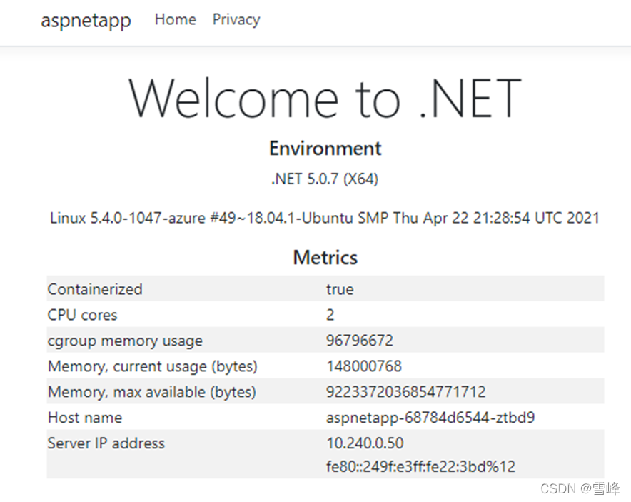
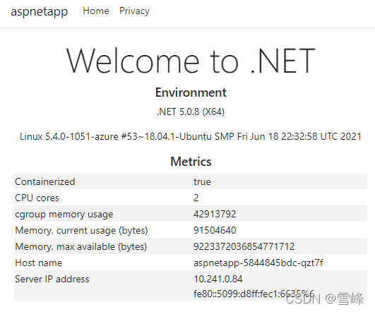

# AKS Cluster Blue-Green Deployment for Version Upgrade (Part 2)

Published: *2022-04-26 17:26:24*

Category: __Azure__

Summary: In the first part of this series, we introduced the basic concepts of AKS blue-green deployment and explained how to deploy related resources and integrate Application Gateway with AKS. For those who missed the first part, you can click here to review. In this part, we will build upon the previous content to further explain how to deploy applications, how to deploy new AKS clusters, and how to switch between AKS versions.

---------

In the first part of this series, we introduced the basic concepts of AKS blue-green deployment and explained how to deploy related resources and integrate Application Gateway with AKS. For those who missed the first part, you can click [here to review](/zh/20220301_AKS.htm)。

In this part, we will build upon the previous content to further explain how to deploy applications, how to deploy new AKS clusters, and how to switch between AKS versions.

### Application Deployment

Let's deploy a demo application to verify that the Application Gateway has been successfully integrated with the AKS cluster. Copy the following YAML source code and save it as deployment_aspnet.yaml。


```yaml
apiVersion: apps/v1
kind: Deployment
metadata:
  name: aspnetapp
spec:
  replicas: 3
  selector:
    matchLabels:
      app: aspnetapp
  template:
    metadata:
      labels:
        app: aspnetapp
    spec:
      containers:
      - name: aspnetapp
        # Sample ASP.Net application from Microsoft which can get private IP.
        image: mcr.microsoft.com/dotnet/core/samples:aspnetapp
        ports:
        - containerPort: 80
---

apiVersion: v1
kind: Service
metadata:
  name: aspnetapp
spec:
  selector:
    app: aspnetapp
  ports:
  - protocol: TCP
    port: 80
    targetPort: 80

---

apiVersion: extensions/v1beta1
kind: Ingress
metadata:
  name: aspnetapp
  annotations:
    kubernetes.io/ingress.class: azure/application-gateway
spec:
  rules:
  - http:
      paths:
      - path: /
        backend:
          serviceName: aspnetapp
          servicePort: 80
```

Deploy the application。


```
kubectl apply -f deployment_aspnet.yaml
```

List pods to confirm the application deployment is running。


```
kubectl get po -o wide
NAME                                    READY   STATUS    RESTARTS   AGE    IP            NODE                                NOMINATED NODE   READINESS GATES
aad-pod-identity-mic-787c5958fd-kmx9b   1/1     Running   0          177m   10.240.0.33   aks-nodepool1-94448771-vmss000000   <none>           <none>
aad-pod-identity-mic-787c5958fd-nkpv4   1/1     Running   0          177m   10.240.0.63   aks-nodepool1-94448771-vmss000001   <none>           <none>
aad-pod-identity-nmi-mhp86              1/1     Running   0          177m   10.240.0.4    aks-nodepool1-94448771-vmss000000   <none>           <none>
aad-pod-identity-nmi-sjpvw              1/1     Running   0          177m   10.240.0.35   aks-nodepool1-94448771-vmss000001   <none>           <none>
aad-pod-identity-nmi-xnfxh              1/1     Running   0          177m   10.240.0.66   aks-nodepool1-94448771-vmss000002   <none>           <none>
agic-ingress-azure-84967fc5b6-cqcn4     1/1     Running   0          111m   10.240.0.79   aks-nodepool1-94448771-vmss000002   <none>           <none>
aspnetapp-68784d6544-j99qg              1/1     Running   0          96s    10.240.0.75   aks-nodepool1-94448771-vmss000002   <none>           <none>
aspnetapp-68784d6544-v9449              1/1     Running   0          96s    10.240.0.13   aks-nodepool1-94448771-vmss000000   <none>           <none>
aspnetapp-68784d6544-ztbd9              1/1     Running   0          96s    10.240.0.50   aks-nodepool1-94448771-vmss000001   <none>           <none>
```

We can see that all application pods are running normally. Note their IPs are 10.240.0.13, 10.240.0.50, and 10.240.0.75.

The Application Gateway backend shows exactly these IPs。


```
az network application-gateway show-backend-health \
 -g $RESOURCE_GROUP \
 -n $APP_GATEWAY \
 --query backendAddressPools[].backendHttpSettingsCollection[].servers[][address,health] \
 -o tsv
10.240.0.13     Healthy
10.240.0.50     Healthy
10.240.0.75     Healthy
```

Check the frontend IP address。


```
az network public-ip show -g $RESOURCE_GROUP -n $APPGW_IP --query ipAddress -o tsv
```

Then access this IP with a browser to see：



Refresh several times, and the Host name and Server IP address will alternately display the 3 hostnames and IPs, which are exactly the 3 pod names and private IPs we deployed earlier. This shows that the Application Gateway and pods in AKS have been successfully integrated.

## Deploying New AKS Cluster

### Creating New Version AKS Cluster

In the second AKS subnet, create a new AKS cluster. Our previous AKS version used the current default version 1.19.11, the new AKS cluster will use 1.20.7, with all other parameters remaining the same. Declare the new AKS cluster name variable。


```
AKS_NEW=new
```

Get the subnet ID for the new cluster。


```
NEW_AKS_SUBNET_ID=$(az network vnet subnet show -g $RESOURCE_GROUP --vnet-name $VNET_NAME --name $NEW_AKS_SUBNET --query id -o tsv)
```

Create the new AKS cluster。


```
az aks create -n $AKS_NEW \
-g $RESOURCE_GROUP \
-l $AZ_REGION \
--generate-ssh-keys \
--network-plugin azure \
--enable-managed-identity \
--vnet-subnet-id $NEW_AKS_SUBNET_ID \
--kubernetes-version 1.20.7
```

The new AKS cluster also uses Helm to install application-gateway-kubernetes-ingress。

### Installing Pod Identity on New Version AKS Cluster

Connect to AKS cluster


```
az aks get-credentials --resource-group $RESOURCE_GROUP --name $AKS_NEW
```

Install AAD Pod Identity


```
kubectl create serviceaccount --namespace kube-system tiller-sa
kubectl create clusterrolebinding tiller-cluster-rule --clusterrole=cluster-admin --serviceaccount=kube-system:tiller-sa
helm repo add aad-pod-identity https://raw.githubusercontent.com/Azure/aad-pod-identity/master/charts
helm install aad-pod-identity aad-pod-identity/aad-pod-identity
```

Helm install Application Gateway Ingress Controller。


```
helm repo add application-gateway-kubernetes-ingress https://appgwingress.blob.core.windows.net/ingress-azure-helm-package/
helm repo update
```

### Deploying Applications on New Version AKS Cluster

We'll also install the same application on the new AKS cluster。


```
kubectl apply -f deployment_aspnet.yaml
```

After deploying the application, list the pods。


```
kubectl get po -o=custom-columns=NAME:.metadata.name,\
podIP:.status.podIP,NODE:.spec.nodeName,\
READY-true:.status.containerStatuses[*].ready

NAME                                    podIP          NODE                                READY-true
aad-pod-identity-mic-644c7c9f6-cqkxr   10.241.0.25   aks-nodepool1-20247409-vmss000000   true
aad-pod-identity-mic-644c7c9f6-xpwlt   10.241.0.43   aks-nodepool1-20247409-vmss000002   true
aad-pod-identity-nmi-k2c8s             10.241.0.35   aks-nodepool1-20247409-vmss000001   true
aad-pod-identity-nmi-vqqzq             10.241.0.66   aks-nodepool1-20247409-vmss000002   true
aad-pod-identity-nmi-xvcxm             10.241.0.4    aks-nodepool1-20247409-vmss000000   true
aspnetapp-5844845bdc-82lcw             10.241.0.33   aks-nodepool1-20247409-vmss000000   true
aspnetapp-5844845bdc-hskvg             10.241.0.43   aks-nodepool1-20247409-vmss000001   true
aspnetapp-5844845bdc-qzt7f             10.241.0.84   aks-nodepool1-20247409-vmss000002   true
```

In actual production workflows, after deploying the application, don't associate it with the existing Application Gateway immediately. Instead, remotely log in and test via private IPs first。


```
kubectl run -it --rm aks-ssh --image=mcr.microsoft.com/aks/fundamental/base-ubuntu:v0.0.11
```

After the container starts, you'll directly enter this container. We'll access the 3 private IPs mentioned above: 10.241.0.33, 10.241.0.43, 10.241.0.84。 For example：


```
root@aks-ssh:/# curl http://10.241.0.33
root@aks-ssh:/# curl http://10.241.0.43
root@aks-ssh:/# curl http://10.241.0.84
```

We can see that all return content normally. This demonstrates that the new environment has been tested and passed. Finally, associate this new AKS cluster with the existing Application Gateway.

## Switching Between Different AKS Cluster Versions

### Application Gateway Switching to Integration with New Version AKS

Execute the following command to install AGIC


```
helm install agic application-gateway-kubernetes-ingress/ingress-azure -f helm_agic.yaml
```

Wait a few seconds


```
kubectl get po -o=custom-columns=NAME:.metadata.name,podIP:.status.podIP,NODE:.spec.nodeName,READY-true:.status.containerStatuses[*].ready
NAME                                    podIP          NODE                                READY-true
aad-pod-identity-mic-644c7c9f6-cqkxr   10.241.0.25   aks-nodepool1-20247409-vmss000000   true
aad-pod-identity-mic-644c7c9f6-xpwlt   10.241.0.43   aks-nodepool1-20247409-vmss000002   true
aad-pod-identity-nmi-k2c8s             10.241.0.35   aks-nodepool1-20247409-vmss000001   true
aad-pod-identity-nmi-vqqzq             10.241.0.66   aks-nodepool1-20247409-vmss000002   true
aad-pod-identity-nmi-xvcxm             10.241.0.4    aks-nodepool1-20247409-vmss000000   true
agic-ingress-azure-84967fc5b6-6x4dd    10.241.0.79   aks-nodepool1-20247409-vmss000002   true
aspnetapp-5844845bdc-82lcw             10.241.0.33   aks-nodepool1-20247409-vmss000000   true
aspnetapp-5844845bdc-hskvg             10.241.0.43   aks-nodepool1-20247409-vmss000001   true
aspnetapp-5844845bdc-qzt7f             10.241.0.84   aks-nodepool1-20247409-vmss000002   true
```

We can see that the agic-ingress-azure-*** pod is running normally.

First use command line to check that the Application Gateway backend has been updated to the new pods。


```
az network application-gateway show-backend-health \
-g $RESOURCE_GROUP \
-n $APP_GATEWAY \
--query backendAddressPools[].backendHttpSettingsCollection[].servers[][address,health] \
-o tsv
10.241.0.33     Healthy
10.241.0.43     Healthy
10.241.0.84     Healthy
```

Let's go back to the browser and refresh the Application Gateway's public IP. We can see that the Host name and IP in the displayed content have switched to the new backend。



### Version Rollback

If the new AKS cluster has issues, we can switch back to the old AKS cluster. We just need to go back to the old AKS cluster and reinstall AGIC to re-associate the Application Gateway with the application pods in the old AKS cluster。


```
az aks get-credentials --resource-group $RESOURCE_GROUP --name $AKS_OLD
helm uninstall agic
helm install agic application-gateway-kubernetes-ingress/ingress-azure -f helm_agic.yaml
```

Soon we can see that the AGIC pod is running。


```
kubectl get po -o wide
NAME                                    READY   STATUS    RESTARTS   AGE    IP            NODE                                NOMINATED NODE   READINESS GATES
aad-pod-identity-mic-787c5958fd-kmx9b   1/1     Running   0          2d1h   10.240.0.33   aks-nodepool1-94448771-vmss000000   <none>           <none>
aad-pod-identity-mic-787c5958fd-nkpv4   1/1     Running   1          2d1h   10.240.0.63   aks-nodepool1-94448771-vmss000001   <none>           <none>
aad-pod-identity-nmi-mhp86              1/1     Running   0          2d1h   10.240.0.4    aks-nodepool1-94448771-vmss000000   <none>           <none>
aad-pod-identity-nmi-sjpvw              1/1     Running   0          2d1h   10.240.0.35   aks-nodepool1-94448771-vmss000001   <none>           <none>
aad-pod-identity-nmi-xnfxh              1/1     Running   0          2d1h   10.240.0.66   aks-nodepool1-94448771-vmss000002   <none>           <none>
agic-ingress-azure-84967fc5b6-nwbh4     1/1     Running   0          8s     10.240.0.70   aks-nodepool1-94448771-vmss000002   <none>           <none>
aspnetapp-68784d6544-j99qg              1/1     Running   0          2d     10.240.0.75   aks-nodepool1-94448771-vmss000002   <none>           <none>
aspnetapp-68784d6544-v9449              1/1     Running   0          2d     10.240.0.13   aks-nodepool1-94448771-vmss000000   <none>           <none>
aspnetapp-68784d6544-ztbd9              1/1     Running   0          2d     10.240.0.50   aks-nodepool1-94448771-vmss000001   <none>           <none>
```

Check the Application Gateway backend again


```
az network application-gateway show-backend-health \
 -g $RESOURCE_GROUP \
 -n $APP_GATEWAY \
 --query backendAddressPools[].backendHttpSettingsCollection[].servers[][address,health] \
 -o tsv
10.240.0.13     Healthy
10.240.0.50     Healthy
10.240.0.75     Healthy
```

We can see that the same Application Gateway backend has been restored to the old AKS cluster IPs.

### Testing Application Availability During Version Switching

We'll use continuous HTTP requests to verify that the service is not interrupted during switching.

Open another command line window and execute


```
while(true); \
do curl -s http://139.217.117.86/ |ts '[%Y-%m-%d %H:%M:%S]' | grep 10.24; \
sleep 0.1; done
[2021-08-03 16:35:09] 10.240.0.13                        <br />
[2021-08-03 16:35:10] 10.240.0.50                        <br />
[2021-08-03 16:35:11] 10.240.0.13                        <br />
[2021-08-03 16:35:12] 10.240.0.75                        <br />
[2021-08-03 16:35:12] 10.240.0.50                        <br />
[2021-08-03 16:35:13] 10.240.0.13                        <br />
[2021-08-03 16:35:14] 10.240.0.75                        <br />
```

We can see the output alternates between the private IPs of pods in the old AKS cluster.

Go back to the AKS operation window, switch to the new AKS cluster, and execute the delete and install AGIC commands again。


```
az aks get-credentials --resource-group $RESOURCE_GROUP --name $AKS_NEW
helm uninstall agic
```

Observe in the second window - you'll find that it still returns IPs from the old AKS cluster. This is because we're only deleting from the new AKS cluster at this point, while the Application Gateway and old AKS cluster are still running normally。

Then execute in the new AKS cluster


```
helm install agic application-gateway-kubernetes-ingress/ingress-azure -f helm_agic.yaml
```

Observe in the second window - you'll find that from a certain line onwards, it directly switches to the new AKS cluster IP addresses. No interruption occurs。


```
[2021-08-03 16:42:08] 10.240.0.13                        <br />
[2021-08-03 16:42:09] 10.240.0.50                        <br />
[2021-08-03 16:42:09] 10.240.0.75                        <br />
[2021-08-03 16:42:10] 10.240.0.13                        <br />
[2021-08-03 16:42:11] 10.240.0.50                        <br />
[2021-08-03 16:42:11] 10.240.0.75                        <br />
[2021-08-03 16:42:12] 10.241.0.33                        <br />
[2021-08-03 16:42:13] 10.241.0.33                        <br />
[2021-08-03 16:42:13] 10.241.0.43                        <br />
[2021-08-03 16:42:15] 10.241.0.43                        <br />
[2021-08-03 16:42:15] 10.241.0.84                        <br />
[2021-08-03 16:42:16] 10.241.0.84                        <br />
```

This verifies that the Application Gateway's external service continues to run normally during the switching process. Through these operations, we can ultimately maintain both new and old AKS clusters while enabling real-time switching。

## Summary

The above uses a common web application as an example to demonstrate creating new AKS clusters through blue-green deployment for stable version upgrades. Besides web applications, other types and scenarios of applications can also refer to this approach, switching at the AKS cluster and upstream integration points to achieve real-time switching and rollback.