# Azure DevOps Comprehensive Management of ACR and AKS

Published: *2022-07-13 10:00:00*

Category: __Azure__

Summary: Azure DevOps is Microsoft's fully managed DevOps pipeline service in the cloud, offering comprehensive pipeline management features and easy integration with various testing, build, and deployment tools. This article introduces how to configure build and deployment pipelines for ACR and AKS in Azure DevOps.

---------------------

Azure DevOps is currently only available as a SaaS service in Microsoft's global Azure regions; it has not yet been released in the Azure China region. In fact, Azure DevOps can manage environments and platforms for various clouds and application deployments. Through Service Connections, it can easily connect to the Azure China region and other special Azure regions, such as US Government Cloud, Germany, etc. This article will guide you step by step to configure a subscription in the China region and establish a connection from Azure DevOps to the China region subscription.

## Managing CI Pipelines for Building to ACR

### Configure ACR Service Connection

<https://blog.yannickreekmans.be/bring-your-own-service-principal-for-an-azure-container-registry-connection-in-azure-devops/>

Add an "other" type of service connection and use the access key of the ACR in the China region for authentication.

My test user is currently a global administrator. By default, ordinary users cannot register applications. If you want ordinary users to be able to register applications, go to User Settings in the left navigation and enable the option for users to register applications.

### Create CI Pipeline

```yaml
dockerRegistryServiceConnection: '44fbf17e-1870-4f48-9f1a-e57e81891048'
imageRepository: 'helloworld'
containerRegistry: 'snowpeak.azurecr.cn'
```

The ID of the dockerRegistryServiceConnection service connection can be found in the browser address bar.

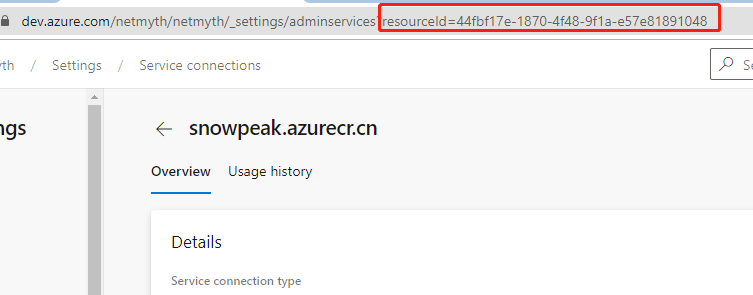

containerRegistry: Go to the ACR overview page in the Azure portal.

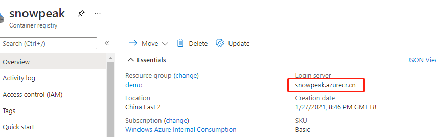

`imageRepository: 'helloworld'`

Find the image repository here.


### Create Azure AD Service Principal

In the portal, go back to Azure Active Directory, select "App registrations" in the left navigation, and then click "New registration".

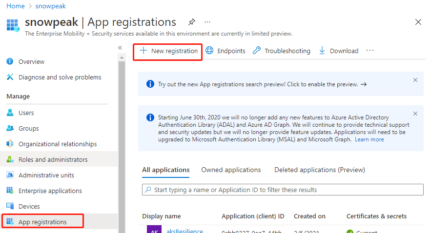

Give the application a name, such as "Azure-DevOps", and remember this name for later use.

Supported account types: select "Accounts in this organizational directory only", keep other settings as default.

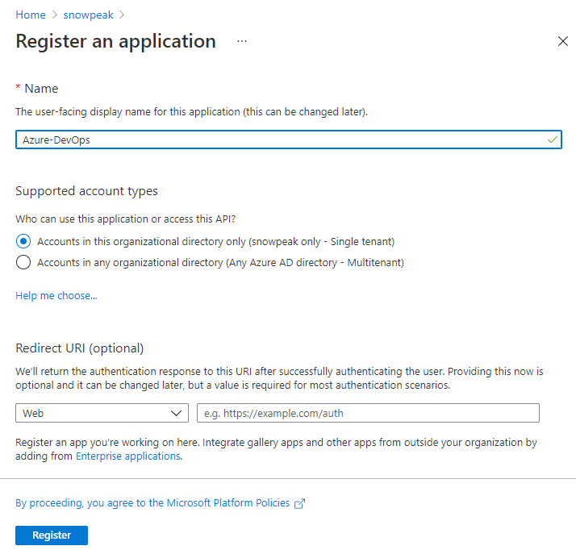

Finally, click Register to complete the registration.

### Add Authentication to the Service Principal

To facilitate authentication when creating a service connection in Azure DevOps in the next step, we add authentication to the service principal just created. Here, we use the application secret method.

In Azure AD's "App registrations", select the application you just created. In the left navigation, select "Certificates & secrets". Then, in the main pane, click "New client secret".

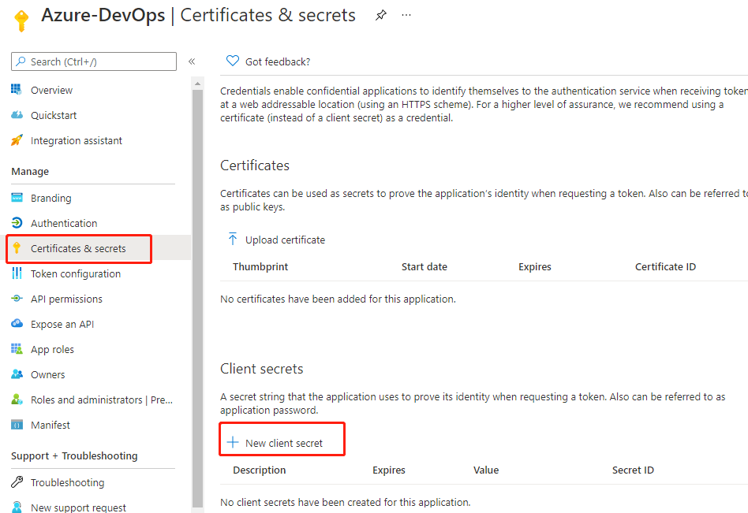

In the pop-up, fill in the description, keep the expiration at the default 6 months, and click the Add button at the bottom. After adding successfully, the newly added record will be displayed.

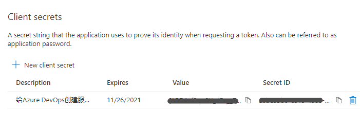

Note: Copy and save the Value immediately, as this is the only chance to do so. The Secret ID can be copied at any time.

### Assign a Role to the Application

Go to the subscription management page in the portal, select the subscription you are working on, then click "Access control (IAM)" in the left navigation, click "Add" in the main pane, and then click "Add role assignment".

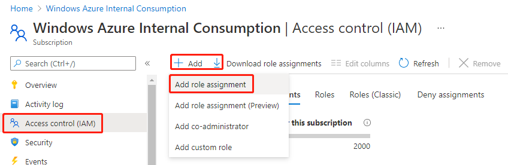

In the pop-up, select the role "Contributor", and for assignment, choose "User, group or service principal".

In the selection box, enter the application name you created earlier. A result will appear; click on it, and the Save button at the bottom left will become available.

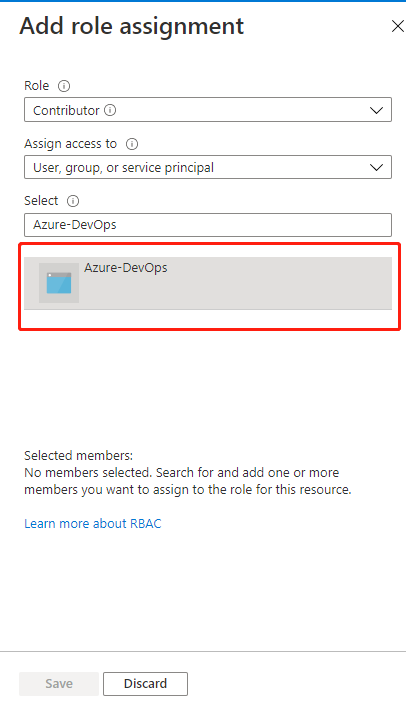

Finally, click Save. After success, you will return to the role assignment list, and the newly assigned role will be displayed, indicating the operation was successful.

## Configure AKS Service Connection

### Create Azure DevOps Service Connection

Log in to the Azure DevOps portal, enter your project, and go to Project settings in the lower left corner. Click Service connections under Pipelines, then click New service connection in the upper right corner. Step 1: Select Azure Resource Manager.

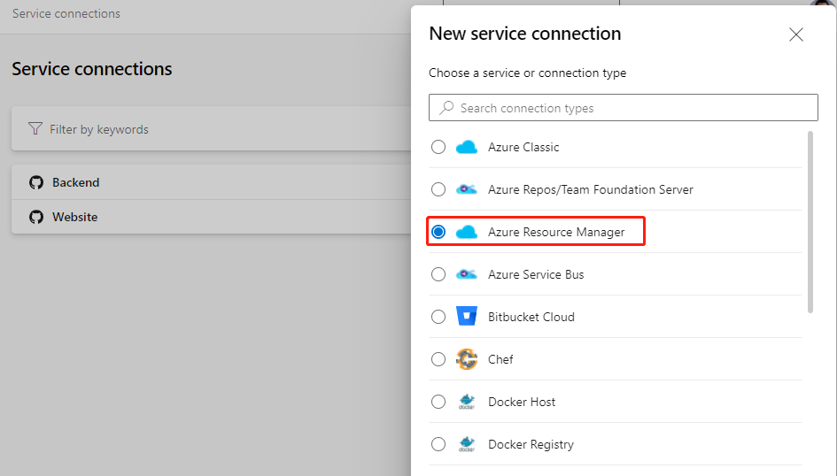

Next, select Service principal (manual).

On this page, set Environment to Azure China Cloud.

Scope Level: select Subscription.

Subscription Id and Subscription Name: go back to the subscription overview page and copy the corresponding items from the main pane.

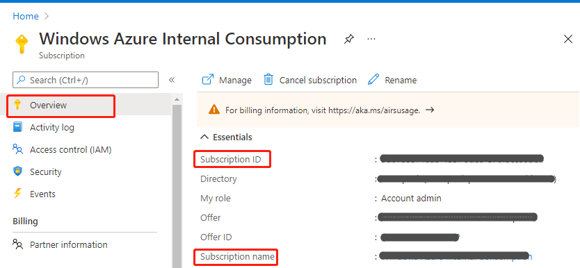

Service Principal Id: Go to the subscription in the Azure China portal, open the application you just registered, and find the Application (client) ID on its overview page.

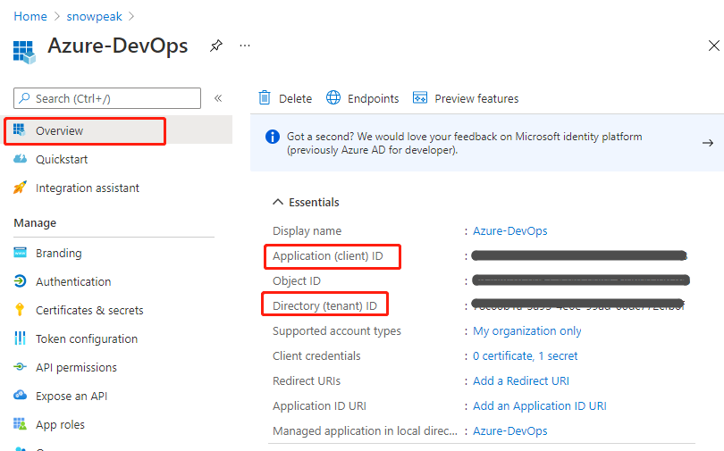

Service principal key: Enter the Value from the client secret you saved earlier.

Tenant ID: Get this from the Directory (tenant) ID on the same page above. After filling in these five fields, the Verify button becomes available. Click it, and if successful, you will see a verification success message. If there is an error, please go back and check whether all IDs and secrets are filled in correctly.

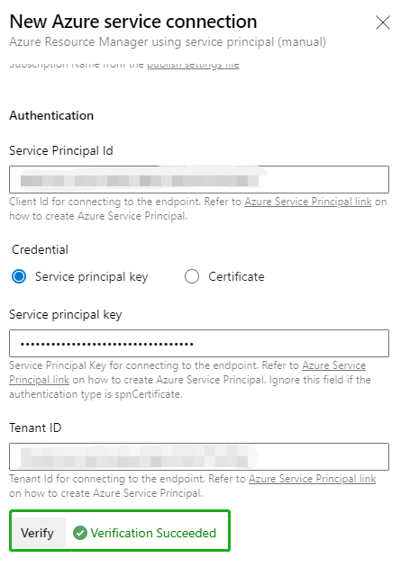

Finally, enter a meaningful name such as "Azure China" and a detailed description in Service connection name and Description (optional), then click Verify and save in the lower right corner to complete.

## Use Azure DevOps Release Pipeline to Verify Service Connection

In the Azure DevOps portal, under Pipelines, click the New button in the middle of the main pane, then click New release pipeline.

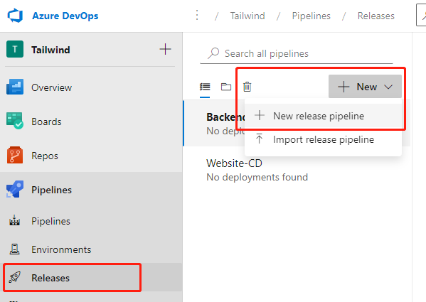

In the pop-up template selection, click the first Azure App Service deployment.

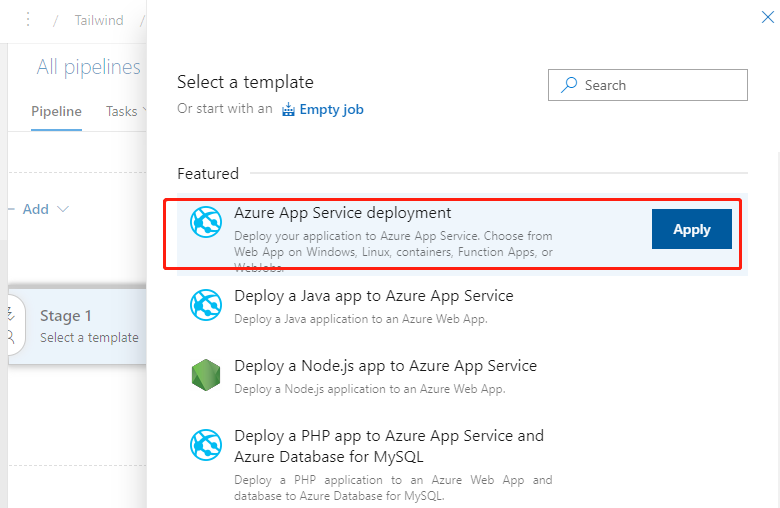

In the next pop-up, click the "1 job, 1 task" link on the left.

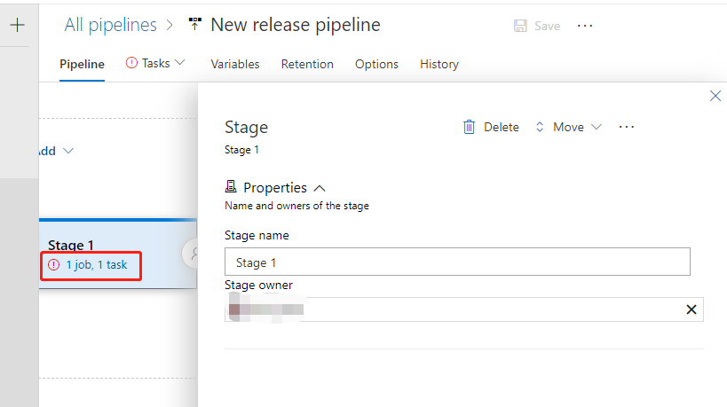

In the next pop-up, expand the menu under Azure subscription.

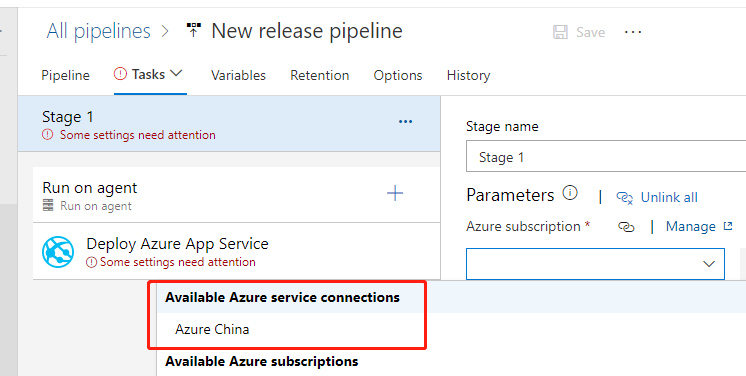

You can see that the service connection we just created is already displayed here, indicating that the service connection was created successfully. Any subsequent release pipelines can use this service connection and select the specific resource target as prompted.