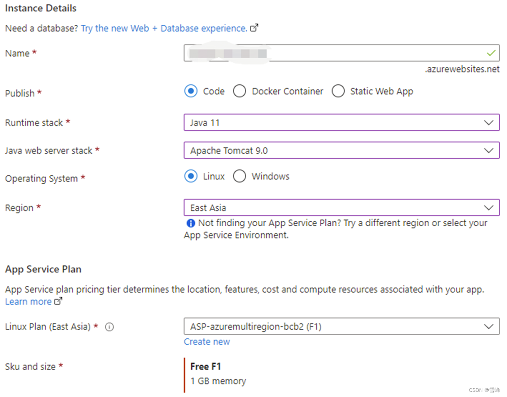
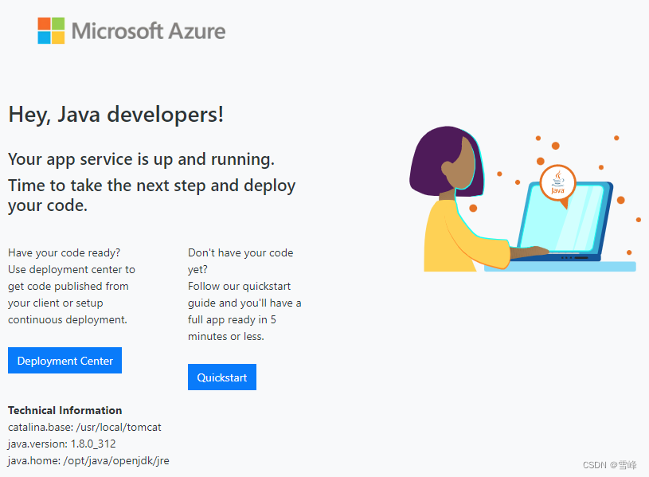
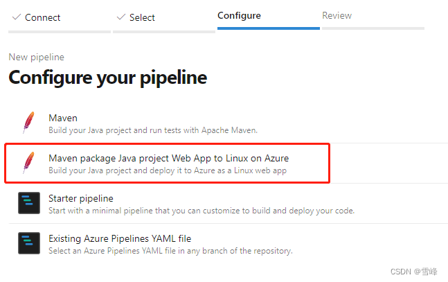
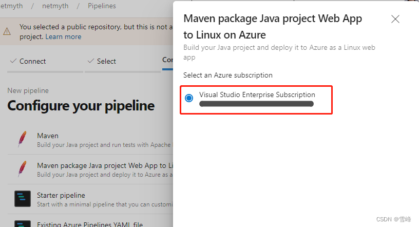
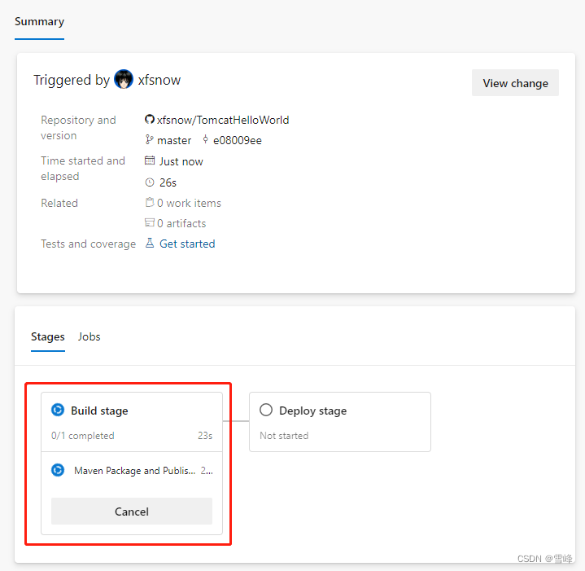
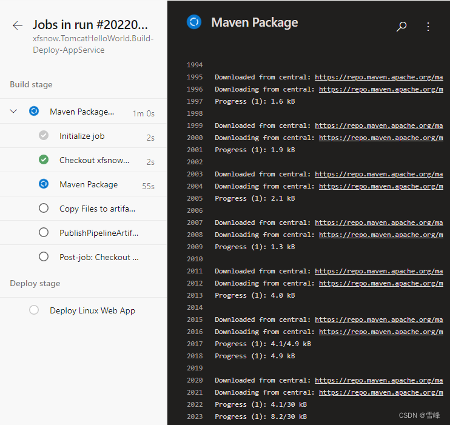
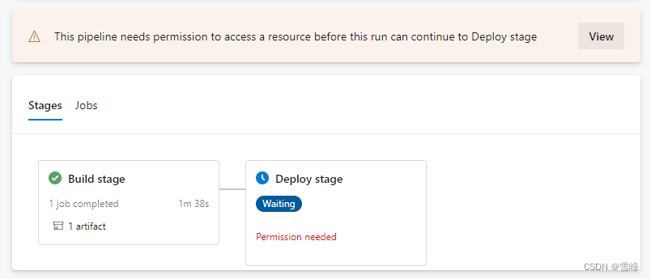
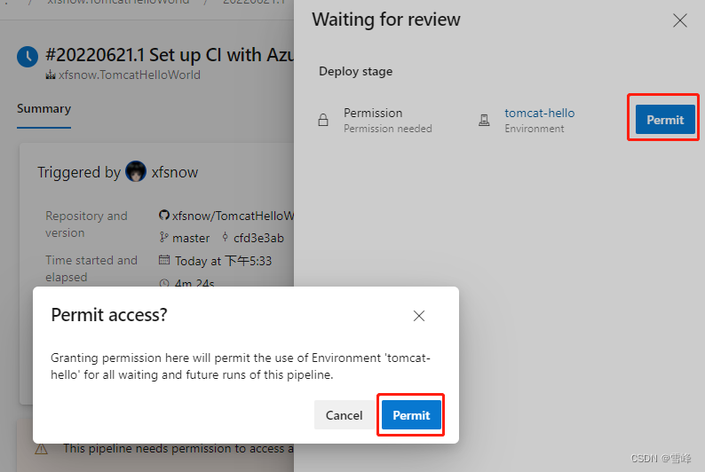
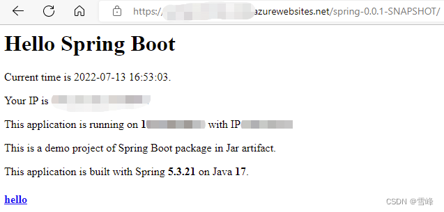
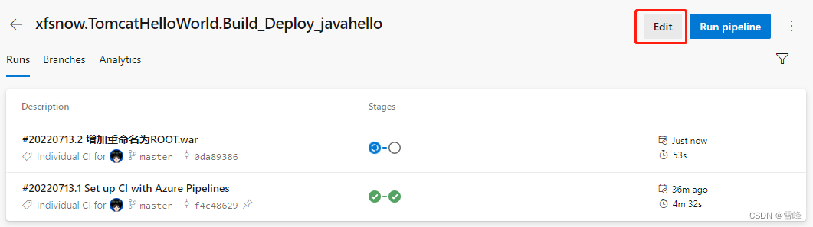

# Azure DevOps Deploying Java Spring Applications to Azure App Service

Published: *2022-07-13 10:57:47*

Category: __Azure__

Summary: Azure DevOps is an end-to-end enterprise-level development management platform on Microsoft Azure cloud platform, where Azure Pipelines is the core service for implementing CI/CD using pipelines. Azure App Service is a fully managed platform-as-a-service (PaaS) product for developers. Spring Boot is the most mainstream development framework for current Java applications. This article uses a basic example to explain in detail how to use Azure Pipelines to create and edit pipelines, building and deploying Java Spring applications to Azure App Service.

Original article: [https://snowpeak.blog.csdn.net/article/details/125759341](https://snowpeak.blog.csdn.net/article/details/125759341)

---------

Azure DevOps is an end-to-end enterprise-level development management platform on Microsoft Azure cloud platform, where Azure Pipelines is the core service for implementing CI/CD using pipelines. Azure App Service is a fully managed platform-as-a-service (PaaS) product for developers that can quickly build HTTP-based web applications, APIs, and mobile backends. Spring Boot is the most mainstream development framework for current Java applications. This article uses a basic example to explain in detail how to use Azure Pipelines to create and edit pipelines, building and deploying Java Spring applications to Azure App Service.

## Java Spring Demo Code

The source code is here [GitHub - xfsnow/SpringTomcat: A demo project of Spring Boot running in Tomcat deployed to Azure App Service with Azure DevOps.](<https://github.com/xfsnow/SpringTomcat> "GitHub - xfsnow/SpringTomcat: A demo project of Spring Boot running in Tomcat deployed to Azure App Service with Azure DevOps."). Please fork it to your own GitHub for practice. Alternatively, you can use this as a reference and directly create a default Maven Project using Spring Initializr in Visual Studio Code. Note that the packaging mode should be set to war package because we want to use an external Tomcat Server rather than the built-in Tomcat Server in Spring Boot. Pay attention to the following configuration items in pom.xml:

```xml
<properties>
	<java.version>11</java.version>
</properties>
```

Reference Tomcat Server-related libraries to facilitate the use of javax.servlet packages.

```xml
    <dependency>
      <groupId>org.apache.tomcat</groupId>
      <artifactId>tomcat-servlet-api</artifactId>
      <version>10.0.8</version>
    </dependency>
    <dependency>
      <groupId>org.apache.tomcat</groupId>
      <artifactId>tomcat-jsp-api</artifactId>
      <version>10.0.8</version>
    </dependency>
```

## Creating Azure App Service Instance

Log in to the Azure console https://portal.azure.com/, find the App Service service, and click Create in the upper left corner to create an App Service instance. In the creation wizard, the key items on the Basics page are the configurations in the Instance Details section.

Publish: select Code;

Runtime Stack: select Java 11;

Java web server stack: select Apache Tomcat 9.0;

Operating System: select Linux;

Region: select a mainstream region, in this example, East Asia is selected.

App Service Plan: select the free tier Free F1 level, which can take full advantage of Azure's free opportunities without incurring resource costs.



Note that the Java 11 and Tomcat 9.0 selected here are compatible with the Java and Tomcat versions configured in the demo code. The demo code chooses these versions based on the dependencies required by the current Spring Boot version 5.3.21. The built-in Maven in Azure DevOps Pipeline requires Java 11 version to build. This ultimately achieves consistent runtime versions across development, CI, and deployment environments, ensuring normal operation when deployed to App Service later. Otherwise, dependency errors and 404 errors will occur.

Keep the default settings on other wizard pages and click the "Create" button to create.

Wait a few minutes for the instance resource to be created. Go to the Overview page of this App Service instance and click the URL on the right, such as https://contoso.azurewebsites.net, which will open the application in a new window. Java applications need to wait a few minutes to run for the first time. Once you can see a default homepage similar to the following, it indicates that this App Service has been successfully created.



Next, we will use Azure DevOps Pipeline to deploy the demo application mentioned earlier to replace this default homepage.

## Configuring Azure Pipeline to Build and Deploy Java Application

### Jumping from Azure Console to Azure DevOps Dedicated Console Pipelines

Enter DevOps in the search bar at the top of the Azure console, then click DevOps Organizations.


This will take you to a transition page that jumps to the DevOps dedicated console.


Click the "My Azure DevOps Organizations" link again. Proceed to the DevOps organization selection page.


I have only one organization here. Click the organization link to finally reach the Azure DevOps dedicated console.


Click the first project square to enter the project console. Finally, click the blue rocket icon in the left navigation links to reach the pipeline management interface.

### Creating Azure Pipeline

On the Azure Pipelines main interface, click the "New pipeline" button in the upper right corner to create a new pipeline. According to the pipeline creation wizard, select GitHub in "Where is your code".

If this is your first time connecting to GitHub, it will redirect to GitHub login and authorization pages. Follow the prompts to operate.

Then go to "Select a repository" and choose the source code repository you forked earlier.

On the Configure page, select "Maven package Java project Web App to Linux on Azure".



A popup will appear. Follow the prompts to select the Azure subscription, resource group, and the App Service resource created earlier.



On the next page, select the previously created App Service instance from the Web App name dropdown menu.


Newly created instances in App Service may not display in the dropdown menu. Please wait patiently until they can be displayed. After selecting the corresponding instance name, click the "Validate and configure" button in the lower right corner. Wait a few seconds, then you'll be redirected to the Review page.


It's recommended to click the filename and rename it to something meaningful, such as pipelines-Build-Deploy-AppService.yml.

Click the "Save and run" button in the upper right corner. In the popup prompt, it's recommended to write a meaningful message in the Commit message, as this pipeline file will be committed to the same source code repository by default. Finally, click the "Save and run" button in the lower right corner of the popup, which will redirect to the pipeline execution interface.



Click Build Stage to proceed to the log interface of the ongoing task.



After the build execution is completed, the Deploy stage requires authorization confirmation when deploying to Azure App Service for the first time.



Click the "View" button. In the "Waiting for review" popup, click "Permit" to authorize, then click "Permit" again in the popup to confirm.



After authorization, the Deploy stage will continue executing until successful completion. Then we can see in the Summary of the pipeline execution page that Related shows "1 published".


Click this link and expand step by step to see that the built artifact is named spring-0.0.1-SNAPSHOT.war.


## Checking Azure App Service Deployment Status

Return to the Azure console https://portal.azure.com/, find the App Service instance, and click Deployment Center under Deployment in the left navigation. You can see the successful deployment record displayed as follows.


Go back to the Overview page and click the public service URL on the right. You'll find that the website homepage shows a 404 error.


Because our project's pom.xml declares that the artifact filename is spring-0.0.1-SNAPSHOT.war, which is also what we saw in the pipeline completion results, when deployed to Tomcat Server by default, it adds a subpath /spring-0.0.1-SNAPSHOT. We can access it by adding /spring-0.0.1-SNAPSHOT after the App Service URL mentioned above.



## Configuring to App Service Site Root Directory

To deploy to the website root directory in Tomcat Server, there's a simple method: specify the war package name as ROOT.war. We can add a rename step in the Pipelines pipeline. In the Pipeline list, click the pipeline we created, then click the "Edit" button in the upper right corner to edit it.



In the editing interface, find the line `- task: CopyFiles@2` and add the following above this line:

```yaml
# Add a rename step to unify the packaged artifact filename to ROOT.war for subsequent deployment to the App Service root directory.
- bash: |
  echo $(System.DefaultWorkingDirectory)
  mv $(System.DefaultWorkingDirectory)/target/*.war $(System.DefaultWorkingDirectory)/target/ROOT.war
```

This task actually uses the bash command execution task type in Pipeline. $(System.DefaultWorkingDirectory) is an environment variable in Pipeline. The previous build task will build hello.war according to the output settings specified in our pom.xml. We use the mv command to rename it to ROOT.war. After saving the pipeline, it will execute automatically. Wait for execution to complete. Go to the App Service public service URL again and refresh. The application should now be accessible from the domain root directory.

