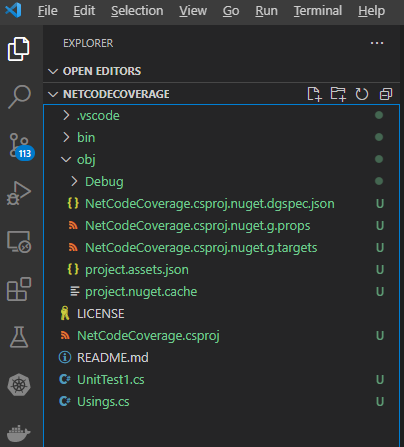
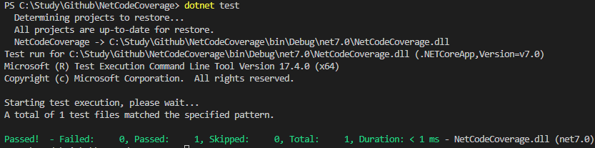
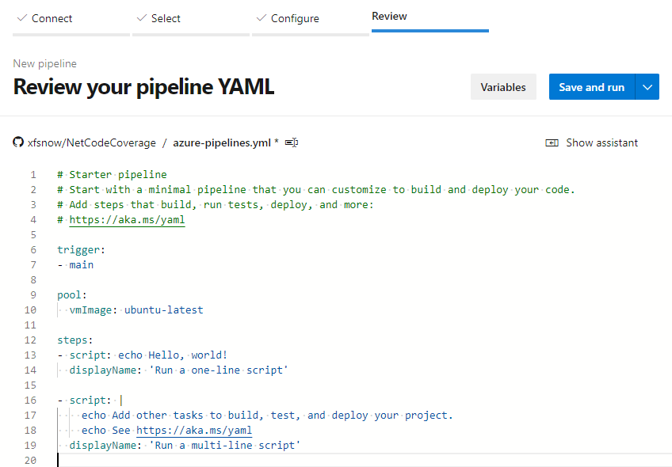
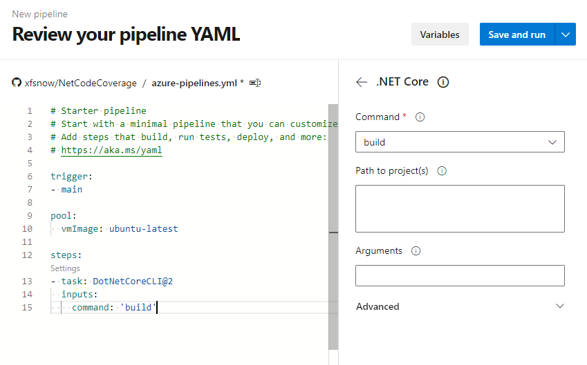
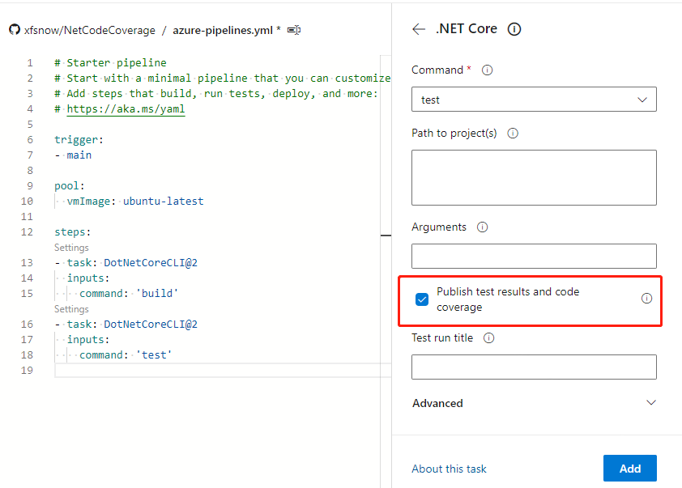

# Displaying Code Coverage in Azure Pipeline

Published: *2023-01-23 10:00:00*

Category: __Azure Cloud__

Summary: Azure Pipeline is a hosted service responsible for automated pipelines in Microsoft's comprehensive DevOps toolset on the cloud, featuring complete pipeline management capabilities and convenient integration with various testing, building, and deployment tools. Code coverage is an important metric in automated testing, measuring the proportion of source code executed during testing relative to the total source code, indirectly measuring software quality. If project code is configured to export code coverage, Azure Pipeline can collect and store the corresponding data. However, by default, this data is only available for download and viewing with other tools. This article briefly introduces how to visually display code coverage in the Azure Pipeline console.

Original article: [https://snowpeak.blog.csdn.net/article/details/125759341](https://snowpeak.blog.csdn.net/article/details/125759341)

------------------------------------

Azure Pipeline is a hosted service responsible for automated pipelines in Microsoft's comprehensive DevOps toolset on the cloud, featuring complete pipeline management capabilities and convenient integration with various testing, building, and deployment tools. Code coverage is an important metric in automated testing, measuring the proportion of source code executed during testing relative to the total source code, indirectly measuring software quality. If project code is configured to export code coverage, Azure Pipeline can collect and store the corresponding data. However, by default, this data is only available for download and viewing with other tools. This article briefly introduces how to visually display code coverage in the Azure Pipeline console.

## Preparing Project Source Code

We use `dotnet new xunit` to initialize a standard .NET test case project. It displays as follows in VS Code:



To implement code coverage, the core configuration is in the NetCodeCoverage.csproj file in the following section:

```xml
<PackageReference Include="coverlet.collector" Version="3.1.2">
      <IncludeAssets>runtime; build; native; contentfiles; analyzers; buildtransitive</IncludeAssets>
      <PrivateAssets>all</PrivateAssets>
</PackageReference>
```

If it's not there, you can manually add it.

Then execute `dotnet build` and `dotnet test` commands, and you can see the following output:



The default created test case doesn't contain any code logic, so of course the test passes. If there are issues, you can fork the source code directly from my GitHub:

<https://github.com/xfsnow/NetCodeCoverage>

## Creating Azure Pipeline

In the Azure DevOps console, find Pipeline under Pipelines, and click "New pipeline" in the upper right corner to create a new YAML format pipeline.

For "Where is your code", select GitHub first. Connect to the GitHub source repository just submitted.

On the Configure page, select "Starter template". Finally, we reach the Review page where we see the following initial pipeline:



Delete the existing 2 script tasks. Click "Show assistant" in the upper right corner, click ".NET Core" in Tasks, as shown below, first add a build task:



Then select "test" from the Command menu:



Note to keep "Publish test results and code coverage" selected, then add a test task.

Finally, add a publish code coverage task.

Finally, click the "Save and run" button in the upper right corner, commit to the source repository as prompted and execute.

- [ ] To be continued