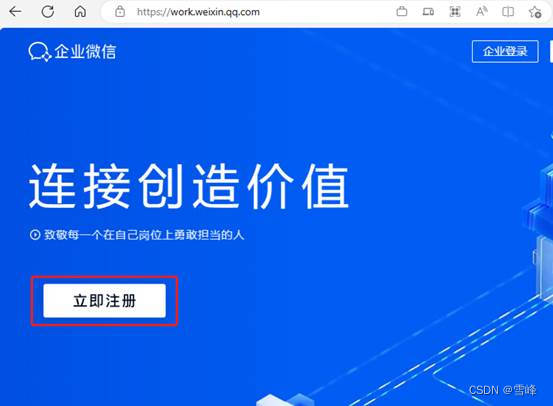
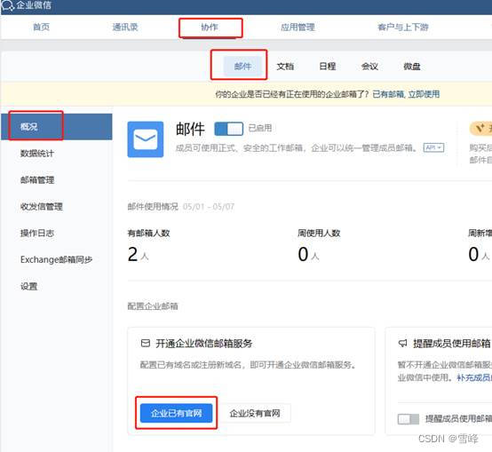
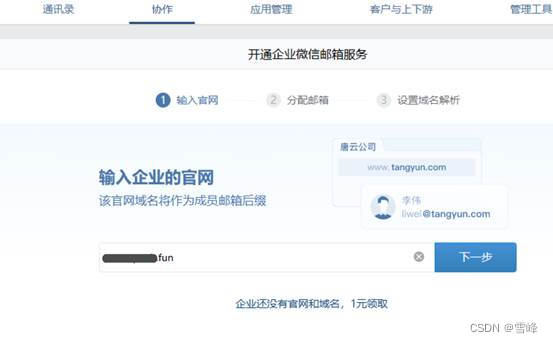
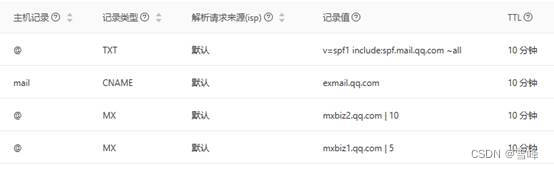
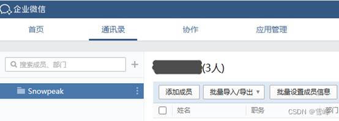
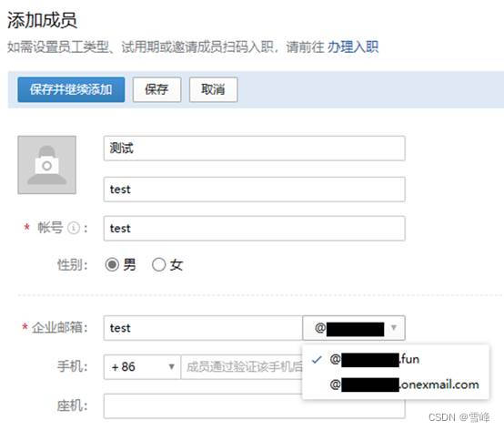
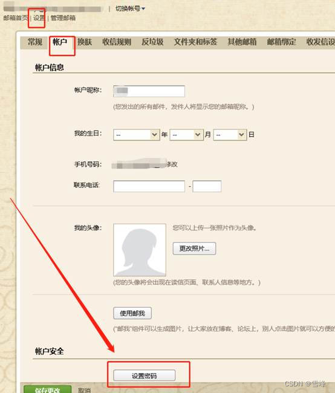

# Configuring Free Domain Email Using Tencent Enterprise Email

Published: *2023-05-08 14:44:11*

Category: __System Administration__

Summary: It's now common for developers to deploy their own personal websites and register their own domain names, but deploying an email server isn't that simple. The free version of Tencent Enterprise Email can also bind domains, and with just a few simple steps, you can have your own domain email!

Original article: [https://snowpeak.blog.csdn.net/article/details/130558658](https://snowpeak.blog.csdn.net/article/details/130558658)

---------

It's now common for developers to deploy their own personal websites and register their own domain names, but deploying an email server isn't that simple. The free version of Tencent Enterprise Email can also bind domains, and with just a few simple steps, you can have your own domain email!

The free version of Tencent Enterprise Email allows one enterprise, can bind one domain, and supports up to 100 members (i.e., 100 email addresses), which is sufficient for individual developers. The process requires downloading and using WeCom (WeChat Work). Since Tencent provides so many free services, supporting them is also reasonable.

## Creating a Free Enterprise

[WeCom (WeChat Work)](<https://work.weixin.qq.com/> "WeCom (WeChat Work)")

Click "Register Now"

For individual developers, fill in the content as needed. You just need to bind your personal WeChat to WeCom.

## Binding Domain for Email

After registering and logging into the enterprise, click "Email" under Collaboration, then click the "Enterprise has official website" button.

Enter your own domain and click "Next" to verify.

The system detected that my domain is registered with Alibaba Cloud, so the next page directly provides instructions for Alibaba Cloud DNS resolution. Configuration for other domain registration platforms is similar. The core is 4 DNS resolution records.

Finally, click the "Complete configuration and verify" button.

## Creating Email with Your Own Domain

Go to the Contacts module and click the "Add Member" button to add new enterprise members, then you can use your own domain to configure email.

In the enterprise email section, you can select your bound domain. The second domain below is a subdomain assigned by WeCom. If you can't see your bound domain, please wait patiently. If it still doesn't work, you can click "Contact Customer Service" in the upper right corner and seek help through the customer service's WeCom. After providing some audit materials as required by customer service, the domain can be manually verified, and then you can use your own domain.

## Logging in to Use Domain Email

To use email on terminals, you need to first log in with the WeCom app and accept the invitation to join this enterprise, which simultaneously activates this email. Then you can use a browser to visit https://exmail.qq.com/login. First-time use requires WeCom QR code login. After logging in, you can set a password yourself, and then you can log in with account and password without needing WeCom QR code scanning.

