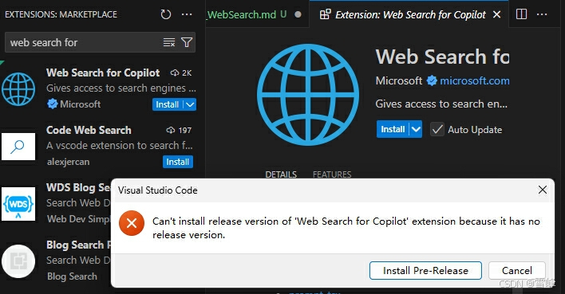
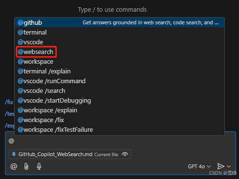
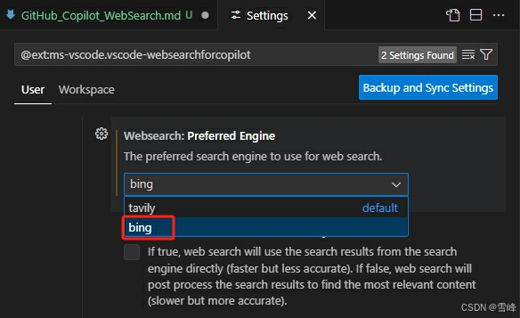
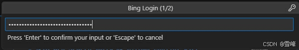
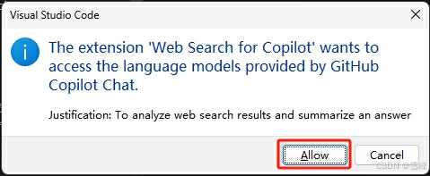
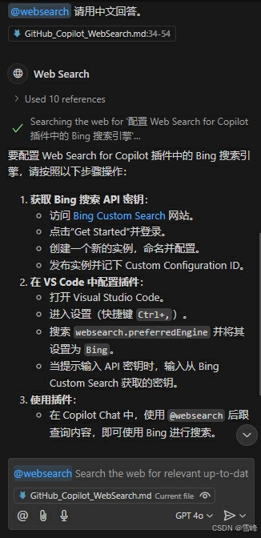

# Using Web Search Plugin to Extend GitHub Copilot Q&A

Published: *2024-11-12 14:40:23*

Category: __AI__

Summary: GitHub Copilot is an AI-powered code suggestion tool developed collaboratively by GitHub and OpenAI. It can provide code suggestions based on context and answer various technical questions. However, Copilot itself cannot answer non-technical questions. To extend Copilot's functionality, Microsoft released a plugin called Web Search, which can use search engines to extend answers to questions that Copilot cannot handle.

Original article: [https://snowpeak.blog.csdn.net/article/details/143713992](https://snowpeak.blog.csdn.net/article/details/143713992)

---------

GitHub Copilot is an AI-powered code suggestion tool developed collaboratively by GitHub and OpenAI. It can provide code suggestions based on context and answer various technical questions. However, Copilot itself cannot answer non-technical questions. To extend Copilot's functionality, Microsoft released a plugin called Web Search, which can use search engines to extend answers to questions that Copilot cannot handle.

### Installing the Web Search Plugin

The official link is at [Web Search for Copilot Plugin](<https://marketplace.visualstudio.com/items?itemName=ms-vscode.vscode-websearchforcopilot> "Web Search for Copilot Plugin")

Search for "Web Search for Copilot" plugin in VS Code's Extensions and install it. Because the current version is v0.1.2024111101 (pre-release), a prompt "Can't install release version..." will appear during installation.

Don't worry, click the "Install Pre-Release" button and the plugin will continue installing.

After installation, Copilot Chat's Agent will have an additional websearch agent.

### Preparing Bing Search API Key

  1. Log in to the [Azure Console](<https://portal.azure.com/> "Azure Console").
  2. In the left menu, click "Create a resource".
  3. Enter "Bing Search API" in the search box, then click "Bing Search v7" in the search results.
  4. Click the "Create" button to start creating a new Bing Search API resource.
  5. On the configuration page, select your subscription, resource group, and pricing tier. Azure offers multiple pricing tiers; you can choose the appropriate tier based on your needs.
  6. After filling in all required information, click "Review + create", then click the "Create" button. Wait a few minutes for Azure to automatically deploy your API service.

After completing these steps, click "click here to manage keys" on the Overview page to view the 2 Keys. Save one for later use.

### Using the Web Search Plugin

Simply include the `@websearch` agent when asking questions in Copilot Chat to use the Web Search plugin to answer questions.

First, open settings @ext:ms-vscode.vscode-websearchforcopilot and change the default search engine to bing.

When using it for the first time, a prompt will appear asking you to log in to Bing.

Click the "Allow" button, then enter the Bing Search key you noted earlier in the input box that appears at the top of VS Code.

Press Enter to confirm and save. Note that this key is not saved in VS Code's settings. If you need to change or clear it, you'll need to delete it from VS Code's local cache files.

Another prompt will appear:
"The extension 'Web Search for Copilot' wants to access the language models provided by GitHub Copilot chat." Click the "Allow" button.

Another prompt will appear: "The extension 'Web Search for Copilot' wants to sign in using GitHub." Click the "Allow" button and follow the prompts to log in with your GitHub account.

All configuration is now complete. Wait a moment and Copilot will answer with content searched through Bing.

Sometimes even when asking questions in Chinese, the answer comes in English. Just follow up with "Please answer in Chinese" and it will work.

