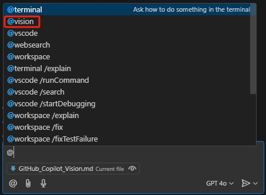
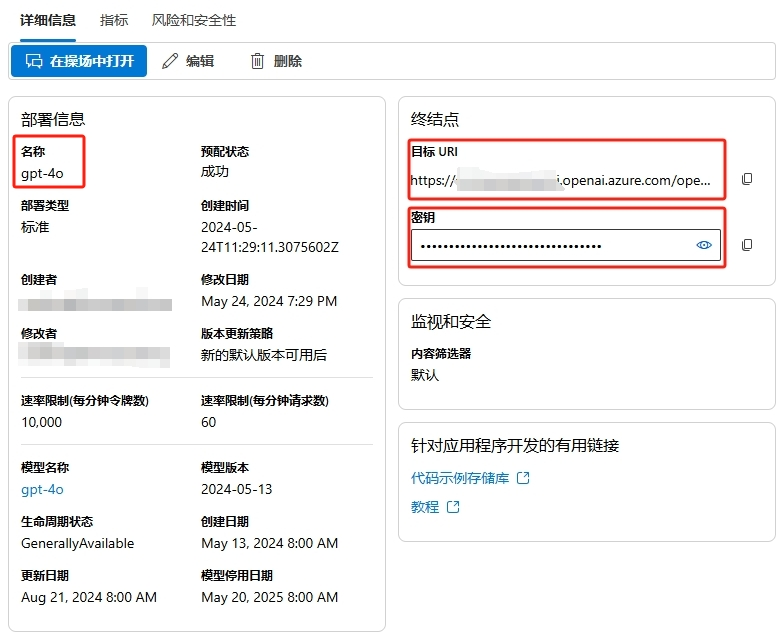
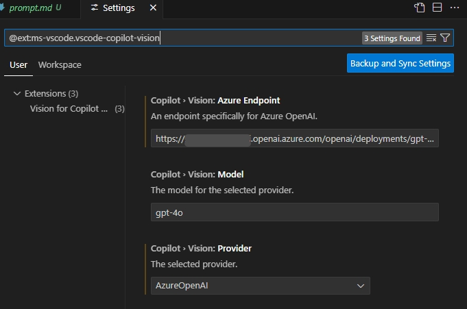
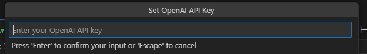
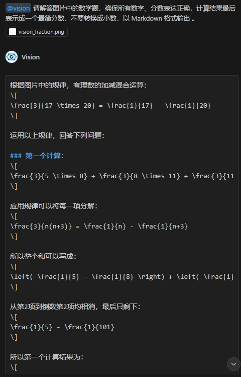

# Using Vision Plugin to Enable GitHub Copilot for Image Q&A

Published: *2024-11-14 10:40:18*

Category: __AI__

Summary: To extend Copilot's functionality, Microsoft released a plugin called Vision for Copilot Preview, which uses Copilot's Agent mechanism to connect with OpenAI's GPT 4o model for image recognition and Q&A. This article introduces the installation and configuration of the Vision for Copilot Preview plugin, and explores some interesting extended uses such as solving math problems through image recognition.

Original article: [https://snowpeak.blog.csdn.net/article/details/143760717](https://snowpeak.blog.csdn.net/article/details/143760717)

---------

GitHub Copilot is an AI-powered code suggestion tool developed collaboratively by GitHub and OpenAI. It can provide code suggestions based on context and answer various technical questions. At the recent global technology conference, GitHub Copilot announced an upgrade to the large language model behind GitHub Copilot, now officially using the GPT 4o model, with the addition of preview access to the o1 model. Although it will support direct image recognition in the future, it currently cannot recognize images and can only answer technical-related questions. To extend Copilot's functionality, Microsoft released a plugin called Vision for Copilot Preview, which uses Copilot's Agent mechanism to connect with OpenAI's GPT 4o model for image recognition and Q&A.

### Installing the Vision Plugin

The official link is at [Vision for Copilot Plugin](<https://marketplace.visualstudio.com/items?itemName=ms-vscode.vscode-copilot-vision> "Vision for Copilot Plugin")

Alternatively, search for "Vision for Copilot" plugin in VS Code's Extensions. After installation, Copilot Chat's Agent will have an additional vision agent.

### Preparing Azure OpenAI API Key

This vision agent actually leverages the convenient agent mechanism in Copilot Chat and then calls OpenAI's existing models to implement image recognition and Q&A. We use Azure OpenAI, which is an enterprise-level OpenAI service that is convenient to enable and configure. Here are the brief steps, noting that when creating OpenAI resources, select the East US region, which currently provides the gpt-4o model.

  1. Create Azure OpenAI Service: First, you need to create a new Azure OpenAI service instance in the Azure portal. Log in to the [Azure Console](<https://portal.azure.com/> "Azure Console"), navigate to "Create a resource", then search for "Azure OpenAI". Follow the prompts to complete the service creation.

  2. Configure Model: In the created Azure OpenAI service instance, select "Model deployment", then choose the GPT-4 model you want to deploy. Configure the model parameters such as name, version, etc.

  3. Generate API KEY: In the Azure portal, navigate to your Azure OpenAI service instance and select "Keys and Endpoint". Here, you can generate a new API KEY.

After completing these steps, click on the newly created deployment in the "Deployments" page, note down the deployment name, endpoint, and key for later use.

### Using the Vision Plugin

First, open settings @ext:ms-vscode.vscode-copilot-vision, fill in the Azure OpenAI access endpoint and deployment name recorded earlier, and select AzureOpenAI for Provider.

When using it for the first time, a prompt will appear asking you to fill in the OpenAI API Key.

Besides the common task of generating HTML code from design images, using the Vision plugin allows Copilot to recognize questions in images and provide answers. For example:

The Q&A effect is as follows:

Copy all the answer content and save it as a markdown file to see the detailed solution.

