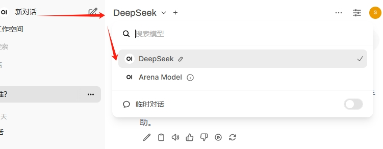

# Deploy DeepSeek on Azure and Integrate with Open WebUI

Published: *2025-02-12 18:01:01*

Category: __AI__

Summary: DeepSeek is an open-source large language model released by Hangzhou DeepSeek Artificial Intelligence Infrastructure Technology Research Co., Ltd. It has been continuously popular recently, causing official services to be frequently unavailable. There are already many articles online about local deployment and private deployment. Here we provide a complete Azure-based private deployment solution.

Original article: [https://snowpeak.blog.csdn.net/article/details/145597507](https://snowpeak.blog.csdn.net/article/details/145597507)

---------

DeepSeek is an open-source large language model released by Hangzhou DeepSeek Artificial Intelligence Infrastructure Technology Research Co., Ltd. It has been continuously popular recently, causing official services to be frequently unavailable. There are already many articles online about local deployment and private deployment. Here we provide a complete Azure-based private deployment solution.

## Deploy DeepSeek using Azure AI Foundry

Azure AI Foundry is an AI service platform launched by Microsoft that provides one-stop AI services, including model training, inference, deployment, etc. To create Azure AI Foundry, please refer to the [official documentation](<https://learn.microsoft.com/azure/ai-studio/how-to/create-projects> "official documentation").

We can use Azure AI Foundry to deploy DeepSeek.

  1. Start deploying the DeepSeek model

  2. After selecting the model, you can see that the DeepSeek model itself is free. (The model is open source and free after all)

When it comes to Azure compute resources, there is still a little cost involved. For specific fees, please refer to [Azure official pricing](<https://azure.microsoft.com/en-us/pricing/details/machine-learning/> "Azure official pricing")

  3. No additional configuration is needed, click the "Create Resource and Deploy" button and wait for deployment to complete.

  4. After deployment is complete, you can see the DeepSeek model's Endpoint.

First, note down the model's Model Name, which is usually `DeepSeek-R1` by default, then click the model's Get Endpoint button.

Note down the model's Azure AI model inference endpoint and Key. These 3 values will be used when configuring Open WebUI functions later.

## Deploy Open WebUI using Azure App Service

[Open WebUI](<https://www.openwebui.com/> "Open WebUI") is an extensible, feature-rich, and user-friendly self-hosted AI platform designed to run completely offline. It supports various LLM runners (such as Ollama and OpenAI-compatible APIs) and has built-in inference engines for RAG, making it a powerful AI deployment solution. Although it supports various local installation methods, given its large size, deployment can be somewhat challenging. Using Azure App Service for one-click deployment to the cloud eliminates the need to download installation packages or Docker images locally, making it very convenient.

### Create App Service

The method is very simple, with the main steps as follows:

  1. In the [Azure portal](<https://portal.azure.com/> "Azure portal"), search for App Service, then click the "Create" button in the upper left corner and select "Web App".
  2. Fill in the application name, resource group, region, and other information as prompted. Pay attention to the following points:
 * Select Container for Publish.
 * Select Linux for Operating System.
 * For Region, it's recommended to choose Japan West, as this region has faster access speeds from mainland China in terms of network access.
 * Select F1 Free for Pricing plans, which is sufficient for our own use.
  3. On the next page, don't select Database.
  4. On the Container page, configure the following:
 * Select Other container registries for Image Source
 * Select Public for Access Type
 * Fill in `ghcr.io` for Registry server URL
 * Fill in `openwebui/openwebui:main` for Image and tag

  5. Leave other pages unchanged and directly click the "Review + Create" button.

After a moment, the App Service will be created. Click on the Default domain on the Overview page to access Open WebUI.

The free tier has limited resource specifications, but the Open WebUI image is large and loads slowly, requiring 5-6 minutes to start. Please be patient. Refresh several times until you see the Open WebUI login interface. You need to register an account for first-time use.

### Open WebUI Version Updates

Version updates are quite frequent. Since `Open WebUI/Open WebUI:main` was set as the image tag when creating the Azure App Service, you only need to stop and restart the App Service to update to the latest version, which is very convenient. The slight downside is that the underlying compute resources of App Service are randomly allocated, so user information saved in Open WebUI will be lost each time you redeploy. For our own use, just re-register.

Version update notification detected

After stopping and restarting App Service and accessing Open WebUI again, you'll find it has been updated to the latest version.

## Configure Open WebUI Functions to Connect to DeepSeek Deployed on Azure AI Foundry

When you first open Open WebUI, it will prompt you to create an administrator account. After creating it, you can log in. Click on the username in the lower left corner, and click "Admin Panel" in the popup menu.

Click on the "Functions" menu on the left, then click the "+" button.

Fill in "DeepSeek" for the function name and "DeepSeek from Azure AI Foundry" for the function description.
Fill in the function content with the following code:

<https://raw.githubusercontent.com/xfsnow/python/refs/heads/master/AzureAI/Open_WebUI_AAIF_DeepSeek.py>

Click the "Save" button and confirm in the popup confirmation dialog. After saving, click the gear button to the right of the function, click the "Default" text, and you can input your own values.

In the popup dialog, fill in the 3 variable values noted down when creating the DeepSeek deployment earlier. Fill in the Azure AI model inference endpoint for Azure Endpoint (note that this should be the URL ending with /models, such as <https://contoso-abcd1234-eastus2.services.ai.azure.com/models>).
Fill in the Key for Azure Api Key and the Model Name for Azure Model Name.

Finally, toggle the circle on the far right of the function to enable it. Then click "New Chat" in the upper left corner, and DeepSeek will appear in the model selection menu.

