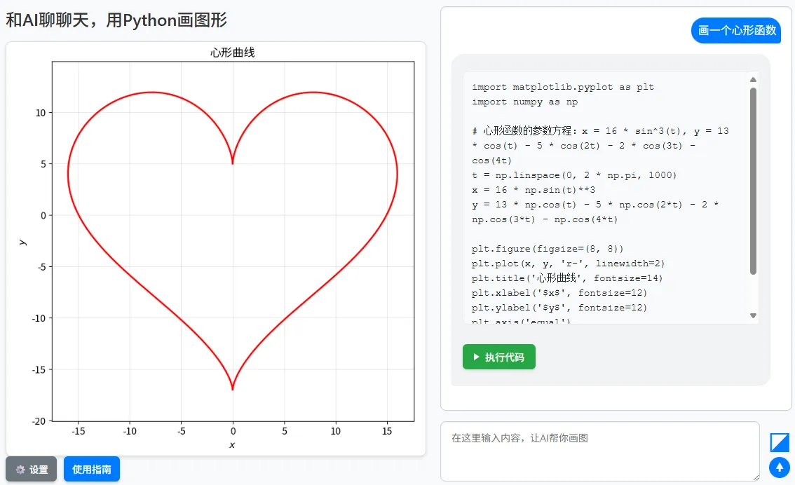

# Chat with AI and Plot with Python - Introducing ChatPyplot

Published: *2025-10-17 15:20:00*

Category: __Development__

Summary: This article introduces an intelligent tool that combines the Python Matplotlib library with AI conversational capabilities. Users can interact with AI using natural language to discuss math-related topics, and the AI generates corresponding Python code that is executed directly in the browser to create charts.

---------

## Overview

Check out the demo application at <https://www.snowpeak.org/math_question/ChatPyplot.htm>

Screenshot of the demo in action:


The project source code is open-sourced at <https://github.com/xfsnow/xfsnow.github.io/blob/master/math_question/ChatPyplot.htm>

### Who Should Read This Document?

This article provides an in-depth explanation of the development process and implementation principles of an intelligent tool—ChatPyplot—that combines the Python Matplotlib library with AI conversational capabilities. It is suitable for those interested in frontend development, AI integration, and data visualization, with a basic understanding of JavaScript, HTML/CSS syntax and some frontend development experience.

### What Is This Document For?

The content introduced in this document is suitable for large-scale frontend development projects, especially those involving AI integration, data visualization, and user interaction design. By detailing the architecture and implementation specifics of the ChatPyplot project, this document helps developers understand how to combine AI technology with Python data visualization libraries to create practical educational tools.

### Significance

In the fields of education and data analysis, visualization is a crucial tool. Traditional data visualization requires users to master specific programming languages and library usage methods. Combining AI with Python Matplotlib can significantly lower the barrier to entry, allowing users to interact with the system through natural language and automatically generate and execute plotting code. This not only improves user experience but also expands the application scenarios of data visualization.

The significance of the ChatPyplot project includes:
1. Providing a new approach to data analysis and visualization
2. Demonstrating how to integrate multiple AI models into a unified interface
3. Achieving seamless connection between AI and Python data visualization libraries
4. Offering new ideas for the development of educational technology

## Project Background and Use Cases

### Project Background

Python Matplotlib is an excellent data visualization library widely used in data analysis and scientific research. However, using Matplotlib requires mastering its specific APIs and programming syntax, which can be a barrier for beginners. With the advancement of AI technology, particularly the continuous improvement of large language models in understanding and generating code, combining AI with Python data visualization libraries has become possible.

The ChatPyplot project emerged to lower the barrier of using Python Matplotlib through natural language interaction, allowing users to generate and execute plotting code through simple language descriptions.

### Addressed Use Cases

1. **Lowering the Learning Curve**: Users don't need to master complex Python and Matplotlib syntax; they only need to describe their requirements in natural language
2. **Improving Efficiency**: Rapidly generate and execute plotting code, saving time on manual coding
3. **Multi-Model Support**: Integration of multiple AI models to meet different user needs
4. **Image Understanding**: Support for uploading images and analyzing/plotting based on image content
5. **Educational Applications**: Providing intuitive visualization tools for data analysis teaching and learning

## Code Architecture Design

### Overall Architecture

The ChatPyplot project adopts a pure frontend architecture, primarily composed of the following components:

1. **User Interface Layer**: User interface implemented with HTML/CSS
2. **Control Logic Layer**: Business logic implemented with JavaScript
3. **AI Interface Layer**: Implementation of interfaces with different AI models
4. **Python Runtime Environment Layer**: Pyodide runtime environment for executing Python code in the browser

### Core Class Design

The project adopts an object-oriented design approach, mainly including the following core classes:

#### AiBase Base Class

AiBase is the base class for all AI model classes, encapsulating common logic, including:
- Message history management
- System prompt handling
- Image file to Base64 encoding
- AI response formatting
- Python code extraction

#### Specific AI Model Classes

The project supports three major AI models, each with a corresponding implementation class that inherits from the AiBase base class:

1. **AiDeepSeek** - DeepSeek AI Class
2. **AiQwen** - Qwen AI Class
3. **AiAzureOpenAI** - Azure OpenAI AI Class

Each subclass implements specific calling logic according to the API specifications of their respective models.

#### PyodideManager Class

This is the core management class of the project, responsible for running Python code in the browser, with main functions including:
- Initializing the Pyodide runtime environment
- Loading necessary Python packages (such as numpy, matplotlib)
- Loading and configuring Chinese fonts
- Executing Python code and generating images
- Managing Python environment status

## Basic Principles of Pyodide Running in the Browser

### What is Pyodide?

Pyodide is a Python distribution compiled to WebAssembly and runs in the browser. It makes it possible to run Python code directly in the browser without server-side support.

### Working Principles

1. **Loading Pyodide**: On first visit, the browser downloads the Pyodide environment (about 10-20MB) from a CDN, including the Python interpreter and standard library.

2. **Installing Dependency Packages**: Additional Python packages such as numpy, matplotlib, and other scientific computing libraries are loaded as needed. These packages are also compiled to WebAssembly format.

3. **Executing Python Code**: User-generated Python code is executed in the Pyodide environment in the browser without communicating with the server.

4. **Result Visualization**: Charts generated using Matplotlib are converted to image data (base64 encoded) and then displayed on the web page.

### Technical Advantages

- **Privacy Protection**: All code is executed locally in the browser without uploading to the server
- **Real-time Response**: No network round trips required, resulting in fast code execution response
- **Offline Availability**: Once loaded, it can continue to be used even without an internet connection
- **Rich Ecosystem**: Supports most commonly used Python scientific computing libraries

## Chinese Font Loading and Display Solution

### Problem Background

In data visualization, correctly displaying Chinese labels, titles, and legends is an important requirement. However, the Pyodide environment in the browser cannot access system fonts, so special handling is required to properly display Chinese characters.

### Solution

ChatPyplot adopts an effective Chinese font loading and configuration solution:

1. **Font File Acquisition**: Obtain the Noto Sans SC font file from Google Fonts CDN.

2. **Font File Loading**: Use the fetch API to download the font file and write it to Pyodide's virtual file system.

3. **Font Registration**: Use matplotlib's font management functionality in the Python environment to register and load the Chinese font.

4. **Font Configuration**: Set matplotlib's default font to the loaded Chinese font.

### Implementation Details

```javascript
// Load font file
const fontResponse = await fetch(this.fontUrl);
if (fontResponse.ok) {
  const fontArrayBuffer = await fontResponse.arrayBuffer();
  const fontData = new Uint8Array(fontArrayBuffer);
  this.pyodide.FS.writeFile(fontPath, fontData);
}

// Configure font in Python environment
this.pyodide.runPython(`
try:
    # Check if font file exists in Pyodide's virtual file system
    if os.path.exists('${fontPath}'):
        # Load font file
        fm.fontManager.addfont('${fontPath}')
        font_name = fm.FontProperties(fname='${fontPath}').get_name()
        # Set as default font
        plt.rcParams['font.family'] = font_name
except Exception as e:
    # Fallback font scheme
    plt.rcParams['font.sans-serif'] = ['DejaVu Sans', 'Bitstream Vera Sans', 'Arial Unicode MS', 'sans-serif']
`);
```

### Technical Key Points

- Using Noto Sans SC as the primary Chinese font, which is an open-source, high-quality font
- Writing font files to the virtual file system using Pyodide's FS module
- Registering fonts using matplotlib's fontManager
- Setting up reasonable font fallback mechanisms to ensure basic content display even when font loading fails
- Configuring minus sign display to resolve Chinese minus sign display anomalies

## System Prompt Design

System prompts are a critical part of guiding AI behavior and hold special importance in the ChatPyplot project. They not only need to guide the AI on how to answer math-related questions but also clearly define how to generate Python code.

### Core Content of System Prompts

System prompts mainly include the following aspects:

1. **Role Definition**: Clearly define the AI as a data visualization assistant
2. **Behavioral Guidelines**: Require the AI to provide friendly explanations and clear Python code in responses
3. **Code Format**: Specify that Python code must be placed in specific code blocks (```python```)
4. **Mathematical Formula Format**: Require mathematical formulas to be wrapped with $$
5. **Code Standards**: Generated code should be directly executable and produce visualization charts

### System Prompt Sharing Mechanism

In ChatPyplot, system prompts serve as global configurations that apply to all AI models. Users only need to set them once, and they will apply to all models, greatly simplifying the configuration process.

## Dialog Interaction Methods

ChatPyplot supports multiple dialog interaction methods to meet the needs of different scenarios:

### Pure Text Dialog

Users can directly input text questions, such as "draw a sine function graph," and the AI will analyze the question and generate corresponding Python code.

### Text with Image Dialog

For more complex scenarios, users can upload images and ask questions combined with text descriptions. This is particularly applicable to the following scenarios:
- Uploading data chart images to inquire about data analysis methods and redraw them
- Uploading function graphs to request analysis of function properties and drawing similar graphs
- Uploading real-world scenario photos to request abstraction into data models and plotting

This functionality is mainly implemented by vision-capable models such as Azure OpenAI's gpt-4o and Qwen's qwen3-vl-plus.

## Image Processing and API Calls

### Local Image Processing Workflow

When users choose to upload images, the system performs the following steps:

1. **File Selection**: Users select local images through a file picker
2. **Format Validation**: Check file type (JPG/PNG/GIF/WEBP) and size (not exceeding 10MB)
3. **Encoding Conversion**: Use FileReader to convert image files to Base64 encoding
4. **Preview Display**: Display image preview in the interface
5. **Data Storage**: Store Base64 encoding in shared state

### Image Parameter Organization

When calling AI models with vision understanding capabilities, images and text need to be organized into specific parameter formats:

```javascript
// Construct user message containing image and text
const userContent = [
  { type: "text", text: "Please analyze the data chart in this image and redraw it" },
  { 
    type: "image_url", 
    image_url: {
      url: "data:image/jpeg;base64,/9j/4AAQSkZJRgABAQAAAQ..."
    }
  }
];
```

This structured approach allows AI to process both text and image information simultaneously, providing a richer interactive experience.

## Main Principles of Calling Large Models

### Unified Interface Design

The project implements a unified interface for different AI models by inheriting from the AiBase base class. The benefits of this approach include:
1. Clear code structure, easy to maintain and extend
2. Adding new AI models only requires inheriting the base class and implementing specific methods
3. Upper-level calling logic does not need to concern itself with the implementation details of specific models

### Streaming Transmission Processing

To provide a better user experience, the project adopts streaming transmission technology to display the AI's thought process in real-time. This allows users to see the AI's gradually generated response rather than waiting for the complete response before displaying it.

### Multi-Model Support Mechanism

The project supports multiple AI models through a model selection mechanism, allowing users to choose appropriate models based on their needs. Each model has independent configuration items, but shares global settings such as system prompts.

## Project Features and Advantages

### Multi-Model Support

ChatPyplot supports multiple mainstream AI models:

1. **DeepSeek**: Open-source large model suitable for Chinese scenarios
2. **Qwen**: Alibaba's Qwen series models with image understanding capabilities
3. **Azure OpenAI**: Microsoft Azure platform's OpenAI service

### Image Understanding Capabilities

The project supports uploading images and conducting combined analysis with AI, implemented through Azure OpenAI's gpt-4o model and Qwen's qwen3-vl-plus model. These models have powerful visual understanding capabilities, enabling them to analyze data content in images and generate corresponding Python code.

### Local Storage Configuration

User configuration information is persistently stored through localStorage, including API keys for various models and system prompts. This way, users don't need to reconfigure when visiting next time.

### In-Browser Code Execution

Unlike traditional solutions that require server-side code execution, ChatPyplot uses Pyodide to directly execute Python code in the browser, offering better privacy protection and response speed.

### Comprehensive Chinese Support

Through carefully designed Chinese font loading and configuration solutions, the proper display of Chinese labels, titles, and legends in charts is ensured.

## Conclusion

The ChatPyplot project combines AI technology with the Python Matplotlib library to provide users with a new approach to data analysis and visualization. The project adopts a modular design with good scalability and maintainability, supporting multiple AI models and image understanding functions.

Through this project, we can see:

1. The tremendous potential of AI technology in the field of data analysis
2. The powerful capabilities of frontend technology in implementing complex interactions
3. The possibility of WebAssembly technology in running complex applications in browsers
4. The important role of open-source technology in promoting educational innovation

In the future, this project can be further expanded, for example:

1. Adding support for more AI models
2. Providing richer visualization effects and chart types
3. Enhancing interactivity and user experience
4. Integrating with data analysis systems to achieve intelligent data analysis and visualization