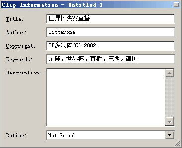
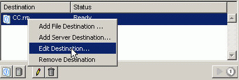

# 用Helix Producer压缩RMVB

发布时间: *2004-06-20 20:42:00*

分类: __软件工具__

简介: Helix Producer 是 RealNetworks 公司的 Helix Producer 压缩工具，用于将 RMVB 文件压缩为 RealVideo 9 格式。本文绍Helix Producer压缩RMVB的基本方法。

---------

现在网上流行的电影动画文件大部分都是RMVB格式的，这是因为该格式有如下诸多优点：

1. 它是现在多种媒体文件中压缩比最高的，即相同画质的影片，RMVB格式的文件可以做到体积最小，对于网上的文件传输和个人的文件保存都是首选。

2. 它支持可变码率（Variable Bitrate），可根据画面内容自动调整码率，动作快的部分给予更多数据，而动作慢的部分适当减少数据量，从而实现更好的画质体积性能比。这也是RMVB文件区别与传统RM文件这所在。

3. 默认双程压缩，程序自动完成变码率的压缩工作。

4. 自动调用 VobSub，在影片上合成字幕无需额外操作。

## 安装方法

官方站点：[www.realnetworks.com](http://www.realnetworks.com/)

注册：Basic 版是免费的；Plus 版需购买

运行系统：建议 Windows 2000，因为Helix Producer压片通常需要较长时间，这期间系统的稳定性至关重要，只有 Windows 2000 能满足要求，可别因为死机让辛苦压缩了半天的文件给毁了。（XP本身占资源太多，而Helix Producer压片时也会占用大量资源，所以不推荐。）

安装需要：最低要求：CPU>400MHz；RAM>96M；至少1GB硬盘空间。（建议硬件配置越高越好！压片相当占内存，而CPU快的压起来才叫爽，否则一部片子压完要半天，你要有足够的耐心。硬盘也是越大越好，好存放压好的片子嘛。）最好已经安装 RealOne Player。虽然不是必须的，但 Helix Producer 可以和 RealOne 集成的功能需要系统中已经有 RealOne 才可使用。而且以后进行RMVB文件也需要RealOne配合。

安装的过程就是一路 next，没什么好说的。下面启动 Helix Producer 看一下具体压缩影片的操作。

## 压缩操作

1、 创建新任务

选择菜单File>New Job或者点击左下角的New Job按钮 。这样就为我们的任务创建了一个最基本的框架。下面就是具体的填充了。需要指出的是：Helix Producer 现在都是以任务（job）的方式来管理压缩任务的。Helix Producer Basic同时只能处理一个任务。而Helix Producer Plus同时可以运行多个任务。不要只记得新建，打开、关闭和保存 任务也是必须知道的。

2、 设置输入对象

这里的对象包括文件（File）和设备（Devices）。我们只用它来压缩影片，所以这里只介绍输入文件。

选择File>Open Input File或者点击Input File后面的浏览（Browse）按钮，或使用快捷键 Ctrl+I，选择要压缩的文件。Helix Producer几乎能压缩所有格式的音频和视频。当然，有时候我们的视频和音频文件可能在支持的播放列表中没有显示，例如：VCD盘上的视频文件就是名字是avseq.dat或者music.dat的那个，没有关系，只要可以确定那是视频和音频就可以。但是它不支持直接压缩 DVD的VOB文件。

3、输出文件的设置

（1）观众设置（Audiences）

点击右面 Output 窗格中间部位的Audiences按钮，弹出Audience设置窗口，如下图所示。

A、编码设置（Encoding Settings）

* 音频模式（Audio mode）这就和压缩的内容有关。如果是新闻、会议之类以谈话为主要内容的，请选择Voice，对于大多数动画来说请用music。

* 视频模式（Video mode）用默认的正常动态视频（Normal Motion Video）好了。

* 视频编码器（Video codec）强烈建议大家用RealVideo 9。因为它的视频质量比RealVideo 8高了30％，比RealVideo G2高了50％；在500kbps下就能获得相当于dvd品质的效果。

* 双程视频编码（2-pass Video encoding）是个不错的东西。现在所做的只是对文件进行压缩，没有直播的任务，所以应该采用双程视频编码。那么什么是双程视频编码呢？双程视频编码首先对整个文件进行分析，找到最合适的压缩方式，然后进行压缩。一程以后又来一程，所以双程视频编码也由此得名。

B、观众选择（Audience Selection）

由于用户机器的连接速度不尽相同，有的可能拨号（56K的老猫），有的可能是ISDN（128K专线），有的可能是1M的ADSL。所以如果只是采用一种编码方式肯定不能满足所有的人。例如：符合了低速用户的要求，高速用户的效果就不行；满足了高速用户的效果，低速用户肯定没有办法看。所以最好是同时有几种编码，而服务器和浏览器根据网络的实际情况来确定到底用什么速度来传输，这就是鼎鼎大名的智能流（Surestream）。也就是众口难调彻底的解决办法！

对于文件压缩只需要一种观众即可，而且通常的DVD转录的片子都需要450 kbps 以上码率的观众。所以把默认的三种都删掉，自己选择左边 Templates 中的 450 VBR Download吧。至于其它的画质与码率选择就需要经验了，有兴趣的可进一步摸索。

（2）视频滤镜（Video Filters）

Helix Producer 提供的滤镜很少，只有截边（Cropping）偶尔需要用一下（当源片有黑边需要截掉时），而且宽和高必须是4的倍数，也不太好用。

其它的滤镜默认选中的 Deinterlace 雪峰也不知具体是做什么用的，反正也没出什么问题。

（3）影片信息（Clip information）

点击“Clip information”，弹出Clip information设置对话框。看看下面的图什么都明白了，不浪费时间了。

4、文件输出的路径

Helix Producer 默认以文件形式输出，保存在输入文件相同的路径下，如果希望修改输出路径，可以在右栏 Destination 窗格中右键点击已经在那里的那个文件，选择 Edit Destination；或按下面的铅笔按钮。选择另存的路径即可。

到了这里，所有的设置都做好了，下面就可以压缩了。选择Controls>encode或者点击  ，或使用快捷键 Ctrl+G，开始压缩。压缩过程中注意查看压缩进程日志，若发现问题，可按 Stop 按钮中断压缩。中断后解决了问题只能重新压缩，Helix Producer 没有继续未完成任务的功能。

---
原文链接: https://www.snowpeak.fun/cn/article/detail/compress_rmvb_with_helix_producer/
