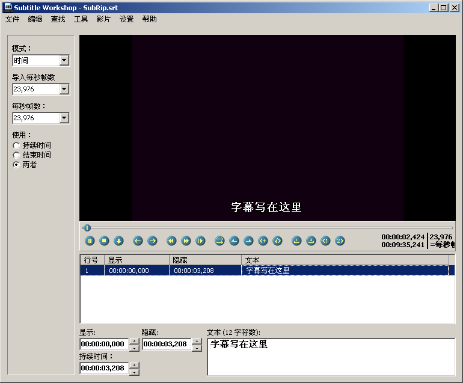
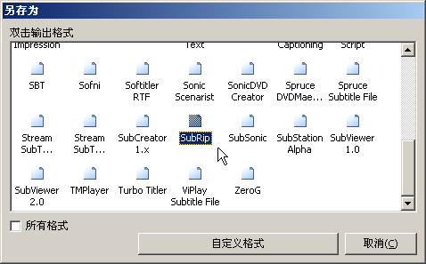

# Subtitle Workshop——雪峰推荐字幕工具

发布时间: *2005-07-24 10:00:00*

简介: 官方站点：www.urusoft.net体积：1 MB注册：免费软件运行系统：Windows 9x, ME, NT, 2000, XP 安装需要：需要播放你要做的影片所需的解码器。 官方站点下载本地下载 这是雪峰提取压缩的程序文件，不用安装直接解压后即可运行，界面已经变成中文。安装完成后第一次运行，可 Settings > Language > Chinese Simpli

原文链接: [https://snowpeak.blog.csdn.net/article/details/433102](https://snowpeak.blog.csdn.net/article/details/433102)

---------

官方站点：[www.urusoft.net](<http://www.urusoft.net>)

体积：1 MB

注册：免费软件

运行系统：Windows 9x, ME, NT, 2000, XP 

安装需要：需要播放你要做的影片所需的解码器。 

[官方站点下载](<http://www.urusoft.net/download.php?lang=1&id=sw>)  
[本地下载](<http://www.snowpeak.org/media/tool/SubtitleWorkshop251.zip>) 这是雪峰提取压缩的程序文件，不用安装直接解压后即可运行，界面已经变成中文。

安装完成后第一次运行，可 Settings > Language > Chinese Simplified，即可变成中文界面。虽然这是西班牙人做的程序，但对多语言支持非常好。而且是雪峰发现的目前唯一一款可同时编辑原文和译文两个字幕文件的字幕工具！当然还是要 Alt + S 设置 一下，基本设置 > 字符编码集，原文字符集和译文字符集都选 GB2312，因为通常我们仅编辑一下字幕文件，那一个文件会被当作原文字幕。当然若需要同时做两个字幕，再在这里重新设置相应字符集。其它都用默认设置就可以开始做了。

Ctrl+N新建一个字幕文件，Ctrl+P打开影片文件。同样是 Ctrl+Space 开始播放， Ctrl+Space 暂停。这里插入字幕用 Insert 键，然后在下面的编辑窗格里写字就行了。然后再Ctrl+Space 开始播放，到需要加字幕的地方 Ctrl+Space 暂停，再用 Insert 键插入新字幕行。以此类推。

SW 的编辑窗格中可以自然地写入多行字，无需特别操作。

在 SW 里可设定字幕开始时间和结束时间，通常 Insert 加入字幕时已经定了开始时间，设置结束时间用快捷键 Alt+V。 

注意这里的时间点是字幕开始显示的时间，比如如果是对白，应该是开始说话的时间。那么如果暂停时已经开始说了，可以用 编辑 > 时间 下面的各项命令操作，快捷键与 SubCreator 有所不同。默认如下：

时间点提前 Ctrl+Shit+H；时间点延后 Ctrl+Shift+N;  
快进 Ctrl+Right，快退 Ctrl+Left，慢进 Alt+Right，慢退 Alt+Left。

SW 快捷键可以用户自定义，虽然是以配置文件形式进行，不太方便普通用户使用。

SW 文件保存成标准字幕格式，保存时会弹出保存格式对话框：

一般选 SubRip，双击它才会出现保存到路径的对话框。因为这个格式最简单，复杂格式可以等整个字幕都完成后再做另存。SW 除支持常见的 54 种字幕格式， 还允许用户自定义工作中使用的文件格式！不过这些高级用法不用也没关系。;)

##### 自定义快捷键范例

找到安装或解压的文件夹下 shortcuts.key 文件，可以用记事本打开它。找到  
SetKey(aPlayPause,Ctrl,Space)  
可以修改成比如 SetKey(aPlayPause,Ctrl+Shift,Space)，就可以使它以快捷键 Ctrl+Shift+Space 控制播放/暂停了。

##### 让 SW 支持 RM/RMVB 文件

现有的带中文字幕的影片文件有的可能是 RM/RMVB 文件，让 SW 支持 RM/RMVB 文件需要做如下工作：

下载并安装 RealOne 解码器，可以在如下网址下载，或搜索常见的下载网站都可以。

<http://www.skycn.com/soft/14852.html>

把需要 SW 打开的 RM/RMVB 文件扩展名改成 avi，这时再 CTRL+P，打开影片就可以了。