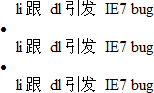
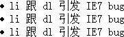

# IE7 列表元素小Bug的CSS处理

发布时间: *2008-04-22 15:20:00*

分类: __前端技术__

简介: 在 IE7 中，遇到HTML代码 LI 元素内紧跟 DL 元素时会出现 bug： OL 和 UL 元素的第一个 LI 项不显示前导的序号。这里分享一种解决方法。

---------

在 IE7 中，遇到HTML代码 LI 元素内紧跟 DL 元素时会出现 bug： OL 和 UL 元素的第一个 LI 项不显示前导的序号。比如：
```html
<ul>
  <li><dl>li 跟 dl 引发 IE7 bug</dl></li>
  <li><dl>li 跟 dl 引发 IE7 bug</dl></li>
  <li><dl>li 跟 dl 引发 IE7 bug</dl></li>
</ul>
```
见如下截图：



对比以下是 Firefox 2.0 中正常的效果：



经过试验发现，只是`<li><dl>`这样才会引发，但只要`<li>`和`<dl>`之间有除了空格以外的其它字符就能正常，比如一些文本，或者其它元素。

但此处我就想要dl紧跟 li，可以用 CSS 来处理一下：
```css
li {
  position:relative;
}
```
这样就可以了。
---
*原文链接: https://www.snowpeak.fun/cn/article/detail/a_css_fix_to_li_in_ie7/*
