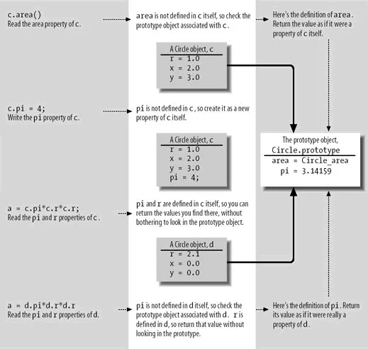

# JavaScript 的类和类生成器工具

发布时间: *2011-04-20 17:56:00*

分类: __前端技术__

简介: 通过实例介绍了 JavaScript 内置的基于原型的类使用方法，并以此为基础循序渐进地讲解如何实现一个类生成器工具函数，以实现基于类的（类似面向对象语言的）类定义写法。

---------

## 概述

### 谁适合看此文档？

本文深入讲解 JavaScript 的类有关知识，并介绍了一些改善 JavaScript 面向对象编程的高级功能。适用于对 JavaScript 比较熟悉的朋友，了解 JavaScript 基本语法，有一定的 JavaScript 开发经验。 

### 此文档有什么用？

此文档介绍的内容适用于较大规模 JavaScript 开发，尤其是大量使用面向对象编程大量使用类的声明和继承等时候。 

### 意义

从定义上说， JavaScript 是一种基于原型 (prototype-based)的面向对象（object-oriented）的脚本语言，它具有面向对象（Object Oriented）语言的全部主要功能，完全可以实现面向对象编程。由于 JavaScript 基于原型的这一特征，使用此语言自身支持的语法进行类的声明和继承，和使用其它主流面向对象语言的写法很不一样。创建一个使用方便的类生成器（Class Creator），以实现类似基于类的 (class-based) 编程语法继承，则会极大的便利面向对象的 JavaScript 编程，不仅可顺应程序员已经熟悉的类的继承思维方式，提高开发效率，还可以减少代码量，提高 JavaScript 程序解析和运行的效率。

当进行大规模 JavaScript 开发时会大量使用面向对象的写法，此时类生成器的作用更为重要，类生成器已经成为 JavaScript 基础类库不可缺少的核心组件，比如 Prototype 库的 [Class.create()](<http://api.prototypejs.org/language/Class/create/>) 和 extJs 的 [Ext.create()](<http://dev.sencha.com/deploy/dev/docs/source/ComponentMgr.html#method-Ext-create>) 和 [Ext.extend()](<http://dev.sencha.com/deploy/dev/docs/source/Ext.html#method-Ext-extend>) 。

## JavaScript 内置的基于原型的类使用方法

### 类的声明

JavaScript 本身就支持类的使用，只是它是基于原型的，它的写法和我们熟悉的那些语言的写法不一样。我们先来看一下 JavaScript 内置的类使用方法。以下实例以及说明来自《JavaScript权威指南》第五版（JavaScript: The Definitive Guide, 5th Edition），它的封面是一只犀牛，熟悉 JavaScript 的朋友根据它的封面把它亲切的称作"犀牛书"。

声明一个类，可以通过以下代码。

```javascript
// 用一个函数作构造器。它的作用就是初始化那些每个实例都不同的属性值。
function Rectangle(w, h) {
    this.width = w;
    this.height = h;
}

// 当我们需要一个各个实例都共有的成员时，我们把此成员放在 prototype 对象里。
Rectangle.prototype.area = function() {
    return this.width * this.height;
}
```

通过如上的代码，我们就声明了一个 Rectangle 类，它的每个实例都会有不同的属性 width 和 height，《权威指南》中也把这样的成员叫实例属性（instance property）或实例方法（instance method）；它们共享一个方法 area()，《权威指南》中也把这样的成员叫类属性（class property）或类方法（class method）。这样的效果可以通过以下代码进行验证。

```javascript
var r = new Rectangle(2, 3);
r.hasOwnProperty("width");  // true: width is a direct property of r
r.hasOwnProperty("area");   // false: area is an inherited property of r
"area" in r;                // true: "area" is a property of r
```

JavaScript 在使用 new 关键字实例化一个对象的原理核心是通过"原型" (prototype)。构造器是一个函数，它提供了这一"类"对象的名字，并且初始化那些每个实例都不同的属性值。构造器函数与一个 prototype 对象关联，使用此构造器函数初始化的每个对象实例都会拥有一套相同的来自此 prototype 的属性和方法。对象实例拥有 prototype 的属性和方法，并非是 prototype 的成员复制给每个实例，而是通过查找成员的过程实现的，即 JavaScript 在遇到调用某对象的成员时，先查找此对象自身的实例属性或实例方法，如果没找到，就继续向上查找此对象的类构造函数的 prototype 中的类属性或类方法。

JavaScript 的这种机制有两个含义。一，使用 prototype 实现成员共享可以大量节省内存。二，由于成员是在运行时查找和调用的，即使在对象实例化后给 prototype 增加成员，对象实例也可使用这新增加的成员（当然并不建议这样做）。

下面图片也来自《权威指南》，形象化的说明了运行时对象成员的查找和使用原理。



### 类的继承

我们再以如下的例子来解释 JavaScript 原生支持的类继承用法。在前面类声明 Rectangle 的基础上，我们来继承出一个它的子类。

```javascript
function PositionedRectangle(x, y, w, h) {
    //首先，在新对象的的构造方法里调用父类的构造方法，用 call 方法来调父类的构造方法目的就是让它作用在当前类实例化的对象上。
    //这种做法叫做constructor chaining，"构造函数链"。其实很多类继承的语言都有这种做法。
    Rectangle.call(this, w, h);
    
    // 现在给当前类增加两个属性。
    this.x = x;
    this.y = y;
}

// 如果使用默认的 prototype 对象，我们只会得到一个默认类 Object 的子类。
// 为了继承 Rectangle 类，我们必须显式创建自己的 prototype 对象，把它指定成 new Rectangle() 就可以得到 Rectangle 的 prototype 对象了。
PositionedRectangle.prototype = new Rectangle();

// 前面的构造函数的 prototype 对象是用 Rectangle() 构造函数创建的，prototype 对象有个 constructor 属性指向构造函数自己，从而每个对象实例都可以通过 constructor 知道哪个函数是自己的构造函数。
// 我们想让当前的子类 PositionedRectangle 的对象实例有自己的构造函数，如下显式指定就可以了。
PositionedRectangle.prototype.constructor = PositionedRectangle;

// 现在我们已经准备好了子类的 prototype 对象，我们可以给它添加新的实例方法了。
PositionedRectangle.prototype.contains = function(x, y) {
    return (x > this.x && x < this.x + this.width && y > this.y && y < this.y + this.height);
}
```

如上声明了这个子类后，咱们就可以使用它了。

```javascript
var pr = new PositionedRectangle(2, 2, 2, 2);
pr.contains(3, 3);                     // 调用自己的实例方法
pr.area();                             // 调用继承自父类的实例方法

// 父类和自己的属性都一样的调用
pr.x + ", " + pr.y + ", " + pr.width + ", " + pr.height;

// 这个对象实例是是下面 3 个类的实例
pr instanceof PositionedRectangle     // true
pr instanceof Rectangle               // true
pr instanceof Object                  // true
```

## 循序渐进做一个类生成器

上述例子说明 JavaScript 完全支持类的声明和继承，只是确实用起来有些麻烦。了解主流 JavaScript 基础类库的朋友可能知道一些类生成器的用法，下面我们就来自己创建一个类生成器。

从本质上说，一个类生成器工具函数就是封装了前面讲到的 JavaScript 自身的类写法。先明确我们的目标，然后一步一步实现出来。

1. 简化类定义写法，不再分别写构造函数和逐个定义 prototype 里的方法，传递进来简洁的 JSON 结构，转化成类定义。作构造方法名，构造方法是可选的。
2. 基本的类继承，一次只能继承一个类
3. 支持 instanceof 方法检测某对象是某类的实例
4. 子类可以调用父类的方法，既可以调用父类不同名的方法，也可以调用父类的同名方法。

### 第零步，先给我们的类生成器工具函数起个函数名

这里再澄清一下，类生成器，它本质是一个工具函数，它接收的参数是一堆类定义相关的东西，返回的是一个用于实例化对象的类的构造函数，根据前面对 JavaScript 类使用的基本知识的介绍，它返回的这个构造函数也有其 prototype 对象及相关的属性和方法，只要 new 一下就能实例化出不同的对象实例。所以类生成器它自己不是一个类的定义，它是一个普通函数，按照常见的类库命名规则，这个函数名字应该全部小写，我们就叫它 classer 吧，意思是"制造 class 的工具"。

### 第一步，先简化类定义写法

传递进来一个 JSON 结构，把它转化成类定义所需的构造函数和 prototype 对象及相关的属性和方法。其实就是把前面 JavaScript 分别声明构造函数和 prototype 方法的写法整理到一起而已。  
我们约定以 __init 作构造方法名，并且构造方法是可选的。

```javascript
// 只有一个参数，是类定义
var classer = function(aDefine) {
    //约定构造函数名字为 __init()
    var constructorName = '__init';
    
    //类型即为该构造函数，若没有 __init()，则使用默认的根类 Object 的构造函数
    var aType = aDefine[constructorName] ? aDefine[constructorName] : Object;
    var aPrototype = aType.prototype;
    
    for (var member in aDefine)  //复制类定义到当前类的prototype
    {
        if(constructorName != member)  //构造函数不用复制
        {
            aPrototype[member] = aDefine[member];
        }
    }
    
    return aType;
};
```

有了这个最基本的类生成器，我们再定义类就可以简单一些了。比如：

```javascript
var Animal = classer({
    __init: function(name) {
        this.name = name;
    },
    
    getName: function() {
        return this.name;
    }
});

// 实例化一个对象，并且测试一下。
var animal = new Animal('animal');
animal instanceof Animal;  // true
animal.getName();          // "animal"
```

### 第二步，实现类的继承

这里采用李战的甘露模型的写法，只有一个参数时是类定义, 有二个参数时，前一个是基类，后一个是当前类的定义。

```javascript
var classer = function() {
    var argLength = arguments.length;
    var aDefine = arguments[argLength-1];  //最后一个参数是类定义
    
    if(aDefine) {
        //解析基类。有基类时用基类，没有基类时用默认的根类 Object
        var aBase = argLength > 1 ? arguments[0] : Object;
        
        //约定构造函数名字为 __init()
        var constructorName = '__init';
        
        //类型即为该构造函数，若没有 __init()，则使用默认的根类的构造函数。
        //经典类继承的写法也是在 Child 的构造函数中调用 Parent.call(this, arguments);
        var aType = aDefine[constructorName] ? aDefine[constructorName] : function() {
            aBase.call(this, arguments);
        };
        
        //经典类继承其实就是 Child.prototype = new Parent(); 但是仅仅 var aPrototype = new aBase(); 是不行的，
        //因为不能直接访问对象内置的 prototype 属性。必须经过一个构造函数链才能传递过去。
        // 详见《悟透》 http://www.cnblogs.com/leadzen/archive/2008/02/25/1073404.html
        function prototype_() {}           //准备传递prototype
        prototype_.prototype = aBase.prototype;  //建立类要用的prototype。新建对象的内置原型将是我们期望的原型对象
        var aPrototype = new prototype_();
        
        //复制类定义到当前类的prototype
        for (var member in aDefine) {
            //构造函数不用复制
            if(constructorName != member) {
                aPrototype[member] = aDefine[member];
            }
        }
        
        //设置类(构造函数)的prototype
        aType.prototype = aPrototype;
        //设置类的 constructor
        aType.prototype.constructor = aType;
        
        return aType;
    }
};
```

经过上述扩展以后，现在我们就可以非常方便的继承类了。在前面 Animal 类的基础上，我们继承出一个子类 Dog。

```javascript
var Dog = classer(Animal, {
    __init: function(name) {
        this.name = name;
    },
    
    bark: function() {
        return 'woof';
    }
});

// 实例化一个对象，并且测试一下。
var dog = new Dog('dog');
dog instanceof Dog       // true
dog instanceof Animal    // true
dog instanceof Object    // true
dog.getName()            // "dog"
dog.bark()               // "woof"
```

### 最后我们来实现子类声明中调用父类成员

在上述拼装 prototype 对象成员的过程中，父类的成员已经拼装成子类 prototype 对象，所以子类的方法声明已经可以直接使用父类的成员，除了子类某方法要调用父类的同名方法。现在我们借鉴 John Resig 的方案来解决这个问题。

```javascript
var classer = function() {
    var argLength = arguments.length;
    var aDefine = arguments[argLength-1];  //最后一个参数是类定义
    
    if(aDefine) {
        //解析基类。有基类时用基类，没有基类时用默认的根类 Object
        var aBase = argLength > 1 ? arguments[0] : Object;
        
        //约定构造函数名字为 __init()
        var constructorName = '__init';
        
        //类型即为该构造函数，若没有 __init()，则使用默认的根类的构造函数。
        //经典类继承的写法也是在 Child 的构造函数中调用 Parent.call(this, arguments);
        //经典类继承其实就是 Child.prototype = new Parent(); 但是仅仅 var aPrototype = new aBase(); 是不行的，
        //因为不能直接访问对象内置的 prototype 属性。必须经过一个构造函数链才能传递过去。
        
        // 增加 _super() 方法, 以实现当前类的方法调用父类的同名方法
        var _super = aBase.prototype;
        
        //构造prototype的临时函数，用于挂接原型链
        function prototype_() {}           //准备传递prototype
        prototype_.prototype = _super;
        
        //建立类要用的prototype 。新建对象的内置原型将是我们期望的原型对象
        var aPrototype = new prototype_();
        
        //复制类定义到当前类的prototype
        for (var member in aDefine) {
            aPrototype[member] = (
                ("function" == typeof aDefine[member]) && 
                ("function" == typeof _super[member])
            ) ? (function(member, fn) {
                return function() {
                    // _super 方法只是临时加进来的, 所以先把原有的 this._super 备份成 tmp, 然后绑定之后再恢复回原来的 this._super = tmp;
                    // 至于绑定的做法, 我现在能理解到的是 var ret = fn.apply(this, arguments); 把 fn 作用于当前对象的 this, 
                    // 最后返回的 return ret; 就是这个函数. 从而实现在类定义的每个方法里都可以调用 this._super(), 方法名是相同的, 但是它们的内容不同!
                    var tmp = this._super;
                    
                    // 把当前这个方法在父类里添加一个 ._super() 方法
                    this._super = _super[member];
                    
                    // 这个方法只是临时绑定的，所以执行完毕后我们再把它删除。
                    var ret = fn.apply(this, arguments);
                    this._super = tmp;
                    
                    return ret;
                };
            })(member, aDefine[member]) : aDefine[member];
        }
        
        // 要实现要构造方法里调用父类的同名构造方法, 就得把构造方法的定义放在复制 prototype 成员后面了.
        // 并且程序语句更自然了: 有自己的构造方法就用自己的, 没有自己的构造方法就用父类的.
        var aType = aDefine[constructorName] ? aPrototype[constructorName] : _super[constructorName];
        
        //设置类(构造函数)的prototype
        aType.prototype = aPrototype;
        //设置类的 constructor
        aType.prototype.constructor = aType;
        
        return aType;
    }
};
```

最后演示一下我们的成果，并测试一下。注意在子类定义中不同方法里都可以使用 `_super()` 方法，而它们指向的是父类的不同的方法！

```javascript
var Person = classer(Animal, {
    __init: function(name, sex) {
        this.sex = sex;
        this._super(name);
    },
    
    getName: function() {
        return 'Person says ' + this._super();
    },
    
    getSex: function() {
        return this.sex;
    }
});

var p = new Person('boy', 'male');
p instanceof Person     // true
p instanceof Animal     // true
p instanceof Object     // true
p.getName()             // "Person says boy"
p.getSex()              // "male"
```

上述的类生成器代码及说明参考了李战的[《悟透JavaScript》之甘露模型](http://www.cnblogs.com/leadzen/archive/2008/06/04/1213090.html)
和 [John Resig 的 Simple JavaScript Inheritance](http://ejohn.org/blog/simple-javascript-inheritance/)。

最终我们的类生成器 classer 函数采用了甘露模型的两个参数的方式，原因是我本人比较偏好这种方式，它的使用习惯也和大家惯用的基于类的声明方式基本一致，并且不论是新声明类还是继承类时都统一调用 classer() 函数，看上去比比 John Resig 的方式比更清楚明白。而 John Resig 的方案给所有它的生成器生成的类的构造函数增加了一个 extend() 方法，这种做法我不太喜欢.