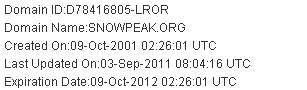

# 雪峰网十周年庆

发布时间: *2011-12-25 17:56:15*

简介: 光阴似箭日月如梭，snowpeak.org 这个域名注册到今年已经有 10 年了。注册整好 10 年的那天没赶上发文纪念，但是到现在也要抒发一下。先上个截图。这是在万网查到的域名注册信息。上面显示的域名注册时间是 2001 年 10 月 9 日。那时各大门户网站也基本上都刚刚起步。那个时代，还有不少免费空间可以用呢。免费空间也曾经是门户网站一项服务。雪峰呢，其实也是从免费空间起

原文链接: [https://snowpeak.blog.csdn.net/article/details/7101366](https://snowpeak.blog.csdn.net/article/details/7101366)

---------

光阴似箭日月如梭，snowpeak.org 这个域名注册到今年已经有 10 年了。注册整好 10 年的那天没赶上发文纪念，但是到现在也要抒发一下。

先上个截图。  

  

这是在万网查到的域名注册信息。上面显示的域名注册时间是 2001 年 10 月 9 日。那时各大门户网站也基本上都刚刚起步。那个时代，还有不少免费空间可以用呢。免费空间也曾经是门户网站一项服务。雪峰呢，其实也是从免费空间起步的，确切地说，最早上线的“雪峰胜境”网站是 2000 年秋冬，具体时间已无从考评，但应该是在 2000 年 10 月底 11 月初的样子。

2001 年正是雪峰毕业开始正式工作的一年。自己的个人网站做了差不多一年以后，开始考虑注册一个正式的域名。由于一直以来网名都是用“雪峰”，自然就想到域名的英文用 snowpeak。2001 年当时注册域名时 snowpeak.com 和 snowpeak.net 都已被注册，这两个域名的注册者是现在仍在使用 snowpeak.com 这个域名的美国户外用户公司 Snow Peak。非常幸运的是 snowpeak.org 域名尚未有人注册，所以雪峰我毫不犹豫地将它注册下来，并且买了虚拟空间，自己默默耕耘，成了日后分享心得和追逐理想的小天地。

过去的这十年间，这个网站只经历过 3 个正式的版本，这 3 个版本还包括今年的这一新版，可以说是“笔耕常辍”。但是，凡事能坚守十年，终归不易。至少我从未放弃。今天大家能看到的这个版本，从外表上看功能其实仍然非常简陋。但是从技术角度来说，可以说是集结了雪峰互联网应用开发的十年经验之大成。虽是小网站，背后可是大架构，前端也使用了相当多的优化方案。具体的技术解读，稍后再发文详细介绍。