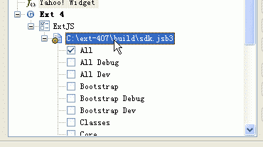
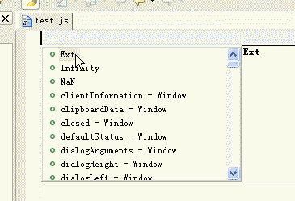

# 在Eclipse中安装Spket并实现ExtJs4.1和jQuery代码提示

发布时间: *2012-07-08 20:31:58*

分类: __Frontend__

简介: 介绍了如何在Eclipse中安装Spket插件，并配置其支持ExtJs4.1和jQuery的代码提示功能。通过详细的操作步骤，帮助开发者提高JavaScript开发效率。

---------

翻译整理自 Spket 官方网站的说明   
<http://www.spket.com/extjs.html>   
<http://www.spket.com/jquery.html>   
  
Spket 是一个支持各种主流 JavaScript 库的非常棒的 Eclipse 的 JavaScript 插件。支持JavaScript, XUL/XBL, Laszlo, SVG and Yahoo! Widget 等的代码提示，这里我们介绍以 Eclipse 的插件运行，并配置其支持 ExtJs4.1和jQuery代码提示。   
  
在 Eclipse 下面安装 Spket，可以到 Spket 官方网站下载 http://www.spket.com 插件包并安装。现在最新版本为1.6.22。   
  
配置 ExtJs4.1 支持   
到 ExtJS 的官方网站下载 Ext JS 4.1   
<http://www.sencha.com/products/extjs/download/>   
解压并注意保留 src 目录。   
在 Eclipse 里 Window -> Preferences -> Spket -> JavaScript Profiles -> New   
输入"ExtJS"单击OK；   
选择"ExtJS" 并点击"Add Library"然后在下拉条中选取"ExtJS"；   
选择 "ExtJS"并点击"Add File"，然后在刚才解压的 build 目录里选择 sdk.jsb3 文件。   
这时此文件下会列出一系列 ExtJS 的组件，把它们都勾选中。   

如下附图所示  
  

最后选中ExtJS，然后点击右边的Default，把此设置为默认。   

现在用 Spket JavaScript Editor 新建一个 JavaScript 文件，按 Alt+/ 可以出现代码提示则说明配置成功了。  
如下图所示  
  

配置 jQuery 支持   
到 jQuery 官方网站 <http://jquery.com/> 下载带注释的完整版源码，如 jquery-1.7.2.js。   
  
在 Eclipse 里 Window -> Preferences -> Spket -> JavaScript Profiles -> New   
输入"jQuery"单击OK；   
选择"jQuery" 并点击"Add Library"然后在下拉条中选取"jQuery"；   
选择 "jQuery"并点击"Add File"，然后在刚才下载的 jquery-1.7.2.js 文件。   
这时此文件下会列出一系列的组件，把它们都勾选中。   
最后选中 jQuery ，然后点击右边的Default，把此设置为默认。   
现在用 Spket JavaScript Editor 新建一个 JavaScript 文件，输入 $('a'). 可以出现代码提示则说明配置成功了。