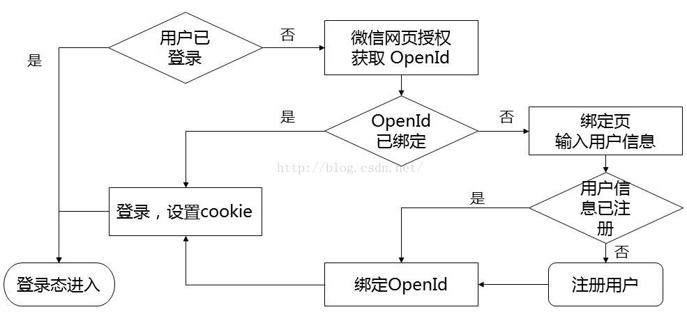

# 微信公众号开发——网页授权实现简化用户绑定

发布时间: *2016-03-13 22:37:47*

分类: __Development__

简介: 本教程介绍了如何通过微信网页授权功能实现用户与系统的简化绑定。通过 OAuth2.0 接口，用户无需反复登录即可实现自动登录，提升用户体验。文章详细讲解了微信用户 OpenID 与系统用户 UserId 的关联流程，以及静默授权模式的实现方法。

原文链接: [https://snowpeak.blog.csdn.net/article/details/50880884](https://snowpeak.blog.csdn.net/article/details/50880884)

---------

本教程的学习条件：

- 了解微信公众号开发的基本知识。已经申请了微信公众号并设置了开发模式等。如果不了解，请先到微信官方平台学习 http://mp.weixin.qq.com/wiki。
- 需要服务器端开发的基本技能，本文主要讲解流程，基本不涉及具体开发语言。

首先我们要明确绑定微信用户和系统用户，其目的是为了用户在一次绑定以后，再次通过微信访问系统时可以由系统自动为其登录，避免用户反复登录操作，使用户操作体验更流畅。  
  
微信绑定用户的核心逻辑其实就是把微信用户的 OpenID 和本系统的用户 UserId 建立关联关系。目前可以获得微信用户的 OpenID 的方法有 2 种：  
1 从用户交互的 xml 中获取：

```xml
<FromUserName><![CDATA[fromUser]]></FromUserName>
```

获取不需要授权页面，但是需要用户主动和公众号互动，常见的方式是使用公众号菜单，设置为回复消息，在用户点击菜单事件推送到服务器接口的 XML 中获取 OpenId ，然后组织一个与 OpenId 相关的链接放到回复内容里，用户点击此链接再跳转到绑定页面。

2 使用网页授权获取用户基本信息  
这是利用微信提供的 OAuth2.0 接口，不需要用户额外点击菜单项和回复消息中的，可以直接从微信公众号里的移动站点任何页面发起。尤其是绑定用户时只需要知道 OpenId，不需要完善的用户信息，还可以使用微信提供的静默授权模式，这时连用户授权的页面都不用出现，获取 OpenId 的过程对用户几乎是透明的，这种流程更流畅。  
  
本文重点介绍第 2 种方式。对应的微信官方文档在 [网页授权获取用户基本信息](<http://mp.weixin.qq.com/wiki/4/9ac2e7b1f1d22e9e57260f6553822520.html>)
  
先看一下整体流程图。  
  
  
  
用户已登录的判断是通过本系统自行判断的。检测出用户未登录时，程序跳转到微信 OAuth 授权页，比如  
  
https://open.weixin.qq.com/connect/oauth2/authorize?appid=wx520c15f417810387&redirect_uri=https%3A%2F%2Fchong.qq.com%2Fphp%2Findex.php%3Fd%3D%26c%3DwxAdapter%26m%3DmobileDeal%26showwxpaytitle%3D1%26vb2ctag%3D4_2030_5_1194_60&response_type=code&scope=snsapi_base&state=123#wechat_redirect  
  
注意我们使用的静默授权方式，scope 参数要取值 snsapi_base。redirect_uri 参数值是要跳回我系统的 URL 地址，这里要进行 URL 编码。  
  
跳转到微信授权页时，不需要用户点击授权，所以不会停，直接跳回到本系统的 URI，并且在其后再加上 code 参数，如上例中的   
https://chong.qq.com/php/index.php?d=&c=wxAdapter&m=mobileDeal&showwxpaytitle=1&vb2ctag=4_2030_5_1194_60&code=xxxx  
  
而这个跳回的页面，就是获取 OpenId 的程序所在。这页程序里使用跳回时得到的 code 参数值，再去调用微信服务器 access_token 接口即可得到 OpenId，即这个接口在返回 access_token 的同时也会返回 OpenId：  
https://api.weixin.qq.com/sns/oauth2/access_token?appid=APPID&secret=SECRET&code=CODE&grant_type=authorization_code  
  
注意这个接口的 URL 前边是 https://api.weixin.qq.com/sns/oauth2，和其它微信接口 https://api.weixin.qq.com/cgi-bin/ 是不同的！  
  
到此我们已经得到了微信用户的 OpenId，此时再输出一个登录表单给用户，让用户填写用户名/密码，或者使用现在更流行的用户登录方式，填写手机号获取短信验证码，POST 提交后，即可查到用户在本系统的 UserId，我们在服务器端记录关联关系，整个绑定过程就完成了。  
  
OpenId 作为微信用户标识字符串，出于完全考虑，原则上不能以明文方式出现在表单里以及在表单中提交上来。OpenId 防伪造防重复等等，网上已有不少研讨。我在实际开发中，发现比较简明的方式是直接使用有效期 5 分钟的 session 存储 OpenId，此 session 使用时立即失效，然后把 session 的 key 作为参数输出给用户端。  
  
最后分享一下我们的公众号二维码，欢迎大家扫码关注并体验。也欢迎提出意见建议，参与技术讨论。

