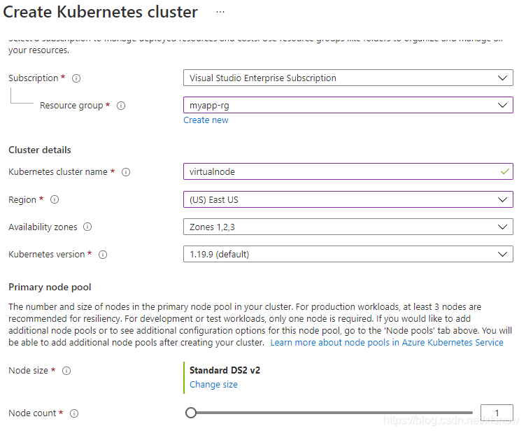
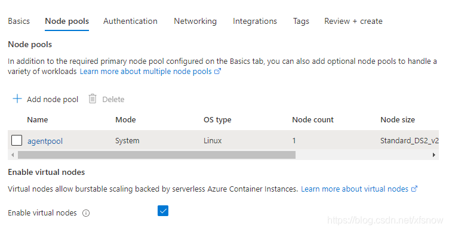
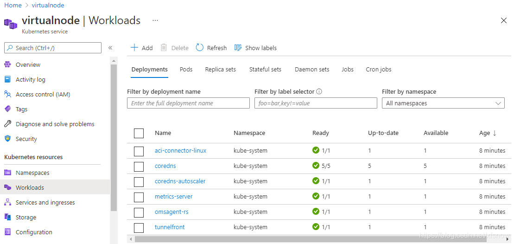
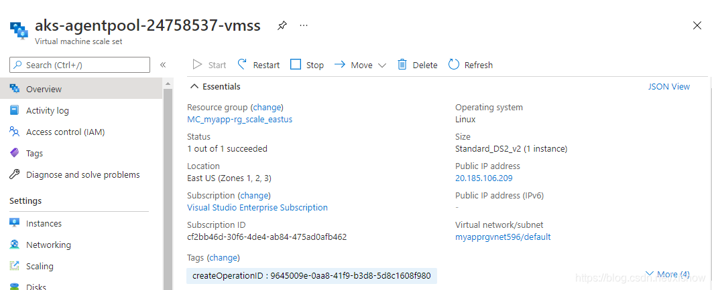
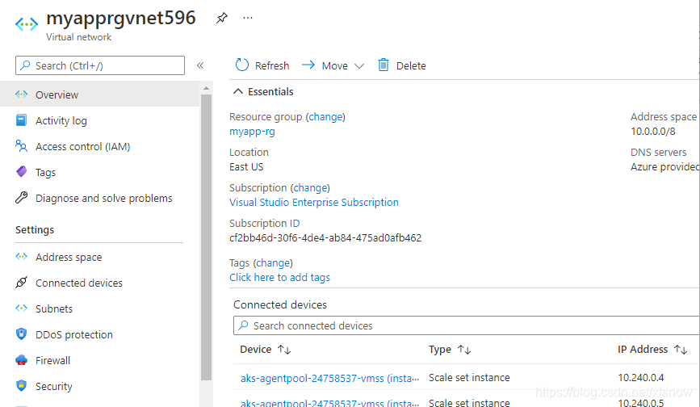
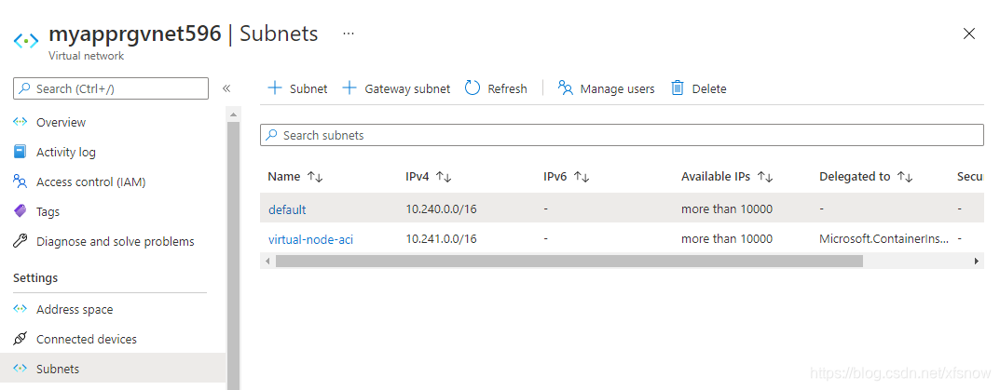
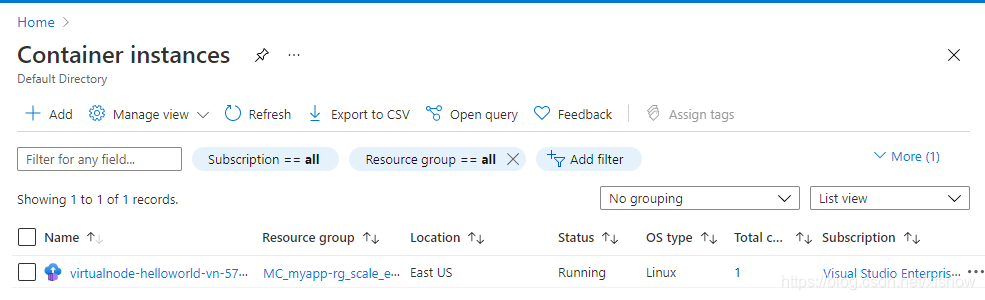

# AKS扩展到虚拟节点

发布时间: *2021-05-26 15:36:48*

分类: __Azure__

简介: Azure Kubernetes 服务 (AKS)是微软云Azure上托管的Kubernetes 群集，可以用于快速部署Kubernetes 群集。基础的AKS集群使用平 Pod 自动缩放程序，在 Kubernetes 群集中使用指标服务器来监视 Pod 的资源需求。如果应用程序需要更多资源，则会自动增加 Pod 数以满足需求。如果工作节点资源也不够了，则再基于虚拟机扩展集（VMSS）进行工作节点自动扩展。当扩展工作节点时，背后需要新启动虚拟机了，这时资源扩展的速度相对比较慢。为此，Azure还推出了虚拟节

原文链接: [https://snowpeak.blog.csdn.net/article/details/117294004](https://snowpeak.blog.csdn.net/article/details/117294004)

---------

Azure Kubernetes 服务 (AKS)是微软云Azure上托管的Kubernetes 群集，可以用于快速部署Kubernetes 群集。基础的AKS集群使用平 Pod 自动缩放程序，在 Kubernetes 群集中使用指标服务器来监视 Pod 的资源需求。如果应用程序需要更多资源，则会自动增加 Pod 数以满足需求。如果工作节点资源也不够了，则再基于虚拟机扩展集（VMSS）进行工作节点自动扩展。当扩展工作节点时，背后需要新启动虚拟机了，这时资源扩展的速度相对比较慢。为此，Azure还推出了虚拟节点的功能，可以基于Azure容器实例快速创建pod，不使用虚拟机，所以不用等待，大大提高了集群扩展的效率。

注意：截止到2020年5月，Azure中国区域仅有东2区发布了容器实例服务，并且尚未支持AKS通过虚拟节点扩展到容器实例。此功能在海外区域多数已经正式发布，具体发布情况请查阅[Azure 容器实例在 Azure 区域的资源可用性](<https://docs.microsoft.com/zh-cn/azure/container-instances/container-instances-region-availability> "Azure 容器实例在 Azure 区域的资源可用性")。做下面实验，需要海外Azure的环境，我们使用的是美东区。

## 基本部署

### 应用

演示用的应用源码在这里。

[/](<https://github.com/xfsnow/azure-multi-region-example/blob/master/VirtualNodeScaling/nginx-vn.yaml> "/")<https://github.com/xfsnow/container/blob/master/VirtualNodeScaling>[/](<https://github.com/xfsnow/azure-multi-region-example/blob/master/VirtualNodeScaling/nginx-vn.yaml> "/")

其中Kubernetes 的 deployment 配置文件nginx-vn.yaml使用经典的 nginx 应用作为演示。除了基本的容器镜像配置以外，这里使用了tolerations和affinity来优化使用VM节点和虚拟节点。


```
tolerations:
  - key: virtual-kubelet.io/provider
value: azure
operator: Equal
effect: NoSchedule
  affinity:
nodeAffinity:
  preferredDuringSchedulingIgnoredDuringExecution:
  - weight: 1
preference:
  matchExpressions:
  - key: type
operator: NotIn
values:
- virtual-kubelet

```

AKS集群中添加的虚拟节点，默认是tainted，所以我们需要明确指定哪些业务需要通过ACI调度到虚拟节点上。配置文件中的tolerations就是允许pod被调度到虚拟节点上，以便在扩展pod时VM节点资源不够的时候可以创建到虚拟节点上去。

nodeAffinity指定的是新建pod时偏好，而运行时忽略。偏好的是节点的labels中，type不带virtual-kubelet值的，即新建pod时优先放置在VM的节点上，而收缩时优先删除在虚拟节点上的pod。

### Azure资源

使用控制台创建一个启用虚拟节点的AKS集群。



区域选择美东，节点数填写1。点击Next: Node pools 按钮。



勾选Enable virtual nodes，这是启用虚拟节点的关键设置。

到Networking页，发现只能选用Azure CNI，不再支持Kubenet了。还需要我们指定Cluster subnet和Virtual nodes subnet，这些都使用默认值就行。

其余配置页都使用默认值，点击Review + Create创建集群。

创建好后，我们先看 Workloads



这里这个aci-connector-linux就是用来连接ACI的pod。

如果刚创建完AKS集群后，这个pod显示不是Ready，请耐心等待一会，可能需要20-30分钟就变成Ready了。

再看VMSS。



可以看到里面有1台VM，正常运行。

点击Virtual network/subnet链接，可以跳转到VM所在的子网。



在这里左边导航链接点击 Subnets，可以看到AKS平台帮我们自动创建了2个子网。



其中 default 是VM节点所在的子网，而另一个virtual-node-aci 是为将来扩展虚拟节点所用的子网。

### 部署Kubernetes

先连接Kubernetes集群


然后看一下现有的节点。


```
kubectl get node
NAME                                STATUS   ROLES   AGE     VERSION
aks-agentpool-34658330-vmss000000   Ready    agent   10m     v1.19.9
virtual-node-aci-linux              Ready    agent   9m35s   v1.18.4-vk-azure-aci-v1.3.5
```

可以看到aks-agentpool-34658330-vmss000000是一个普通的基于虚拟机的节点，还有一个virtual-node-aci-linux就是虚拟节点。

我们创建一个命名空间，后面的实验都在这个命名空间里进行。


```
kubectl create namespace virtualnode
namespace/virtualnode created
```

先来做一个是基础的，把pod部署到虚拟节点上。


```
kubectl apply -f helloworld-vn.yaml
deployment.apps/helloworld-vn created
```

看一下pod


```
kubectl get pods -o wide -n virtualnode
NAME                             READY   STATUS     RESTARTS   AGE   IP       NODE                     NOMINATED NODE   READINESS GATES
helloworld-vn-5749f58859-67vn6   0/1     Creating   0          21s   <none>   virtual-node-aci-linux   <none>           <none>
```

可以看到正在虚拟节点上部署。

再看详情：


```
kubectl describe pod helloworld-vn-5749f58859-67vn6 -n  virtualnode
Name:         helloworld-vn-5749f58859-67vn6
Namespace:    virtualnode
Priority:     0
Node:         virtual-node-aci-linux/
Start Time:   Tue, 11 May 2021 11:28:36 +0800
Labels:       app=helloworld-vn
  pod-template-hash=5749f58859
Annotations:  <none>
Status:       Running
IP:           10.241.0.4
IPs:
  IP:           10.241.0.4
Controlled By:  ReplicaSet/helloworld-vn-5749f58859
Containers:
  helloworld-vn:
Container ID:   aci://6ee343c40cb742b912ce86084cb73c5d0f9997dd55fa0b44290bb0c9b04370a4
Image:          mcr.microsoft.com/azuredocs/aci-helloworld
Image ID:
Port:           80/TCP
Host Port:      0/TCP
State:          Running
  Started:      Tue, 11 May 2021 11:28:36 +0800
Ready:          True
Restart Count:  0
Environment:    <none>
Mounts:
  /var/run/secrets/kubernetes.io/serviceaccount from default-token-rzbnb (ro)
Conditions:
  Type           Status
  Ready          True
  Initialized    True
  PodScheduled   True
Volumes:
  default-token-rzbnb:
Type:        Secret (a volume populated by a Secret)
SecretName:  default-token-rzbnb
Optional:    false
QoS Class:       BestEffort
Node-Selectors:  beta.kubernetes.io/os=linux
 kubernetes.io/role=agent
 type=virtual-kubelet
Tolerations:     node.kubernetes.io/not-ready:NoExecute op=Exists for 300s
 node.kubernetes.io/unreachable:NoExecute op=Exists for 300s
 virtual-kubelet.io/provider op=Exists
Events:
  Type    Reason                 Age   From                                   Message
  ----    ------                 ----  ----                                   -------
  Normal  Scheduled              82s                                          Successfully assigned virtualnode/helloworld-vn-5749f58859-67vn6 to virtual-n
ode-aci-linux
  Normal  ProviderCreateSuccess  81s   virtual-node-aci-linux/pod-controller  Create pod in provider successfully
```

首次部署虚拟节点使用了82秒，感觉稍微有点慢，这里时间主要用在2方面，一是初次创建ACI实例，更多的时间是用在拉取 mcr.microsoft.com/azuredocs/aci-helloworld 这个镜像文件和部署。

点击查看容器实例



可以看到有1个容器实例了。

最后我们把这个deployment删除，清理资源。


```
kubectl delete -f helloworld-vn.yaml        
deployment.apps "helloworld-vn" deleted
```

伸缩测试

基于VM的节点和虚拟节点的混合伸缩。


```
kubectl apply -f nginx-vn.yaml
deployment.apps/nginx-vn created
```

只部署1个pod时，优先部署在了虚拟机的节点上。


```
kubectl get pod -o wide --namespace virtualnode
NAME                        READY   STATUS    RESTARTS   AGE   IP            NODE                                NOMINATED NODE   READINESS GATES
nginx-vn-54d69f7df4-hxkkz   1/1     Running   0          23s   10.240.0.75   aks-agentpool-34658330-vmss000000   <none>           <none>
```

先扩展到20个副本。


```
kubectl scale deployment nginx-vn --replicas=20 -n virtualnode
deployment.apps/nginx-vn scaled
```

查看pod。


```
kubectl get pod -o wide --namespace virtualnode
NAME                        READY   STATUS    RESTARTS   AGE     IP             NODE                                NOMINATED NODE   READINESS GATES
nginx-vn-54d69f7df4-4fr5g   1/1     Running   0          3m2s    10.241.0.19    virtual-node-aci-linux              <none>           <none>
nginx-vn-54d69f7df4-cg4jb   1/1     Running   0          3m2s    10.241.0.5     virtual-node-aci-linux              <none>           <none>
nginx-vn-54d69f7df4-cmj6d   1/1     Running   0          3m2s    10.241.0.7     virtual-node-aci-linux              <none>           <none>
nginx-vn-54d69f7df4-dljkw   1/1     Running   0          3m2s    10.241.0.16    virtual-node-aci-linux              <none>           <none>
nginx-vn-54d69f7df4-f25fb   1/1     Running   0          3m2s    10.241.0.8     virtual-node-aci-linux              <none>           <none>
nginx-vn-54d69f7df4-g6ps9   1/1     Running   0          3m2s    10.241.0.15    virtual-node-aci-linux              <none>           <none>
nginx-vn-54d69f7df4-h2dtq   1/1     Running   0          3m2s    10.240.0.82    aks-agentpool-34658330-vmss000000   <none>           <none>
nginx-vn-54d69f7df4-hgkzc   1/1     Running   0          3m2s    10.241.0.14    virtual-node-aci-linux              <none>           <none>
nginx-vn-54d69f7df4-hxkkz   1/1     Running   0          7m53s   10.240.0.75    aks-agentpool-34658330-vmss000000   <none>           <none>
nginx-vn-54d69f7df4-jf4h7   1/1     Running   0          3m2s    10.241.0.20    virtual-node-aci-linux              <none>           <none>
nginx-vn-54d69f7df4-mtjbn   1/1     Running   0          3m2s    10.241.0.9     virtual-node-aci-linux              <none>           <none>
nginx-vn-54d69f7df4-q9d5f   1/1     Running   0          3m2s    10.241.0.13    virtual-node-aci-linux              <none>           <none>
nginx-vn-54d69f7df4-qlf4l   1/1     Running   0          3m2s    10.241.0.18    virtual-node-aci-linux              <none>           <none>
nginx-vn-54d69f7df4-sb54f   1/1     Running   0          6m27s   10.241.0.4     virtual-node-aci-linux              <none>           <none>
nginx-vn-54d69f7df4-t4zmf   1/1     Running   0          3m2s    10.241.0.12    virtual-node-aci-linux              <none>           <none>
nginx-vn-54d69f7df4-xj95k   1/1     Running   0          3m2s    10.241.0.10    virtual-node-aci-linux              <none>           <none>
nginx-vn-54d69f7df4-xltlt   1/1     Running   0          3m2s    10.241.0.17    virtual-node-aci-linux              <none>           <none>
nginx-vn-54d69f7df4-xnhtc   1/1     Running   0          3m2s    10.240.0.109   aks-agentpool-34658330-vmss000000   <none>           <none>
nginx-vn-54d69f7df4-zbzt5   1/1     Running   0          3m2s    10.241.0.6     virtual-node-aci-linux              <none>           <none>
nginx-vn-54d69f7df4-zphhk   1/1     Running   0          3m2s    10.241.0.11    virtual-node-aci-linux              <none>           <none>
```

再收缩回2个副本。


```
kubectl scale deployment nginx-vn --replicas=2 -n virtualnode
deployment.apps/nginx-vn scaled
```

可以看到收缩后，只留下虚拟机节点上的 pod了。


```
kubectl get pod -o wide --namespace virtualnode
NAME                        READY   STATUS    RESTARTS   AGE     IP            NODE                                NOMINATED NODE   READINESS GATES
nginx-vn-54d69f7df4-h2dtq   1/1     Running   0          5m18s   10.240.0.82   aks-agentpool-34658330-vmss000000   <none>           <none>
nginx-vn-54d69f7df4-hxkkz   1/1     Running   0          10m     10.240.0.75   aks-agentpool-34658330-vmss000000   <none>           <none>
```

### 总结

通过ACI扩展到虚拟节点，确实比基于VMSS先扩虚机再扩pod 要快不少。但是扩展出的虚拟节点数量也是有限制的，做不到在短时间内无限的扩展出来。建议做法是，以AKS的自动扩展为基础，结合虚拟节点的快速扩展来支持突增的场景，用虚拟节点来先顶住突增的需求，给AKS扩展争取到时间，2种同时扩展，等VMSS扩起来以后，就可以把虚拟节点替换下了。而且 VMSS 的扩展，理论上可以提供更大规模的资源，能够提供比仅用虚拟节点更多的资源。这样做就兼顾了性能的成本。