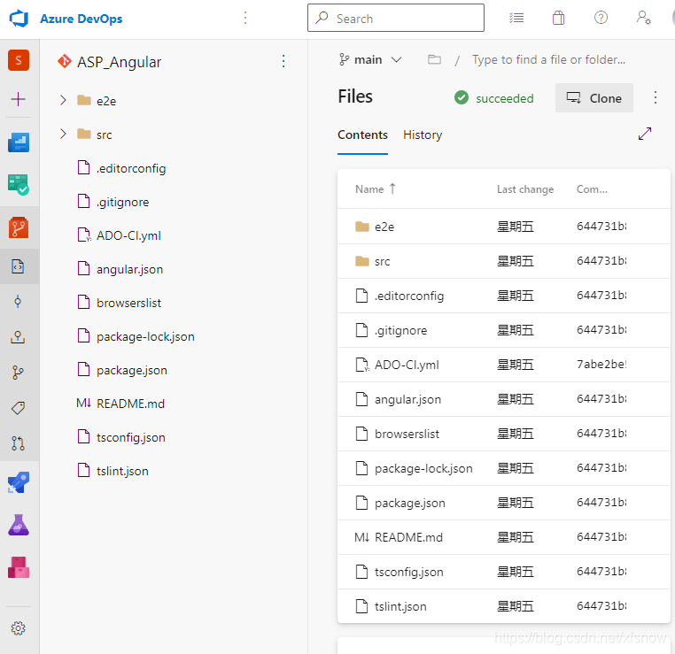
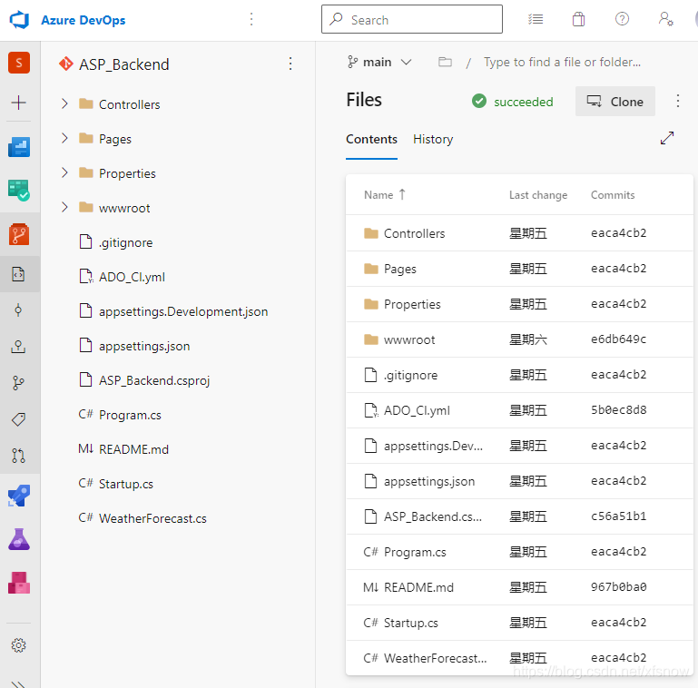
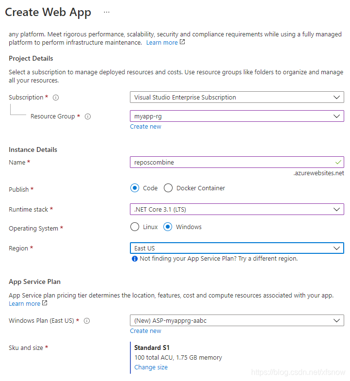
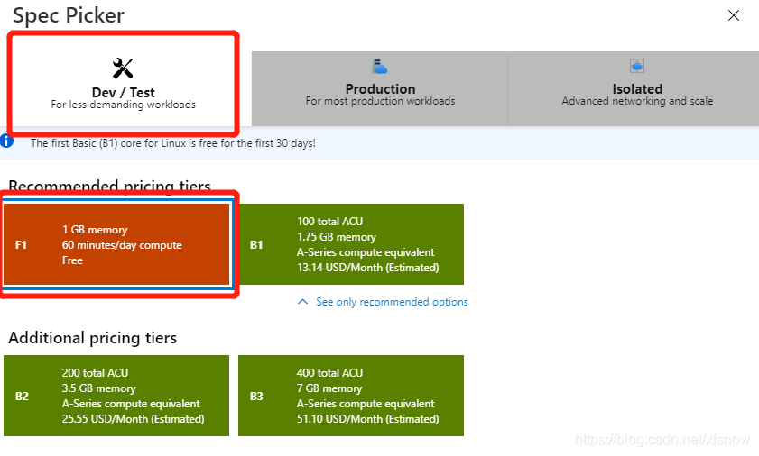

# Azure DevOps流水线合并多个源码库（一）

发布时间: *2021-06-09 15:38:06*

简介: Azure DevOps作为微软云上DevOps端到端的工具链，提供了开发日常常用的主要功能模块，尤其是Repos源码库结合 Pipelines 流水线实现自动化的CI和CD，这是最常用到的功能。随着当前Web应用逐渐发展，前后端分离的架构已经成为主流。日常开发时前端源码和后端源码通常由2个团队负责开发，保存在2个源码库中，而自动化集成和部署时则经常需要统一部署到一个资源环境下。为了实现这个常见的应用场景，今天带着大家一起编写和配置Azure Pipelines的流水线，熟悉一下YAML文件的基本用法，以及

原文链接: [https://snowpeak.blog.csdn.net/article/details/117744549](https://snowpeak.blog.csdn.net/article/details/117744549)

---------

Azure DevOps作为微软云上DevOps端到端的工具链，提供了开发日常常用的主要功能模块，尤其是Repos源码库结合 Pipelines 流水线实现自动化的CI和CD，这是最常用到的功能。随着当前Web应用逐渐发展，前后端分离的架构已经成为主流。日常开发时前端源码和后端源码通常由2个团队负责开发，保存在2个源码库中，而自动化集成和部署时则经常需要统一部署到一个资源环境下。为了实现这个常见的应用场景，今天带着大家一起编写和配置Azure Pipelines的流水线，熟悉一下YAML文件的基本用法，以及集成流水线和发布流水线的对接。

## 基础部署

我们这个演示的总体步骤是：

  1. 把ASP.Net的后端项目构建成可发布的发布包
  2. 把前端的代码构建成可发布的Angular项目
  3. 把前后端的发布内容整合打包部署到Azure App Service上。

下面我们先把源头源码库和最终部署目标App Service准备好。

### 准备源码库

演示用的应用源码在这里：

<https://github.com/xfsnow/container/blob/master/ReposCombine/ASP_Angular.zip>  
<https://github.com/xfsnow/container/blob/master/ReposCombine/ASP_Backend.zip>

请下载这2个压缩包，解压，然后分别以这2个目录创建2个Azure DevOps Repos，并把源码推送到相应的Repos中。具体操作请参考文档[《在项目中创建新的 Git 存储库》](<https://docs.microsoft.com/zh-cn/azure/devops/repos/git/create-new-repo>),这里不再赘述。完成后的2个源码库如下图所示。

这是用于前端的源码库，如名称所示，这是个使用Angular.js 的纯前端项目。

这是用于后端的源码库，这是个使用ASP.Net的后端项目。

### 创建App Service

我们使用控制台快速创建一个Web App实例。

主要配置项是Publish 选Code，Runtime stack选 .Net Core 3.1，Operation System选 Windows。

注意 Sku and size 点击 Change size

在弹出的浮层点击最左边的Dev/Test，然后点选 1GB memory 这一款，这是免费的型号，方便咱们做实验不收费。点击底部Review + create 按钮，再点Create 按钮即可完成。创建过程需要几分钟，等待的时间我们继续下面的工作。