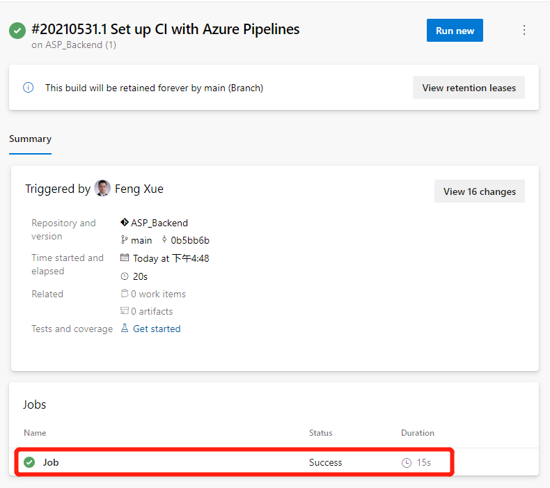

# Azure DevOps流水线合并多个源码库（二）

发布时间: *2021-06-10 10:00:00*

分类: __Azure__

简介: 上一节我们已经创建了源码库，以及 Azure App Service 实例。今天我们继续来配置Azure DevOps的流水线，完成后端的构建和制品保存。


--------------

## 配置CI流水线

源和目标准备好了，我们先来配置持续集成的流水线。

### 创建流水线，先构建后端项目

在Azure DevOps 控制台点击左侧导航链接Pipelines 下的
Pipelines，右上角点击 New pipeline 按钮。

跟着向导走，Where is your code 选 Azure Repos Git。

Select a repository 选前面准备好的ASP_Backend 库。

Configure your pipeline，点击 Show more按钮，然后点选 ASP.Net
Core。点击右上角的Save and run 按钮。弹出的浮层都用默认值，点右下角 Save
and run
按钮先执行一下。然后会跳到流水线执行界面。稍等一会，我们会看到执行完成，Job前面有个绿色对勾图标，说明这第一步ASP.Net构建成功了。



集成流水线创建成功，也完成了第一个任务。不过到现在为止，什么制品都没有生成和保存。没关系，咱们就是一步一步来详细讲解，带领大家从零开始创建一个流水线。下一步，我们来保存构建生成的制品。

### 保存构建制品

我们回到刚刚创建的Pipeline，点击右上角的Edit按钮，可以看到这其实是一个YAML文件。


其中steps下面就是这个流水线要执行的具体步骤，可以看到现在只有一个步骤，就是使用
dotnet build把当前的后端项目构建一下。下面我们再添加2个步骤。

```yaml
- task: DotNetCoreCLI@2
  displayName: 'dotnet publish'
  inputs:
    command: publish
    publishWebProjects: false
    projects: '**/*.csproj'
    arguments: '--configuration $(BuildConfiguration) --output $(build.artifactstagingdirectory)'
    zipAfterPublish: true

- task: PublishBuildArtifacts@1
  inputs:
PathtoPublish: '$(Build.ArtifactStagingDirectory)/'
```

新增的2个步骤，前一个是把构建好的制品发布到指定路径，后一个是把发布的制品保存下来。

点击右上角的Save按钮，然后再点击 Run
按钮，耐心等待一会我们更新后的Pipeline执行完毕。这时再回来看任务执行的结果页，会发现多了一个
1 Published。


点击这个1 Published链接，会前进到如下的制品页面。


s.zip 这个制品文件点击可下载，下载之后打开这个压缩包文件，可以看到里面就是dotnet build构建好的文件。

```bash
unzip -l s.zip
Archive:  s.zip
  Length     Date   Time    Name
 --------    ----   ----    ----
   138528  06-02-21 09:50   ASP_Backend
    10240  06-02-21 09:50   ASP_Backend.Views.dll
    19136  06-02-21 09:50   ASP_Backend.Views.pdb
   106734  06-02-21 09:50   ASP_Backend.deps.json
    11264  06-02-21 09:50   ASP_Backend.dll
    20392  06-02-21 09:50   ASP_Backend.pdb
      292  06-02-21 09:50   ASP_Backend.runtimeconfig.json
    62328  04-23-21 18:32   Microsoft.AspNetCore.SpaServices.Extensions.dll
      162  06-02-21 09:50   appsettings.Development.json
      196  06-02-21 09:50   appsettings.json
      487  06-02-21 09:50   web.config
        0  06-02-21 09:50   wwwroot/
     5430  06-02-21 09:50   wwwroot/favicon.ico
 --------                   -------
   375189                   13 files
```

到此，后端构建和制品保存已经完成。下面我们再来看一下前端的构建。在构建前端之前，需要先在当前流水线引入2个源码库。