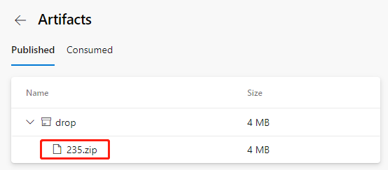

# Azure DevOps流水线合并多个源码库（四）
发布时间: *2021-06-12 10:00:00*

分类: __Azure__

简介: 上一节我们介绍如何在流水线中引入第2个源码库，完成前端的构建和制品保存。这一节我们把前端和后端的代码合并，构建出最终的制品包。

--------------

## 构建前端项目

回到YAML文件编辑界面，在
```yaml
steps:
- checkout: Angular
  displayName: 'checkout Angular'
```
步骤下面加上如下2个任务。
```yaml
- task: Npm@1
  displayName: 'npm install'
  inputs:
    command: install
    workingDir: '$(Agent.BuildDirectory)/s/ASP_Angular/'
- task: Npm@1
  displayName: 'Build Angular'
  inputs:
    command: custom
    customCommand: run build
    workingDir: '$(Agent.BuildDirectory)/s/ASP_Angular/'
```

新增的前1个任务，是按前端项目的依赖关系，把依赖库安装上。后1个任务就是构建出前端可发布的文件。

注意这2个任务都有`workingDir: '$(Agent.BuildDirectory)/s/ASP_Angular/'`
这个声明，`$(Agent.BuildDirectory)`是个环境变量，在当前任务的环境下指的就是 `/home/vsts/work/1`，所以前面日志中显示的代码签出路径`/home/vsts/work/1/s/ASP_Angular`可以用环境变量来表示就是`$(Agent.BuildDirectory)/s/ASP_Angular/`。

保存并运行。耐心等待一会，任务运行完成后，我们点进任务日志，可以看到如下的日志。


表示前端的构建已经成功完成。

## 前端后端代码合并最终发布制品

最后我们把前端构建好的文件复制到后端构建好的目录下，就可以准备好用于发布的制品包了。

回到YAML文件编辑界面，先找到
```yaml
- task: DotNetCoreCLI@2
  displayName: 'dotnet publish'
  inputs:
    command: publish
    publishWebProjects: false
    projects: '**/*.csproj'
    arguments: '--configuration $(BuildConfiguration) --output $(build.artifactstagingdirectory)'
    zipAfterPublish: true
```
这段，把最后的 `zipAfterPublish: true` 改成 `zipAfterPublish: false`，意思是我们在这步先不压缩了，保持原来的目录和文件。然后在这个任务后面添加一个任务。
```yaml
- task: CopyFiles@2
  displayName: 'copy frontend files'
  inputs:
    SourceFolder: '$(Agent.BuildDirectory)/s/ASP_Angular/dist'
    Contents: '**'
    TargetFolder: '$(Build.ArtifactStagingDirectory)/ASP_Backend/wwwroot'
```
这是把前端构建好的文件拷贝到后端构建好的指定目录中。

`SourceFolder: '$(Agent.BuildDirectory)/s/ASP_Angular/dist'` 表示源路径设置为`$(Agent.BuildDirectory)/s/ASP_Angular/dist`，因为默认情况下Angular构建生成的文件放在项目的/dist目录下。

`TargetFolder: '$(Build.ArtifactStagingDirectory)/ASP_Backend/wwwroot'` 表示目标路径是后端构建好的目录下的 wwwroot，这是ASP.Net 项目的惯例，wwwroot下的静态文件会原样输出。

然后再添加一个任务。
```yaml
- task: ArchiveFiles@2
  inputs:
    rootFolderOrFile: '$(Build.ArtifactStagingDirectory)/ASP_Backend/'
    includeRootFolder: false
    archiveType: 'zip'
    archiveFile: '$(Build.ArtifactStagingDirectory)/$(Build.BuildId).zip'
    replaceExistingArchive: true
    verbose: true
```

把前面都整理好的目录和文件统一打包压缩包。

`archiveFile: '$(Build.ArtifactStagingDirectory)/$(Build.BuildId).zip'`
这行声明打包文件存放的路径，`$(Build.BuildId)`是个环境变量，是构建的序列号，通常用来给每次构建的打包文件生成不同的名字。

最后发布制品的任务也从原来的
```yaml
    PathtoPublish: '$(Build.ArtifactStagingDirectory)/ '
```
改成
```yaml
    PathtoPublish: '$(Build.ArtifactStagingDirectory)/$(Build.BuildId).zip'
```

咱们只要保存这一个最终的压缩包即可，其它过程中的文件不用发布。

保存之后运行。运行成功后，这次我们可以看到生成的制品文件名变成了这样的。



因为包含前端和后端所有构建好的文件，所以体积也增大到了4MB。

我们下载这个文件，可以在自己电脑解压看一下。

```bash
unzip -l 235.zip
Archive:  235.zip
  Length     Date   Time    Name
 --------    ----   ----    ----
   138528  06-03-21 08:12   ASP_Backend
    10240  06-03-21 08:12   ASP_Backend.Views.dll
    19216  06-03-21 08:12   ASP_Backend.Views.pdb
   106734  06-03-21 08:12   ASP_Backend.deps.json
    11264  06-03-21 08:12   ASP_Backend.dll
    20472  06-03-21 08:12   ASP_Backend.pdb
      292  06-03-21 08:12   ASP_Backend.runtimeconfig.json
    62328  04-23-21 18:32   Microsoft.AspNetCore.SpaServices.Extensions.dll
      162  06-03-21 08:11   appsettings.Development.json
      196  06-03-21 08:11   appsettings.json
      487  06-03-21 08:12   web.config
        0  06-03-21 08:12   wwwroot/
  2530889  06-03-21 08:12   wwwroot/vendor-es5.js.map
     6303  06-03-21 08:12   wwwroot/runtime-es5.js
     6289  06-03-21 08:12   wwwroot/runtime-es2015.js.map
    14659  06-03-21 08:12   wwwroot/main-es2015.js.map
     5430  06-03-21 08:11   wwwroot/favicon.ico
   387821  06-03-21 08:12   wwwroot/polyfills-es5.js.map
     6286  06-03-21 08:12   wwwroot/runtime-es5.js.map
   816259  06-03-21 08:12   wwwroot/polyfills-es5.js
   289746  06-03-21 08:12   wwwroot/polyfills-es2015.js
     6306  06-03-21 08:12   wwwroot/runtime-es2015.js
    16417  06-03-21 08:12   wwwroot/main-es5.js.map
   147637  06-03-21 08:12   wwwroot/styles.css
      819  06-03-21 08:12   wwwroot/index.html
  5198180  06-03-21 08:12   wwwroot/vendor-es5.js
    28439  06-03-21 08:12   wwwroot/main-es2015.js
  4315318  06-03-21 08:12   wwwroot/vendor-es2015.js
   776588  06-03-21 08:12   wwwroot/styles.css.map
   256877  06-03-21 08:12   wwwroot/polyfills-es2015.js.map
  5079925  06-03-21 08:12   wwwroot/vendor-es2015.js.map
    32199  06-03-21 08:12   wwwroot/main-es5.js
 --------                   -------
 20292306                   32 files
```

确实包含了前后端所有文件，并且按准备部署的目录格式整理好了。

如果集成流水线的YAML文件编辑还有问题，可以参考后端源码包ASP_Backend.zip中的ASP_Combine.yml这个文件。