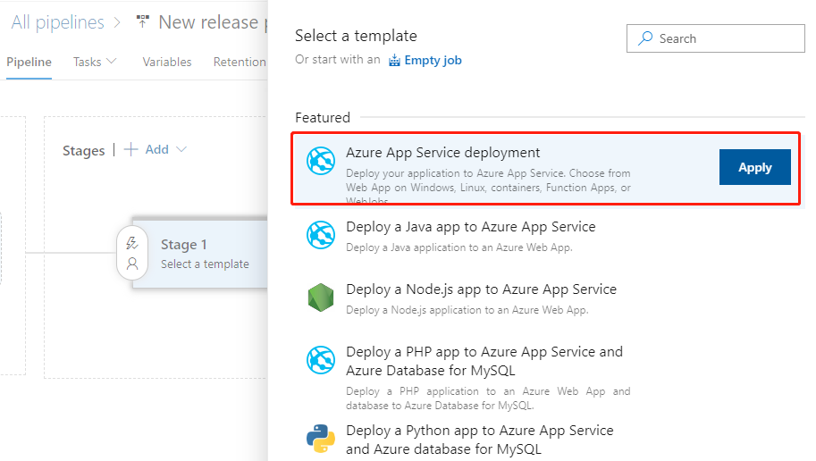
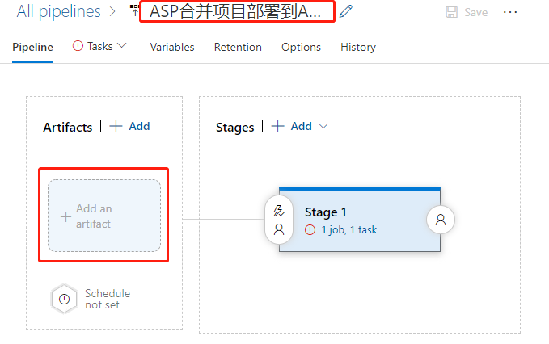
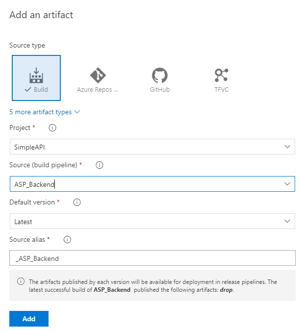
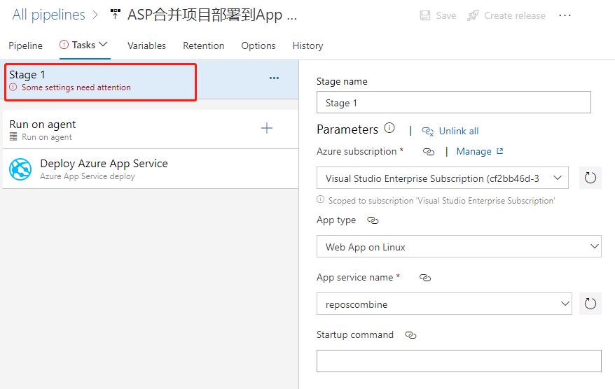
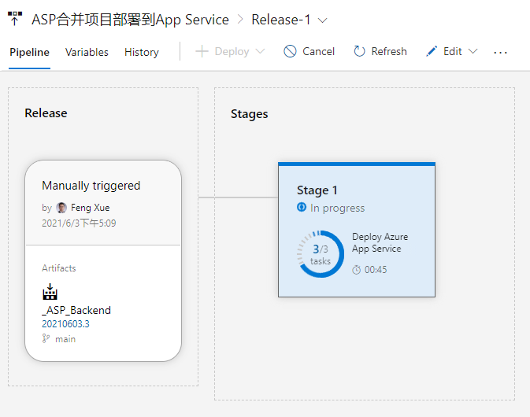
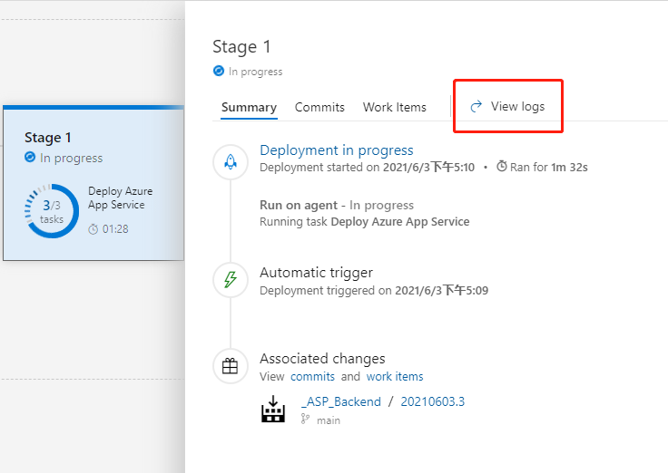

# Azure DevOps流水线合并多个源码库（五）
发布时间: *2021-06-13 10:00:00*

分类: __Azure__

简介: 上一节我们把前端和后端的代码合并，构建出最终的制品包，这一节我们将配置部署流水线，最终把制品包部署到Azure App Service上。

--------------

## 配置部署流水线

前面我们通过持续集成的流水线把用于部署的制品包都准备好了，最后我们把它部署到Azure
App Service去吧。

### 创建Release流水线

左侧导航链接Pipelines 下点击 Releases，在中间New按钮处点击New release pipeline创建一个新的发布流水线。直接打开到选择模板页面。

咱们就选择第1个Azure App Service deployment，点击Apply按钮。

然后弹出的Stage浮层

点击右上角叉号先把它关闭。先点击流水线名称，编辑一个有意义的名字。

然后点击左下 Add an artifact 大按钮。添加一个制品。

先在Source选中我们之前准备好的 ASP_Backend 那个流水线，然后程序会自动刷新出浮层下半部分的内容，这里都使用默认值即可，点最下面的Add按钮完成添加。

再点右边的 1 job, 1 task 链接，打开部署目标的配置浮层。先把Stage 1整个阶段的配置补全。

主要就是按提示依次选择Azure订阅，App 的类型，再选到我们前面创建出的那个实例即可。

然后会发现Deploy Azure App Service 那个任务使用默认值就已经可以了。

Package or folder 这里右下角的3点按钮，其实可以弹出浮层选择具体的制品包文件，但是建议不要选择具体文件名，而是使用默认的通配符，这样最灵活。

点击右上角Save按钮保存一下，然后再点旁边的Create release按钮，弹出浮层

可以看到这里显示的就是CI流水线最新版本的制品，建议在Release description写一些和此次部署相关的描述，以方便日后追溯。点击底部Create按钮创建即可。

创建完成立即运行，这里还有一个动画展示的界面。

点击Stage 1 再点右上的 View logs，可以实时看到如下的部署过程中的详细日志。

等部署任务执行完毕，我们回到App Service的控制台，在Overview中找到URL。

用浏览器打开这个URL，就可以看到我们部署成功的网站了。