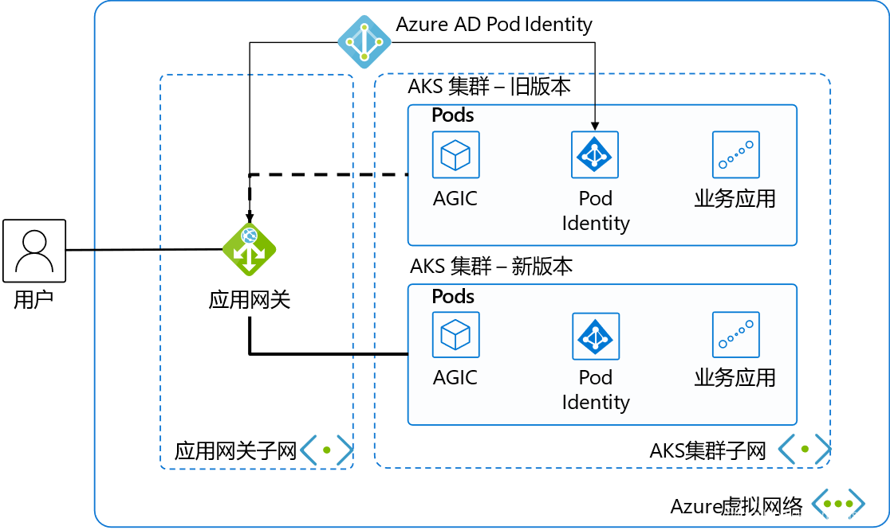

# AKS集群蓝绿部署实现版本升级（上篇）

发布时间: *2022-03-01 16:47:49*

简介: Azure Kubernetes 服务 (AKS)是微软云Azure上托管的Kubernetes 群集，可以用于快速部署Kubernetes 群集，结合Azure其它服务和功能，简化日常运维，轻松实现业务应用的弹性。当前Kubernetes 社区蓬勃发展，版本升级比较频繁。AKS托管的版本升级功能，可以一键式地把AKS集群 原地升级，对集群内的工作节点逐个滚动升级，对于小规模或非关键业务集群来说，使用AKS的托管升级功能非常方便。对于大规模的集群，或者关键业务应用来说，前述一键式原地升级的方法，存在升级整体

原文链接: [https://snowpeak.blog.csdn.net/article/details/118493083](https://snowpeak.blog.csdn.net/article/details/118493083)

---------

Azure Kubernetes 服务 (AKS)是微软云Azure上托管的Kubernetes 群集，可以用于快速部署Kubernetes 群集，结合Azure其它服务和功能，简化日常运维，轻松实现业务应用的弹性。当前Kubernetes 社区蓬勃发展，版本升级比较频繁。AKS托管的版本升级功能，可以一键式地把AKS集群 原地升级，对集群内的工作节点逐个滚动升级，对于小规模或非关键业务集群来说，使用AKS的托管升级功能非常方便。对于大规模的集群，或者关键业务应用来说，前述一键式原地升级的方法，存在升级整体时间周期长，存在升级故障的可能性，以及若发生故障不能回滚等问题。最稳妥的办法是新建1个AKS集群，使用蓝绿部署的方式进行切换升级，可以实现秒级切换，备份集群可随时回滚，更加快捷和安全。相应的，这个方案的架构和操作也更复杂一些，本文带领大家逐步搭建这样一套切换升级的架构方案。这次我们使用的是经典Web应用的场景，也可拓展成其它AKS集群应用的场景。

## 架构概述



这是一个经典的Web应用架构图，我们选取了最精简的资源，以使演示和说明尽量简明扼要。

在一个虚拟网络中划分开2个子 网，前1个子网放置应用网关，做为对外服务的负载均衡器。

后一个子网日常只有1个AKS集群，部署了业务系统。AKS集群采用高级网络CNI，以简化网络模式，以及方便应用网关与其通信。

在AKS集群中部署Pod Identity，通过Azure AD 的Pod Identity 来授权AKS中的 Pod 可以管理应用网关。

AGIC全称为 Application Gateway Ingress Controller，它除了可以把来自应用网关的网络流量分发到相应的Pod，还监视部分 Kubernetes 资源中的更改，可以在 AKS 伸缩时自动更新应用网关的后端池，以及在AKS集群切换时同步更新应用网关的后端池。使用AGIC动态更新应用网关的后端，这是我们实现蓝绿部署的核心思路。

## 资源部署

### 网络等基础资源

我们用CLI快速把当前环境的基础资源创建出来。资源组：


```
AZ_REGION=ChinaNorth2
RESOURCE_GROUP=AKS_Upgrade
az group create -n $RESOURCE_GROUP -l $AZ_REGION
```

创建VNET和子网


```
VNET_NAME=AksVnet
APPGW_SUBNET=AppGwSubnet
AKS_SUBNET=AksSubnet

az network vnet create -n $VNET_NAME \
-g $RESOURCE_GROUP \
-l $AZ_REGION \
--address-prefix 10.0.0.0/8 \
--subnet-name $APPGW_SUBNET --subnet-prefix 10.1.0.0/16

az network vnet subnet create \
-g $RESOURCE_GROUP \
-n $AKS_SUBNET \
--address-prefixes 10.240.0.0/16 \
--vnet-name $VNET_NAME
```

### 当前版本的Azure资源

创建公有IP


```
APPGW_IP=AppGatewayIp
az network public-ip create -n $APPGW_IP \
-g $RESOURCE_GROUP \
--allocation-method Static \
--sku Standard
```

创建应用网关


```
APP_GATEWAY=AppGateway
az network application-gateway create -n $APP_GATEWAY \
-g $RESOURCE_GROUP \
-l $AZ_REGION \
--vnet-name $VNET_NAME \
--subnet $APPGW_SUBNET \
--sku Standard_v2 \
--public-ip-address $APPGW_IP
```

创建旧AKS集群，使用当前默认的主流AKS版本。


```
az network vnet subnet show \
-g $RESOURCE_GROUP \
--vnet-name $VNET_NAME \
--name $AKS_SUBNET
```

先获取一下之前创建出的放 AKS 集群的子网ID


```
AKS_SUBNET_ID=$(az network vnet subnet show -g $RESOURCE_GROUP --vnet-name $VNET_NAME --name $AKS_SUBNET --query id -o tsv)
```

创建AKS集群。


```
AKS_OLD=old
az aks create -n $AKS_OLD \
-g $RESOURCE_GROUP \
-l $AZ_REGION \
--generate-ssh-keys \
--network-plugin azure \
--enable-managed-identity \
--vnet-subnet-id $AKS_SUBNET_ID
```

本文写作时，主流AKS版本是1.19.11。

### 应用网关与当前版本AKS集成

我们用Azure 服务主体来授权AKS集群管理应用网关的配置。

连接AKS集群


```
az aks get-credentials --resource-group $RESOURCE_GROUP --name $AKS_OLD
```

然后就可以用大家熟悉的kubectl 来管理AKS集群。

安装 Helm 并运行以下命令来添加 application-gateway-kubernetes-ingress Helm 包。我们的AKS 群集已启用 Kubernetes RBAC ，使用以下命令。


```
kubectl create serviceaccount --namespace kube-system tiller-sa
kubectl create clusterrolebinding tiller-cluster-rule --clusterrole=cluster-admin --serviceaccount=kube-system:tiller-sa
helm repo add aad-pod-identity https://raw.githubusercontent.com/Azure/aad-pod-identity/master/charts
helm install aad-pod-identity aad-pod-identity/aad-pod-identity
```

会返回


```
NAME: aad-pod-identity
LAST DEPLOYED: Tue Jun 29 08:14:30 2021
NAMESPACE: default
STATUS: deployed
REVISION: 1
TEST SUITE: None
NOTES:
You have successfully installed AAD Pod Identity in your Kubernetes cluster!
…
```

稍等一两分钟，使用


```
kubectl get po -o wide
NAME                                    READY   STATUS    RESTARTS   AGE   IP            NODE                                NOMINATED NODE   READINESS GATES
aad-pod-identity-mic-787c5958fd-kmx9b   1/1     Running   0          71s   10.240.0.33   aks-nodepool1-94448771-vmss000000   <none>           <none>
aad-pod-identity-mic-787c5958fd-nkpv4   1/1     Running   0          72s   10.240.0.63   aks-nodepool1-94448771-vmss000001   <none>           <none>
aad-pod-identity-nmi-mhp86              1/1     Running   0          72s   10.240.0.4    aks-nodepool1-94448771-vmss000000   <none>           <none>
aad-pod-identity-nmi-sjpvw              1/1     Running   0          72s   10.240.0.35   aks-nodepool1-94448771-vmss000001   <none>           <none>
aad-pod-identity-nmi-xnfxh              1/1     Running   0          72s   10.240.0.66   aks-nodepool1-94448771-vmss000002   <none>           <none>
```

看到相关的几个pod已经运行起来了。

helm安装 Application Gateway Ingress Controller。


```
helm repo add application-gateway-kubernetes-ingress https://appgwingress.blob.core.windows.net/ingress-azure-helm-package/
helm repo update
```

复制以下 YAML 文件，先保存为 helm-old.yaml 用于配置 AGIC：


```
# This file contains the essential configs for the ingress controller helm chart

# Verbosity level of the App Gateway Ingress Controller
verbosityLevel: 3

################################################################################
# Specify which application gateway the ingress controller will manage
#
appgw:
subscriptionId: <subscriptionId>
resourceGroup: <resourceGroupName>
name: <applicationGatewayName>
environment: AzureChinaCloud

# Setting appgw.shared to "true" will create an AzureIngressProhibitedTarget CRD.
# This prohibits AGIC from applying config for any host/path.
# Use "kubectl get AzureIngressProhibitedTargets" to view and change this.
shared: false

################################################################################
# Specify which kubernetes namespace the ingress controller will watch
# Default value is "default"
# Leaving this variable out or setting it to blank or empty string would
# result in Ingress Controller observing all acessible namespaces.
#
# kubernetes:
#   watchNamespace: <namespace>

################################################################################
# Specify the authentication with Azure Resource Manager
#
# Two authentication methods are available:
# - Option 1: AAD-Pod-Identity (https://github.com/Azure/aad-pod-identity)
# armAuth:
#    type: aadPodIdentity
#    identityResourceID: <identityResourceId>
#    identityClientID:  <identityClientId>

## Alternatively you can use Service Principal credentials
armAuth:
type: servicePrincipal
secretJSON: <<Generate value with: "az ad sp create-for-rbac --sdk-auth | base64 -w0">>

################################################################################
# Specify if the cluster is RBAC enabled or not
rbac:
enabled: true # true/false
```

我们逐个把上述配置文件中的参数值填写进去。

<subscriptionId> 通过 az account show --query id -o tsv 获取。

<resourceGroupName> 值取`$RESOURCE_GROUP``环境变量。`

<applicationGatewayName> 值取$APP_GATEWAY环境变量。

secretJSON的值使用 az ad sp create-for-rbac --sdk-auth | base64 -w0 命令获取，是一段800多字节的base64编码长字符串。

因为我们的AKS集群启用了RBAC，所以最后那个配置 rbac 设置为 true。

最后执行以下命令安装


```
helm install agic application-gateway-kubernetes-ingress/ingress-azure -f helm_agic.yaml
```

返回


```
W0629 08:16:47.733467   16087 warnings.go:70] apiextensions.k8s.io/v1beta1 CustomResourceDefinition is deprecated in v1.16+, unavailable in v1.22+; use apiextensions.k8s.io/v1 CustomResourceDefinition
NAME: agic
LAST DEPLOYED: Tue Jun 29 08:16:48 2021
NAMESPACE: default
STATUS: deployed
REVISION: 1
TEST SUITE: None
NOTES:
Thank you for installing ingress-azure:1.4.0.

Your release is named agic.
The controller is deployed in deployment agic-ingress-azure.

Configuration Details:
----------------------
 * AzureRM Authentication Method:
- Use AAD-Pod-Identity
 * Application Gateway:
- Subscription ID : 3d07553f-f6a8-455f-9de6-876fbcc00bb4
- Resource Group  : AKS_Upgrade
- Application Gateway Name : AppGateway
 * Kubernetes Ingress Controller:
- Watching All Namespaces
- Verbosity level: 3

```

`然后再`


```
kubectl get po -o wide
NAME                                    READY   STATUS    RESTARTS   AGE     IP            NODE                                NOMINATED NODE   READINESS GATES
aad-pod-identity-mic-787c5958fd-kmx9b   1/1     Running   0          4m54s   10.240.0.33   aks-nodepool1-94448771-vmss000000   <none>           <none>
aad-pod-identity-mic-787c5958fd-nkpv4   1/1     Running   0          4m55s   10.240.0.63   aks-nodepool1-94448771-vmss000001   <none>           <none>
aad-pod-identity-nmi-mhp86              1/1     Running   0          4m55s   10.240.0.4    aks-nodepool1-94448771-vmss000000   <none>           <none>
aad-pod-identity-nmi-sjpvw              1/1     Running   0          4m55s   10.240.0.35   aks-nodepool1-94448771-vmss000001   <none>           <none>
aad-pod-identity-nmi-xnfxh              1/1     Running   0          4m55s   10.240.0.66   aks-nodepool1-94448771-vmss000002   <none>           <none>
agic-ingress-azure-8d9d85dd9-z8dwh      1/1     Running   0          2m37s   10.240.0.70   aks-nodepool1-94448771-vmss000002   <none>           <none>
```

发现新建的agic-ingress-azure这个pod也正常运行起来了。

至此，我们已经成功部署了相关资源并实现了应用网关与AKS的集成。在下篇文章中，将会涉及应用部署、AKS新集群部署以及AKS版本切换三个任务。