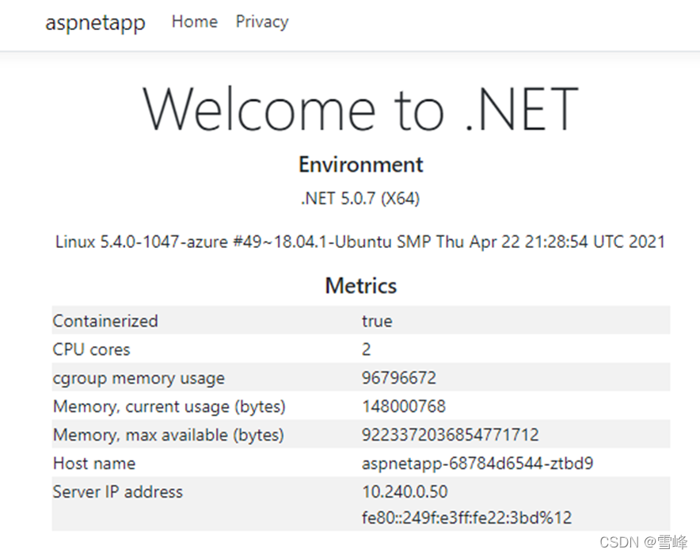
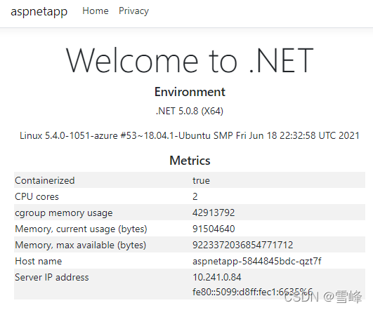

# AKS集群蓝绿部署实现版本升级(下篇)

发布时间: *2022-04-26 17:26:24*

简介: 在本系列文章的上篇，我们已经介绍了AKS蓝绿部署的基本思路，并介绍了如何部署相关资源并将应用网关与AKS进行集成。错过上篇的小伙伴，可以点击这里回看。本篇我们将基于上篇的内容，进一步介绍如何部署应用，如何部署AKS新集群，以及如何对AKS版本进行切换。应用部署我们来部署一个演示的应用，验证应用网关与AKS集群已经成功集成。把以下YAML源码复制另存为 deployment_aspnet.yaml。apiVersion: apps/v1kind: Deploymentmetadata:

原文链接: [https://snowpeak.blog.csdn.net/article/details/124430834](https://snowpeak.blog.csdn.net/article/details/124430834)

---------

在本系列文章的上篇，我们已经介绍了AKS蓝绿部署的基本思路，并介绍了如何部署相关资源并将应用网关与AKS进行集成。错过上篇的小伙伴，可以点击[这里回看](<https://blog.csdn.net/xfsnow/article/details/118493083> "这里回看")。

本篇我们将基于上篇的内容，进一步介绍如何部署应用，如何部署AKS新集群，以及如何对AKS版本进行切换。

### 应用部署

我们来部署一个演示的应用，验证应用网关与AKS集群已经成功集成。把以下YAML源码复制另存为 deployment_aspnet.yaml`。`


```
apiVersion: apps/v1
kind: Deployment
metadata:
  name: aspnetapp
spec:
  replicas: 3
  selector:
matchLabels:
  app: aspnetapp
  template:
metadata:
  labels:
app: aspnetapp
spec:
  containers:
- name: aspnetapp
  # Sample ASP.Net application from Microsoft which can get private IP.
  image: mcr.microsoft.com/dotnet/core/samples:aspnetapp
  ports:
  - containerPort: 80
---

apiVersion: v1
kind: Service
metadata:
  name: aspnetapp
spec:
  selector:
app: aspnetapp
  ports:
  - protocol: TCP
port: 80
targetPort: 80

---

apiVersion: extensions/v1beta1
kind: Ingress
metadata:
  name: aspnetapp
  annotations:
kubernetes.io/ingress.class: azure/application-gateway
spec:
  rules:
  - http:
  paths:
  - path: /
backend:
  serviceName: aspnetapp
  servicePort: 80
```

部署上应用。


```
kubectl apply -f deployment_aspnet.yaml
```

列表查看pod确认应用部署已运行。


```
kubectl get po -o wide
NAME                                    READY   STATUS    RESTARTS   AGE    IP            NODE                                NOMINATED NODE   READINESS GATES
aad-pod-identity-mic-787c5958fd-kmx9b   1/1     Running   0          177m   10.240.0.33   aks-nodepool1-94448771-vmss000000   <none>           <none>
aad-pod-identity-mic-787c5958fd-nkpv4   1/1     Running   0          177m   10.240.0.63   aks-nodepool1-94448771-vmss000001   <none>           <none>
aad-pod-identity-nmi-mhp86              1/1     Running   0          177m   10.240.0.4    aks-nodepool1-94448771-vmss000000   <none>           <none>
aad-pod-identity-nmi-sjpvw              1/1     Running   0          177m   10.240.0.35   aks-nodepool1-94448771-vmss000001   <none>           <none>
aad-pod-identity-nmi-xnfxh              1/1     Running   0          177m   10.240.0.66   aks-nodepool1-94448771-vmss000002   <none>           <none>
agic-ingress-azure-84967fc5b6-cqcn4     1/1     Running   0          111m   10.240.0.79   aks-nodepool1-94448771-vmss000002   <none>           <none>
aspnetapp-68784d6544-j99qg              1/1     Running   0          96    10.240.0.75   aks-nodepool1-94448771-vmss000002   <none>           <none>
aspnetapp-68784d6544-v9449              1/1     Running   0          96    10.240.0.13   aks-nodepool1-94448771-vmss000000   <none>           <none>
aspnetapp-68784d6544-ztbd9              1/1     Running   0          96    10.240.0.50   aks-nodepool1-94448771-vmss000001   <none>           <none>

```

可以看到应用的pod都正常运行起来了。注意它们的IP是10.240.0.13，10.240.0.50和10.240.0.75。

应用网关后端可以看到就是上述IP。


```
az network application-gateway show-backend-health \
 -g $RESOURCE_GROUP \
 -n $APP_GATEWAY \
 --query backendAddressPools[].backendHttpSettingsCollection[].servers[][address,health]
 -o tsv
10.240.0.13     Healthy
10.240.0.50     Healthy
10.240.0.75     Healthy

```

查一下前端的IP 地址。


```
az network public-ip show -g $RESOURCE_GROUP -n $APPGW_IP --query ipAddress -o tsv
```

然后用浏览器访问这个IP，就会看到。



多刷新几次，Host name 和Server IP address 那里会轮流显示 3主机名和IP，正是咱们前面部署的pod的3个pod名和内网IP。说明应用网关和AKS中的pod集成已经顺利实现。

## 部署AKS新集群

### 创建新版本的AKS集群

在第2个AKS子网中，创建一套新的AKS集群。我们之前的AKS版本使用的是当前默认版本1.19.11，新的AKS集群使用1.20.7，其它参数全都保持不变。声明新AKS集群名称的变量。


```
AKS_NEW=new
```

获取新集群所在子网的ID。


```
NEW_AKS_SUBNET_ID=$(az network vnet subnet show -g $RESOURCE_GROUP --vnet-name $VNET_NAME --name $NEW_AKS_SUBNET --query id -o tsv)
```

创建新AKS集群。


```
az aks create -n $AKS_NEW \
-g $RESOURCE_GROUP \
-l $AZ_REGION \
--generate-ssh-keys \
--network-plugin azure \
--enable-managed-identity \
--vnet-subnet-id $NEW_AKS_SUBNET_ID \
--kubernetes-version 1.20.7

```

新的AKS 集群还是用Helm 安装 application-gateway-kubernetes-ingress。

### 在新版本的AKS集群上安装Pod Identify

连接AKS集群


```
az aks get-credentials --resource-group $RESOURCE_GROUP --name $AKS_NEW
```

安装 AAD Pod Identify


```
kubectl create serviceaccount --namespace kube-system tiller-sa
kubectl create clusterrolebinding tiller-cluster-rule --clusterrole=cluster-admin --serviceaccount=kube-system:tiller-sa
helm repo add aad-pod-identity https://raw.githubusercontent.com/Azure/aad-pod-identity/master/charts
helm install aad-pod-identity aad-pod-identity/aad-pod-identity

```

helm安装 Application Gateway Ingress Controller。


```
helm repo add application-gateway-kubernetes-ingress https://appgwingress.blob.core.windows.net/ingress-azure-helm-package/
helm repo update

```

### 新版本AKS集群上部署应用

我们给新AKS集群也安装上相同的应用。


```
kubectl apply -f deployment_aspnet.yaml
```

应用部署好后，列表一下Pod。


```
kubectl get po -o=custom-columns=NAME:.metadata.name,\
podIP:.status.podIP,NODE:.spec.nodeName,\
READY-true:.status.containerStatuses[*].ready

NAME                                    podIP          NODE                                READY-true
aad-pod-identity-mic-644c7c9f6-cqkxr   10.241.0.25   aks-nodepool1-20247409-vmss000000   true
aad-pod-identity-mic-644c7c9f6-xpwlt   10.241.0.43   aks-nodepool1-20247409-vmss000002   true
aad-pod-identity-nmi-k2c8s             10.241.0.35   aks-nodepool1-20247409-vmss000001   true
aad-pod-identity-nmi-vqqzq             10.241.0.66   aks-nodepool1-20247409-vmss000002   true
aad-pod-identity-nmi-xvcxm             10.241.0.4    aks-nodepool1-20247409-vmss000000   true
aspnetapp-5844845bdc-82lcw             10.241.0.33   aks-nodepool1-20247409-vmss000000   true
aspnetapp-5844845bdc-hskvg             10.241.0.43   aks-nodepool1-20247409-vmss000001   true
aspnetapp-5844845bdc-qzt7f             10.241.0.84   aks-nodepool1-20247409-vmss000002   true

```

实际生产操作流程中，部署好应用后，先不要关联到现有的应用网关，而是远程登录上去，通过内网IP访问测试一下。


```
kubectl run -it --rm aks-ssh --image=mcr.microsoft.com/aks/fundamental/base-ubuntu:v0.0.11
```

容器启动起来后会直接进入这个容器，我们访问一下前述 3 个内网IP——10.241.0.33，10.241.0.43，10.241.0.84。比如


```
root@aks-ssh:/# curl http://10.241.0.33
root@aks-ssh:/# curl http://10.241.0.43
root@aks-ssh:/# curl http://10.241.0.84

```

我们看到都可以正常返回内容。这可以演示作新环境已经测试通过，最后把这个新AKS集群与现有的应用网关关联上。

## 切换不同版本的AKS集群

### 应用网关切换到与新版本的AKS集成

执行以下命令安装AGIC


```
helm install agic application-gateway-kubernetes-ingress/ingress-azure -f helm_agic.yaml
```

稍等几秒钟


```
kubectl get po -o=custom-columns=NAME:.metadata.name,podIP:.status.podIP,NODE:.spec.nodeName,READY-true:.status.containerStatuses[*].ready
NAME                                    podIP          NODE                                READY-true
aad-pod-identity-mic-644c7c9f6-cqkxr   10.241.0.25   aks-nodepool1-20247409-vmss000000   true
aad-pod-identity-mic-644c7c9f6-xpwlt   10.241.0.43   aks-nodepool1-20247409-vmss000002   true
aad-pod-identity-nmi-k2c8s             10.241.0.35   aks-nodepool1-20247409-vmss000001   true
aad-pod-identity-nmi-vqqzq             10.241.0.66   aks-nodepool1-20247409-vmss000002   true
aad-pod-identity-nmi-xvcxm             10.241.0.4    aks-nodepool1-20247409-vmss000000   true
agic-ingress-azure-84967fc5b6-6x4dd    10.241.0.79   aks-nodepool1-20247409-vmss000002   true
aspnetapp-5844845bdc-82lcw             10.241.0.33   aks-nodepool1-20247409-vmss000000   true
aspnetapp-5844845bdc-hskvg             10.241.0.43   aks-nodepool1-20247409-vmss000001   true
aspnetapp-5844845bdc-qzt7f             10.241.0.84   aks-nodepool1-20247409-vmss000002   true

```

可以看到agic-ingress-azure-***这个pod已经正常运行起来了。

先用命令行查看一下应用网关的后端已经更新成新的pod了。


```
az network application-gateway show-backend-health \
-g $RESOURCE_GROUP \
-n $APP_GATEWAY \
--query backendAddressPools[].backendHttpSettingsCollection[].servers[][address,health] \
-o tsv
10.241.0.33     Healthy
10.241.0.43     Healthy
10.241.0.84     Healthy

```

我们再回到浏览器刷新应用网关的公网IP，可以看到显示的内容中Host name和IP已经切换成新的后端了。



### 版本回滚

假如新版AKS集群有故障，我们再切换回旧AKS集群。只需要回到旧AKS集群，重新安装 AGIC让应用网关重新关联到旧AKS集群中的应用pod就可以了。 


```
az aks get-credentials --resource-group $RESOURCE_GROUP --name $AKS_OLD
helm uninstall agic
helm install agic application-gateway-kubernetes-ingress/ingress-azure -f helm_agic.yaml
```

很快可以看到 AGIC 的pod已经运行起来。


```
kubectl get po -o wide
NAME                                    READY   STATUS    RESTARTS   AGE    IP            NODE                                NOMINATED NODE   READINESS GATES
aad-pod-identity-mic-787c5958fd-kmx9b   1/1     Running   0          2d1h   10.240.0.33   aks-nodepool1-94448771-vmss000000   <none>           <none>
aad-pod-identity-mic-787c5958fd-nkpv4   1/1     Running   1          2d1h   10.240.0.63   aks-nodepool1-94448771-vmss000001   <none>           <none>
aad-pod-identity-nmi-mhp86              1/1     Running   0          2d1h   10.240.0.4    aks-nodepool1-94448771-vmss000000   <none>           <none>
aad-pod-identity-nmi-sjpvw              1/1     Running   0          2d1h   10.240.0.35   aks-nodepool1-94448771-vmss000001   <none>           <none>
aad-pod-identity-nmi-xnfxh              1/1     Running   0          2d1h   10.240.0.66   aks-nodepool1-94448771-vmss000002   <none>           <none>
agic-ingress-azure-84967fc5b6-nwbh4     1/1     Running   0          8s     10.240.0.70   aks-nodepool1-94448771-vmss000002   <none>           <none>
aspnetapp-68784d6544-j99qg              1/1     Running   0          2d     10.240.0.75   aks-nodepool1-94448771-vmss000002   <none>           <none>
aspnetapp-68784d6544-v9449              1/1     Running   0          2d     10.240.0.13   aks-nodepool1-94448771-vmss000000   <none>           <none>
aspnetapp-68784d6544-ztbd9              1/1     Running   0          2d     10.240.0.50   aks-nodepool1-94448771-vmss000001   <none>           <none>

```

再看应用网关后端


```
az network application-gateway show-backend-health \
 -g $RESOURCE_GROUP \
 -n $APP_GATEWAY \
 --query backendAddressPools[].backendHttpSettingsCollection[].servers[][address,health]
 -o tsv
10.240.0.13     Healthy
10.240.0.50     Healthy
10.240.0.75     Healthy

```

可以看到同一个应用网关后端已经恢复回旧的AKS集群的IP了。

### 版本切换时应用可用性的测试

我们用连续的HTTP请求验证一下切换期间服务没有中断。

另开一个命令行窗口，执行


```
while(true); \
do curl -s http://139.217.117.86/ |ts '[%Y-%m-%d %H:%M:%S]' | grep 10.24; \
sleep 0.1; done
[2021-08-03 16:35:09] 10.240.0.13                        <br />
[2021-08-03 16:35:10] 10.240.0.50                        <br />
[2021-08-03 16:35:11] 10.240.0.13                        <br />
[2021-08-03 16:35:12] 10.240.0.75                        <br />
[2021-08-03 16:35:12] 10.240.0.50                        <br />
[2021-08-03 16:35:13] 10.240.0.13                        <br />
[2021-08-03 16:35:14] 10.240.0.75                        <br />

```

可以看到返回的是旧AKS集群中pod私有IP轮流输出。

再回到前面AKS操作的窗口，切换到新的AKS集群，再次执行删除和安装AGIC的命令。


```
az aks get-credentials --resource-group $RESOURCE_GROUP --name $AKS_NEW
helm uninstall agic

```

到第2个窗口观察，会发现返回的仍然是旧AKS集群的IP。因为此时我们只在新AKS集群操作删除，应用网关和旧AKS集群都在正常运行。

再在新AKS集群上执行


```
helm install agic application-gateway-kubernetes-ingress/ingress-azure -f helm_agic.yaml
```

到第2个 窗口观察，会发现从某一行起直接替换成了新AKS集群的IP地址。没有任何中断。


```
[2021-08-03 16:42:08] 10.240.0.13                        <br />
[2021-08-03 16:42:09] 10.240.0.50                        <br />
[2021-08-03 16:42:09] 10.240.0.75                        <br />
[2021-08-03 16:42:10] 10.240.0.13                        <br />
[2021-08-03 16:42:11] 10.240.0.50                        <br />
[2021-08-03 16:42:11] 10.240.0.75                        <br />
[2021-08-03 16:42:12] 10.241.0.33                        <br />
[2021-08-03 16:42:13] 10.241.0.33                        <br />
[2021-08-03 16:42:13] 10.241.0.43                        <br />
[2021-08-03 16:42:15] 10.241.0.43                        <br />
[2021-08-03 16:42:15] 10.241.0.84                        <br />
[2021-08-03 16:42:16] 10.241.0.84                        <br />

```

由此验证了切换过程中应用网关对外的服务始终正常运行。通过这样的操作，最终可以实现新旧版AKS集群同时保留，并且可以实时切换。

## 总结

以上是以常见的Web应用为例，演示了新建AKS集群通过蓝绿部署实现稳妥地版本升级。除了Web应用以外，其它类型和场景的应用都可以参照，在AKS集群和上游集成的地方进行切换，从而实现实时切换和回滚。