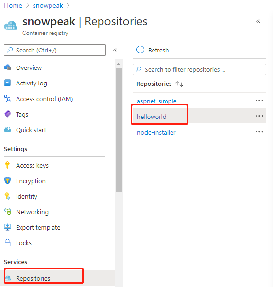
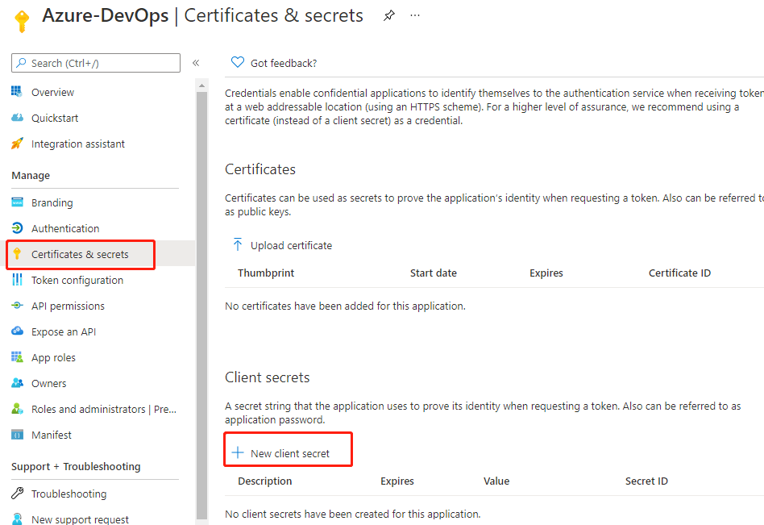
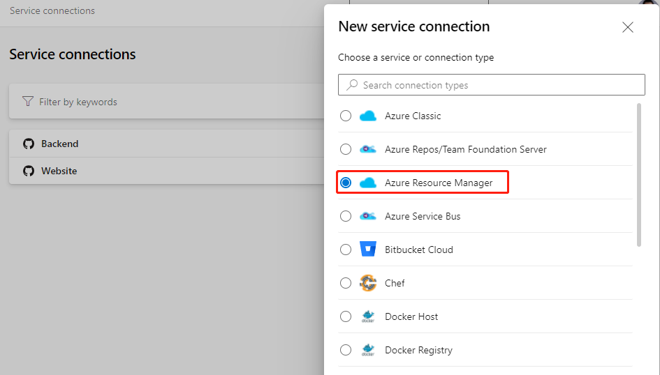
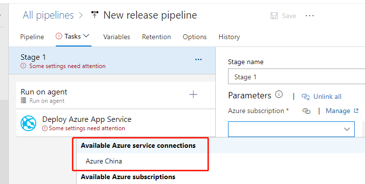

# Azure DevOps综合管理ACR和AKS

发布时间: *2022-07-13 10:00:00*

分类: __Azure__

简介: Azure DevOps是微软云上全线DevOps工具集中负责自动化流水线的托管服务，具备完备的流水线管理功能，还方便和各种测试、构建和部署工具集成。本文介绍如何在Azure DevOps中配置 ACR 和 AKS 构建和部署流水线。

---------------------

Azure
DevOps目前仍只在微软云Azure海外区域提供SaaS服务，Azure中国区域还没有发布。其实Azure
DevOps可以管理各种云和应用部署的环境与平台，可以通过服务连接（Service
Connection）
方便地连接Azure中国区域，以及其它Azure的特殊区域，比如美国政务云、德国区域等等。本文将带领大家一步一步配置好中国区域的订阅，以及建立起Azure DevOps到中国区域订阅的连接。

## 管理构建到ACR的CI流水线

### 配置ACR服务连接

<https://blog.yannickreekmans.be/bring-your-own-service-principal-for-an-azure-container-registry-connection-in-azure-devops/>

添加一个 other类型的服务连接，使用 中国区域 ACR 的访问密钥来验证。

我这个测试用户现在是全局管理员，默认情况下普通用户不能注册应用程序。如果需要普通用户也可以注册应用程序，可以在左侧导航链接点击
User Settings，把用户可以注册应用程序设置为启用。

### 创建CI流水线

```yaml
dockerRegistryServiceConnection: '44fbf17e-1870-4f48-9f1a-e57e81891048'
imageRepository: 'helloworld'
containerRegistry: 'snowpeak.azurecr.cn'
```

dockerRegistryServiceConnection服务连接的ID，去浏览器地址栏找。


containerRegistry: 去Azure控制台的ACR概览页


`imageRepository: 'helloworld`

镜像库去这里找



### 创建Azure AD 服务主体

在控制台回到 Azure Active Directory，左侧导航链接选择应用注册，再点新注册。


为应用程序起个名字，比如"Azure-DevOps"，并记下这个名字，后面还会用到。

支持的帐户类型，选择Accounts in this organizational directory only，其它保持默认。


最后点击 Register 完成注册。

### 给服务主体添加身份验证

为配合下一步Azure DevOps创建服务连接时的验证，我们给刚刚创建出的服务主体添加身份验证。这里我们选用应用程序机密的方式。

在Azure AD 中的"应用注册"，选择刚创建出的应用程序。在左侧导航链接中选择"证书和机密"。然后在主窗格中点击"新建客户端机密"。



在弹出的浮层填写描述，失效期保持默认6个月，最后点击底部添加按钮即可。添加成功后，会显示刚才添加的那条记录。


这里注意我们把 Value 的值复制保存出来，只有这一次机会，以后就不能复制了。Secret ID
是随时可以复制的。

### 给应用程序分配订阅的角色

再来到控制台的订阅管理界面，选择到咱们正在操作的这个订阅，然后点击左侧导航链接中的"访问控制(IAM)"，点击主窗格中的"添加"，再点击添加角色分配。


在弹出的添加角色分配浮层中，角色选Contributor，分配权限选择User, group or service principal。

在选择格，输入前面创建的应用程序名，会搜索出来一个结果，要再点击一下这条结果，然后底下左边的保存按钮就变成可用了。


最后点击保存，成功后会回到分配角色这个列表，已经显示出来刚刚分配的角色，表示操作成功。

## 配置AKS服务连接

### 创建Azure DevOps服务连接

登录Azure DevOps控制台，进入我们的项目，左下角Project settings进入项目配置。点击 Pipelines下的Service connections，再点右上角的New service connection。第1步，点选Azure Resource Manager。



下一步，点选Service principal (manual)。

这一页的Environment选择 Azure China Cloud。

Scope Level 选Subscription。

Subscription Id 和 Subscription Name 要回到订阅的概览页，从主窗格相应项目复制过来。


Service Principal Id，去到Azure中国控制台的订阅中，点开我们刚刚注册的应用，在其概览页找到Application (client) ID。


Service principal
key的值，填写前面我们复制保存出来的客户端机密中的Value值。

Tenant ID 的值，取自上面界面的Directory (tenant)
ID。这5格填写好后，Verify按钮变为可用，我们点击一下，顺利的话，会显示出如下的验证成功。如果报错，请返回重新检查各个ID和机密的值是否都填写到正确的格里。


最后我们在Service connection name和Description (optional) 中填写上有意义的名字比如"Azure China"和详细描述，点击右下角的Verify and save 就完成了。

## 使用Azure DevOps的发布流水线验证服务连接

在Azure DevOps控制台 Pipelines 下的 Releases，右边主窗格点击中间位置的New 按钮，再点击New release pipeline。


在弹出的选择模板浮层，点击第1个Azure App Service deployment。


在接下来的浮层中，点击左边的"1 job, 1 task"链接。


在接下来的浮层中，Azure subscription 选项下展开菜单。



可以看到我们刚才创建的服务连接已经显示在这里了，表示这个服务连接完全创建成功。后续有其它的发布流水线，都可以选用这个服务连接，并且按提示再选择具体的资源目标了。